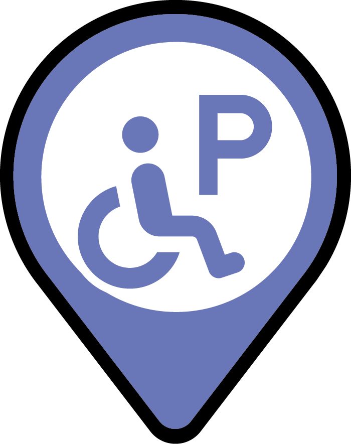

# Layer symbology inventory

Every layer on every AggieMap map, with where its symbology comes from and exactly what it draws. Made
for [#1578](https://github.com/TamuGeoInnovation/Tamu.GeoInnovation.js.monorepo/issues/1578): to find any
layer drawing ArcGIS's default symbol, and to give a single picture of the symbols in use, for
standardizing the look across maps. How a layer's symbology is decided is [`map-layers.md`](map-layers.md).

**Collected on 9 October 2026** from a local dev server running `development` at `9c326a9f` with this change, which draws from production's GIS services. The 13 maps that open a builder were read through the direct links `tools/builder-inventory` records, one for each distinct layer set. Each of the 70 maps was loaded and the map
probe asked, for every layer the map had made, where its symbology came from and what renderer it was
drawing (`MapProbe.renderers()`). So this records what is actually drawn - after the portal item's
symbology (#1497) and every override - not what a definition file appears to say.

**Not covered:** a layer created only when someone switches it on (`loadOnInit: false`) does not exist
when a map loads, so it is not here; nor are layers without a renderer (basemaps, tile, image and graphics
layers). Every map loaded.

**Result: no layer draws ArcGIS's default symbol.** Of the
224 distinct layer renderers, 6 are a map's own choice, 138 come from the
portal item and 80 from the service. Dining and AggiePrint, which drew the default symbol on
production for two days, are among the map's own choices since #1579 (#1576). `maps.spec.ts` now fails on
any layer drawing the default symbol, so this does not need re-running to stay safe. To refresh the
inventory after symbology changes, see [`tools/layer-symbology`](../tools/layer-symbology/README.md).

The full renderer JSON for each layer below is in [`layer-symbology/renderers.json`](layer-symbology/renderers.json),
and picture-marker icons are saved under [`layer-symbology/icons/`](layer-symbology/icons/).

## Symbols in use, across maps

Each distinct symbol, how many layer classes use it, and where. Near-duplicates here are the candidates
for standardizing.

| Symbol | Uses | Where (layer (class)) |
| --- | ---: | --- |
|  CIM: stroke #5e34ea 1pt, fill #5e89ea | 14 | 150th Kickoff - Parking (Event Parking); 4-H Roundup Parking (Event Parking); Accessible Parking (Preferred Parking  - tap for details); Available Lots (Preferred Parking  - tap for details); Event Parking (Free Public Parking); and 9 more |
|  CIM: stroke #448970 1pt, fill #4fb335 | 12 | Family Weekend view - Friday Parking Lots ($10 Event Parking); Family Weekend view - Saturday Parking Lots (Paid Parking); Family Weekend view - Sunday Parking Lots (Paid Parking); Football Parking Lots (ParkMobile Prepay); Kickoff at Kyle Parking (Paid Parking); and 7 more |
|  CIM: stroke #e67c00 1pt, fill #f4a261 | 12 | Drop-Off Zones (1-Hour Drop Off Zone, Space Limited); Event Parking (Reserved); Family Weekend view - Saturday Parking Lots (Reserved Lot); Family Weekend view - Sunday Parking Lots (Reserved Lot); Maroon White Game view - Event Parking Lots (Reserved); and 7 more |
|  fill solid #5a0000 | 9 | AnyValidPermitParking - AVP Parking Lots (Any Valid Texas A&M Permit); MediaParking - Media Parking Lots (Media Permit and Media+ Permit Authorized); NewStudentConferenceParking - NSC Parking Lots (NSC Permit Authorized); Night Privileges 5:00pm - 6:00am (Authorized Parking Lot, Valid Texas A&M Permit Required); Only UB+ Permit Authorized (UB Permit and UB+ Permit Authorized); and 4 more |
|  CIM: picture marker 25pt | 9 | 4-H Roundup Locations ((all features)); Bike Registration (Check In/Key Pickup Location); Cardboard Recycling (Check In/Key Pickup Location); Check-In / Key Pickup (Check In/Key Pickup Location); Dining (Check In/Key Pickup Location); and 4 more |
|  CIM: stroke #e60000 1pt, hatch | 8 | Drop-Off Zones (No Roadside Parking); Event Parking (Road Closed (Pedestrian Zone)); Maroon White Game view - Event Parking Lots (Road Closed (Pedestrian Zone)); Muster Parking (Road Closed (Pedestrian Zone)); No Roadside Parking (No Roadside Parking); and 3 more |
|  CIM: picture marker 25pt, vector marker 20.833333333333336pt, fill #ffffff | 6 | Bike Registration (Dining Areas); Cardboard Recycling (Dining Areas); Check-In / Key Pickup (Dining Areas); Dining (Dining Areas); Information (Dining Areas); and 1 more |
|  CIM: picture marker 22.727272727272727pt, vector marker 25pt, fill #000000 | 6 | Bike Registration (CardBoard Recycling Locations); Cardboard Recycling (CardBoard Recycling Locations); Check-In / Key Pickup (CardBoard Recycling Locations); Dining (CardBoard Recycling Locations); Information (CardBoard Recycling Locations); and 1 more |
|  CIM: picture marker 25pt | 6 | Bike Registration (Bicycle Registration and Engraving Location); Cardboard Recycling (Bicycle Registration and Engraving Location); Check-In / Key Pickup (Bicycle Registration and Engraving Location); Dining (Bicycle Registration and Engraving Location); Information (Bicycle Registration and Engraving Location); and 1 more |
|  CIM: picture marker 25pt | 6 | Bike Registration (No Roadside Parking); Cardboard Recycling (No Roadside Parking); Check-In / Key Pickup (No Roadside Parking); Dining (No Roadside Parking); Information (No Roadside Parking); and 1 more |
|  CIM: picture marker 25pt, vector marker 25pt, stroke #000000 0pt, fill #0000ff | 6 | Bike Registration (Hospitality Stations); Cardboard Recycling (Hospitality Stations); Check-In / Key Pickup (Hospitality Stations); Dining (Hospitality Stations); Information (Hospitality Stations); and 1 more |
|  fill solid #005ce6 | 5 | Freshman Student Selectable (Freshman Student Selectable); MoveOutParking - Move-Out Allowed Street Parking (Accessible ONLY); Resident Student Priority (Freshman Student Selectable); StudentSelectableParking - Student Selectable Parking Lots (Student Selectable); TS Main - Parking Lots (Visitor Parking) |
|  CIM: stroke #00a9e6 2pt, hatch, stroke #00a9e6 0.5pt | 4 | Construction (TS Projects); Construction Area (TS Projects); Construction Zones (TS Projects); Current Construction Area (TS Projects) |
|  CIM: stroke #e69800 2pt, hatch, stroke #e69800 0.5pt | 4 | Construction (UES Projects); Construction Area (UES Projects); Construction Zones (UES Projects); Current Construction Area (UES Projects) |
|  CIM: picture marker 25pt | 4 | Accessible Parking ((all features)); Baseball Symbols ($5 Accessible Parking); Maroon White Game view - Accessible PrePaid Parking (Accessible Parking); Points of Interest (Accessible Parking) |
|  CIM: stroke #267300 2pt, hatch, stroke #267300 0.5pt | 4 | Construction (SSC Projects); Construction Area (SSC Projects); Construction Zones (SSC Projects); Current Construction Area (SSC Projects) |
|  fill backwarddiagonal #e60000, outline #e60000 1 | 4 | High School Graduation Parking (Closure (Pedestrian Path)); Parking Lots (Road Closed); Parking/Closures (Closure (Pedestrian Path)); Parking/Closures (Closure) |
|  CIM: stroke #004da8 2pt, hatch, stroke #004da8 0.5pt | 4 | Construction (TxDOT Projects); Construction Area (TxDOT Projects); Construction Zones (TxDOT Projects); Current Construction Area (TxDOT Projects) |
|  CIM: stroke #6e6e6e 0.7pt, fill #23449c | 4 | Accessible Parking (Accessible Parking, One Hour ONLY); Available Lots (Accessible Parking, One Hour ONLY); Lot Closures (Accessible Parking, One Hour ONLY); Parking Lots (Accessible Parking) |
|  CIM: stroke #000000 at 0% 0pt, fill #5a0000 | 4 | Accessible Parking Lots ($5 Event Parking, Any Valid Texas A&M Permit, Baseball Season Permit, ParkMobile Pre-Paid Baseball Event Parking); Event Parking Lots ($5 Event Parking, Any Valid Texas A&M Permit, Baseball Season Permit, ParkMobile Pre-Paid Baseball Event Parking); SoccerParking view - Soccer Event Parking Lots (Event Parking); Women's Basketball Event Parking Lots (Event Parking or Any Valid Texas A&M Permit) |
|  fill solid #5a0000, outline #000000 at 0% 0 | 4 | Contractor Permit and Contractor+ Permit Authorized (Contractor Permit and Contractor+ Permit Authorized); Loading Zones - Service Parking Lots (Service Permit and Service+ Permit Authorized); MaintenanceParking - Maintenance Parking Lots (Maintenance Permit and Maintenance+ Permit Authorized); Only Contractor+ Permit Authorized (Contractor Permit and Contractor+ Permit Authorized) |
|  fill solid #e8beff | 4 | MediaParking - Media Parking Lots (Only Media+ Permit Authorized); Only UB+ Permit Authorized (Only UB+ Permit Authorized); UB Permit and UB+ Permit Authorized (Only UB+ Permit Authorized); VendorParking - Vendor Parking Lots (Only Vendor+ Permit Authorized) |
|  fill solid #ff0000 | 4 | Freshman Student Selectable (Resident Student Priority); MoveOutParking - Move-Out Allowed Street Parking (NoParking); Resident Student Priority (Resident Student Priority); StudentSelectableParking - Student Selectable Parking Lots (Resident Student Priority) |
|  CIM: stroke #ff0000 2pt, hatch, stroke #ff0000 0.5pt | 4 | Construction (Building Projects); Construction Area (Building Projects); Construction Zones (Building Projects); Current Construction Area (Building Projects) |
|  CIM: stroke #6e6e6e 0.7pt, fill #e60000 | 4 | Accessible Parking (No Move-In Parking.  Lot Specific Permit Required); Available Lots (No Move-In Parking.  Lot Specific Permit Required); Family Weekend view - Friday Parking Lots (Closure); Lot Closures (No Move-In Parking.  Lot Specific Permit Required) |
|  fill solid #e8beff, outline #000000 at 0% 0 | 4 | Contractor Permit and Contractor+ Permit Authorized (Only Contractor+ Permit Authorized); Loading Zones - Service Parking Lots (Only Service+ Permit Authorized); MaintenanceParking - Maintenance Parking Lots (Only Maintenance+ Permit Authorized); Only Contractor+ Permit Authorized (Only Contractor+ Permit Authorized) |
|  CIM: stroke #6e6e6e 0.7pt, fill #f4a261 | 3 | Big Event view - Parking Lots (Lot Permit Required); MS150 view - MS150 Parking (Reserved Parking); Ring Day Areas (Lot Specific Permit Required) |
|  CIM: picture marker 25pt | 3 | 150th Kickoff - Event Locations (Shuttle); Gameday Parking (RV); MensBasketballParking view - Basketball Icons (Bus Parking) |
|  CIM: stroke #448970 0.7pt, fill #4fb335 | 3 | Accessible Parking (Paid Visitor Parking); Available Lots (Paid Visitor Parking); Lot Closures (Paid Visitor Parking) |
|  CIM: picture marker 25pt | 3 | Gameday Parking (Any Valid Texas A&M Permit); MS150 view - Parking for any valid Texas A&M permit ((all features)); Points of Interest (Any Valid Permit) |
|  marker circle #00a884 size 10, outline #00734c 1 | 3 | Day 1 Points of Interest (Day 1 Start); Day 2 Points of Interest (Day 2 Start); Day 3 Points of Interest (Day 3 Start) |
|  fill solid #51b336, outline #448970 1 | 3 | High School Graduation Parking ($10 Event Parking/Any Valid Texas A&M Permit); Parking Lots (Parking); Parking/Closures ($10 Event Parking/Any Valid Texas A&M Permit) |
|  CIM: stroke #e60000 3pt | 3 | Traffic Flow (Leave Kickoff,Road Closed); Traffic Flow (To Kickoff,Road Closed); Traffic Flow (Tool Dropoff,Road Closed) |
|  CIM: stroke #000000 at 0% 0pt, fill #2a9d8f | 3 | Accessible Parking Lots ($5 Accessible Parking); Event Parking Lots ($5 Accessible Parking); Women's Basketball Event Parking Lots (Accessible Parking Only) |
|  CIM: stroke #6e6e6e 0.7pt, fill #e9c46a | 3 | Big Event view - Parking Lots (Parking Reserved for Baseball); IndoorTrackParking view - Indoor Track Building ((all features)); Ring Day Areas ($10 Event Parking) |
|  fill solid #f2a061, outline #e67c00 1 | 3 | High School Graduation Parking (Reserved); Parking Lots (Parent Drop Off); Parking/Closures (Reserved) |
|  CIM: picture marker 25pt | 3 | Gameday Parking (ParkMobile Prepay Parking); MensBasketballParking view - Basketball Icons (Season Pass/ParkMobile Prepay); Points of Interest (A&M Permit/ParkMobile $10 Paid Parking) |
|  CIM: stroke #000000 at 0% 0pt, fill #264653 | 3 | OutdoorTrackParking view - Outdoor Track Event Parking Lots (Rec Center Patrons Only); SoccerParking view - Soccer Event Parking Lots (Rec Center Patrons Only); VolleyballParking view - Volleyball Event Parking Lots (Rec Center Patrons Only) |
|  line solid #38a800 width 14 | 3 | Pedestrian Path - General Parking (Pedestrian Path); Physics Fest - Pedestrian Path - Buses Entering from Eastbound University Dr (Pedestrian Path); Physics Fest - Pedestrian Path - Buses Entering from Westbound University (Hogg St Pedestrian Path) |
| CIM: vector marker 12pt, fill #38a800, stroke #38a800 1.9pt | 3 | Traffic Flow (Leave Kickoff,Exit Route); Traffic Flow (To Kickoff,Fast Route ); Traffic Flow (Tool Dropoff,Fastest Route) |
|  CIM: stroke #000000 at 0% 0pt, fill #e9c46a | 2 | Accessible Parking Lots (100j Season Pass); Event Parking Lots (100j Season Pass) |
|  CIM: stroke #000000 1.4pt, stroke #fffb86 4.6pt, stroke #000000 6pt | 2 | Crosswalks (Please use marked crosswalks.  No mid-street crossing.); Safety First (Please use marked crosswalks.  No mid-street crossing.) |
|  picture marker 14×14 | 2 | TS Main - Visitor Kiosks ((all features)); Visitor Parking ((all features)) |
|  CIM: stroke #5a0000 3pt | 2 | Ring Day Routes (Aggie Ring Day Exit Path); Shuttle Routes (35) |
|  CIM: stroke #000000 at 0% 0pt, fill #f4a261 | 2 | OutdoorTrackParking view - Outdoor Track Event Parking Lots (Lot Reserved); Women's Basketball Event Parking Lots (Rec Center Patrons Only) |
|  CIM: stroke #df73ff 2pt, hatch, stroke #df73ff 0.5pt | 2 | Planned Construction Area (TxDOT); Planned Construction Area Popup (TxDOT) |
|  CIM: stroke #000000 at 0% 0pt, fill #732f2f | 2 | OutdoorTrackParking view - Outdoor Track Event Parking Lots (Event Parking); VolleyballParking view - Volleyball Event Parking Lots (Event Parking) |
|  fill solid #e8c26b, outline #6e6e6e 0.7 | 2 | Physics Fest - Physics Engineering Festival - Bus Parking (Outdoor Activities); Physics Fest - Physics Engineering Festival - General Parking (Outdoor Activities) |
|  CIM: stroke #23449c 1pt, fill #5e89ea | 2 | Football Parking Lots (Reserved Parking); Football Parking Lots (12th Man Reserved Parking) |
|  picture marker 17×17 | 2 | RNS Spaces ((all features)); TS Main - RNS Spaces ((all features)) |
|  CIM: stroke #73dfff 2pt, hatch, stroke #73dfff 0.5pt | 2 | Planned Construction Area (TS); Planned Construction Area Popup (TS) |
|  CIM: stroke #4ce600 2pt, hatch, stroke #b4d79e 0.5pt | 2 | Planned Construction Area (SSC); Planned Construction Area Popup (SSC) |
|  fill solid #f2a061, outline #6e6e6e 0.7 | 2 | Parking Lots (Parent Parking Only); Physics Fest - Physics Engineering Festival - General Parking (Paid Hourly Parking) |
|  fill solid #fcbdcc at 0%, outline #6e6e6e 0 | 2 | Buildings ((all features)); Residence Hall ((all features)) |
|  line solid #00734c width 15 | 2 | Arrival Recommended Routes (Fast Route); Departure Recommended Routes (Recommended Route) |
|  line solid #267300 width 3 | 2 | Entry Routes ((all features)); Exit Routes ((all features)) |
|  fill solid #732f2f, outline #6e6e6e 0.7 | 2 | Physics Fest - Physics Engineering Festival - Bus Parking (Mitchell Physics Building); Physics Fest - Physics Engineering Festival - General Parking (Mitchell Physics Building) |
|  CIM: stroke #e6e600 2pt, hatch, stroke #e6e600 0.5pt | 2 | Planned Construction Area (UES); Planned Construction Area Popup (UES) |
|  line solid #ffffff width 3.68 | 2 | Day 2 Routes (Walking Tour Day 2); Day 3 Routes (Walking Tour Day 3) |
|  picture marker 17×17 | 2 | Loading Zones - Service Parking Spaces (Loading Zones); MaintenanceParking - Maintenance Parking Spaces (Loading Zones) |
|  CIM: fill #f4a261 | 2 | IndoorTrackParking view - Indoor Track Event Parking Lots (Reserved Parking - Permit Required); SoftballParking view - Softball Event Parking Lots (Baseball Parking Only) |
|  line solid #005ce6 width 10 | 2 | Day 2 Routes (Bus Tour Route Day 2); Day 3 Routes (Bus Tour Route Day 3) |
|  CIM: stroke #6e6e6e 0.7pt, fill #5a0000 | 2 | CrossCountryParking view - Cross Country Event Parking Lots (Event Parking); TennisParking view - Tennis Event Parking Lots (Event Parking) |
|  CIM: stroke #ffffff 1pt, fill #500000 | 2 | Aggie Park Tents ((all features)); Simpson Drill Field Tents ((all features)) |
|  CIM: stroke #500000 0.2pt, fill #867978 | 2 | Buildings ((all features)); Property ((all features)) |
|  fill solid #2a9c8c, outline #6e6e6e 0.7 | 2 | Physics Fest - Physics Engineering Festival - Bus Parking (Bus Parking); Physics Fest - Physics Engineering Festival - General Parking (Bus Parking) |
|  fill solid #004da8 | 2 | MoveOutParking - Move-Out Lots (Accessible); VisitorParking - Visitor Parking Lots (Hourly Visitor Parking) |
|  picture marker 24×30 | 2 | Parking Information (Fish Camp Student Parking); Parking Information (Student & Counselor Parking Only) |
|  CIM: stroke #ffbebe 2pt, hatch, stroke #ffbebe 0.5pt | 2 | Planned Construction Area (Building Projects); Planned Construction Area Popup (Building Projects) |
|  picture marker 17×17 | 2 | Loading Zones - Service Parking Spaces (Service Spaces); MaintenanceParking - Maintenance Parking Spaces (Service Spaces) |
|  CIM: stroke #0070ff 1pt, fill #73b2ff | 2 | Parking Lots (Event Parking); Zones (Unloading Zones) |
|  marker square #4e4e4e size 10, outline #ffffff 1 | 2 | Day 2 Points of Interest (Day 2 End); Day 3 Points of Interest (Day 3 End) |
|  picture marker 25×25 | 2 | Day 2 Points of Interest (Day 2 Checkpoint); Day 3 Points of Interest (Day 3 Checkpoint) |
| CIM: vector marker 12pt, fill #e60000, stroke #e60000 1.9pt | 2 | Traffic Flow (To Kickoff,Expect Delays); Traffic Flow (Tool Dropoff,Expect Delays) |
| CIM: vector marker 15pt, fill #267300, stroke #267300 2.2pt | 2 | Entry Route ((all features)); Preferred Route ((all features)) |
| CIM: vector marker 15pt, fill #a900e6, stroke #a900e6 1.9pt | 2 | Entry Routes ((all features)); Exit Routes ((all features)) |
|  CIM: stroke #6e6e6e 0pt, fill #0070ff | 1 | IndoorTrackParking view - Team Bus Parking (Team Drop Off) |
|  CIM: stroke #000000 1pt, fill #a900e6 at 50% | 1 | West Campus Tailgating (Lot E Tailgating) |
|  CIM: fill #cccccc | 1 | Women's Basketball Event Parking Lots (Lot Specific Permit Required) |
|  CIM: stroke #6e6e6e 0pt, fill #730000 | 1 | Ring Day Areas (Gathering Area) |
|  CIM: picture marker 25pt | 1 | Alert ((all features)) |
|  CIM: picture marker 30pt | 1 | Special Points of Interest (Bus Parking) |
|  picture marker 20×20 | 1 | Departure Traffic Advisories (Traffic Advisory) |
|  CIM: stroke #000000 1pt, fill #00c5ff at 50% | 1 | West Campus Tailgating (Recognized Student Organizations) |
|  picture marker 20×20 | 1 | TS Main - Campus Stops (On) |
|  picture marker 25×25 | 1 | Accessible/Bus Parking (Bus Parking) |
|  CIM: stroke #4c0073 1.3pt, fill #8400a8 at 69% | 1 | MSC & Rudder Buildings (Rudder) |
|  fill solid #cccccc, outline #6e6e6e 1 | 1 | TS Main - Parking Lots (Valid Texas A&M Permit Required) |
|  CIM: stroke #6e6e6e 0.7pt, fill #2a9d8f | 1 | Big Event view - Parking Lots (Tool Distribution) |
|  CIM: stroke #004da8 at 0% 0pt, fill #2a9d8f | 1 | VolleyballParking view - Volleyball Event Parking Lots (Accessible Parking Only) |
|  picture marker 17×17 | 1 | TS Main - Route Stop Start Points (15) |
|  picture marker 17×17 | 1 | TS Main - Route Stop Start Points (40) |
|  picture marker 23×23 | 1 | MoveOutParking - No Parking Areas (No Parking Area) |
|  fill backwarddiagonal #004d7c, outline #004d7c 2 | 1 | Dismount Zones ((all features)) |
|  marker circle #55ff00 size 14, outline #000000 0 | 1 | TS Main - Route Stop Start Points (41) |
|  picture marker 24×30 | 1 | Parking Information (Permit Parking Only) |
|  CIM: picture marker 25pt | 1 | Gameday Parking (12th Man Lot) |
|  picture marker 17×17 | 1 | TS Main - Route Stop Start Points (36) |
|  CIM: fill #732f2f | 1 | IndoorTrackParking view - Indoor Track Event Parking Lots (Event Parking) |
|  CIM: stroke #7a8ef5 2pt, hatch, stroke #7a8ef5 0.5pt | 1 | Street Grass Areas (Click for details) (Reserved Tailgate) |
|  CIM: stroke #000000 1pt, fill #55ff00 at 50% | 1 | West Campus Tailgating (Lot E 102 Only) |
|  picture marker 14×14 | 1 | Accessible Building Entrances (Powered Accessible entrance) |
|  CIM: stroke #ff48c3 3pt | 1 | Shuttle Routes (Reed / Olsen) |
|  CIM: stroke #94d500 3pt | 1 | Shuttle Routes (26) |
|  CIM: stroke #e60000 0.7pt, fill #dcdddd | 1 | Bike Veo Geofence (No Ride Zone) |
|  CIM: picture marker 30pt | 1 | Campus Locations (The Williams Alumni Center) |
|  CIM: picture marker 30pt, vector marker 35pt, stroke #000000 at 64% 0.5pt, fill #ffffff | 1 | Ring Day Points of Interest (Haynes Ring Plaza) |
|  CIM: picture marker 30pt, vector marker 29.5pt, stroke #000000 at 64% 0.5pt, fill #c93100 | 1 | Ring Day Points of Interest (Medical Station) |
|  picture marker 17×17 | 1 | TS Main - Route Stop Start Points (35) |
|  fill solid #51b336, outline #6e6e6e 0.7 | 1 | Parking Lots (Fish Camp Student/Parent Parking) |
|  line solid #ffffff width 3.6799999999999997 | 1 | Day 1 Routes (Walking Tour Day 1) |
|  CIM: picture marker 20pt | 1 | Purchase Hourly Visitor Parking (Visitor Kiosk) |
|  CIM: picture marker 25pt | 1 | Purchase Hourly Visitor Parking (Visitor Kiosk) |
|  picture marker 25×25 | 1 | VisitorParking - Visitor Kiosks (Where to Pay) |
|  CIM: stroke #004da8 1pt, fill #004da8 | 1 | Football Parking Lots (Any Valid Texas A&M Permit) |
|  picture marker 17×17 | 1 | TS Main - Route Stop Start Points (27) |
|  picture marker 31×31 | 1 | Bike Racks (The Hub) |
|  CIM: fill #5a0000 | 1 | SoftballParking view - Softball Event Parking Lots ($5 Event Parking or Any Valid Texas A&M Permit during Baseball or other Paid Event) |
|  picture marker 18×24 | 1 | AggiePrint Locations (Campus Member Accessible) |
|  CIM: fill #264653 | 1 | IndoorTrackParking view - Indoor Track Event Parking Lots (Rec Center Patrons Only) |
|  picture marker 10×10 | 1 | TimedParking - Timed Parking Space (Timed) |
|  picture marker 23×23 | 1 | EV Charge Stations (Main + RELLIS) ((all features)) |
|  CIM: stroke #004d7c 2pt, hatch, stroke #004d7c 1pt | 1 | Bike Dismount Zones ((all features)) |
|  fill solid #5f8ae8, outline #5e34ea 1 | 1 | Parking Lots (Permit/Fish Camp Student Parking) |
|  CIM: stroke #e64c00 1pt, hatch | 1 | MensBasketballParking view - Basketball Closures (Closure) |
|  fill solid #447a9c, outline #6e6e6e 0.7 | 1 | Physics Fest - Physics Engineering Festival - General Parking (Free Parking) |
|  CIM: stroke #730000 1pt, hatch, stroke #894444 0.5pt | 1 | Ring Day Areas (The Williams Alumni Center) |
|  CIM: picture marker 25pt | 1 | Micromobility Parking Area ((all features)) |
|  picture marker 30×30 | 1 | Bike Racks (Shared Mobility Racks) |
|  fill solid #ffd37f | 1 | SummerBreakParking - Break-Summer Parking Lots (Authorized Summer ONLY) |
|  CIM: picture marker 24pt | 1 | 150th Kickoff - Event Locations (Event Location) |
|  CIM: stroke #6e6e6e 0pt, fill #38a800 | 1 | Ring Day Areas (Aggie Ring Day Marketplace) |
|  CIM: stroke #cccccc 1pt, fill #5a0000 | 1 | AggielandSaturday view - Aggieland Saturday Parking (Free Event Parking) |
|  CIM: picture marker 25pt | 1 | Gameday Parking (Presale) |
|  CIM: stroke #6e6e6e 0.4pt, fill #e1e1e1 | 1 | Football Parking Lots (Other Lots) |
|  fill solid #e600a9 | 1 | StudentSelectableParking - Student Selectable Parking Lots (Grad Student Selectable) |
|  fill solid #ffff00 | 1 | MoveOutParking - Move-Out Lots (Authorized) |
|  CIM: stroke #e60000 0.4pt, hatch, stroke #e60000 1.2pt, stroke #e69800 1.2pt | 1 | Street Grass Areas (Click for details) (Street Closures) |
|  CIM: stroke #6e6e6e 0pt, fill #ff00c5 | 1 | IndoorTrackParking view - Team Bus Parking (Team Bus Parking) |
|  CIM: stroke #6e6e6e 0.7pt, fill #fff4df | 1 | Bike Veo Geofence (Slow Ride Zone) |
|  line solid #00734c width 9 | 1 | Routes (Preferred Vehicle Route) |
|  picture marker 15×15 | 1 | Single Occupancy Restroom Locations ((all features)) |
|  CIM: stroke #000000 1pt, fill #ffff00 at 50% | 1 | West Campus Tailgating (Open Access) |
|  picture marker 17×17 | 1 | TS Main - Route Stop Start Points (08) |
|  CIM: stroke #e60000 0.4pt, hatch, stroke #e60000 0.5pt | 1 | Big Event view - Road Closures ((all features)) |
|  CIM: stroke #e60000 1pt, hatch, stroke #e60000 0.5pt | 1 | No Parking Zones ((all features)) |
|  CIM: stroke #ff0000 1pt, hatch, stroke #e60000 1pt | 1 | Road Closures ((all features)) |
|  CIM: stroke #6e6e6e 0.4pt, fill #98b1ea | 1 | Football Parking Lots (Public Paid Parking/Any Valid Texas A&M Permit) |
|  CIM: stroke #cccccc 1pt, fill #732f2f | 1 | Big Event view - Parking Lots (Any Valid Texas A&M Permit) |
|  picture marker 18×24 | 1 | Dining Locations (Food Truck - Closed) |
|  CIM: stroke #e69800 1pt, hatch, stroke #e69800 0.5pt | 1 | Live at the Station Parking (Closure) |
|  CIM: stroke #000000 1pt, fill #00008c at 50% | 1 | Aggie Park Tailgating (Free Tailgating (UCEN)) |
|  picture marker 18×17 | 1 | University Business Spaces 2 Hour Time Limit (University Business Spaces 2 Hour Time Limit) |
|  picture marker 18×24 | 1 | AggiePrint Locations (Restricted Access Printers) |
|  picture marker 17×17 | 1 | TS Main - Route Stop Start Points (34) |
|  picture marker 17×17 | 1 | TS Main - Route Stop Start Points (31) |
|  CIM: picture marker 30pt | 1 | Special Points of Interest (Shopping) |
|  fill solid #264552, outline #6e6e6e 0.7 | 1 | Physics Fest - Physics Engineering Festival - General Parking ($10 Parking) |
|  CIM: stroke #cccccc 1pt, fill #264653 | 1 | Big Event view - Parking Lots (Paid Hourly Parking) |
|  CIM: stroke #6e6e6e 0.7pt, fill #732f2f | 1 | SwimmingParking view - Swimming Event Parking Lots (Hourly Paid Parking) |
|  line solid #ffffff width 0.8 | 1 | TS Main - Line Paint ((other)) |
|  picture marker 17×17 | 1 | TS Main - Route Stop Start Points (12) |
|  picture marker 16×16 | 1 | Lactation Rooms ((all features)) |
|  CIM: picture marker 30pt, vector marker 30pt, vector marker 18.5pt, stroke #6e6e6e 0pt, fill #730000 | 1 | Ring Day Points of Interest (Rideshare drop-off & pick up for Aggie Ring Day) |
|  picture marker 24×30 | 1 | Parking Information (Parent Drop Off) |
|  CIM: stroke #4e4e4e 1.5pt | 1 | Stripes (RV Space) |
|  picture marker 14×14 | 1 | Accessible Building Entrances (Accessible entrance) |
|  line solid #e60000 width 14 | 1 | Physics Fest - Bus Route - Buses Entering from Westbound University (Hogg St Bus Route) |
|  line solid #e60000 width 15 | 1 | Arrival Recommended Routes (Expect Delays) |
|  CIM: picture marker 30pt, vector marker 35pt, vector marker 18.5pt, stroke #6e6e6e 0pt, fill #005ce6 | 1 | Ring Day Points of Interest (Accessible Entrance) |
|  line dash #005ce6 width 1 | 1 | Routes (Preferred Walking Route) |
|  CIM: picture marker 30pt | 1 | Special Points of Interest (Dining) |
|  CIM: picture marker 30pt, vector marker 29.5pt, stroke #000000 at 64% 0.5pt, fill #730000 | 1 | Ring Day Points of Interest (Moore Family Creamery - Concessions) |
|  picture marker 18×24 | 1 | Dining Locations (Dining - Open) |
|  CIM: stroke #267300 1pt, fill #83f57a at 69% | 1 | Gene Stallings Parking Garage (CSG) |
|  CIM: picture marker 20pt | 1 | Gameday Parking (Accessible Parking) |
|  CIM: picture marker 20pt, vector marker 20pt, fill #ffffff | 1 | Accessible Parking Spaces (Accessible Parking) |
|  CIM: picture marker 23pt | 1 | MensBasketballParking view - Basketball Icons ($5 Accessible/ParkMobile Prepay) |
|  CIM: picture marker 25pt, vector marker 20pt, fill #ffffff | 1 | Accessible Parking Spaces (Accessible Parking) |
|  picture marker 20×20 | 1 | Accessible/Bus Parking (Accessible Parking) |
|  picture marker 30×30 | 1 | Bike Racks (Regular Rack Locations) |
|  CIM: fill #68608e | 1 | SoftballParking view - Softball Event Parking Lots (Free Softball Game Parking) |
|  CIM: picture marker 25pt | 1 | Rideshare Locations (Rideshare Location) |
|  picture marker 24×30 | 1 | Parking Information (Parent Parking Only) |
|  CIM: stroke #6e6e6e 0.4pt, fill #a80000 | 1 | Football Parking Lots (Lot Closed) |
|  CIM: stroke #6e6e6e 0.7pt, fill #a80000 | 1 | Closures (Closure) |
|  CIM: stroke #ea7424 3pt | 1 | Shuttle Routes (Agronomy) |
|  CIM: stroke #6e6e6e 0.4pt, fill #4fb335 | 1 | Football Parking Lots (Public Paid Parking) |
|  fill solid #5e89ea | 1 | StaffSelectableParking - Staff Selectable Parking Lots (Staff Selectable Lots) |
|  CIM: stroke #004da8 3pt | 1 | Shuttle Routes (Downtown Bryan) |
|  picture marker 17×17 | 1 | TS Main - Route Stop Start Points (07) |
|  CIM: stroke #6e6e6e 1pt, fill #e9c46a | 1 | AggielandSaturday view - Aggieland Saturday Parking (Hourly Paid Parking) |
|  picture marker 18×24 | 1 | Dining Locations (Dining - Closed) |
|  picture marker 17×17 | 1 | TS Main - Route Stop Start Points (06) |
|  CIM: stroke #fd9fc8 3pt | 1 | Shuttle Routes (22) |
|  CIM: stroke #6e6e6e 0.7pt, fill #264653 | 1 | SwimmingParking view - Swimming Event Parking Lots (Rec Center Patrons Only) |
|  picture marker 17×17 | 1 | TS Main - Route Stop Start Points (47) |
|  fill solid #bee8ff | 1 | SummerBreakParking - Break-Summer Parking Lots (Break AND Summer Authorized) |
|  picture marker 17×17 | 1 | TS Main - Route Stop Start Points (48) |
|  line solid #005ce6 width 14 | 1 | Physics Fest - Bus Route - Buses Entering from Eastbound University Dr (Route) |
|  line solid #a900e6 width 1 | 1 | City Bike Lanes and Routes ((all features)) |
|  picture marker 17×17 | 1 | TS Main - Route Stop Start Points (26) |
|  CIM: stroke #000000 1pt, fill #e60000 at 50% | 1 | Aggie Park Tailgating (Paid Tailgating (Revel XP)) |
|  CIM: stroke #783cbd 3pt | 1 | Shuttle Routes (31) |
|  fill solid none, outline none 1 | 1 | Bonfire Memorial ((all features)) |
|  CIM: picture marker 30pt | 1 | Maroon White Game view - Accessible PrePaid Parking (ParkMobile Prepaid Parking) |
|  CIM: stroke #e69800 1pt, hatch, stroke #ffaa00 1pt | 1 | Street Grass Areas (Click for details) (Permit Required) |
|  picture marker 20×20 | 1 | Emergency Phones ((all features)) |
|  picture marker 18×24 | 1 | Dining Locations (Food Truck - Open) |
|  CIM: stroke #0070ff 2pt, hatch, stroke #00c5ff 0.5pt | 1 | Ring Day Areas (Event Parking) |
|  CIM: stroke #e67c00 0.7pt, fill #f4a261 | 1 | Kickoff at Kyle Parking (Lot Reserved) |
|  CIM: stroke #000000 1pt, fill #ff0000 at 50% | 1 | West Campus Tailgating (12th Man Donors with E, G, O Parking) |
|  picture marker 17×17 | 1 | TS Main - Route Stop Start Points (22) |
|  CIM: stroke #6e6e6e 0.7pt, fill #cccccc | 1 | TennisParking view - Tennis Event Parking Lots (Lot Specific Permit Required) |
|  picture marker 17×17 | 1 | TS Main - Route Stop Start Points (05) |
|  fill solid #730000 | 1 | MotoristAssistance - Service Area ((all features)) |
|  CIM: stroke #897044 1.5pt | 1 | CrossCountryParking view - Cross Country Area ((all features)) |
|  CIM: stroke #008774 1pt, fill #00a774 | 1 | Zones (Staging Area (N Rudder Plaza)) |
|  CIM: picture marker 30pt, vector marker 29.5pt, stroke #000000 at 64% 0.5pt, fill #730000 | 1 | Ring Day Points of Interest (Photo Station) |
|  picture marker 24×30 | 1 | Parking Information (Luggage) |
|  line solid #ff00c5 width 0.5 | 1 | Campus Bike Lanes (Lane Markings) |
|  line solid #ff00c5 width 1 | 1 | Campus Bike Lanes (Bike Lanes) |
|  CIM: stroke #23449c 0pt, fill #23449c | 1 | Football Parking Lots (Season Presale) |
|  CIM: stroke #6e6e6e 1pt, fill #2a9d8f | 1 | AggielandSaturday view - Aggieland Saturday Parking (Paid Parking - Pay at Entry) |
|  CIM: stroke #f6323e 3pt | 1 | Shuttle Routes (Bush Library) |
|  CIM: stroke #500000 1.3pt, fill #500000 at 69% | 1 | MSC & Rudder Buildings (Memorial Student Center) |
|  picture marker 16×16 | 1 | MotorcycleParking - Motorcycle Parking Space (M/C) |
|  CIM: picture marker 20pt | 1 | Gameday Parking (Alert) |
|  picture marker 17×17 | 1 | TS Main - Route Stop Start Points (03) |
|  marker square #4e4e4e size 10, outline #9c9c9c 1 | 1 | Day 1 Points of Interest (Day 1 End) |
|  CIM: picture marker 30pt, vector marker 29.5pt, stroke #000000 at 64% 0.5pt, fill #730000 | 1 | Ring Day Points of Interest (Public Restrooms) |
|  picture marker 17×17 | 1 | TS Main - Route Stop Start Points (01) |
|  CIM: stroke #67b2e7 3pt | 1 | Shuttle Routes (Stotzer) |
|  CIM: stroke #00b497 3pt | 1 | Shuttle Routes (W R) |
|  CIM: stroke #3423af 3pt | 1 | Shuttle Routes (Bonfire) |
|  CIM: picture marker 26pt, vector marker 21pt, fill #ffffff | 1 | Baseball Symbols ($10 Bus Parking) |
|  CIM: picture marker 30pt | 1 | AggielandSaturday view - Bus Stops (West Bus Stops) |
|  picture marker 30×30 | 1 | Physics Fest - Westbound Bus Drop Off Pick Up Location (Hogg St ) |
|  CIM: picture marker 30pt | 1 | Special Points of Interest (Performance) |
|  CIM: picture marker 30pt, vector marker 29.5pt, stroke #000000 at 64% 0.5pt, fill #730000 | 1 | Ring Day Points of Interest (The Swaim Amphitheater - Musical Performances) |
|  picture marker 17×17 | 1 | TS Main - Route Stop Start Points (04) |
|  CIM: picture marker 30pt, vector marker 35pt, vector marker 18.5pt, stroke #6e6e6e 0pt, fill #730000 | 1 | Ring Day Points of Interest (Entrance) |
|  CIM: picture marker 25pt | 1 | Accessible Parking ((all features)) |
|  CIM: stroke #6e6e6e 0pt, fill #ff0000 | 1 | Ring Day Areas (Lot or Street Closure) |
|  CIM: picture marker 30pt | 1 | Campus Locations (Bus Parking) |
|  CIM: picture marker 30pt, vector marker 29.5pt, stroke #000000 at 64% 0.5pt, fill #264653 | 1 | Ring Day Points of Interest (Shuttle Stop) |
|  CIM: picture marker 30pt, vector marker 35pt, stroke #000000 at 64% 0.5pt, fill #5a0000 | 1 | Ring Day Points of Interest (Spirit of '02 Cannon - Parsons Mounted Cavalry) |
|  line solid #002673 width 1.1 | 1 | TS Main - Line Paint (Chongo) |
|  CIM: picture marker 25pt | 1 | Spirit of 150 Week - Cake & Ice Cream Locations ((all features)) |
|  fill solid #bab7b0, outline #828282 0.4 | 1 | Surface Lots ((all features)) |
|  CIM: stroke #3962ae 3pt | 1 | Ring Day Routes (Walking Path from Shuttle to the Williams Alumni Center) |
|  CIM: stroke #004da8 1pt, fill #005ce6 at 69% | 1 | GIS Day Parking Garages (GARAGE) |
|  CIM: fill #cd2e31 | 1 | Gate/Road Closure (Road Closed) |
|  CIM: picture marker 25pt | 1 | Gameday Parking (Public Paid Parking) |
|  CIM: stroke #e9c46a 1pt, hatch | 1 | Ring Day Areas (Ticketed Area) |
|  picture marker 22×35 | 1 | Bike Fix Stations ((all features)) |
|  CIM: stroke #828282 0.4pt, fill #e60000 | 1 | Kickoff at Kyle Parking (Lot Closed) |
|  CIM: stroke #828282 1pt, fill #f4a261 | 1 | AggielandSaturday view - Aggieland Saturday Parking (Reserved for Athletics) |
|  CIM: stroke #6e6e6e 0.5pt, fill #ff0000 | 1 | MS150 view - MS150 Parking (Closure) |
|  CIM: stroke #6e6e6e 0.7pt, fill #0070ff | 1 | Ring Day Areas (Accessible Path) |
|  CIM: stroke #6e6e6e 0.7pt, fill #68608e | 1 | Big Event view - Parking Lots (Parking Reserved for Softball) |
|  CIM: stroke #828282 0.4pt, fill #d7c29e | 1 | Buildings ((all features)) |
|  CIM: picture marker 25pt, vector marker 20pt, stroke #a7a9ac 0.5pt, fill #0070ff | 1 | Baseball Symbols (Accessible Shuttle Stop) |
|  CIM: picture marker 30pt | 1 | AggielandSaturday view - Bus Stops (East Bus Stops) |
|  picture marker 24×30 | 1 | Parking Information (Bus Parking) |
|  picture marker 30×30 | 1 | Physics Fest - Eastbound Bus Drop Off Pick Up Location (New St) |
|  fill solid #38a800 | 1 | MoveOutParking - Move-Out Allowed Street Parking (1 HR Loading Only) |
|  line solid #005ce6 width 3 | 1 | Exit Routes ((all features)) |
| CIM: vector marker 10.000000000000002pt, fill #005ce6, stroke #005ce6 3pt | 1 | AggielandSaturday view - Bus Routes (Aggieland Saturday E) |
| CIM: vector marker 10.000000000000002pt, fill #ff0000, stroke #ff0000 3pt | 1 | AggielandSaturday view - Bus Routes (Aggieland Saturday W) |
| CIM: vector marker 10pt, fill #003893, fill #ffffff | 1 | AccessibleParking view - Accessible Parking Space (Accessible Space) |
| CIM: vector marker 10pt, fill #0070ff, stroke #0070ff 3pt | 1 | Routes (To Loading/Unloading Zones) |
| CIM: vector marker 10pt, fill #0070ff, stroke #235fff 3pt | 1 | Accessible Shuttle (Accessible Shuttle) |
| CIM: vector marker 10pt, fill #00734c, stroke #00734c 1.5pt | 1 | Routes (Preferred Route) |
| CIM: vector marker 10pt, fill #267300, stroke #267300 1.5pt | 1 | 150th Kickoff - Shuttle Route ((all features)) |
| CIM: vector marker 10pt, fill #267300, stroke #267300 3pt | 1 | Routes (To Outside Exhibits) |
| CIM: vector marker 10pt, fill #e60000, stroke #e60000 1.5pt | 1 | Routes (Expect Delays) |
| CIM: vector marker 10pt, stroke #004da8 2pt, fill #000000 at 0% | 1 | Campus Shuttle Stops (Downtown Bryan) |
| CIM: vector marker 10pt, stroke #00b497 2pt, fill #000000 at 0% | 1 | Campus Shuttle Stops (W R) |
| CIM: vector marker 10pt, stroke #3423af 2pt, fill #3423af at 0% | 1 | Campus Shuttle Stops (Bonfire) |
| CIM: vector marker 10pt, stroke #5a0000 2pt, fill #000000 at 0% | 1 | Campus Shuttle Stops (35) |
| CIM: vector marker 10pt, stroke #67b2e7 2pt, fill #000000 at 0% | 1 | Campus Shuttle Stops (Stotzer) |
| CIM: vector marker 10pt, stroke #783cbd 2pt, fill #000000 at 0% | 1 | Campus Shuttle Stops (31) |
| CIM: vector marker 10pt, stroke #94d500 2pt, fill #000000 at 0% | 1 | Campus Shuttle Stops (26) |
| CIM: vector marker 10pt, stroke #ea7424 2pt, fill #000000 at 0% | 1 | Campus Shuttle Stops (Agronomy) |
| CIM: vector marker 10pt, stroke #f6323e 2pt, fill #000000 at 0% | 1 | Campus Shuttle Stops (Bush Library) |
| CIM: vector marker 10pt, stroke #fd9fc8 2pt, fill #000000 at 0% | 1 | Campus Shuttle Stops (22) |
| CIM: vector marker 10pt, stroke #ff48c3 2pt, fill #000000 at 0% | 1 | Campus Shuttle Stops (Reed / Olsen) |
| CIM: vector marker 14.999999999999998pt, fill #267300, stroke #267300 2.2pt | 1 | Muster Traffic Flow (Recommended Route) |
| CIM: vector marker 15.75pt, fill #000000, vector marker 18.5pt, stroke #a7a9ac 0.5pt, fill #ffffff | 1 | Baseball Symbols (RV Parking) |
| CIM: vector marker 15pt, fill #00734c, stroke #00734c 2.2pt | 1 | Traffic Flow ((all features)) |
| CIM: vector marker 15pt, fill #00734c, stroke #00734c 3pt | 1 | Aggie Family Parade view - Parade Route ((all features)) |
| CIM: vector marker 15pt, fill #008800, fill #ffffff | 1 | Baseball Symbols (Club Parking) |
| CIM: vector marker 15pt, fill #500000, vector marker 23pt, fill #ffffff | 1 | Baseball Symbols (Suite Parking) |
| CIM: vector marker 15pt, fill #e60000, stroke #e60000 2.2pt | 1 | Muster Traffic Flow (Expect Delays) |
| CIM: vector marker 15pt, stroke #ffffff 1.5pt, fill #3b0b0b | 1 | Zone Numbers ((all features)) |
| CIM: vector marker 16pt, fill #e2007f, fill #ffffff | 1 | Baseball Symbols (Motorcycle) |
| CIM: vector marker 25pt, fill #267300, stroke #267300 4pt | 1 | MS150 view - MS150 Route ((all features)) |
| CIM: vector marker 25pt, fill #38a800, stroke #38a800 4pt | 1 | Recommended Route (Recommended Route) |
| CIM: vector marker 4pt, stroke #000000 0.7pt, fill #b02e7c | 1 | Points of Interest ((all features)) |
| CIM: vector marker 4pt, stroke #000000 at 0% 0.7pt, fill #3f9966 at 0% | 1 | RNS Spaces ((all features)) |
| CIM: vector marker 5pt, fill #264653, stroke #264653 1.5pt | 1 | Ring Day Routes (Aggie Ring Day Shuttle Route) |

## By layer

### 150th Kickoff - Event Locations

`150th-kickoff-event-locations`, feature layer. Symbology from: portal item. Renderer: uniqueValue by `keywords`. Used on `/events/150th-kickoff`.

| Class | | Symbol |
| --- | --- | --- |
| Event Location |  | CIM: picture marker 24pt |
| Shuttle |  | CIM: picture marker 25pt |

### 150th Kickoff - Parking

`150th-kickoff-parking`, feature layer. Symbology from: portal item. Renderer: uniqueValue by `type`. Used on `/events/150th-kickoff`.

| Class | | Symbol |
| --- | --- | --- |
| Event Parking |  | CIM: stroke #5e34ea 1pt, fill #5e89ea |

### 150th Kickoff - Shuttle Route

`150th-kickoff-shuttle-route`, feature layer. Symbology from: portal item. Renderer: simple. Used on `/events/150th-kickoff`.

| Class | | Symbol |
| --- | --- | --- |
| (all features) |  | CIM: vector marker 10pt, fill #267300, stroke #267300 1.5pt |

### 4-H Roundup Locations

`four-h-roundup-locations`, feature layer. Symbology from: portal item. Renderer: simple. Used on `/events/4h-roundup-2026`.

| Class | | Symbol |
| --- | --- | --- |
| (all features) |  | CIM: picture marker 25pt |

### 4-H Roundup Parking

`four-h-roundup-parking`, feature layer. Symbology from: portal item. Renderer: uniqueValue by `type`. Used on `/events/4h-roundup-2026`.

| Class | | Symbol |
| --- | --- | --- |
| Event Parking |  | CIM: stroke #5e34ea 1pt, fill #5e89ea |

### Accessible Building Entrances (/campus/dc-bush-school)

`accessible-entrances-layer`, feature layer. Symbology from: service. Renderer: uniqueValue by `Category`. Used on `/campus/dc-bush-school`, `/campus/mcallen`, `/events/april-ring-day/map/d?event-day=day2`, `/events/big-event/map/d?map-type=Tool+Dropoff`, `/events/games-of-texas`, `/events/gis-day` and 31 more.

| Class | | Symbol |
| --- | --- | --- |
| Accessible entrance |  | picture marker 14×14 |
| Powered Accessible entrance |  | picture marker 14×14 |

### Accessible Building Entrances (/campus/galveston)

`accessible-entrances-layer`, feature layer. Symbology from: service. Renderer: uniqueValue by `Category`. Used on `/campus/galveston`, `/events/150th-kickoff`, `/events/4h-roundup-2026`, `/events/aggie-family-parade`, `/events/aggieland-saturday`, `/events/beef-cattle-vendor` and 26 more.

| Class | | Symbol |
| --- | --- | --- |
| Accessible entrance |  | picture marker 14×14 |
| Powered Accessible entrance |  | picture marker 14×14 |

### Accessible Parking (/events/muster)

`muster-accessible-parking`, feature layer. Symbology from: portal item. Renderer: simple. Used on `/events/muster`.

| Class | | Symbol |
| --- | --- | --- |
| (all features) |  | CIM: picture marker 25pt |

### Accessible Parking (/events/graduation-fall/map/d?date=2025-12-17T05%3A00%3A00.000Z)

`graduation-accessible-parking`, feature layer. Symbology from: portal item. Renderer: simple. Used on `/events/graduation-fall/map/d?date=2025-12-17T05%3A00%3A00.000Z`, `/events/graduation-spring/map/d?date=2026-05-06T05%3A00%3A00.000Z`.

| Class | | Symbol |
| --- | --- | --- |
| (all features) |  | CIM: picture marker 25pt |

### Accessible Parking (/parking/move-in/map/d?move-in-date=2026-08-18&move-in-residence-hall=hall-fowler&move-in-accessible-parking=yes)

`move-in-lots-accessible`, feature layer. Symbology from: portal item. Renderer: uniqueValue by `type`. Used on `/parking/move-in/map/d?move-in-date=2026-08-18&move-in-residence-hall=hall-fowler&move-in-accessible-parking=yes`.

| Class | | Symbol |
| --- | --- | --- |
| Accessible Parking, One Hour ONLY |  | CIM: stroke #6e6e6e 0.7pt, fill #23449c |
| Preferred Parking  - tap for details |  | CIM: stroke #5e34ea 1pt, fill #5e89ea |
| Preferred Parking  - tap for details |  | CIM: stroke #5e34ea 1pt, fill #5e89ea |
| Preferred Parking  - tap for details |  | CIM: stroke #5e34ea 1pt, fill #5e89ea |
| Preferred Parking  - tap for details |  | CIM: stroke #5e34ea 1pt, fill #5e89ea |
| Preferred Parking  - tap for details |  | CIM: stroke #5e34ea 1pt, fill #5e89ea |
| Preferred Parking  - tap for details |  | CIM: stroke #5e34ea 1pt, fill #5e89ea |
| Preferred Parking  - tap for details |  | CIM: stroke #5e34ea 1pt, fill #5e89ea |
| Preferred Parking  - tap for details |  | CIM: stroke #5e34ea 1pt, fill #5e89ea |
| Paid Visitor Parking |  | CIM: stroke #448970 0.7pt, fill #4fb335 |
| No Move-In Parking.  Lot Specific Permit Required |  | CIM: stroke #6e6e6e 0.7pt, fill #e60000 |

### Accessible Parking Lots

`baseball-accessible-lots`, feature layer. Symbology from: portal item. Renderer: uniqueValue by `baseball`. Used on `/parking/baseball-parking/map/d?map-mode=accessible`.

| Class | | Symbol |
| --- | --- | --- |
| $5 Event Parking, Any Valid Texas A&M Permit, Baseball Season Permit, ParkMobile Pre-Paid Baseball Event Parking |  | CIM: stroke #000000 at 0% 0pt, fill #5a0000 |
| $5 Accessible Parking |  | CIM: stroke #000000 at 0% 0pt, fill #2a9d8f |
| 100j Season Pass |  | CIM: stroke #000000 at 0% 0pt, fill #e9c46a |

### Accessible Parking Spaces (/events/womens-basketball)

`womens-basketball-accessible-parking`, feature layer. Symbology from: portal item. Renderer: uniqueValue by `type`, `event`. Used on `/events/womens-basketball`.

| Class | | Symbol |
| --- | --- | --- |
| Accessible Parking |  | CIM: picture marker 25pt, vector marker 20pt, fill #ffffff |
| Accessible Parking |  | CIM: picture marker 25pt, vector marker 20pt, fill #ffffff |

### Accessible Parking Spaces (/parking/indoor-track-parking)

`indoor-track-parking-accessible-parking`, feature layer. Symbology from: portal item. Renderer: uniqueValue by `type`, `event`. Used on `/parking/indoor-track-parking`.

| Class | | Symbol |
| --- | --- | --- |
| Accessible Parking |  | CIM: picture marker 20pt, vector marker 20pt, fill #ffffff |
| Accessible Parking |  | CIM: picture marker 20pt, vector marker 20pt, fill #ffffff |

### Accessible Parking Spaces (/parking/outdoor-track-parking)

`outdoor-track-parking-accessible-parking`, feature layer. Symbology from: portal item. Renderer: uniqueValue by `type`, `event`. Used on `/parking/outdoor-track-parking`.

| Class | | Symbol |
| --- | --- | --- |
| Accessible Parking |  | CIM: picture marker 25pt, vector marker 20pt, fill #ffffff |
| Accessible Parking |  | CIM: picture marker 25pt, vector marker 20pt, fill #ffffff |

### Accessible Parking Spaces (/parking/soccer-parking)

`soccer-parking-accessible-parking`, feature layer. Symbology from: portal item. Renderer: uniqueValue by `type`, `event`. Used on `/parking/soccer-parking`.

| Class | | Symbol |
| --- | --- | --- |
| Accessible Parking |  | CIM: picture marker 25pt, vector marker 20pt, fill #ffffff |
| Accessible Parking |  | CIM: picture marker 25pt, vector marker 20pt, fill #ffffff |

### Accessible Parking Spaces (/parking/softball-parking)

`softball-parking-accessible-parking`, feature layer. Symbology from: portal item. Renderer: uniqueValue by `type`, `event`. Used on `/parking/softball-parking`.

| Class | | Symbol |
| --- | --- | --- |
| Accessible Parking |  | CIM: picture marker 25pt, vector marker 20pt, fill #ffffff |
| Accessible Parking |  | CIM: picture marker 25pt, vector marker 20pt, fill #ffffff |

### Accessible Parking Spaces (/parking/swimming-parking)

`swimming-parking-accessible-parking`, feature layer. Symbology from: portal item. Renderer: uniqueValue by `type`, `event`. Used on `/parking/swimming-parking`.

| Class | | Symbol |
| --- | --- | --- |
| Accessible Parking |  | CIM: picture marker 25pt, vector marker 20pt, fill #ffffff |

### Accessible Parking Spaces (/parking/volleyball-parking)

`volleyball-parking-accessible-parking`, feature layer. Symbology from: portal item. Renderer: uniqueValue by `type`, `event`. Used on `/parking/volleyball-parking`.

| Class | | Symbol |
| --- | --- | --- |
| Accessible Parking |  | CIM: picture marker 25pt, vector marker 20pt, fill #ffffff |
| Accessible Parking |  | CIM: picture marker 25pt, vector marker 20pt, fill #ffffff |

### Accessible Shuttle

`baseball-accessible-shuttles`, feature layer. Symbology from: portal item. Renderer: simple. Used on `/parking/baseball-parking/map/d?map-mode=accessible`.

| Class | | Symbol |
| --- | --- | --- |
| Accessible Shuttle |  | CIM: vector marker 10pt, fill #0070ff, stroke #235fff 3pt |

### Accessible/Bus Parking

`hs-graduation-accessible-bus-parking`, feature layer. Symbology from: service. Renderer: uniqueValue by `name`. Used on `/events/hs-graduation-2026`.

| Class | | Symbol |
| --- | --- | --- |
| Accessible Parking |  | picture marker 20×20 |
| Bus Parking |  | picture marker 25×25 |

### AccessibleParking view - Accessible Parking Space

`Accessible Parking Space`, feature layer. Symbology from: portal item. Renderer: uniqueValue by `spc_type`. Used on `/parking/accessible-parking`.

| Class | | Symbol |
| --- | --- | --- |
| Accessible Space |  | CIM: vector marker 10pt, fill #003893, fill #ffffff |
| Accessible Space |  | CIM: vector marker 10pt, fill #003893, fill #ffffff |

### Aggie Family Parade view - Parade Route

`aggie-family-parade-route`, feature layer. Symbology from: portal item. Renderer: simple. Used on `/events/aggie-family-parade`.

| Class | | Symbol |
| --- | --- | --- |
| (all features) |  | CIM: vector marker 15pt, fill #00734c, stroke #00734c 3pt |

### Aggie Park Tailgating

`tailgating-aggie-park`, feature layer. Symbology from: portal item. Renderer: uniqueValue by `type`. Used on `/events/tailgating`.

| Class | | Symbol |
| --- | --- | --- |
| Free Tailgating (UCEN) |  | CIM: stroke #000000 1pt, fill #00008c at 50% |
| Paid Tailgating (Revel XP) |  | CIM: stroke #000000 1pt, fill #e60000 at 50% |

### Aggie Park Tents

`tailgating-tents`, feature layer. Symbology from: portal item. Renderer: simple. Used on `/events/tailgating`.

| Class | | Symbol |
| --- | --- | --- |
| (all features) |  | CIM: stroke #ffffff 1pt, fill #500000 |

### AggielandSaturday view - Aggieland Saturday Parking

`aggieland-saturday-parking`, feature layer. Symbology from: portal item. Renderer: uniqueValue by `type`. Used on `/events/aggieland-saturday`.

| Class | | Symbol |
| --- | --- | --- |
| Free Event Parking |  | CIM: stroke #cccccc 1pt, fill #5a0000 |
| Paid Parking - Pay at Entry |  | CIM: stroke #6e6e6e 1pt, fill #2a9d8f |
| Hourly Paid Parking |  | CIM: stroke #6e6e6e 1pt, fill #e9c46a |
| Reserved for Athletics |  | CIM: stroke #828282 1pt, fill #f4a261 |

### AggielandSaturday view - Bus Routes

`aggieland-saturday-bus-routes`, feature layer. Symbology from: portal item. Renderer: uniqueValue by `routename`. Used on `/events/aggieland-saturday`.

| Class | | Symbol |
| --- | --- | --- |
| Aggieland Saturday E |  | CIM: vector marker 10.000000000000002pt, fill #005ce6, stroke #005ce6 3pt |
| Aggieland Saturday W |  | CIM: vector marker 10.000000000000002pt, fill #ff0000, stroke #ff0000 3pt |

### AggielandSaturday view - Bus Stops

`aggieland-saturday-bus-stops`, feature layer. Symbology from: portal item. Renderer: uniqueValue by `route`. Used on `/events/aggieland-saturday`.

| Class | | Symbol |
| --- | --- | --- |
| East Bus Stops |  | CIM: picture marker 30pt |
| West Bus Stops |  | CIM: picture marker 30pt |

### AggiePrint Locations

`aggieprint-locations-layer`, feature layer. Symbology from: own (definition). Renderer: uniqueValue by an Arcade expression. Used on `/campus/dc-bush-school`, `/campus/galveston`, `/campus/mcallen`, `/events/150th-kickoff`, `/events/4h-roundup-2026`, `/events/aggie-family-parade` and 63 more.

| Class | | Symbol |
| --- | --- | --- |
| Campus Member Accessible |  | picture marker 18×24 |
| Restricted Access Printers |  | picture marker 18×24 |

### Alert

`beef-cattle-alert`, feature layer. Symbology from: portal item. Renderer: simple. Used on `/events/beef-cattle-vendor`.

| Class | | Symbol |
| --- | --- | --- |
| (all features) |  | CIM: picture marker 25pt |

### AnyValidPermitParking - AVP Parking Lots

`AVP-parking-lots`, feature layer. Symbology from: service. Renderer: uniqueValue by `GIS.TS.Lot_Use.AVP_Lot`, `GIS.TS.ParkingLots.AggieMap`. Used on `/parking/avp-parking`.

| Class | | Symbol |
| --- | --- | --- |
| Any Valid Texas A&M Permit |  | fill solid #5a0000 |

### Arrival Recommended Routes

`hs-graduation-arrival-routes`, feature layer. Symbology from: service. Renderer: uniqueValue by `name`. Used on `/events/hs-graduation-2026`.

| Class | | Symbol |
| --- | --- | --- |
| Expect Delays |  | line solid #e60000 width 15 |
| Fast Route |  | line solid #00734c width 15 |

### Available Lots

`move-in-lots-available`, feature layer. Symbology from: portal item. Renderer: uniqueValue by `type`. Used on `/parking/move-in/map/d?move-in-date=2026-08-18&move-in-residence-hall=hall-fowler&move-in-accessible-parking=yes`.

| Class | | Symbol |
| --- | --- | --- |
| Accessible Parking, One Hour ONLY |  | CIM: stroke #6e6e6e 0.7pt, fill #23449c |
| Preferred Parking  - tap for details |  | CIM: stroke #5e34ea 1pt, fill #5e89ea |
| Preferred Parking  - tap for details |  | CIM: stroke #5e34ea 1pt, fill #5e89ea |
| Preferred Parking  - tap for details |  | CIM: stroke #5e34ea 1pt, fill #5e89ea |
| Preferred Parking  - tap for details |  | CIM: stroke #5e34ea 1pt, fill #5e89ea |
| Preferred Parking  - tap for details |  | CIM: stroke #5e34ea 1pt, fill #5e89ea |
| Preferred Parking  - tap for details |  | CIM: stroke #5e34ea 1pt, fill #5e89ea |
| Preferred Parking  - tap for details |  | CIM: stroke #5e34ea 1pt, fill #5e89ea |
| Preferred Parking  - tap for details |  | CIM: stroke #5e34ea 1pt, fill #5e89ea |
| Paid Visitor Parking |  | CIM: stroke #448970 0.7pt, fill #4fb335 |
| No Move-In Parking.  Lot Specific Permit Required |  | CIM: stroke #6e6e6e 0.7pt, fill #e60000 |

### Baseball Symbols

`baseball-accessible-symbols`, feature layer. Symbology from: portal item. Renderer: uniqueValue by `type`, `event`. Used on `/parking/baseball-parking/map/d?map-mode=accessible`.

| Class | | Symbol |
| --- | --- | --- |
| Accessible Shuttle Stop |  | CIM: picture marker 25pt, vector marker 20pt, stroke #a7a9ac 0.5pt, fill #0070ff |
| $5 Accessible Parking |  | CIM: picture marker 25pt |
| $10 Bus Parking |  | CIM: picture marker 26pt, vector marker 21pt, fill #ffffff |
| Club Parking |  | CIM: vector marker 15pt, fill #008800, fill #ffffff |
| Suite Parking |  | CIM: vector marker 15pt, fill #500000, vector marker 23pt, fill #ffffff |
| RV Parking |  | CIM: vector marker 15.75pt, fill #000000, vector marker 18.5pt, stroke #a7a9ac 0.5pt, fill #ffffff |
| Motorcycle |  | CIM: vector marker 16pt, fill #e2007f, fill #ffffff |

### Big Event view - Parking Lots

`big-event-parking-lots`, feature layer. Symbology from: portal item. Renderer: uniqueValue by `type`. Used on `/events/big-event/map/d?map-type=Tool+Dropoff`.

| Class | | Symbol |
| --- | --- | --- |
| Any Valid Texas A&M Permit |  | CIM: stroke #cccccc 1pt, fill #732f2f |
| Paid Hourly Parking |  | CIM: stroke #cccccc 1pt, fill #264653 |
| Tool Distribution |  | CIM: stroke #6e6e6e 0.7pt, fill #2a9d8f |
| Lot Permit Required |  | CIM: stroke #6e6e6e 0.7pt, fill #f4a261 |
| Parking Reserved for Softball |  | CIM: stroke #6e6e6e 0.7pt, fill #68608e |
| Parking Reserved for Baseball |  | CIM: stroke #6e6e6e 0.7pt, fill #e9c46a |

### Big Event view - Road Closures

`big-event-road-closures`, feature layer. Symbology from: portal item. Renderer: simple. Used on `/events/big-event/map/d?map-type=Tool+Dropoff`.

| Class | | Symbol |
| --- | --- | --- |
| (all features) |  | CIM: stroke #e60000 0.4pt, hatch, stroke #e60000 0.5pt |

### Bike Dismount Zones

`football-bike-dismount-zones`, feature layer. Symbology from: portal item. Renderer: simple. Used on `/events/gameday-parking/map/d?transport-type=shuttle`.

| Class | | Symbol |
| --- | --- | --- |
| (all features) |  | CIM: stroke #004d7c 2pt, hatch, stroke #004d7c 1pt |

### Bike Fix Stations

`bike-fix-stations-layer`, feature layer. Symbology from: service. Renderer: simple. Used on `/campus/dc-bush-school`, `/campus/galveston`, `/campus/mcallen`, `/events/150th-kickoff`, `/events/4h-roundup-2026`, `/events/aggie-family-parade` and 63 more.

| Class | | Symbol |
| --- | --- | --- |
| (all features) |  | picture marker 22×35 |

### Bike Racks (/campus/dc-bush-school)

`bike-racks-map-layer`, feature layer. Symbology from: service. Renderer: uniqueValue by `Type`. Used on `/campus/dc-bush-school`, `/campus/galveston`, `/events/150th-kickoff`, `/events/4h-roundup-2026`, `/events/aggieland-saturday`, `/events/april-ring-day/map/d?event-day=day2` and 20 more.

| Class | | Symbol |
| --- | --- | --- |
| The Hub |  | picture marker 31×31 |
| Shared Mobility Racks |  | picture marker 30×30 |
| Regular Rack Locations |  | picture marker 30×30 |
| Regular Rack Locations |  | picture marker 30×30 |
| Regular Rack Locations |  | picture marker 30×30 |
| Regular Rack Locations |  | picture marker 30×30 |
| Regular Rack Locations |  | picture marker 30×30 |
| Regular Rack Locations |  | picture marker 30×30 |
| Regular Rack Locations |  | picture marker 30×30 |
| Regular Rack Locations |  | picture marker 30×30 |
| Regular Rack Locations |  | picture marker 30×30 |
| Regular Rack Locations |  | picture marker 30×30 |
| Regular Rack Locations |  | picture marker 30×30 |
| Regular Rack Locations |  | picture marker 30×30 |

### Bike Racks (/campus/mcallen)

`bike-racks-map-layer`, feature layer. Symbology from: service. Renderer: uniqueValue by `Type`. Used on `/campus/mcallen`, `/events/aggie-family-parade`, `/events/beef-cattle-vendor`, `/events/big-event/map/d?map-type=Tool+Dropoff`, `/events/family-weekend-2026/map/d?date=2026-04-11T05%3A00%3A00.000Z`, `/events/fire-school` and 37 more.

| Class | | Symbol |
| --- | --- | --- |
| The Hub |  | picture marker 31×31 |
| Shared Mobility Racks |  | picture marker 30×30 |
| Regular Rack Locations |  | picture marker 30×30 |
| Regular Rack Locations |  | picture marker 30×30 |
| Regular Rack Locations |  | picture marker 30×30 |
| Regular Rack Locations |  | picture marker 30×30 |
| Regular Rack Locations |  | picture marker 30×30 |
| Regular Rack Locations |  | picture marker 30×30 |
| Regular Rack Locations |  | picture marker 30×30 |
| Regular Rack Locations |  | picture marker 30×30 |
| Regular Rack Locations |  | picture marker 30×30 |
| Regular Rack Locations |  | picture marker 30×30 |
| Regular Rack Locations |  | picture marker 30×30 |
| Regular Rack Locations |  | picture marker 30×30 |

### Bike Registration

`move-in-poi-bike`, feature layer. Symbology from: portal item. Renderer: uniqueValue by `type`. Used on `/parking/move-in/map/d?move-in-date=2026-08-18&move-in-residence-hall=hall-fowler&move-in-accessible-parking=yes`.

| Class | | Symbol |
| --- | --- | --- |
| Dining Areas |  | CIM: picture marker 25pt, vector marker 20.833333333333336pt, fill #ffffff |
| CardBoard Recycling Locations |  | CIM: picture marker 22.727272727272727pt, vector marker 25pt, fill #000000 |
| Hospitality Stations |  | CIM: picture marker 25pt, vector marker 25pt, stroke #000000 0pt, fill #0000ff |
| Bicycle Registration and Engraving Location |  | CIM: picture marker 25pt |
| Check In/Key Pickup Location |  | CIM: picture marker 25pt |
| No Roadside Parking |  | CIM: picture marker 25pt |

### Bike Veo Geofence

`football-bike-veo-geofence`, feature layer. Symbology from: portal item. Renderer: uniqueValue by `type`. Used on `/events/gameday-parking/map/d?transport-type=shuttle`.

| Class | | Symbol |
| --- | --- | --- |
| Slow Ride Zone |  | CIM: stroke #6e6e6e 0.7pt, fill #fff4df |
| No Ride Zone |  | CIM: stroke #e60000 0.7pt, fill #dcdddd |

### Bonfire Memorial

`bonfire-layer`, feature layer. Symbology from: service. Renderer: simple. Used on `/campus/dc-bush-school`, `/campus/galveston`, `/campus/mcallen`, `/events/150th-kickoff`, `/events/4h-roundup-2026`, `/events/aggie-family-parade` and 63 more.

| Class | | Symbol |
| --- | --- | --- |
| (all features) |  | fill solid none, outline none 1 |

### Buildings (/campus/dc-bush-school)

`buildings-layer`, feature layer. Symbology from: service. Renderer: simple. Used on `/campus/dc-bush-school`, `/campus/galveston`, `/campus/mcallen`, `/events/150th-kickoff`, `/events/4h-roundup-2026`, `/events/aggie-family-parade` and 64 more.

| Class | | Symbol |
| --- | --- | --- |
| (all features) |  | fill solid #fcbdcc at 0%, outline #6e6e6e 0 |

### Buildings (/campus/galveston)

`galveston-buildings-layer`, feature layer. Symbology from: portal item. Renderer: simple. Used on `/campus/galveston`.

| Class | | Symbol |
| --- | --- | --- |
| (all features) |  | CIM: stroke #500000 0.2pt, fill #867978 |

### Buildings (/campus/mcallen)

`mcallen-buildings-layer`, feature layer. Symbology from: portal item. Renderer: simple. Used on `/campus/mcallen`.

| Class | | Symbol |
| --- | --- | --- |
| (all features) |  | CIM: stroke #828282 0.4pt, fill #d7c29e |

### Campus Bike Lanes (/campus/dc-bush-school)

`bike-lanes-layer`, feature layer. Symbology from: service. Renderer: uniqueValue by `Street_Use`. Used on `/campus/dc-bush-school`, `/campus/mcallen`, `/events/150th-kickoff`, `/events/aggie-family-parade`, `/events/beef-cattle-vendor`, `/events/big-event/map/d?map-type=Tool+Dropoff` and 25 more.

| Class | | Symbol |
| --- | --- | --- |
| Lane Markings |  | line solid #ff00c5 width 0.5 |
| Lane Markings |  | line solid #ff00c5 width 0.5 |
| Lane Markings |  | line solid #ff00c5 width 0.5 |
| Lane Markings |  | line solid #ff00c5 width 0.5 |
| Lane Markings |  | line solid #ff00c5 width 0.5 |
| Bike Lanes |  | line solid #ff00c5 width 1 |

### Campus Bike Lanes (/campus/galveston)

`bike-lanes-layer`, feature layer. Symbology from: service. Renderer: uniqueValue by `Street_Use`. Used on `/campus/galveston`, `/events/4h-roundup-2026`, `/events/aggieland-saturday`, `/events/april-ring-day/map/d?event-day=day2`, `/events/family-weekend-2026/map/d?date=2026-04-11T05%3A00%3A00.000Z`, `/events/gis-day` and 32 more.

| Class | | Symbol |
| --- | --- | --- |
| Lane Markings |  | line solid #ff00c5 width 0.5 |
| Lane Markings |  | line solid #ff00c5 width 0.5 |
| Lane Markings |  | line solid #ff00c5 width 0.5 |
| Lane Markings |  | line solid #ff00c5 width 0.5 |
| Lane Markings |  | line solid #ff00c5 width 0.5 |
| Bike Lanes |  | line solid #ff00c5 width 1 |

### Campus Locations

`t-camp-campus-locations`, feature layer. Symbology from: portal item. Renderer: uniqueValue by `name`. Used on `/events/t-camp`.

| Class | | Symbol |
| --- | --- | --- |
| Bus Parking |  | CIM: picture marker 30pt |
| The Williams Alumni Center |  | CIM: picture marker 30pt |

### Campus Shuttle Stops

`football-shuttle-stops`, feature layer. Symbology from: portal item. Renderer: uniqueValue by `route`. Used on `/events/gameday-parking/map/d?transport-type=shuttle`.

| Class | | Symbol |
| --- | --- | --- |
| Bonfire |  | CIM: vector marker 10pt, stroke #3423af 2pt, fill #3423af at 0% |
| W R |  | CIM: vector marker 10pt, stroke #00b497 2pt, fill #000000 at 0% |
| Reed / Olsen |  | CIM: vector marker 10pt, stroke #ff48c3 2pt, fill #000000 at 0% |
| Bush Library |  | CIM: vector marker 10pt, stroke #f6323e 2pt, fill #000000 at 0% |
| Agronomy |  | CIM: vector marker 10pt, stroke #ea7424 2pt, fill #000000 at 0% |
| Stotzer |  | CIM: vector marker 10pt, stroke #67b2e7 2pt, fill #000000 at 0% |
| Downtown Bryan |  | CIM: vector marker 10pt, stroke #004da8 2pt, fill #000000 at 0% |
| 22 |  | CIM: vector marker 10pt, stroke #fd9fc8 2pt, fill #000000 at 0% |
| 26 |  | CIM: vector marker 10pt, stroke #94d500 2pt, fill #000000 at 0% |
| 31 |  | CIM: vector marker 10pt, stroke #783cbd 2pt, fill #000000 at 0% |
| 35 |  | CIM: vector marker 10pt, stroke #5a0000 2pt, fill #000000 at 0% |

### Cardboard Recycling

`move-in-poi-recycle`, feature layer. Symbology from: portal item. Renderer: uniqueValue by `type`. Used on `/parking/move-in/map/d?move-in-date=2026-08-18&move-in-residence-hall=hall-fowler&move-in-accessible-parking=yes`.

| Class | | Symbol |
| --- | --- | --- |
| Dining Areas |  | CIM: picture marker 25pt, vector marker 20.833333333333336pt, fill #ffffff |
| CardBoard Recycling Locations |  | CIM: picture marker 22.727272727272727pt, vector marker 25pt, fill #000000 |
| Hospitality Stations |  | CIM: picture marker 25pt, vector marker 25pt, stroke #000000 0pt, fill #0000ff |
| Bicycle Registration and Engraving Location |  | CIM: picture marker 25pt |
| Check In/Key Pickup Location |  | CIM: picture marker 25pt |
| No Roadside Parking |  | CIM: picture marker 25pt |

### Check-In / Key Pickup

`move-in-poi-keys`, feature layer. Symbology from: portal item. Renderer: uniqueValue by `type`. Used on `/parking/move-in/map/d?move-in-date=2026-08-18&move-in-residence-hall=hall-fowler&move-in-accessible-parking=yes`.

| Class | | Symbol |
| --- | --- | --- |
| Dining Areas |  | CIM: picture marker 25pt, vector marker 20.833333333333336pt, fill #ffffff |
| CardBoard Recycling Locations |  | CIM: picture marker 22.727272727272727pt, vector marker 25pt, fill #000000 |
| Hospitality Stations |  | CIM: picture marker 25pt, vector marker 25pt, stroke #000000 0pt, fill #0000ff |
| Bicycle Registration and Engraving Location |  | CIM: picture marker 25pt |
| Check In/Key Pickup Location |  | CIM: picture marker 25pt |
| No Roadside Parking |  | CIM: picture marker 25pt |

### City Bike Lanes and Routes

`city-bike-lanes-routes-layer`, feature layer. Symbology from: service. Renderer: simple. Used on `/campus/dc-bush-school`, `/campus/galveston`, `/campus/mcallen`, `/events/150th-kickoff`, `/events/4h-roundup-2026`, `/events/aggie-family-parade` and 63 more.

| Class | | Symbol |
| --- | --- | --- |
| (all features) |  | line solid #a900e6 width 1 |

### Closures

`t-camp-closures`, feature layer. Symbology from: portal item. Renderer: uniqueValue by `type`. Used on `/events/t-camp`.

| Class | | Symbol |
| --- | --- | --- |
| Closure |  | CIM: stroke #6e6e6e 0.7pt, fill #a80000 |

### Construction

`tailgating-construction`, feature layer. Symbology from: portal item. Renderer: uniqueValue by `owner`. Used on `/events/tailgating`, `/parking/ts-main-parking`.

| Class | | Symbol |
| --- | --- | --- |
| SSC Projects |  | CIM: stroke #267300 2pt, hatch, stroke #267300 0.5pt |
| TS Projects |  | CIM: stroke #00a9e6 2pt, hatch, stroke #00a9e6 0.5pt |
| UES Projects |  | CIM: stroke #e69800 2pt, hatch, stroke #e69800 0.5pt |
| TxDOT Projects |  | CIM: stroke #004da8 2pt, hatch, stroke #004da8 0.5pt |
| Building Projects |  | CIM: stroke #ff0000 2pt, hatch, stroke #ff0000 0.5pt |

### Construction Area

`construction-map-popup`, feature layer. Symbology from: portal item. Renderer: uniqueValue by `owner`. Used on `/operations/construction-map`.

| Class | | Symbol |
| --- | --- | --- |
| SSC Projects |  | CIM: stroke #267300 2pt, hatch, stroke #267300 0.5pt |
| TS Projects |  | CIM: stroke #00a9e6 2pt, hatch, stroke #00a9e6 0.5pt |
| UES Projects |  | CIM: stroke #e69800 2pt, hatch, stroke #e69800 0.5pt |
| TxDOT Projects |  | CIM: stroke #004da8 2pt, hatch, stroke #004da8 0.5pt |
| Building Projects |  | CIM: stroke #ff0000 2pt, hatch, stroke #ff0000 0.5pt |

### Construction Zones

`construction_zone-layer`, feature layer. Symbology from: portal item. Renderer: uniqueValue by `owner`. Used on `/campus/dc-bush-school`, `/campus/galveston`, `/campus/mcallen`, `/events/150th-kickoff`, `/events/4h-roundup-2026`, `/events/aggie-family-parade` and 63 more.

| Class | | Symbol |
| --- | --- | --- |
| SSC Projects |  | CIM: stroke #267300 2pt, hatch, stroke #267300 0.5pt |
| TS Projects |  | CIM: stroke #00a9e6 2pt, hatch, stroke #00a9e6 0.5pt |
| UES Projects |  | CIM: stroke #e69800 2pt, hatch, stroke #e69800 0.5pt |
| TxDOT Projects |  | CIM: stroke #004da8 2pt, hatch, stroke #004da8 0.5pt |
| Building Projects |  | CIM: stroke #ff0000 2pt, hatch, stroke #ff0000 0.5pt |

### Contractor Permit and Contractor+ Permit Authorized

`Contractor Permit and Contractor+ Permit Authorized`, feature layer. Symbology from: service. Renderer: uniqueValue by `GIS.TS.Lot_Use.Construct_Lot`, `GIS.TS.ParkingLots.LotType`. Used on `/parking/contractor-parking`.

| Class | | Symbol |
| --- | --- | --- |
| Contractor Permit and Contractor+ Permit Authorized |  | fill solid #5a0000, outline #000000 at 0% 0 |
| Contractor Permit and Contractor+ Permit Authorized |  | fill solid #5a0000, outline #000000 at 0% 0 |
| Only Contractor+ Permit Authorized |  | fill solid #e8beff, outline #000000 at 0% 0 |

### CrossCountryParking view - Cross Country Area

`cross-country-parking-area`, feature layer. Symbology from: portal item. Renderer: simple. Used on `/parking/cross-country-parking`.

| Class | | Symbol |
| --- | --- | --- |
| (all features) |  | CIM: stroke #897044 1.5pt |

### CrossCountryParking view - Cross Country Event Parking Lots

`cross-country-parking-lots`, feature layer. Symbology from: portal item. Renderer: simple. Used on `/parking/cross-country-parking`.

| Class | | Symbol |
| --- | --- | --- |
| Event Parking |  | CIM: stroke #6e6e6e 0.7pt, fill #5a0000 |

### Crosswalks

`womens-basketball-safety-first`, feature layer. Symbology from: portal item. Renderer: uniqueValue by `street_use`. Used on `/events/womens-basketball`.

| Class | | Symbol |
| --- | --- | --- |
| Please use marked crosswalks.  No mid-street crossing. |  | CIM: stroke #000000 1.4pt, stroke #fffb86 4.6pt, stroke #000000 6pt |

### Current Construction Area

`current-construction-area`, feature layer. Symbology from: portal item. Renderer: uniqueValue by `owner`. Used on `/operations/construction-map`.

| Class | | Symbol |
| --- | --- | --- |
| SSC Projects |  | CIM: stroke #267300 2pt, hatch, stroke #267300 0.5pt |
| TS Projects |  | CIM: stroke #00a9e6 2pt, hatch, stroke #00a9e6 0.5pt |
| UES Projects |  | CIM: stroke #e69800 2pt, hatch, stroke #e69800 0.5pt |
| TxDOT Projects |  | CIM: stroke #004da8 2pt, hatch, stroke #004da8 0.5pt |
| Building Projects |  | CIM: stroke #ff0000 2pt, hatch, stroke #ff0000 0.5pt |

### Day 1 Points of Interest

`sec-grounds-day1-pois`, feature layer. Symbology from: service. Renderer: uniqueValue by `description`. Used on `/events/sec-grounds-conference/map/d?conference-day=day1`.

| Class | | Symbol |
| --- | --- | --- |
| Day 1 Start |  | marker circle #00a884 size 10, outline #00734c 1 |
| Day 1 End |  | marker square #4e4e4e size 10, outline #9c9c9c 1 |

### Day 1 Routes

`sec-grounds-day1-routes`, feature layer. Symbology from: service. Renderer: uniqueValue by `description`. Used on `/events/sec-grounds-conference/map/d?conference-day=day1`.

| Class | | Symbol |
| --- | --- | --- |
| Walking Tour Day 1 |  | line solid #ffffff width 3.6799999999999997 |

### Day 2 Points of Interest

`sec-grounds-day2-pois`, feature layer. Symbology from: service. Renderer: uniqueValue by `description`. Used on `/events/sec-grounds-conference/map/d?conference-day=day1`.

| Class | | Symbol |
| --- | --- | --- |
| Day 2 Start |  | marker circle #00a884 size 10, outline #00734c 1 |
| Day 2 End |  | marker square #4e4e4e size 10, outline #ffffff 1 |
| Day 2 Checkpoint |  | picture marker 25×25 |

### Day 2 Routes

`sec-grounds-day2-routes`, feature layer. Symbology from: service. Renderer: uniqueValue by `description`. Used on `/events/sec-grounds-conference/map/d?conference-day=day1`.

| Class | | Symbol |
| --- | --- | --- |
| Bus Tour Route Day 2 |  | line solid #005ce6 width 10 |
| Walking Tour Day 2 |  | line solid #ffffff width 3.68 |

### Day 3 Points of Interest

`sec-grounds-day3-pois`, feature layer. Symbology from: service. Renderer: uniqueValue by `description`. Used on `/events/sec-grounds-conference/map/d?conference-day=day1`.

| Class | | Symbol |
| --- | --- | --- |
| Day 3 Start |  | marker circle #00a884 size 10, outline #00734c 1 |
| Day 3 End |  | marker square #4e4e4e size 10, outline #ffffff 1 |
| Day 3 Checkpoint |  | picture marker 25×25 |

### Day 3 Routes

`sec-grounds-day3-routes`, feature layer. Symbology from: service. Renderer: uniqueValue by `description`. Used on `/events/sec-grounds-conference/map/d?conference-day=day1`.

| Class | | Symbol |
| --- | --- | --- |
| Bus Tour Route Day 3 |  | line solid #005ce6 width 10 |
| Walking Tour Day 3 |  | line solid #ffffff width 3.68 |

### Departure Recommended Routes

`hs-graduation-departure-routes`, feature layer. Symbology from: service. Renderer: uniqueValue by `name`. Used on `/events/hs-graduation-2026`.

| Class | | Symbol |
| --- | --- | --- |
| Recommended Route |  | line solid #00734c width 15 |

### Departure Traffic Advisories

`hs-graduation-traffic-advisories`, feature layer. Symbology from: service. Renderer: uniqueValue by `name`. Used on `/events/hs-graduation-2026`.

| Class | | Symbol |
| --- | --- | --- |
| Traffic Advisory |  | picture marker 20×20 |
| Traffic Advisory |  | picture marker 20×20 |

### Dining

`move-in-poi-dining`, feature layer. Symbology from: portal item. Renderer: uniqueValue by `type`. Used on `/parking/move-in/map/d?move-in-date=2026-08-18&move-in-residence-hall=hall-fowler&move-in-accessible-parking=yes`.

| Class | | Symbol |
| --- | --- | --- |
| Dining Areas |  | CIM: picture marker 25pt, vector marker 20.833333333333336pt, fill #ffffff |
| CardBoard Recycling Locations |  | CIM: picture marker 22.727272727272727pt, vector marker 25pt, fill #000000 |
| Hospitality Stations |  | CIM: picture marker 25pt, vector marker 25pt, stroke #000000 0pt, fill #0000ff |
| Bicycle Registration and Engraving Location |  | CIM: picture marker 25pt |
| Check In/Key Pickup Location |  | CIM: picture marker 25pt |
| No Roadside Parking |  | CIM: picture marker 25pt |

### Dining Locations

`dining-locations-layer`, geojson layer. Symbology from: own (definition). Renderer: uniqueValue by `label`, `type`. Used on `/campus/dc-bush-school`, `/campus/galveston`, `/campus/mcallen`, `/events/150th-kickoff`, `/events/4h-roundup-2026`, `/events/aggie-family-parade` and 64 more.

| Class | | Symbol |
| --- | --- | --- |
| Food Truck - Open |  | picture marker 18×24 |
| Food Truck - Closed |  | picture marker 18×24 |
| Dining - Open |  | picture marker 18×24 |
| Dining - Closed |  | picture marker 18×24 |

### Dismount Zones

`bike-dismount-zones-layer`, feature layer. Symbology from: service. Renderer: simple. Used on `/campus/dc-bush-school`, `/campus/galveston`, `/campus/mcallen`, `/events/150th-kickoff`, `/events/4h-roundup-2026`, `/events/aggie-family-parade` and 63 more.

| Class | | Symbol |
| --- | --- | --- |
| (all features) |  | fill backwarddiagonal #004d7c, outline #004d7c 2 |

### Drop-Off Zones

`move-in-streets-dropoff`, feature layer. Symbology from: portal item. Renderer: uniqueValue by `type`. Used on `/parking/move-in/map/d?move-in-date=2026-08-18&move-in-residence-hall=hall-fowler&move-in-accessible-parking=yes`.

| Class | | Symbol |
| --- | --- | --- |
| 1-Hour Drop Off Zone, Space Limited |  | CIM: stroke #e67c00 1pt, fill #f4a261 |
| 1-Hour Drop Off Zone, Space Limited |  | CIM: stroke #e67c00 1pt, fill #f4a261 |
| No Roadside Parking |  | CIM: stroke #e60000 1pt, hatch |

### Emergency Phones

`emergency-phones-layer`, feature layer. Symbology from: service. Renderer: simple. Used on `/campus/dc-bush-school`, `/campus/galveston`, `/campus/mcallen`, `/events/150th-kickoff`, `/events/4h-roundup-2026`, `/events/aggie-family-parade` and 63 more.

| Class | | Symbol |
| --- | --- | --- |
| (all features) |  | picture marker 20×20 |

### Entry Route

`t-camp-entry-route`, feature layer. Symbology from: portal item. Renderer: simple. Used on `/events/t-camp`.

| Class | | Symbol |
| --- | --- | --- |
| (all features) |  | CIM: vector marker 15pt, fill #267300, stroke #267300 2.2pt |

### Entry Routes (/events/gameday-parking/map/d?transport-type=shuttle)

`football-micromobility-entry-routes`, feature layer. Symbology from: portal item. Renderer: simple. Used on `/events/gameday-parking/map/d?transport-type=shuttle`.

| Class | | Symbol |
| --- | --- | --- |
| (all features) |  | CIM: vector marker 15pt, fill #a900e6, stroke #a900e6 1.9pt |

### Entry Routes (/events/gameday-parking/map/d?transport-type=shuttle)

`football-presale-entry-routes`, feature layer. Symbology from: own (definition). Renderer: simple. Used on `/events/gameday-parking/map/d?transport-type=shuttle`.

| Class | | Symbol |
| --- | --- | --- |
| (all features) |  | line solid #267300 width 3 |

### EV Charge Stations (Main + RELLIS)

`ev-charge-stations-layer`, feature layer. Symbology from: service. Renderer: simple. Used on `/campus/dc-bush-school`, `/campus/galveston`, `/campus/mcallen`, `/events/150th-kickoff`, `/events/4h-roundup-2026`, `/events/aggie-family-parade` and 63 more.

| Class | | Symbol |
| --- | --- | --- |
| (all features) |  | picture marker 23×23 |

### Event Parking

`graduation-event-parking-lots`, feature layer. Symbology from: portal item. Renderer: uniqueValue by `type`. Used on `/events/graduation-fall/map/d?date=2025-12-17T05%3A00%3A00.000Z`, `/events/graduation-spring/map/d?date=2026-05-06T05%3A00%3A00.000Z`.

| Class | | Symbol |
| --- | --- | --- |
| Free Public Parking |  | CIM: stroke #5e34ea 1pt, fill #5e89ea |
| Reserved |  | CIM: stroke #e67c00 1pt, fill #f4a261 |
| Reserved |  | CIM: stroke #e67c00 1pt, fill #f4a261 |
| Road Closed (Pedestrian Zone) |  | CIM: stroke #e60000 1pt, hatch |

### Event Parking Lots

`baseball-event-lots`, feature layer. Symbology from: portal item. Renderer: uniqueValue by `baseball`. Used on `/parking/baseball-parking/map/d?map-mode=accessible`.

| Class | | Symbol |
| --- | --- | --- |
| $5 Event Parking, Any Valid Texas A&M Permit, Baseball Season Permit, ParkMobile Pre-Paid Baseball Event Parking |  | CIM: stroke #000000 at 0% 0pt, fill #5a0000 |
| $5 Accessible Parking |  | CIM: stroke #000000 at 0% 0pt, fill #2a9d8f |
| 100j Season Pass |  | CIM: stroke #000000 at 0% 0pt, fill #e9c46a |

### Exit Routes (/events/gameday-parking/map/d?transport-type=shuttle)

`football-pedestrian-exit-routes`, feature layer. Symbology from: own (definition). Renderer: simple. Used on `/events/gameday-parking/map/d?transport-type=shuttle`.

| Class | | Symbol |
| --- | --- | --- |
| (all features) |  | line solid #005ce6 width 3 |

### Exit Routes (/events/gameday-parking/map/d?transport-type=shuttle)

`football-micromobility-exit-routes`, feature layer. Symbology from: portal item. Renderer: simple. Used on `/events/gameday-parking/map/d?transport-type=shuttle`.

| Class | | Symbol |
| --- | --- | --- |
| (all features) |  | CIM: vector marker 15pt, fill #a900e6, stroke #a900e6 1.9pt |

### Exit Routes (/events/gameday-parking/map/d?transport-type=shuttle)

`football-presale-exit-routes`, feature layer. Symbology from: own (definition). Renderer: simple. Used on `/events/gameday-parking/map/d?transport-type=shuttle`.

| Class | | Symbol |
| --- | --- | --- |
| (all features) |  | line solid #267300 width 3 |

### Family Weekend view - Friday Parking Lots

`family-weekend-friday-parking-lots`, feature layer. Symbology from: portal item. Renderer: uniqueValue by `type`. Used on `/events/family-weekend-2026/map/d?date=2026-04-11T05%3A00%3A00.000Z`.

| Class | | Symbol |
| --- | --- | --- |
| $10 Event Parking |  | CIM: stroke #448970 1pt, fill #4fb335 |
| Closure |  | CIM: stroke #6e6e6e 0.7pt, fill #e60000 |

### Family Weekend view - Saturday Parking Lots

`family-weekend-saturday-parking-lots`, feature layer. Symbology from: portal item. Renderer: uniqueValue by `type`. Used on `/events/family-weekend-2026/map/d?date=2026-04-11T05%3A00%3A00.000Z`.

| Class | | Symbol |
| --- | --- | --- |
| Event Parking |  | CIM: stroke #5e34ea 1pt, fill #5e89ea |
| Paid Parking |  | CIM: stroke #448970 1pt, fill #4fb335 |
| Paid Parking |  | CIM: stroke #448970 1pt, fill #4fb335 |
| Reserved Lot |  | CIM: stroke #e67c00 1pt, fill #f4a261 |
| Reserved Lot |  | CIM: stroke #e67c00 1pt, fill #f4a261 |

### Family Weekend view - Sunday Parking Lots

`family-weekend-sunday-parking-lots`, feature layer. Symbology from: portal item. Renderer: uniqueValue by `type`. Used on `/events/family-weekend-2026/map/d?date=2026-04-11T05%3A00%3A00.000Z`.

| Class | | Symbol |
| --- | --- | --- |
| Event Parking |  | CIM: stroke #5e34ea 1pt, fill #5e89ea |
| Paid Parking |  | CIM: stroke #448970 1pt, fill #4fb335 |
| Paid Parking |  | CIM: stroke #448970 1pt, fill #4fb335 |
| Reserved Lot |  | CIM: stroke #e67c00 1pt, fill #f4a261 |
| Reserved Lot |  | CIM: stroke #e67c00 1pt, fill #f4a261 |

### Football Parking Lots (/events/gameday-parking/map/d?transport-type=shuttle)

`football-rv-parking-lots`, feature layer. Symbology from: portal item. Renderer: uniqueValue by `type`. Used on `/events/gameday-parking/map/d?transport-type=shuttle`.

| Class | | Symbol |
| --- | --- | --- |
| Reserved Parking |  | CIM: stroke #23449c 1pt, fill #5e89ea |
| Reserved Parking |  | CIM: stroke #23449c 1pt, fill #5e89ea |
| Reserved Parking |  | CIM: stroke #23449c 1pt, fill #5e89ea |
| Reserved Parking |  | CIM: stroke #23449c 1pt, fill #5e89ea |

### Football Parking Lots (/events/gameday-parking/map/d?transport-type=shuttle)

`football-presale-parking-lots`, feature layer. Symbology from: portal item. Renderer: uniqueValue by `type`. Used on `/events/gameday-parking/map/d?transport-type=shuttle`.

| Class | | Symbol |
| --- | --- | --- |
| Season Presale |  | CIM: stroke #23449c 0pt, fill #23449c |
| Other Lots |  | CIM: stroke #6e6e6e 0.4pt, fill #e1e1e1 |
| Other Lots |  | CIM: stroke #6e6e6e 0.4pt, fill #e1e1e1 |
| Other Lots |  | CIM: stroke #6e6e6e 0.4pt, fill #e1e1e1 |
| Other Lots |  | CIM: stroke #6e6e6e 0.4pt, fill #e1e1e1 |
| Other Lots |  | CIM: stroke #6e6e6e 0.4pt, fill #e1e1e1 |
| Other Lots |  | CIM: stroke #6e6e6e 0.4pt, fill #e1e1e1 |
| Other Lots |  | CIM: stroke #6e6e6e 0.4pt, fill #e1e1e1 |
| Other Lots |  | CIM: stroke #6e6e6e 0.4pt, fill #e1e1e1 |
| Other Lots |  | CIM: stroke #6e6e6e 0.4pt, fill #e1e1e1 |
| Other Lots |  | CIM: stroke #6e6e6e 0.4pt, fill #e1e1e1 |
| Other Lots |  | CIM: stroke #6e6e6e 0.4pt, fill #e1e1e1 |
| Other Lots |  | CIM: stroke #6e6e6e 0.4pt, fill #e1e1e1 |
| Other Lots |  | CIM: stroke #6e6e6e 0.4pt, fill #e1e1e1 |
| Other Lots |  | CIM: stroke #6e6e6e 0.4pt, fill #e1e1e1 |
| Other Lots |  | CIM: stroke #6e6e6e 0.4pt, fill #e1e1e1 |
| Other Lots |  | CIM: stroke #6e6e6e 0.4pt, fill #e1e1e1 |
| Other Lots |  | CIM: stroke #6e6e6e 0.4pt, fill #e1e1e1 |

### Football Parking Lots (/events/gameday-parking/map/d?transport-type=shuttle)

`football-12th-man-parking-lots`, feature layer. Symbology from: portal item. Renderer: uniqueValue by `type`. Used on `/events/gameday-parking/map/d?transport-type=shuttle`.

| Class | | Symbol |
| --- | --- | --- |
| 12th Man Reserved Parking |  | CIM: stroke #23449c 1pt, fill #5e89ea |
| 12th Man Reserved Parking |  | CIM: stroke #23449c 1pt, fill #5e89ea |
| 12th Man Reserved Parking |  | CIM: stroke #23449c 1pt, fill #5e89ea |
| 12th Man Reserved Parking |  | CIM: stroke #23449c 1pt, fill #5e89ea |
| 12th Man Reserved Parking |  | CIM: stroke #23449c 1pt, fill #5e89ea |
| 12th Man Reserved Parking |  | CIM: stroke #23449c 1pt, fill #5e89ea |
| 12th Man Reserved Parking |  | CIM: stroke #23449c 1pt, fill #5e89ea |
| Other Lots |  | CIM: stroke #6e6e6e 0.4pt, fill #e1e1e1 |
| Other Lots |  | CIM: stroke #6e6e6e 0.4pt, fill #e1e1e1 |
| Other Lots |  | CIM: stroke #6e6e6e 0.4pt, fill #e1e1e1 |
| Other Lots |  | CIM: stroke #6e6e6e 0.4pt, fill #e1e1e1 |
| Other Lots |  | CIM: stroke #6e6e6e 0.4pt, fill #e1e1e1 |
| Other Lots |  | CIM: stroke #6e6e6e 0.4pt, fill #e1e1e1 |
| Other Lots |  | CIM: stroke #6e6e6e 0.4pt, fill #e1e1e1 |
| Other Lots |  | CIM: stroke #6e6e6e 0.4pt, fill #e1e1e1 |
| Other Lots |  | CIM: stroke #6e6e6e 0.4pt, fill #e1e1e1 |
| Other Lots |  | CIM: stroke #6e6e6e 0.4pt, fill #e1e1e1 |
| Other Lots |  | CIM: stroke #6e6e6e 0.4pt, fill #e1e1e1 |

### Football Parking Lots (/events/gameday-parking/map/d?transport-type=shuttle)

`football-parkmobile-parking-lots`, feature layer. Symbology from: portal item. Renderer: uniqueValue by `type`. Used on `/events/gameday-parking/map/d?transport-type=shuttle`.

| Class | | Symbol |
| --- | --- | --- |
| ParkMobile Prepay |  | CIM: stroke #448970 1pt, fill #4fb335 |
| ParkMobile Prepay |  | CIM: stroke #448970 1pt, fill #4fb335 |
| ParkMobile Prepay |  | CIM: stroke #448970 1pt, fill #4fb335 |
| ParkMobile Prepay |  | CIM: stroke #448970 1pt, fill #4fb335 |
| ParkMobile Prepay |  | CIM: stroke #448970 1pt, fill #4fb335 |
| ParkMobile Prepay |  | CIM: stroke #448970 1pt, fill #4fb335 |
| ParkMobile Prepay |  | CIM: stroke #448970 1pt, fill #4fb335 |
| Other Lots |  | CIM: stroke #6e6e6e 0.4pt, fill #e1e1e1 |
| Other Lots |  | CIM: stroke #6e6e6e 0.4pt, fill #e1e1e1 |
| Other Lots |  | CIM: stroke #6e6e6e 0.4pt, fill #e1e1e1 |
| Other Lots |  | CIM: stroke #6e6e6e 0.4pt, fill #e1e1e1 |
| Other Lots |  | CIM: stroke #6e6e6e 0.4pt, fill #e1e1e1 |
| Other Lots |  | CIM: stroke #6e6e6e 0.4pt, fill #e1e1e1 |
| Other Lots |  | CIM: stroke #6e6e6e 0.4pt, fill #e1e1e1 |
| Other Lots |  | CIM: stroke #6e6e6e 0.4pt, fill #e1e1e1 |
| Other Lots |  | CIM: stroke #6e6e6e 0.4pt, fill #e1e1e1 |

### Football Parking Lots (/events/gameday-parking/map/d?transport-type=shuttle)

`football-pay-avp-parking-lots`, feature layer. Symbology from: portal item. Renderer: uniqueValue by `type`. Used on `/events/gameday-parking/map/d?transport-type=shuttle`.

| Class | | Symbol |
| --- | --- | --- |
| Public Paid Parking |  | CIM: stroke #6e6e6e 0.4pt, fill #4fb335 |
| Public Paid Parking |  | CIM: stroke #6e6e6e 0.4pt, fill #4fb335 |
| Public Paid Parking |  | CIM: stroke #6e6e6e 0.4pt, fill #4fb335 |
| Public Paid Parking |  | CIM: stroke #6e6e6e 0.4pt, fill #4fb335 |
| Public Paid Parking |  | CIM: stroke #6e6e6e 0.4pt, fill #4fb335 |
| Public Paid Parking/Any Valid Texas A&M Permit |  | CIM: stroke #6e6e6e 0.4pt, fill #98b1ea |
| Public Paid Parking/Any Valid Texas A&M Permit |  | CIM: stroke #6e6e6e 0.4pt, fill #98b1ea |
| Any Valid Texas A&M Permit |  | CIM: stroke #004da8 1pt, fill #004da8 |
| Other Lots |  | CIM: stroke #6e6e6e 0.4pt, fill #e1e1e1 |
| Other Lots |  | CIM: stroke #6e6e6e 0.4pt, fill #e1e1e1 |
| Other Lots |  | CIM: stroke #6e6e6e 0.4pt, fill #e1e1e1 |
| Other Lots |  | CIM: stroke #6e6e6e 0.4pt, fill #e1e1e1 |
| Other Lots |  | CIM: stroke #6e6e6e 0.4pt, fill #e1e1e1 |
| Other Lots |  | CIM: stroke #6e6e6e 0.4pt, fill #e1e1e1 |
| Other Lots |  | CIM: stroke #6e6e6e 0.4pt, fill #e1e1e1 |
| Other Lots |  | CIM: stroke #6e6e6e 0.4pt, fill #e1e1e1 |
| Other Lots |  | CIM: stroke #6e6e6e 0.4pt, fill #e1e1e1 |
| Lot Closed |  | CIM: stroke #6e6e6e 0.4pt, fill #a80000 |

### Freshman Student Selectable

`Freshman Student Selectable`, feature layer. Symbology from: service. Renderer: uniqueValue by `GIS.TS.Lot_Use.Resident_Lot`, `GIS.TS.Lot_Use.FreshmanSele_Lot`. Used on `/parking/permit-select-freshman`.

| Class | | Symbol |
| --- | --- | --- |
| Resident Student Priority |  | fill solid #ff0000 |
| Freshman Student Selectable |  | fill solid #005ce6 |

### Gameday Parking (/events/gameday-parking/map/d?transport-type=shuttle)

`football-rv-gameday-parking`, feature layer. Symbology from: portal item. Renderer: uniqueValue by `notes`. Used on `/events/gameday-parking/map/d?transport-type=shuttle`.

| Class | | Symbol |
| --- | --- | --- |
| RV |  | CIM: picture marker 25pt |

### Gameday Parking (/events/gameday-parking/map/d?transport-type=shuttle)

`football-presale-gameday-parking`, feature layer. Symbology from: portal item. Renderer: uniqueValue by `notes`. Used on `/events/gameday-parking/map/d?transport-type=shuttle`.

| Class | | Symbol |
| --- | --- | --- |
| Presale |  | CIM: picture marker 25pt |

### Gameday Parking (/events/gameday-parking/map/d?transport-type=shuttle)

`football-12th-man-gameday-parking`, feature layer. Symbology from: portal item. Renderer: uniqueValue by `notes`. Used on `/events/gameday-parking/map/d?transport-type=shuttle`.

| Class | | Symbol |
| --- | --- | --- |
| 12th Man Lot |  | CIM: picture marker 25pt |
| Accessible Parking |  | CIM: picture marker 20pt |

### Gameday Parking (/events/gameday-parking/map/d?transport-type=shuttle)

`football-parkmobile-gameday-parking`, feature layer. Symbology from: portal item. Renderer: uniqueValue by `notes`. Used on `/events/gameday-parking/map/d?transport-type=shuttle`.

| Class | | Symbol |
| --- | --- | --- |
| ParkMobile Prepay Parking |  | CIM: picture marker 25pt |
| ParkMobile Prepay Parking |  | CIM: picture marker 25pt |
| Accessible Parking |  | CIM: picture marker 20pt |

### Gameday Parking (/events/gameday-parking/map/d?transport-type=shuttle)

`football-pay-avp-gameday-parking`, feature layer. Symbology from: portal item. Renderer: uniqueValue by `notes`. Used on `/events/gameday-parking/map/d?transport-type=shuttle`.

| Class | | Symbol |
| --- | --- | --- |
| Any Valid Texas A&M Permit |  | CIM: picture marker 25pt |
| Public Paid Parking |  | CIM: picture marker 25pt |
| Accessible Parking |  | CIM: picture marker 20pt |
| Alert |  | CIM: picture marker 20pt |

### Gate/Road Closure

`baseball-gate-road-closure`, feature layer. Symbology from: portal item. Renderer: uniqueValue by `baseball`. Used on `/parking/baseball-parking/map/d?map-mode=accessible`.

| Class | | Symbol |
| --- | --- | --- |
| Road Closed |  | CIM: fill #cd2e31 |

### Gene Stallings Parking Garage

`gis-day-csg`, feature layer. Symbology from: portal item. Renderer: uniqueValue by `Name`. Used on `/events/gis-day`.

| Class | | Symbol |
| --- | --- | --- |
| CSG |  | CIM: stroke #267300 1pt, fill #83f57a at 69% |

### GIS Day Parking Garages

`gis-day-garages`, feature layer. Symbology from: portal item. Renderer: uniqueValue by `Type`. Used on `/events/gis-day`.

| Class | | Symbol |
| --- | --- | --- |
| GARAGE |  | CIM: stroke #004da8 1pt, fill #005ce6 at 69% |

### High School Graduation Parking

`hs-graduation-arrival-parking`, feature layer. Symbology from: service. Renderer: uniqueValue by `Type`. Used on `/events/hs-graduation-2026`.

| Class | | Symbol |
| --- | --- | --- |
| $10 Event Parking/Any Valid Texas A&M Permit |  | fill solid #51b336, outline #448970 1 |
| $10 Event Parking/Any Valid Texas A&M Permit |  | fill solid #51b336, outline #448970 1 |
| Reserved |  | fill solid #f2a061, outline #e67c00 1 |
| Reserved |  | fill solid #f2a061, outline #e67c00 1 |
| Reserved |  | fill solid #f2a061, outline #e67c00 1 |
| Closure (Pedestrian Path) |  | fill backwarddiagonal #e60000, outline #e60000 1 |

### IndoorTrackParking view - Indoor Track Building

`indoor-track-parking-building`, feature layer. Symbology from: portal item. Renderer: simple. Used on `/parking/indoor-track-parking`.

| Class | | Symbol |
| --- | --- | --- |
| (all features) |  | CIM: stroke #6e6e6e 0.7pt, fill #e9c46a |

### IndoorTrackParking view - Indoor Track Event Parking Lots

`indoor-track-parking-lots`, feature layer. Symbology from: portal item. Renderer: uniqueValue by `trackindoor`. Used on `/parking/indoor-track-parking`.

| Class | | Symbol |
| --- | --- | --- |
| Rec Center Patrons Only |  | CIM: fill #264653 |
| Event Parking |  | CIM: fill #732f2f |
| Reserved Parking - Permit Required |  | CIM: fill #f4a261 |

### IndoorTrackParking view - Team Bus Parking

`indoor-track-parking-team-bus`, feature layer. Symbology from: portal item. Renderer: uniqueValue by `type`. Used on `/parking/indoor-track-parking`.

| Class | | Symbol |
| --- | --- | --- |
| Team Drop Off |  | CIM: stroke #6e6e6e 0pt, fill #0070ff |
| Team Bus Parking |  | CIM: stroke #6e6e6e 0pt, fill #ff00c5 |

### Information

`move-in-poi-info`, feature layer. Symbology from: portal item. Renderer: uniqueValue by `type`. Used on `/parking/move-in/map/d?move-in-date=2026-08-18&move-in-residence-hall=hall-fowler&move-in-accessible-parking=yes`.

| Class | | Symbol |
| --- | --- | --- |
| Dining Areas |  | CIM: picture marker 25pt, vector marker 20.833333333333336pt, fill #ffffff |
| CardBoard Recycling Locations |  | CIM: picture marker 22.727272727272727pt, vector marker 25pt, fill #000000 |
| Hospitality Stations |  | CIM: picture marker 25pt, vector marker 25pt, stroke #000000 0pt, fill #0000ff |
| Bicycle Registration and Engraving Location |  | CIM: picture marker 25pt |
| Check In/Key Pickup Location |  | CIM: picture marker 25pt |
| No Roadside Parking |  | CIM: picture marker 25pt |

### Kickoff at Kyle Parking

`kickoff-at-kyle-parking`, feature layer. Symbology from: portal item. Renderer: uniqueValue by `type`. Used on `/events/kickoff-at-kyle`.

| Class | | Symbol |
| --- | --- | --- |
| Event Parking |  | CIM: stroke #5e34ea 1pt, fill #5e89ea |
| Paid Parking |  | CIM: stroke #448970 1pt, fill #4fb335 |
| Lot Reserved |  | CIM: stroke #e67c00 0.7pt, fill #f4a261 |
| Lot Closed |  | CIM: stroke #828282 0.4pt, fill #e60000 |

### Lactation Rooms

`lactation-rooms-layer`, feature layer. Symbology from: service. Renderer: simple. Used on `/campus/dc-bush-school`, `/campus/galveston`, `/campus/mcallen`, `/events/150th-kickoff`, `/events/4h-roundup-2026`, `/events/aggie-family-parade` and 63 more.

| Class | | Symbol |
| --- | --- | --- |
| (all features) |  | picture marker 16×16 |

### Live at the Station Parking

`live-at-the-station-parking`, feature layer. Symbology from: portal item. Renderer: uniqueValue by `type`. Used on `/events/live-at-the-station`.

| Class | | Symbol |
| --- | --- | --- |
| Paid Parking |  | CIM: stroke #448970 1pt, fill #4fb335 |
| Paid/Any Valid Texas A&M Permit |  | CIM: stroke #5e34ea 1pt, fill #5e89ea |
| Closure |  | CIM: stroke #e69800 1pt, hatch, stroke #e69800 0.5pt |

### Loading Zones - Service Parking Lots

`service-parking-lots`, feature layer. Symbology from: service. Renderer: uniqueValue by `GIS.TS.Lot_Use.MaintServ_Lot`, `GIS.TS.ParkingLots.LotType`. Used on `/parking/service-loading`.

| Class | | Symbol |
| --- | --- | --- |
| Service Permit and Service+ Permit Authorized |  | fill solid #5a0000, outline #000000 at 0% 0 |
| Service Permit and Service+ Permit Authorized |  | fill solid #5a0000, outline #000000 at 0% 0 |
| Service Permit and Service+ Permit Authorized |  | fill solid #5a0000, outline #000000 at 0% 0 |
| Only Service+ Permit Authorized |  | fill solid #e8beff, outline #000000 at 0% 0 |

### Loading Zones - Service Parking Spaces

`service-parking-spaces`, feature layer. Symbology from: service. Renderer: uniqueValue by `Spc_Type`. Used on `/parking/service-loading`.

| Class | | Symbol |
| --- | --- | --- |
| Service Spaces |  | picture marker 17×17 |
| Loading Zones |  | picture marker 17×17 |

### Lot Closures

`move-in-lots-closures`, feature layer. Symbology from: portal item. Renderer: uniqueValue by `type`. Used on `/parking/move-in/map/d?move-in-date=2026-08-18&move-in-residence-hall=hall-fowler&move-in-accessible-parking=yes`.

| Class | | Symbol |
| --- | --- | --- |
| Accessible Parking, One Hour ONLY |  | CIM: stroke #6e6e6e 0.7pt, fill #23449c |
| Preferred Parking  - tap for details |  | CIM: stroke #5e34ea 1pt, fill #5e89ea |
| Preferred Parking  - tap for details |  | CIM: stroke #5e34ea 1pt, fill #5e89ea |
| Preferred Parking  - tap for details |  | CIM: stroke #5e34ea 1pt, fill #5e89ea |
| Preferred Parking  - tap for details |  | CIM: stroke #5e34ea 1pt, fill #5e89ea |
| Preferred Parking  - tap for details |  | CIM: stroke #5e34ea 1pt, fill #5e89ea |
| Preferred Parking  - tap for details |  | CIM: stroke #5e34ea 1pt, fill #5e89ea |
| Preferred Parking  - tap for details |  | CIM: stroke #5e34ea 1pt, fill #5e89ea |
| Preferred Parking  - tap for details |  | CIM: stroke #5e34ea 1pt, fill #5e89ea |
| Paid Visitor Parking |  | CIM: stroke #448970 0.7pt, fill #4fb335 |
| No Move-In Parking.  Lot Specific Permit Required |  | CIM: stroke #6e6e6e 0.7pt, fill #e60000 |

### MaintenanceParking - Maintenance Parking Lots

`maintenance-parking-lots`, feature layer. Symbology from: service. Renderer: uniqueValue by `GIS.TS.Lot_Use.MaintServ_Lot`, `GIS.TS.ParkingLots.LotType`. Used on `/parking/maintenance-parking`.

| Class | | Symbol |
| --- | --- | --- |
| Maintenance Permit and Maintenance+ Permit Authorized |  | fill solid #5a0000, outline #000000 at 0% 0 |
| Maintenance Permit and Maintenance+ Permit Authorized |  | fill solid #5a0000, outline #000000 at 0% 0 |
| Maintenance Permit and Maintenance+ Permit Authorized |  | fill solid #5a0000, outline #000000 at 0% 0 |
| Only Maintenance+ Permit Authorized |  | fill solid #e8beff, outline #000000 at 0% 0 |

### MaintenanceParking - Maintenance Parking Spaces

`maintenance-parking-spaces`, feature layer. Symbology from: service. Renderer: uniqueValue by `Spc_Type`. Used on `/parking/maintenance-parking`.

| Class | | Symbol |
| --- | --- | --- |
| Service Spaces |  | picture marker 17×17 |
| Loading Zones |  | picture marker 17×17 |

### Maroon White Game view - Accessible PrePaid Parking

`maroon-white-game-accessible-prepaid-parking`, feature layer. Symbology from: portal item. Renderer: uniqueValue by `name`. Used on `/events/maroon-white-game-2026`.

| Class | | Symbol |
| --- | --- | --- |
| Accessible Parking |  | CIM: picture marker 25pt |
| ParkMobile Prepaid Parking |  | CIM: picture marker 30pt |

### Maroon White Game view - Event Parking Lots

`maroon-white-game-event-parking-lots`, feature layer. Symbology from: portal item. Renderer: uniqueValue by `type`. Used on `/events/maroon-white-game-2026`.

| Class | | Symbol |
| --- | --- | --- |
| Event Parking |  | CIM: stroke #448970 1pt, fill #4fb335 |
| Reserved |  | CIM: stroke #e67c00 1pt, fill #f4a261 |
| Reserved |  | CIM: stroke #e67c00 1pt, fill #f4a261 |
| Road Closed (Pedestrian Zone) |  | CIM: stroke #e60000 1pt, hatch |

### MediaParking - Media Parking Lots

`media-parking-lots`, feature layer. Symbology from: service. Renderer: uniqueValue by `GIS.TS.Lot_Use.Media_Lot`, `GIS.TS.ParkingLots.LotType`. Used on `/parking/media-parking`.

| Class | | Symbol |
| --- | --- | --- |
| Media Permit and Media+ Permit Authorized |  | fill solid #5a0000 |
| Only Media+ Permit Authorized |  | fill solid #e8beff |

### MensBasketballParking view - Basketball Closures

`mens-basketball-symbols`, feature layer. Symbology from: portal item. Renderer: uniqueValue by `type`. Used on `/events/mens-basketball`.

| Class | | Symbol |
| --- | --- | --- |
| Closure |  | CIM: stroke #e64c00 1pt, hatch |

### MensBasketballParking view - Basketball Icons

`mens-basketball-gates`, feature layer. Symbology from: portal item. Renderer: uniqueValue by `name`. Used on `/events/mens-basketball`.

| Class | | Symbol |
| --- | --- | --- |
| $5 Accessible/ParkMobile Prepay |  | CIM: picture marker 23pt |
| Season Pass/ParkMobile Prepay |  | CIM: picture marker 25pt |
| Bus Parking |  | CIM: picture marker 25pt |

### MensBasketballParking view - Basketball Parking

`mens-basketball-parking-lots`, feature layer. Symbology from: portal item. Renderer: uniqueValue by `type`. Used on `/events/mens-basketball`.

| Class | | Symbol |
| --- | --- | --- |
| Reserved Accessible Parking |  | CIM: stroke #e67c00 1pt, fill #f4a261 |
| Paid Parking/Any Valid Texas A&M Permit |  | CIM: stroke #448970 1pt, fill #4fb335 |

### Micromobility Parking Area

`football-micromobility-parking`, feature layer. Symbology from: portal item. Renderer: simple. Used on `/events/gameday-parking/map/d?transport-type=shuttle`.

| Class | | Symbol |
| --- | --- | --- |
| (all features) |  | CIM: picture marker 25pt |

### MotorcycleParking - Motorcycle Parking Space

`motorcycle-parking-space`, feature layer. Symbology from: service. Renderer: uniqueValue by `Spc_Type`. Used on `/parking/motorcycle-parking`.

| Class | | Symbol |
| --- | --- | --- |
| M/C |  | picture marker 16×16 |

### MotoristAssistance - Service Area

`Service Area`, feature layer. Symbology from: service. Renderer: simple. Used on `/parking/motorist-assistance`.

| Class | | Symbol |
| --- | --- | --- |
| (all features) |  | fill solid #730000 |

### MoveOutParking - Move-Out Allowed Street Parking

`Move-Out Allowed Street Parking`, feature layer. Symbology from: service. Renderer: uniqueValue by `Type`. Used on `/events/move-out`.

| Class | | Symbol |
| --- | --- | --- |
| Accessible ONLY |  | fill solid #005ce6 |
| 1 HR Loading Only |  | fill solid #38a800 |
| NoParking |  | fill solid #ff0000 |

### MoveOutParking - Move-Out Lots

`Move-Out Lots`, feature layer. Symbology from: service. Renderer: uniqueValue by `GIS.TS.SPEV_Lot_Use.Spring_MoveOut`. Used on `/events/move-out`.

| Class | | Symbol |
| --- | --- | --- |
| Authorized |  | fill solid #ffff00 |
| Accessible |  | fill solid #004da8 |

### MoveOutParking - No Parking Areas

`No Parking Areas`, feature layer. Symbology from: service. Renderer: uniqueValue by `Type`. Used on `/events/move-out`.

| Class | | Symbol |
| --- | --- | --- |
| No Parking Area |  | picture marker 23×23 |

### MS150 view - MS150 Parking

`ms150-parking-lots`, feature layer. Symbology from: portal item. Renderer: uniqueValue by `type`. Used on `/events/ms150`.

| Class | | Symbol |
| --- | --- | --- |
| Event Parking |  | CIM: stroke #448970 1pt, fill #4fb335 |
| Event Parking |  | CIM: stroke #448970 1pt, fill #4fb335 |
| Event Parking |  | CIM: stroke #448970 1pt, fill #4fb335 |
| Reserved Parking |  | CIM: stroke #6e6e6e 0.7pt, fill #f4a261 |
| Closure |  | CIM: stroke #6e6e6e 0.5pt, fill #ff0000 |

### MS150 view - MS150 Route

`ms150-route`, feature layer. Symbology from: portal item. Renderer: simple. Used on `/events/ms150`.

| Class | | Symbol |
| --- | --- | --- |
| (all features) |  | CIM: vector marker 25pt, fill #267300, stroke #267300 4pt |

### MS150 view - Parking for any valid Texas A&M permit

`ms150-avp-parking`, feature layer. Symbology from: portal item. Renderer: simple. Used on `/events/ms150`.

| Class | | Symbol |
| --- | --- | --- |
| (all features) |  | CIM: picture marker 25pt |

### MSC & Rudder Buildings

`gis-day-msc-rudder`, feature layer. Symbology from: portal item. Renderer: uniqueValue by `Type`. Used on `/events/gis-day`.

| Class | | Symbol |
| --- | --- | --- |
| Memorial Student Center |  | CIM: stroke #500000 1.3pt, fill #500000 at 69% |
| Rudder |  | CIM: stroke #4c0073 1.3pt, fill #8400a8 at 69% |

### Muster Parking

`muster-parking`, feature layer. Symbology from: portal item. Renderer: uniqueValue by `type`. Used on `/events/muster`.

| Class | | Symbol |
| --- | --- | --- |
| Free Event Parking |  | CIM: stroke #5e34ea 1pt, fill #5e89ea |
| Paid Hourly Parking |  | CIM: stroke #448970 1pt, fill #4fb335 |
| Reserved |  | CIM: stroke #e67c00 1pt, fill #f4a261 |
| Reserved |  | CIM: stroke #e67c00 1pt, fill #f4a261 |
| Road Closed (Pedestrian Zone) |  | CIM: stroke #e60000 1pt, hatch |

### Muster Traffic Flow

`muster-traffic-flow`, feature layer. Symbology from: portal item. Renderer: uniqueValue by `edited`. Used on `/events/muster`.

| Class | | Symbol |
| --- | --- | --- |
| Recommended Route |  | CIM: vector marker 14.999999999999998pt, fill #267300, stroke #267300 2.2pt |
| Expect Delays |  | CIM: vector marker 15pt, fill #e60000, stroke #e60000 2.2pt |

### NewStudentConferenceParking - NSC Parking Lots

`NSC Parking Lots`, feature layer. Symbology from: service. Renderer: uniqueValue by `GIS.TS.Lot_Use.NSCm`. Used on `/events/nsc-parking`.

| Class | | Symbol |
| --- | --- | --- |
| NSC Permit Authorized |  | fill solid #5a0000 |

### Night Privileges 5:00pm - 6:00am

`Night Privileges 5:00pm - 6:00am`, feature layer. Symbology from: service. Renderer: uniqueValue by `GIS.TS.Lot_Use.Night_Lot`. Used on `/parking/night-weekend`.

| Class | | Symbol |
| --- | --- | --- |
| Authorized Parking Lot, Valid Texas A&M Permit Required |  | fill solid #5a0000 |

### No Parking Zones

`beef-cattle-no-parking-zones`, feature layer. Symbology from: portal item. Renderer: simple. Used on `/events/beef-cattle-vendor`.

| Class | | Symbol |
| --- | --- | --- |
| (all features) |  | CIM: stroke #e60000 1pt, hatch, stroke #e60000 0.5pt |

### No Roadside Parking (/parking/move-in/map/d?move-in-date=2026-08-18&move-in-residence-hall=hall-fowler&move-in-accessible-parking=yes)

`move-in-streets-closures`, feature layer. Symbology from: portal item. Renderer: uniqueValue by `type`. Used on `/parking/move-in/map/d?move-in-date=2026-08-18&move-in-residence-hall=hall-fowler&move-in-accessible-parking=yes`.

| Class | | Symbol |
| --- | --- | --- |
| 1-Hour Drop Off Zone, Space Limited |  | CIM: stroke #e67c00 1pt, fill #f4a261 |
| 1-Hour Drop Off Zone, Space Limited |  | CIM: stroke #e67c00 1pt, fill #f4a261 |
| No Roadside Parking |  | CIM: stroke #e60000 1pt, hatch |

### No Roadside Parking (/parking/move-in/map/d?move-in-date=2026-08-18&move-in-residence-hall=hall-fowler&move-in-accessible-parking=yes)

`move-in-poi-no-parking`, feature layer. Symbology from: portal item. Renderer: uniqueValue by `type`. Used on `/parking/move-in/map/d?move-in-date=2026-08-18&move-in-residence-hall=hall-fowler&move-in-accessible-parking=yes`.

| Class | | Symbol |
| --- | --- | --- |
| Dining Areas |  | CIM: picture marker 25pt, vector marker 20.833333333333336pt, fill #ffffff |
| CardBoard Recycling Locations |  | CIM: picture marker 22.727272727272727pt, vector marker 25pt, fill #000000 |
| Hospitality Stations |  | CIM: picture marker 25pt, vector marker 25pt, stroke #000000 0pt, fill #0000ff |
| Bicycle Registration and Engraving Location |  | CIM: picture marker 25pt |
| Check In/Key Pickup Location |  | CIM: picture marker 25pt |
| No Roadside Parking |  | CIM: picture marker 25pt |

### Only Contractor+ Permit Authorized

`Only Contractor+ Permit Authorized`, feature layer. Symbology from: service. Renderer: uniqueValue by `GIS.TS.Lot_Use.Construct_Lot`, `GIS.TS.ParkingLots.LotType`. Used on `/parking/contractor-parking`.

| Class | | Symbol |
| --- | --- | --- |
| Contractor Permit and Contractor+ Permit Authorized |  | fill solid #5a0000, outline #000000 at 0% 0 |
| Contractor Permit and Contractor+ Permit Authorized |  | fill solid #5a0000, outline #000000 at 0% 0 |
| Only Contractor+ Permit Authorized |  | fill solid #e8beff, outline #000000 at 0% 0 |

### Only UB+ Permit Authorized

`Only UB+ Permit Authorized`, feature layer. Symbology from: service. Renderer: uniqueValue by `GIS.TS.Lot_Use.UB_Lot`, `GIS.TS.ParkingLots.LotType`. Used on `/parking/business-parking`.

| Class | | Symbol |
| --- | --- | --- |
| UB Permit and UB+ Permit Authorized |  | fill solid #5a0000 |
| UB Permit and UB+ Permit Authorized |  | fill solid #5a0000 |
| UB Permit and UB+ Permit Authorized |  | fill solid #5a0000 |
| Only UB+ Permit Authorized |  | fill solid #e8beff |
| Only UB+ Permit Authorized |  | fill solid #e8beff |

### OutdoorTrackParking view - Outdoor Track Event Parking Lots

`outdoor-track-parking-lots`, feature layer. Symbology from: portal item. Renderer: uniqueValue by `trackoutdoor`. Used on `/parking/outdoor-track-parking`.

| Class | | Symbol |
| --- | --- | --- |
| Rec Center Patrons Only |  | CIM: stroke #000000 at 0% 0pt, fill #264653 |
| Event Parking |  | CIM: stroke #000000 at 0% 0pt, fill #732f2f |
| Lot Reserved |  | CIM: stroke #000000 at 0% 0pt, fill #f4a261 |

### Parking (/events/games-of-texas)

`games-of-texas-parking`, feature layer. Symbology from: portal item. Renderer: uniqueValue by `type`. Used on `/events/games-of-texas`.

| Class | | Symbol |
| --- | --- | --- |
| Event Parking |  | CIM: stroke #5e34ea 1pt, fill #5e89ea |
| Reserved - Officials, Staff, and Liasion Parking |  | CIM: stroke #e67c00 1pt, fill #f4a261 |

### Parking (/events/t-camp)

`t-camp-parking`, feature layer. Symbology from: portal item. Renderer: uniqueValue by `type`. Used on `/events/t-camp`.

| Class | | Symbol |
| --- | --- | --- |
| Paid Parking |  | CIM: stroke #448970 1pt, fill #4fb335 |

### Parking Information (/events/fish-camp/map/d?fish-camp-session=session-g)

`fish-camp-departure-parking-info`, feature layer. Symbology from: service. Renderer: uniqueValue by `name`. Used on `/events/fish-camp/map/d?fish-camp-session=session-g`.

| Class | | Symbol |
| --- | --- | --- |
| Bus Parking |  | picture marker 24×30 |
| Fish Camp Student Parking |  | picture marker 24×30 |
| Luggage |  | picture marker 24×30 |
| Student & Counselor Parking Only |  | picture marker 24×30 |
| Parent Parking Only |  | picture marker 24×30 |

### Parking Information (/events/fish-camp/map/d?fish-camp-session=session-g)

`fish-camp-arrival-parking-info`, feature layer. Symbology from: service. Renderer: uniqueValue by `name`. Used on `/events/fish-camp/map/d?fish-camp-session=session-g`.

| Class | | Symbol |
| --- | --- | --- |
| Bus Parking |  | picture marker 24×30 |
| Fish Camp Student Parking |  | picture marker 24×30 |
| Luggage |  | picture marker 24×30 |
| Parent Drop Off |  | picture marker 24×30 |
| Permit Parking Only |  | picture marker 24×30 |
| Student & Counselor Parking Only |  | picture marker 24×30 |

### Parking Lots (/events/fire-school)

`fire-school-parking-lots`, feature layer. Symbology from: portal item. Renderer: uniqueValue by `type`. Used on `/events/fire-school`.

| Class | | Symbol |
| --- | --- | --- |
| Event Location |  | CIM: stroke #e67c00 1pt, fill #f4a261 |
| Event Location |  | CIM: stroke #e67c00 1pt, fill #f4a261 |
| Event Parking |  | CIM: stroke #0070ff 1pt, fill #73b2ff |

### Parking Lots (/events/fish-camp/map/d?fish-camp-session=session-g)

`fish-camp-departure-parking-lots`, feature layer. Symbology from: service. Renderer: uniqueValue by `name`. Used on `/events/fish-camp/map/d?fish-camp-session=session-g`.

| Class | | Symbol |
| --- | --- | --- |
| Parent Parking Only |  | fill solid #f2a061, outline #6e6e6e 0.7 |
| Fish Camp Student/Parent Parking |  | fill solid #51b336, outline #6e6e6e 0.7 |
| Road Closed |  | fill backwarddiagonal #e60000, outline #e60000 1 |

### Parking Lots (/events/fish-camp/map/d?fish-camp-session=session-g)

`fish-camp-arrival-parking-lots`, feature layer. Symbology from: service. Renderer: uniqueValue by `Type`. Used on `/events/fish-camp/map/d?fish-camp-session=session-g`.

| Class | | Symbol |
| --- | --- | --- |
| Parent Drop Off |  | fill solid #f2a061, outline #e67c00 1 |
| Parking |  | fill solid #51b336, outline #448970 1 |
| Permit/Fish Camp Student Parking |  | fill solid #5f8ae8, outline #5e34ea 1 |
| Road Closed |  | fill backwarddiagonal #e60000, outline #e60000 1 |

### Parking Lots (/events/graduation-summer/map/d?date=2026-08-08T05%3A00%3A00.000Z)

`summer-commencement-parking-lots`, feature layer. Symbology from: portal item. Renderer: uniqueValue by `type`. Used on `/events/graduation-summer/map/d?date=2026-08-08T05%3A00%3A00.000Z`.

| Class | | Symbol |
| --- | --- | --- |
| Free Public Parking |  | CIM: stroke #5e34ea 1pt, fill #5e89ea |
| Accessible Parking |  | CIM: stroke #6e6e6e 0.7pt, fill #23449c |
| Reserved |  | CIM: stroke #e67c00 1pt, fill #f4a261 |
| Closure |  | CIM: stroke #e60000 1pt, hatch |

### Parking/Closures

`hs-graduation-departure-parking`, feature layer. Symbology from: service. Renderer: uniqueValue by `Type`. Used on `/events/hs-graduation-2026`.

| Class | | Symbol |
| --- | --- | --- |
| $10 Event Parking/Any Valid Texas A&M Permit |  | fill solid #51b336, outline #448970 1 |
| $10 Event Parking/Any Valid Texas A&M Permit |  | fill solid #51b336, outline #448970 1 |
| Reserved |  | fill solid #f2a061, outline #e67c00 1 |
| Reserved |  | fill solid #f2a061, outline #e67c00 1 |
| Reserved |  | fill solid #f2a061, outline #e67c00 1 |
| Closure (Pedestrian Path) |  | fill backwarddiagonal #e60000, outline #e60000 1 |
| Closure |  | fill backwarddiagonal #e60000, outline #e60000 1 |

### Pedestrian Path - General Parking

`phys-eng-festival-general-parking-pedestrian-path`, feature layer. Symbology from: service. Renderer: uniqueValue by `name`. Used on `/events/phys-eng-fest`.

| Class | | Symbol |
| --- | --- | --- |
| Pedestrian Path |  | line solid #38a800 width 14 |

### Physics Fest - Bus Route - Buses Entering from Eastbound University Dr

`phys-eng-festival-eastbound-bus-route`, feature layer. Symbology from: service. Renderer: uniqueValue by `name`. Used on `/events/phys-eng-fest`.

| Class | | Symbol |
| --- | --- | --- |
| Route |  | line solid #005ce6 width 14 |

### Physics Fest - Bus Route - Buses Entering from Westbound University

`phys-eng-festival-westbound-bus-route`, feature layer. Symbology from: service. Renderer: uniqueValue by `name`. Used on `/events/phys-eng-fest`.

| Class | | Symbol |
| --- | --- | --- |
| Hogg St Bus Route |  | line solid #e60000 width 14 |

### Physics Fest - Eastbound Bus Drop Off Pick Up Location

`phys-eng-festival-eastbound-bus-dropoff`, feature layer. Symbology from: service. Renderer: uniqueValue by `name`. Used on `/events/phys-eng-fest`.

| Class | | Symbol |
| --- | --- | --- |
| New St |  | picture marker 30×30 |

### Physics Fest - Pedestrian Path - Buses Entering from Eastbound University Dr

`phys-eng-festival-eastbound-pedestrian-path`, feature layer. Symbology from: service. Renderer: uniqueValue by `name`. Used on `/events/phys-eng-fest`.

| Class | | Symbol |
| --- | --- | --- |
| Pedestrian Path |  | line solid #38a800 width 14 |

### Physics Fest - Pedestrian Path - Buses Entering from Westbound University

`phys-eng-festival-westbound-pedestrian-path`, feature layer. Symbology from: service. Renderer: uniqueValue by `name`. Used on `/events/phys-eng-fest`.

| Class | | Symbol |
| --- | --- | --- |
| Hogg St Pedestrian Path |  | line solid #38a800 width 14 |

### Physics Fest - Physics Engineering Festival - Bus Parking

`phys-eng-festival-westbound-bus-parking`, feature layer. Symbology from: service. Renderer: uniqueValue by `Type`. Used on `/events/phys-eng-fest`.

| Class | | Symbol |
| --- | --- | --- |
| Bus Parking |  | fill solid #2a9c8c, outline #6e6e6e 0.7 |
| Mitchell Physics Building |  | fill solid #732f2f, outline #6e6e6e 0.7 |
| Outdoor Activities |  | fill solid #e8c26b, outline #6e6e6e 0.7 |

### Physics Fest - Physics Engineering Festival - General Parking

`phys-eng-festival-general-parking`, feature layer. Symbology from: service. Renderer: uniqueValue by `Type`. Used on `/events/phys-eng-fest`.

| Class | | Symbol |
| --- | --- | --- |
| $10 Parking |  | fill solid #264552, outline #6e6e6e 0.7 |
| Bus Parking |  | fill solid #2a9c8c, outline #6e6e6e 0.7 |
| Free Parking |  | fill solid #447a9c, outline #6e6e6e 0.7 |
| Paid Hourly Parking |  | fill solid #f2a061, outline #6e6e6e 0.7 |
| Mitchell Physics Building |  | fill solid #732f2f, outline #6e6e6e 0.7 |
| Outdoor Activities |  | fill solid #e8c26b, outline #6e6e6e 0.7 |

### Physics Fest - Westbound Bus Drop Off Pick Up Location

`phys-eng-festival-westbound-bus-dropoff`, feature layer. Symbology from: service. Renderer: uniqueValue by `name`. Used on `/events/phys-eng-fest`.

| Class | | Symbol |
| --- | --- | --- |
| Hogg St  |  | picture marker 30×30 |

### Planned Construction Area

`planned-construction-area`, feature layer. Symbology from: portal item. Renderer: uniqueValue by `owner`. Used on `/operations/construction-map`.

| Class | | Symbol |
| --- | --- | --- |
| SSC |  | CIM: stroke #4ce600 2pt, hatch, stroke #b4d79e 0.5pt |
| TS |  | CIM: stroke #73dfff 2pt, hatch, stroke #73dfff 0.5pt |
| UES |  | CIM: stroke #e6e600 2pt, hatch, stroke #e6e600 0.5pt |
| TxDOT |  | CIM: stroke #df73ff 2pt, hatch, stroke #df73ff 0.5pt |
| Building Projects |  | CIM: stroke #ffbebe 2pt, hatch, stroke #ffbebe 0.5pt |

### Planned Construction Area Popup

`planned-construction-map-popup`, feature layer. Symbology from: portal item. Renderer: uniqueValue by `owner`. Used on `/operations/construction-map`.

| Class | | Symbol |
| --- | --- | --- |
| SSC |  | CIM: stroke #4ce600 2pt, hatch, stroke #b4d79e 0.5pt |
| TS |  | CIM: stroke #73dfff 2pt, hatch, stroke #73dfff 0.5pt |
| UES |  | CIM: stroke #e6e600 2pt, hatch, stroke #e6e600 0.5pt |
| TxDOT |  | CIM: stroke #df73ff 2pt, hatch, stroke #df73ff 0.5pt |
| Building Projects |  | CIM: stroke #ffbebe 2pt, hatch, stroke #ffbebe 0.5pt |

### Points of Interest (/campus/dc-bush-school)

`poi-layer`, feature layer. Symbology from: portal item. Renderer: simple. Used on `/campus/dc-bush-school`, `/campus/galveston`, `/campus/mcallen`, `/events/150th-kickoff`, `/events/4h-roundup-2026`, `/events/aggie-family-parade` and 63 more.

| Class | | Symbol |
| --- | --- | --- |
| (all features) |  | CIM: vector marker 4pt, stroke #000000 0.7pt, fill #b02e7c |

### Points of Interest (/events/aggie-family-parade)

`aggie-family-parade-pois`, feature layer. Symbology from: portal item. Renderer: simple. Used on `/events/aggie-family-parade`.

| Class | | Symbol |
| --- | --- | --- |
| (all features) |  | CIM: picture marker 25pt |

### Points of Interest (/events/games-of-texas)

`games-of-texas-points-of-interest`, feature layer. Symbology from: portal item. Renderer: uniqueValue by `edited`. Used on `/events/games-of-texas`.

| Class | | Symbol |
| --- | --- | --- |
| A&M Permit/ParkMobile $10 Paid Parking |  | CIM: picture marker 25pt |
| Accessible Parking |  | CIM: picture marker 25pt |
| Any Valid Permit |  | CIM: picture marker 25pt |
| Points of Interest |  | CIM: picture marker 25pt |

### Preferred Route

`fire-school-preferred-route`, feature layer. Symbology from: portal item. Renderer: simple. Used on `/events/fire-school`.

| Class | | Symbol |
| --- | --- | --- |
| (all features) |  | CIM: vector marker 15pt, fill #267300, stroke #267300 2.2pt |

### Property

`dc-bush-school-property-layer`, feature layer. Symbology from: portal item. Renderer: simple. Used on `/campus/dc-bush-school`.

| Class | | Symbol |
| --- | --- | --- |
| (all features) |  | CIM: stroke #500000 0.2pt, fill #867978 |

### Purchase Hourly Visitor Parking (/events/womens-basketball)

`womens-basketball-visitor-kiosk`, feature layer. Symbology from: portal item. Renderer: simple. Used on `/events/womens-basketball`, `/parking/outdoor-track-parking`, `/parking/soccer-parking`, `/parking/softball-parking`, `/parking/swimming-parking`, `/parking/volleyball-parking`.

| Class | | Symbol |
| --- | --- | --- |
| Visitor Kiosk |  | CIM: picture marker 25pt |

### Purchase Hourly Visitor Parking (/parking/indoor-track-parking)

`indoor-track-parking-visitor-kiosk`, feature layer. Symbology from: portal item. Renderer: simple. Used on `/parking/indoor-track-parking`.

| Class | | Symbol |
| --- | --- | --- |
| Visitor Kiosk |  | CIM: picture marker 20pt |

### Recommended Route

`summer-commencement-traffic-flow`, feature layer. Symbology from: portal item. Renderer: uniqueValue by `name`. Used on `/events/graduation-summer/map/d?date=2026-08-08T05%3A00%3A00.000Z`.

| Class | | Symbol |
| --- | --- | --- |
| Recommended Route |  | CIM: vector marker 25pt, fill #38a800, stroke #38a800 4pt |

### Residence Hall

`Residence Hall`, feature layer. Symbology from: service. Renderer: simple. Used on `/parking/move-in/map/d?move-in-date=2026-08-18&move-in-residence-hall=hall-fowler&move-in-accessible-parking=yes`.

| Class | | Symbol |
| --- | --- | --- |
| (all features) |  | fill solid #fcbdcc at 0%, outline #6e6e6e 0 |

### Resident Student Priority

`Resident Student Priority`, feature layer. Symbology from: service. Renderer: uniqueValue by `GIS.TS.Lot_Use.Resident_Lot`, `GIS.TS.Lot_Use.FreshmanSele_Lot`. Used on `/parking/permit-select-freshman`.

| Class | | Symbol |
| --- | --- | --- |
| Resident Student Priority |  | fill solid #ff0000 |
| Freshman Student Selectable |  | fill solid #005ce6 |

### RetireeParking - Retiree Parking Lots

`Retiree Parking Lots`, feature layer. Symbology from: service. Renderer: uniqueValue by `GIS.TS.Lot_Use.Retired_Lot`. Used on `/parking/retiree-parking`.

| Class | | Symbol |
| --- | --- | --- |
| Retiree Permit Authorized |  | fill solid #5a0000 |

### Rideshare Locations

`football-rideshare-locations`, feature layer. Symbology from: portal item. Renderer: uniqueValue by `notes`. Used on `/events/gameday-parking/map/d?transport-type=shuttle`.

| Class | | Symbol |
| --- | --- | --- |
| Rideshare Location |  | CIM: picture marker 25pt |

### Ring Day Areas

`ring-day-areas`, feature layer. Symbology from: portal item. Renderer: uniqueValue by `type`. Used on `/events/april-ring-day/map/d?event-day=day2`, `/events/november-ring-day/map/d?event-day=day2`, `/events/ring-day/map/d?event-day=day2`.

| Class | | Symbol |
| --- | --- | --- |
| Accessible Path |  | CIM: stroke #6e6e6e 0.7pt, fill #0070ff |
| Event Parking |  | CIM: stroke #0070ff 2pt, hatch, stroke #00c5ff 0.5pt |
| Aggie Ring Day Marketplace |  | CIM: stroke #6e6e6e 0pt, fill #38a800 |
| Ticketed Area |  | CIM: stroke #e9c46a 1pt, hatch |
| Gathering Area |  | CIM: stroke #6e6e6e 0pt, fill #730000 |
| Lot or Street Closure |  | CIM: stroke #6e6e6e 0pt, fill #ff0000 |
| The Williams Alumni Center |  | CIM: stroke #730000 1pt, hatch, stroke #894444 0.5pt |
| $10 Event Parking |  | CIM: stroke #6e6e6e 0.7pt, fill #e9c46a |
| Lot Specific Permit Required |  | CIM: stroke #6e6e6e 0.7pt, fill #f4a261 |

### Ring Day Points of Interest

`ring-day-pois`, feature layer. Symbology from: portal item. Renderer: uniqueValue by `name`. Used on `/events/april-ring-day/map/d?event-day=day2`, `/events/november-ring-day/map/d?event-day=day2`, `/events/ring-day/map/d?event-day=day2`.

| Class | | Symbol |
| --- | --- | --- |
| Moore Family Creamery - Concessions |  | CIM: picture marker 30pt, vector marker 29.5pt, stroke #000000 at 64% 0.5pt, fill #730000 |
| Moore Family Creamery - Concessions |  | CIM: picture marker 30pt, vector marker 29.5pt, stroke #000000 at 64% 0.5pt, fill #730000 |
| Medical Station |  | CIM: picture marker 30pt, vector marker 29.5pt, stroke #000000 at 64% 0.5pt, fill #c93100 |
| Public Restrooms |  | CIM: picture marker 30pt, vector marker 29.5pt, stroke #000000 at 64% 0.5pt, fill #730000 |
| Photo Station |  | CIM: picture marker 30pt, vector marker 29.5pt, stroke #000000 at 64% 0.5pt, fill #730000 |
| Accessible Entrance |  | CIM: picture marker 30pt, vector marker 35pt, vector marker 18.5pt, stroke #6e6e6e 0pt, fill #005ce6 |
| Entrance |  | CIM: picture marker 30pt, vector marker 35pt, vector marker 18.5pt, stroke #6e6e6e 0pt, fill #730000 |
| Rideshare drop-off & pick up for Aggie Ring Day |  | CIM: picture marker 30pt, vector marker 30pt, vector marker 18.5pt, stroke #6e6e6e 0pt, fill #730000 |
| Haynes Ring Plaza |  | CIM: picture marker 30pt, vector marker 35pt, stroke #000000 at 64% 0.5pt, fill #ffffff |
| Shuttle Stop |  | CIM: picture marker 30pt, vector marker 29.5pt, stroke #000000 at 64% 0.5pt, fill #264653 |
| Spirit of '02 Cannon - Parsons Mounted Cavalry |  | CIM: picture marker 30pt, vector marker 35pt, stroke #000000 at 64% 0.5pt, fill #5a0000 |
| The Swaim Amphitheater - Musical Performances |  | CIM: picture marker 30pt, vector marker 29.5pt, stroke #000000 at 64% 0.5pt, fill #730000 |

### Ring Day Routes

`ring-day-routes`, feature layer. Symbology from: portal item. Renderer: uniqueValue by `name`. Used on `/events/april-ring-day/map/d?event-day=day2`, `/events/november-ring-day/map/d?event-day=day2`, `/events/ring-day/map/d?event-day=day2`.

| Class | | Symbol |
| --- | --- | --- |
| Aggie Ring Day Exit Path |  | CIM: stroke #5a0000 3pt |
| Walking Path from Shuttle to the Williams Alumni Center |  | CIM: stroke #3962ae 3pt |
| Aggie Ring Day Shuttle Route |  | CIM: vector marker 5pt, fill #264653, stroke #264653 1.5pt |

### RNS Spaces (/campus/dc-bush-school)

`rns-spaces-layer`, feature layer. Symbology from: service. Renderer: simple. Used on `/campus/dc-bush-school`, `/campus/galveston`, `/campus/mcallen`, `/events/150th-kickoff`, `/events/4h-roundup-2026`, `/events/aggie-family-parade` and 63 more.

| Class | | Symbol |
| --- | --- | --- |
| (all features) |  | picture marker 17×17 |

### RNS Spaces (/events/gameday-parking/map/d?transport-type=shuttle)

`football-rv-rns-spaces`, feature layer. Symbology from: portal item. Renderer: simple. Used on `/events/gameday-parking/map/d?transport-type=shuttle`.

| Class | | Symbol |
| --- | --- | --- |
| (all features) |  | CIM: vector marker 4pt, stroke #000000 at 0% 0.7pt, fill #3f9966 at 0% |

### Road Closures (/events/fire-school)

`fire-school-road-closures`, feature layer. Symbology from: portal item. Renderer: simple. Used on `/events/fire-school`.

| Class | | Symbol |
| --- | --- | --- |
| (all features) |  | CIM: stroke #ff0000 1pt, hatch, stroke #e60000 1pt |

### Road Closures (/events/games-of-texas)

`games-of-texas-road-closures`, feature layer. Symbology from: portal item. Renderer: uniqueValue by `type`. Used on `/events/games-of-texas`.

| Class | | Symbol |
| --- | --- | --- |
| Road Closed |  | CIM: stroke #e60000 1pt, hatch |

### Road Closures (/events/graduation-fall/map/d?date=2025-12-17T05%3A00%3A00.000Z)

`graduation-road-closed`, feature layer. Symbology from: portal item. Renderer: uniqueValue by `type`. Used on `/events/graduation-fall/map/d?date=2025-12-17T05%3A00%3A00.000Z`, `/events/graduation-spring/map/d?date=2026-05-06T05%3A00%3A00.000Z`.

| Class | | Symbol |
| --- | --- | --- |
| Free Public Parking |  | CIM: stroke #5e34ea 1pt, fill #5e89ea |
| Reserved |  | CIM: stroke #e67c00 1pt, fill #f4a261 |
| Reserved |  | CIM: stroke #e67c00 1pt, fill #f4a261 |
| Road Closed (Pedestrian Zone) |  | CIM: stroke #e60000 1pt, hatch |

### Routes (/events/beef-cattle-vendor)

`beef-cattle-routes`, feature layer. Symbology from: portal item. Renderer: uniqueValue by `edited`. Used on `/events/beef-cattle-vendor`.

| Class | | Symbol |
| --- | --- | --- |
| To Outside Exhibits |  | CIM: vector marker 10pt, fill #267300, stroke #267300 3pt |
| To Loading/Unloading Zones |  | CIM: vector marker 10pt, fill #0070ff, stroke #0070ff 3pt |

### Routes (/events/games-of-texas)

`games-of-texas-routes`, feature layer. Symbology from: portal item. Renderer: uniqueValue by `name`. Used on `/events/games-of-texas`.

| Class | | Symbol |
| --- | --- | --- |
| Expect Delays |  | CIM: vector marker 10pt, fill #e60000, stroke #e60000 1.5pt |
| Preferred Route |  | CIM: vector marker 10pt, fill #00734c, stroke #00734c 1.5pt |

### Routes (/events/fish-camp/map/d?fish-camp-session=session-g)

`fish-camp-departure-routes`, feature layer. Symbology from: service. Renderer: uniqueValue by `name`. Used on `/events/fish-camp/map/d?fish-camp-session=session-g`.

| Class | | Symbol |
| --- | --- | --- |
| Preferred Vehicle Route |  | line solid #00734c width 9 |

### Routes (/events/fish-camp/map/d?fish-camp-session=session-g)

`fish-camp-arrival-routes`, feature layer. Symbology from: service. Renderer: uniqueValue by `name`. Used on `/events/fish-camp/map/d?fish-camp-session=session-g`.

| Class | | Symbol |
| --- | --- | --- |
| Preferred Vehicle Route |  | line solid #00734c width 9 |
| Preferred Walking Route |  | line dash #005ce6 width 1 |

### Safety First (/parking/indoor-track-parking)

`indoor-track-parking-safety-first`, feature layer. Symbology from: portal item. Renderer: uniqueValue by `street_use`. Used on `/parking/indoor-track-parking`.

| Class | | Symbol |
| --- | --- | --- |
| Please use marked crosswalks.  No mid-street crossing. |  | CIM: stroke #000000 1.4pt, stroke #fffb86 4.6pt, stroke #000000 6pt |

### Safety First (/parking/outdoor-track-parking)

`outdoor-track-parking-safety-first`, feature layer. Symbology from: portal item. Renderer: uniqueValue by `street_use`. Used on `/parking/outdoor-track-parking`.

| Class | | Symbol |
| --- | --- | --- |
| Please use marked crosswalks.  No mid-street crossing. |  | CIM: stroke #000000 1.4pt, stroke #fffb86 4.6pt, stroke #000000 6pt |

### Safety First (/parking/soccer-parking)

`soccer-parking-safety-first`, feature layer. Symbology from: portal item. Renderer: uniqueValue by `street_use`. Used on `/parking/soccer-parking`.

| Class | | Symbol |
| --- | --- | --- |
| Please use marked crosswalks.  No mid-street crossing. |  | CIM: stroke #000000 1.4pt, stroke #fffb86 4.6pt, stroke #000000 6pt |

### Safety First (/parking/softball-parking)

`softball-parking-safety-first`, feature layer. Symbology from: portal item. Renderer: uniqueValue by `street_use`. Used on `/parking/softball-parking`.

| Class | | Symbol |
| --- | --- | --- |
| Please use marked crosswalks.  No mid-street crossing. |  | CIM: stroke #000000 1.4pt, stroke #fffb86 4.6pt, stroke #000000 6pt |

### Safety First (/parking/swimming-parking)

`swimming-parking-safety-first`, feature layer. Symbology from: portal item. Renderer: uniqueValue by `street_use`. Used on `/parking/swimming-parking`.

| Class | | Symbol |
| --- | --- | --- |
| Please use marked crosswalks.  No mid-street crossing. |  | CIM: stroke #000000 1.4pt, stroke #fffb86 4.6pt, stroke #000000 6pt |

### Safety First (/parking/volleyball-parking)

`volleyball-parking-safety-first`, feature layer. Symbology from: portal item. Renderer: uniqueValue by `street_use`. Used on `/parking/volleyball-parking`.

| Class | | Symbol |
| --- | --- | --- |
| Please use marked crosswalks.  No mid-street crossing. |  | CIM: stroke #000000 1.4pt, stroke #fffb86 4.6pt, stroke #000000 6pt |

### Shuttle Routes

`football-shuttle-routes`, feature layer. Symbology from: portal item. Renderer: uniqueValue by `routenum`. Used on `/events/gameday-parking/map/d?transport-type=shuttle`.

| Class | | Symbol |
| --- | --- | --- |
| Bonfire |  | CIM: stroke #3423af 3pt |
| W R |  | CIM: stroke #00b497 3pt |
| Reed / Olsen |  | CIM: stroke #ff48c3 3pt |
| Bush Library |  | CIM: stroke #f6323e 3pt |
| Agronomy |  | CIM: stroke #ea7424 3pt |
| Stotzer |  | CIM: stroke #67b2e7 3pt |
| Downtown Bryan |  | CIM: stroke #004da8 3pt |
| 22 |  | CIM: stroke #fd9fc8 3pt |
| 26 |  | CIM: stroke #94d500 3pt |
| 31 |  | CIM: stroke #783cbd 3pt |
| 35 |  | CIM: stroke #5a0000 3pt |

### Simpson Drill Field Tents

`tailgating-simpson-tents`, feature layer. Symbology from: portal item. Renderer: simple. Used on `/events/tailgating`.

| Class | | Symbol |
| --- | --- | --- |
| (all features) |  | CIM: stroke #ffffff 1pt, fill #500000 |

### Single Occupancy Restroom Locations

`single-occupancy-restroom-locations-layer`, feature layer. Symbology from: service. Renderer: simple. Used on `/campus/dc-bush-school`, `/campus/galveston`, `/campus/mcallen`, `/events/150th-kickoff`, `/events/4h-roundup-2026`, `/events/aggie-family-parade` and 63 more.

| Class | | Symbol |
| --- | --- | --- |
| (all features) |  | picture marker 15×15 |

### SoccerParking view - Soccer Event Parking Lots

`soccer-parking-lots`, feature layer. Symbology from: portal item. Renderer: uniqueValue by `soccer`. Used on `/parking/soccer-parking`.

| Class | | Symbol |
| --- | --- | --- |
| Rec Center Patrons Only |  | CIM: stroke #000000 at 0% 0pt, fill #264653 |
| Event Parking |  | CIM: stroke #000000 at 0% 0pt, fill #5a0000 |

### SoftballParking view - Softball Event Parking Lots

`softball-parking-lots`, feature layer. Symbology from: portal item. Renderer: uniqueValue by `softball`. Used on `/parking/softball-parking`.

| Class | | Symbol |
| --- | --- | --- |
| Baseball Parking Only |  | CIM: fill #f4a261 |
| $5 Event Parking or Any Valid Texas A&M Permit during Baseball or other Paid Event |  | CIM: fill #5a0000 |
| Free Softball Game Parking |  | CIM: fill #68608e |

### Special Points of Interest

`aggieland-saturday-special-pois`, feature layer. Symbology from: portal item. Renderer: uniqueValue by `type`. Used on `/events/aggieland-saturday`.

| Class | | Symbol |
| --- | --- | --- |
| Dining |  | CIM: picture marker 30pt |
| Performance |  | CIM: picture marker 30pt |
| Shopping |  | CIM: picture marker 30pt |
| Bus Parking |  | CIM: picture marker 30pt |

### Spirit of 150 Week - Cake & Ice Cream Locations

`spirit-of-150-week-cake-ice-cream`, feature layer. Symbology from: portal item. Renderer: simple. Used on `/events/spirit-of-150-week`.

| Class | | Symbol |
| --- | --- | --- |
| (all features) |  | CIM: picture marker 25pt |

### StaffSelectableParking - Staff Selectable Parking Lots

`Staff Selectable Parking Lots`, feature layer. Symbology from: service. Renderer: uniqueValue by `GIS.TS.Lot_Use.StaffSele_Lot`. Used on `/parking/permit-select-staff`.

| Class | | Symbol |
| --- | --- | --- |
| Staff Selectable Lots |  | fill solid #5e89ea |

### Street Grass Areas (Click for details)

`football-rv-street-grass-areas`, feature layer. Symbology from: own (definition). Renderer: uniqueValue by `type`. Used on `/events/gameday-parking/map/d?transport-type=shuttle`.

| Class | | Symbol |
| --- | --- | --- |
| Street Closures |  | CIM: stroke #e60000 0.4pt, hatch, stroke #e60000 1.2pt, stroke #e69800 1.2pt |
| Permit Required |  | CIM: stroke #e69800 1pt, hatch, stroke #ffaa00 1pt |
| Reserved Tailgate |  | CIM: stroke #7a8ef5 2pt, hatch, stroke #7a8ef5 0.5pt |

### Stripes

`football-rv-stripes`, feature layer. Symbology from: portal item. Renderer: uniqueValue by `pkg_use`. Used on `/events/gameday-parking/map/d?transport-type=shuttle`.

| Class | | Symbol |
| --- | --- | --- |
| RV Space |  | CIM: stroke #4e4e4e 1.5pt |

### StudentSelectableParking - Student Selectable Parking Lots

`Student Selectable Parking Lots`, feature layer. Symbology from: service. Renderer: uniqueValue by `GIS.TS.Lot_Use.StudentSele_Lot`, `GIS.TS.Lot_Use.Resident_Lot`, `GIS.TS.Lot_Use.GradSele_Lot`. Used on `/parking/permit-select-student`.

| Class | | Symbol |
| --- | --- | --- |
| Resident Student Priority |  | fill solid #ff0000 |
| Student Selectable |  | fill solid #005ce6 |
| Grad Student Selectable |  | fill solid #e600a9 |

### SummerBreakParking - Break-Summer Parking Lots

`Break-Summer Parking Lots`, feature layer. Symbology from: service. Renderer: uniqueValue by `GIS.TS.Lot_Use.Break_Lot`, `GIS.TS.Lot_Use.Summer_Lot`. Used on `/parking/break-summer`.

| Class | | Symbol |
| --- | --- | --- |
| Break AND Summer Authorized |  | fill solid #bee8ff |
| Authorized Break ONLY |  | fill solid #5a0000 |
| Authorized Summer ONLY |  | fill solid #ffd37f |

### Surface Lots

`surface-lots-layer`, feature layer. Symbology from: service. Renderer: simple. Used on `/campus/dc-bush-school`, `/campus/galveston`, `/campus/mcallen`, `/events/150th-kickoff`, `/events/4h-roundup-2026`, `/events/aggie-family-parade` and 63 more.

| Class | | Symbol |
| --- | --- | --- |
| (all features) |  | fill solid #bab7b0, outline #828282 0.4 |

### SwimmingParking view - Swimming Event Parking Lots

`swimming-parking-lots`, feature layer. Symbology from: portal item. Renderer: uniqueValue by `swimming`. Used on `/parking/swimming-parking`.

| Class | | Symbol |
| --- | --- | --- |
| Rec Center Patrons Only |  | CIM: stroke #6e6e6e 0.7pt, fill #264653 |
| Hourly Paid Parking |  | CIM: stroke #6e6e6e 0.7pt, fill #732f2f |

### TennisParking view - Tennis Event Parking Lots

`tennis-parking-lots`, feature layer. Symbology from: portal item. Renderer: uniqueValue by `tennis`. Used on `/parking/tennis-parking`.

| Class | | Symbol |
| --- | --- | --- |
| Event Parking |  | CIM: stroke #6e6e6e 0.7pt, fill #5a0000 |
| Lot Specific Permit Required |  | CIM: stroke #6e6e6e 0.7pt, fill #cccccc |

### TimedParking - Timed Parking Space

`Timed Parking Space`, feature layer. Symbology from: service. Renderer: uniqueValue by `Spc_Type`. Used on `/parking/timed-parking`.

| Class | | Symbol |
| --- | --- | --- |
| Timed |  | picture marker 10×10 |

### Traffic Flow (/events/big-event/map/d?map-type=Tool+Dropoff)

`big-event-traffic`, feature layer. Symbology from: portal item. Renderer: uniqueValue by `edited`, `name`. Used on `/events/big-event/map/d?map-type=Tool+Dropoff`.

| Class | | Symbol |
| --- | --- | --- |
| Leave Kickoff,Exit Route |  | CIM: vector marker 12pt, fill #38a800, stroke #38a800 1.9pt |
| Leave Kickoff,Road Closed |  | CIM: stroke #e60000 3pt |
| To Kickoff,Expect Delays |  | CIM: vector marker 12pt, fill #e60000, stroke #e60000 1.9pt |
| To Kickoff,Fast Route  |  | CIM: vector marker 12pt, fill #38a800, stroke #38a800 1.9pt |
| To Kickoff,Road Closed |  | CIM: stroke #e60000 3pt |
| Tool Dropoff,Expect Delays |  | CIM: vector marker 12pt, fill #e60000, stroke #e60000 1.9pt |
| Tool Dropoff,Fastest Route |  | CIM: vector marker 12pt, fill #38a800, stroke #38a800 1.9pt |
| Tool Dropoff,Road Closed |  | CIM: stroke #e60000 3pt |

### Traffic Flow (/events/graduation-fall/map/d?date=2025-12-17T05%3A00%3A00.000Z)

`graduation-traffic-flow`, feature layer. Symbology from: portal item. Renderer: simple. Used on `/events/graduation-fall/map/d?date=2025-12-17T05%3A00%3A00.000Z`, `/events/graduation-spring/map/d?date=2026-05-06T05%3A00%3A00.000Z`.

| Class | | Symbol |
| --- | --- | --- |
| (all features) |  | CIM: vector marker 15pt, fill #00734c, stroke #00734c 2.2pt |

### TS Main - Campus Stops

`Campus Stops`, feature layer. Symbology from: service. Renderer: uniqueValue by `Stop_Loc`. Used on `/parking/ts-main-parking`.

| Class | | Symbol |
| --- | --- | --- |
| On |  | picture marker 20×20 |

### TS Main - Line Paint

`Line Paint`, feature layer. Symbology from: service. Renderer: uniqueValue by `PKG_Use`. Used on `/parking/ts-main-parking`.

| Class | | Symbol |
| --- | --- | --- |
| Chongo |  | line solid #002673 width 1.1 |
| (other) |  | line solid #ffffff width 0.8 |

### TS Main - Parking Lots

`Parking Lots`, feature layer. Symbology from: service. Renderer: uniqueValue by `GIS.TS.ParkingLots.LotType`. Used on `/parking/ts-main-parking`.

| Class | | Symbol |
| --- | --- | --- |
| Visitor Parking |  | fill solid #005ce6 |
| Visitor Parking |  | fill solid #005ce6 |
| Valid Texas A&M Permit Required |  | fill solid #cccccc, outline #6e6e6e 1 |

### TS Main - RNS Spaces

`RNS Spaces`, feature layer. Symbology from: service. Renderer: simple. Used on `/parking/ts-main-parking`.

| Class | | Symbol |
| --- | --- | --- |
| (all features) |  | picture marker 17×17 |

### TS Main - Route Stop Start Points

`Route Stop/Start Points`, feature layer. Symbology from: service. Renderer: uniqueValue by `Route`. Used on `/parking/ts-main-parking`.

| Class | | Symbol |
| --- | --- | --- |
| 01 |  | picture marker 17×17 |
| 03 |  | picture marker 17×17 |
| 04 |  | picture marker 17×17 |
| 05 |  | picture marker 17×17 |
| 06 |  | picture marker 17×17 |
| 07 |  | picture marker 17×17 |
| 08 |  | picture marker 17×17 |
| 12 |  | picture marker 17×17 |
| 15 |  | picture marker 17×17 |
| 22 |  | picture marker 17×17 |
| 26 |  | picture marker 17×17 |
| 27 |  | picture marker 17×17 |
| 31 |  | picture marker 17×17 |
| 34 |  | picture marker 17×17 |
| 35 |  | picture marker 17×17 |
| 36 |  | picture marker 17×17 |
| 40 |  | picture marker 17×17 |
| 41 |  | marker circle #55ff00 size 14, outline #000000 0 |
| 47 |  | picture marker 17×17 |
| 48 |  | picture marker 17×17 |

### TS Main - Visitor Kiosks

`Visitor Kiosks`, feature layer. Symbology from: service. Renderer: simple. Used on `/parking/ts-main-parking`.

| Class | | Symbol |
| --- | --- | --- |
| (all features) |  | picture marker 14×14 |

### UB Permit and UB+ Permit Authorized

`UB Permit and UB+ Permit Authorized`, feature layer. Symbology from: service. Renderer: uniqueValue by `GIS.TS.Lot_Use.UB_Lot`, `GIS.TS.ParkingLots.LotType`. Used on `/parking/business-parking`.

| Class | | Symbol |
| --- | --- | --- |
| UB Permit and UB+ Permit Authorized |  | fill solid #5a0000 |
| UB Permit and UB+ Permit Authorized |  | fill solid #5a0000 |
| UB Permit and UB+ Permit Authorized |  | fill solid #5a0000 |
| Only UB+ Permit Authorized |  | fill solid #e8beff |
| Only UB+ Permit Authorized |  | fill solid #e8beff |

### University Business Spaces 2 Hour Time Limit

`University Business Spaces 2 Hour Time Limit`, feature layer. Symbology from: service. Renderer: uniqueValue by `Spc_Type`. Used on `/parking/business-parking`.

| Class | | Symbol |
| --- | --- | --- |
| University Business Spaces 2 Hour Time Limit |  | picture marker 18×17 |

### VendorParking - Vendor Parking Lots

`vendor-parking-lots`, feature layer. Symbology from: service. Renderer: uniqueValue by `GIS.TS.Lot_Use.Vendor_Lot`, `GIS.TS.ParkingLots.LotType`. Used on `/parking/vendor-parking`.

| Class | | Symbol |
| --- | --- | --- |
| Vendor Permit and Vendor+ Permit Authorized |  | fill solid #5a0000 |
| Vendor Permit and Vendor+ Permit Authorized |  | fill solid #5a0000 |
| Only Vendor+ Permit Authorized |  | fill solid #e8beff |

### Visitor Parking

`visitor-parking-layer`, feature layer. Symbology from: service. Renderer: simple. Used on `/campus/dc-bush-school`, `/campus/galveston`, `/campus/mcallen`, `/events/150th-kickoff`, `/events/4h-roundup-2026`, `/events/aggie-family-parade` and 63 more.

| Class | | Symbol |
| --- | --- | --- |
| (all features) |  | picture marker 14×14 |

### VisitorParking - Visitor Kiosks

`Visitor Kiosks`, feature layer. Symbology from: service. Renderer: simple. Used on `/parking/visitor-parking`.

| Class | | Symbol |
| --- | --- | --- |
| Where to Pay |  | picture marker 25×25 |

### VisitorParking - Visitor Parking Lots

`Visitor Parking Lots`, feature layer. Symbology from: service. Renderer: uniqueValue by `GIS.TS.Lot_Use.Visitor_Lot`. Used on `/parking/visitor-parking`.

| Class | | Symbol |
| --- | --- | --- |
| Hourly Visitor Parking |  | fill solid #004da8 |

### VolleyballParking view - Volleyball Event Parking Lots

`volleyball-parking-lots`, feature layer. Symbology from: portal item. Renderer: uniqueValue by `volleyball`. Used on `/parking/volleyball-parking`.

| Class | | Symbol |
| --- | --- | --- |
| Rec Center Patrons Only |  | CIM: stroke #000000 at 0% 0pt, fill #264653 |
| Accessible Parking Only |  | CIM: stroke #004da8 at 0% 0pt, fill #2a9d8f |
| Event Parking |  | CIM: stroke #000000 at 0% 0pt, fill #732f2f |

### West Campus Tailgating

`tailgating-west-campus`, feature layer. Symbology from: portal item. Renderer: uniqueValue by `type`. Used on `/events/tailgating`.

| Class | | Symbol |
| --- | --- | --- |
| 12th Man Donors with E, G, O Parking |  | CIM: stroke #000000 1pt, fill #ff0000 at 50% |
| Lot E 102 Only |  | CIM: stroke #000000 1pt, fill #55ff00 at 50% |
| Lot E Tailgating |  | CIM: stroke #000000 1pt, fill #a900e6 at 50% |
| Open Access |  | CIM: stroke #000000 1pt, fill #ffff00 at 50% |
| Recognized Student Organizations |  | CIM: stroke #000000 1pt, fill #00c5ff at 50% |

### Women's Basketball Event Parking Lots

`womens-basketball-parking-lots`, feature layer. Symbology from: portal item. Renderer: uniqueValue by `wbasketball`. Used on `/events/womens-basketball`.

| Class | | Symbol |
| --- | --- | --- |
| Rec Center Patrons Only |  | CIM: stroke #000000 at 0% 0pt, fill #f4a261 |
| Accessible Parking Only |  | CIM: stroke #000000 at 0% 0pt, fill #2a9d8f |
| Event Parking or Any Valid Texas A&M Permit |  | CIM: stroke #000000 at 0% 0pt, fill #5a0000 |
| Event Parking or Any Valid Texas A&M Permit |  | CIM: stroke #000000 at 0% 0pt, fill #5a0000 |
| Lot Specific Permit Required |  | CIM: fill #cccccc |

### Zone Numbers

`tailgating-zone-numbers`, feature layer. Symbology from: portal item. Renderer: simple. Used on `/events/tailgating`.

| Class | | Symbol |
| --- | --- | --- |
| (all features) |  | CIM: vector marker 15pt, stroke #ffffff 1.5pt, fill #3b0b0b |

### Zones

`beef-cattle-zones`, feature layer. Symbology from: portal item. Renderer: uniqueValue by `type`. Used on `/events/beef-cattle-vendor`.

| Class | | Symbol |
| --- | --- | --- |
| Outside Exhibits (N Rudder Plaza) |  | CIM: stroke #448970 1pt, fill #4fb335 |
| Staging Area (N Rudder Plaza) |  | CIM: stroke #008774 1pt, fill #00a774 |
| Unloading Zones |  | CIM: stroke #0070ff 1pt, fill #73b2ff |

