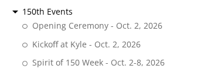
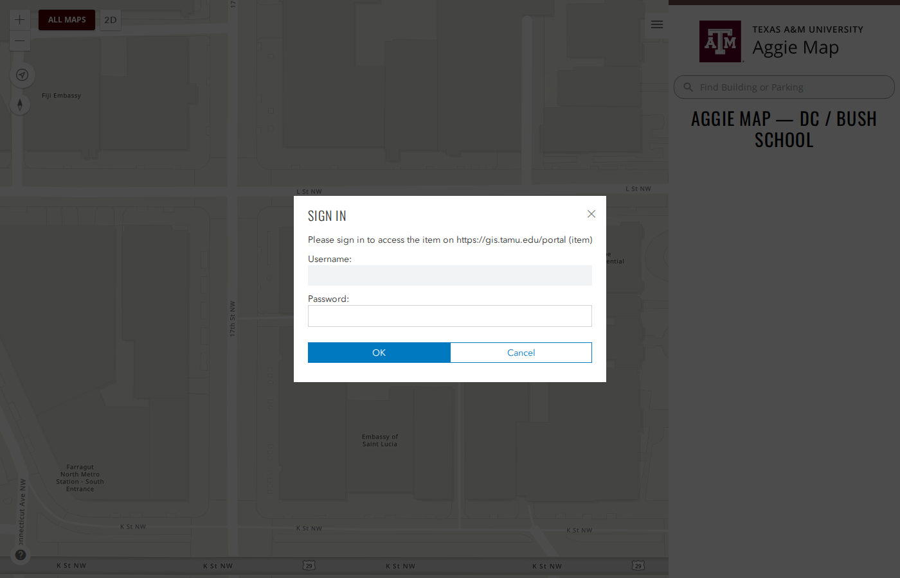
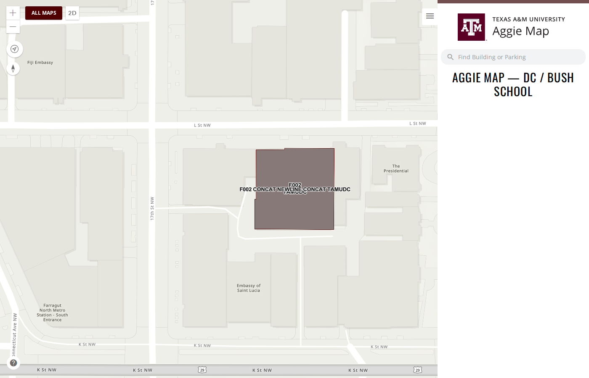

# 28 September 2026, second release

> **In production.** Released to [aggiemap.tamu.edu](https://aggiemap.tamu.edu) on the evening of
> 28 September 2026, after the [first release that day](2026-09-28.md). This file is the record of
> that release and is not edited further, except to correct something that is wrong.

**Previous release: [28 September](2026-09-28.md).**

Verified on the production deployment: **144 checks passed and none failed**, in 10.6 minutes. That
covers 52 maps loading with every layer returning data, analytics, search, popups, and the 83 GIS
services the maps use. The 11 maps behind a builder were skipped, because production has no builder
inventory yet; the 28 September release was in the same position. Seven services on production's
known-failures list, each tracked by an issue, were recorded rather than failed ([#1098](https://github.com/TamuGeoInnovation/Tamu.GeoInnovation.js.monorepo/issues/1098), [#1122](https://github.com/TamuGeoInnovation/Tamu.GeoInnovation.js.monorepo/issues/1122),
[#1123](https://github.com/TamuGeoInnovation/Tamu.GeoInnovation.js.monorepo/issues/1123)). The same suite passed on dev before this shipped: 165 checks, none failed.

---

## Summary

The **150th Events** list on the main map is corrected. Live at the Station comes out of the group,
because it is a concert rather than part of the anniversary celebration. Each remaining event now
shows its date next to its name. The DC / Bush School campus map works again after its services
moved. Behind the scenes, the automated checks now cover search, map popups, and every GIS service
the maps use.

The 150th Events list on the main map, before and after:

| Before (production) | After (production) |
| --- | --- |
|  |  |

---

## What to test

**Now on production.** Each link opens the thing it describes on
[aggiemap.tamu.edu](https://aggiemap.tamu.edu). The same checks were run on dev before this shipped.

DC / Bush School is the exception and keeps its dev link: campus maps are a development-only section,
so dev is the only place it is listed.

| Open this | Look for |
| --- | --- |
| [The main map](https://aggiemap.tamu.edu/map) | the layer list's **150th Events** heading lists **three** events, with no Live at the Station |
| [The main map](https://aggiemap.tamu.edu/map) | each event shows its date after its name: **Opening Ceremony - Oct. 2, 2026**, **Kickoff at Kyle - Oct. 2, 2026**, **Spirit of 150 Week - Oct. 2-8, 2026** |
| [Live at the Station](https://aggiemap.tamu.edu/events/live-at-the-station) | its own map is unchanged, and it is still listed on All Maps |
| [DC / Bush School, **on dev**](https://dev.aggiemap.tamu.edu/campus/dc-bush-school) | the map draws, and searching for "Bush" finds **Bush School - DC (F002)** |

---

## Changed

### Live at the Station is no longer listed under 150th Events

The main map's layer list showed Live at the Station under the **150th Events** heading. It is a
concert and not part of the 150th anniversary celebration. Megan McMullen caught this, and Tricia
Speed confirmed it against the university's event page. The heading now lists Opening Ceremony,
Kickoff at Kyle and Spirit of 150 Week.

Only the main map's list changes. The Live at the Station map itself, and where it is listed on All
Maps, stay as they were. ([#1125](https://github.com/TamuGeoInnovation/Tamu.GeoInnovation.js.monorepo/issues/1125))

### Each 150th event shows its date

Tricia asked for each event's date in the layer list, next to its name, rather than in the layers
themselves:

| Event | Date |
| --- | --- |
| Opening Ceremony | Oct. 2, 2026 |
| Kickoff at Kyle | Oct. 2, 2026 |
| Spirit of 150 Week | Oct. 2-8, 2026 |

The date follows the name after a dash, in the list's usual grey. Any other layer can show a note
the same way later with only a definition change, no code change. ([#1126](https://github.com/TamuGeoInnovation/Tamu.GeoInnovation.js.monorepo/issues/1126))

## Fixed

### The DC / Bush School map stopped loading

Its services were republished at a new address, and the old one began asking for a sign-in, so the
map drew nothing. It now reads the new services. Search now finds buildings by name, abbreviation or
number. ([#1110](https://github.com/TamuGeoInnovation/Tamu.GeoInnovation.js.monorepo/issues/1110))

| Before (dev) | After (dev) |
| --- | --- |
|  |  |

Campus maps are a development-only section, so this is visible on dev; production does not list
them.

One thing is still for the GIS team: a building label on the new basemap reads
"F002 CONCAT NEWLINE CONCAT TAMUDC" instead of two lines. That comes from the service's label style,
not from Aggie Map, and is noted on [#1110](https://github.com/TamuGeoInnovation/Tamu.GeoInnovation.js.monorepo/issues/1110).

---

## Behind the scenes

Not user-visible, but worth recording.

- **Search and popups are tested.** The automated checks now type a search, pick the result and
  confirm its details open. They also click a map feature and confirm its popup shows data. ([#1116](https://github.com/TamuGeoInnovation/Tamu.GeoInnovation.js.monorepo/issues/1116),
  [#1117](https://github.com/TamuGeoInnovation/Tamu.GeoInnovation.js.monorepo/issues/1117))
- **Maps behind a builder are tested** rather than skipped. ([#1106](https://github.com/TamuGeoInnovation/Tamu.GeoInnovation.js.monorepo/pull/1106))
- **Local test runs use `localhost`,** so they check the same maps dev shows. ([#1114](https://github.com/TamuGeoInnovation/Tamu.GeoInnovation.js.monorepo/issues/1114))
- **Every GIS service the maps use is checked directly**, so a service that is moved, stopped or
  made private is named outright rather than surfacing as a map that does not load ([#1118](https://github.com/TamuGeoInnovation/Tamu.GeoInnovation.js.monorepo/issues/1118)). Its
  first run found four stopped services for past events ([#1098](https://github.com/TamuGeoInnovation/Tamu.GeoInnovation.js.monorepo/issues/1098)), a missing bike racks service on
  production ([#1122](https://github.com/TamuGeoInnovation/Tamu.GeoInnovation.js.monorepo/issues/1122)) and two unused entries ([#1123](https://github.com/TamuGeoInnovation/Tamu.GeoInnovation.js.monorepo/issues/1123)).

---

## What went into this release

Every pull request this release carried, and the issue behind each one.

| Change | Pull request | Issue |
| --- | --- | --- |
| DC / Bush School map pointed at its republished services | [#1111](https://github.com/TamuGeoInnovation/Tamu.GeoInnovation.js.monorepo/pull/1111) | [#1110](https://github.com/TamuGeoInnovation/Tamu.GeoInnovation.js.monorepo/issues/1110) |
| Live at the Station removed from the home map's 150th Events group | [#1127](https://github.com/TamuGeoInnovation/Tamu.GeoInnovation.js.monorepo/pull/1127) | [#1125](https://github.com/TamuGeoInnovation/Tamu.GeoInnovation.js.monorepo/issues/1125) |
| Each 150th event's date shown next to its name | [#1128](https://github.com/TamuGeoInnovation/Tamu.GeoInnovation.js.monorepo/pull/1128) | [#1126](https://github.com/TamuGeoInnovation/Tamu.GeoInnovation.js.monorepo/issues/1126) |
| Map search tested: finds the expected result and shows its data | [#1120](https://github.com/TamuGeoInnovation/Tamu.GeoInnovation.js.monorepo/pull/1120) | [#1116](https://github.com/TamuGeoInnovation/Tamu.GeoInnovation.js.monorepo/issues/1116) |
| Map popups tested: clicking a feature opens it with data | [#1121](https://github.com/TamuGeoInnovation/Tamu.GeoInnovation.js.monorepo/pull/1121) | [#1117](https://github.com/TamuGeoInnovation/Tamu.GeoInnovation.js.monorepo/issues/1117) |
| Every GIS service the maps use tested as public and answering | [#1124](https://github.com/TamuGeoInnovation/Tamu.GeoInnovation.js.monorepo/pull/1124) | [#1118](https://github.com/TamuGeoInnovation/Tamu.GeoInnovation.js.monorepo/issues/1118) |
| Maps behind a builder tested instead of skipped | [#1106](https://github.com/TamuGeoInnovation/Tamu.GeoInnovation.js.monorepo/pull/1106) | [#1088](https://github.com/TamuGeoInnovation/Tamu.GeoInnovation.js.monorepo/issues/1088) |
| Local smoke runs use `localhost`, not `127.0.0.1` | [#1115](https://github.com/TamuGeoInnovation/Tamu.GeoInnovation.js.monorepo/pull/1115) | [#1114](https://github.com/TamuGeoInnovation/Tamu.GeoInnovation.js.monorepo/issues/1114) |
| Release notes made the first step after a production deployment | [#1095](https://github.com/TamuGeoInnovation/Tamu.GeoInnovation.js.monorepo/pull/1095) | [#1094](https://github.com/TamuGeoInnovation/Tamu.GeoInnovation.js.monorepo/issues/1094) |
| Work in flight recorded so another machine can pick it up | [#1109](https://github.com/TamuGeoInnovation/Tamu.GeoInnovation.js.monorepo/pull/1109) | [#1108](https://github.com/TamuGeoInnovation/Tamu.GeoInnovation.js.monorepo/issues/1108) |
| Every issue and pull request field filled in | [#1113](https://github.com/TamuGeoInnovation/Tamu.GeoInnovation.js.monorepo/pull/1113) | [#1112](https://github.com/TamuGeoInnovation/Tamu.GeoInnovation.js.monorepo/issues/1112) |
| 150th Events changes and the DC fix recorded in the notes | [#1130](https://github.com/TamuGeoInnovation/Tamu.GeoInnovation.js.monorepo/pull/1130) | [#1129](https://github.com/TamuGeoInnovation/Tamu.GeoInnovation.js.monorepo/issues/1129) |

Found by the new service checks and **not** fixed in this release: [#1098](https://github.com/TamuGeoInnovation/Tamu.GeoInnovation.js.monorepo/issues/1098), [#1122](https://github.com/TamuGeoInnovation/Tamu.GeoInnovation.js.monorepo/issues/1122), [#1123](https://github.com/TamuGeoInnovation/Tamu.GeoInnovation.js.monorepo/issues/1123).
