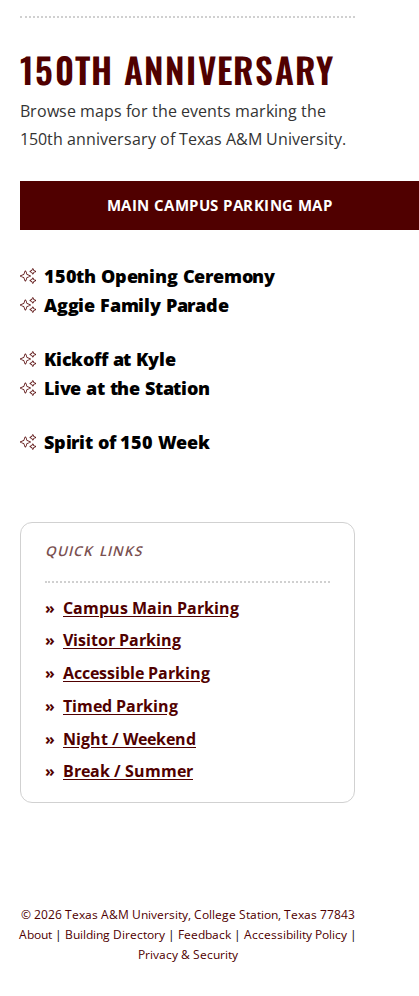
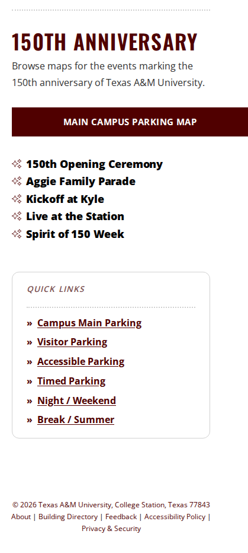

# 28 September 2026

> **In production.** Released to [aggiemap.tamu.edu](https://aggiemap.tamu.edu) on 28 September 2026.
> This file is the record of that release and is not edited further, except to correct something that
> is wrong.

**Previous release: [25 September](2026-09-25.md).**

Verified on the production deployment: **56 maps checked automatically, every layer resolving and
returning data, no failures**, and analytics reporting to the production property. The same suite was
run against dev before this shipped.

**Bus routes are not on production.** That is deliberate, not a fault - the service they read is not
published on the production GIS server yet. See the bus entry below.

---

## Summary

Bus routes return to Aggie Map on dev, held on production until their service is published. The 150th Anniversary maps gain a section of their own and appear on
the main map. The Maps pages work properly on a phone. Three map bugs are fixed, one of which had
been showing incorrect data on production. Behind the scenes, every map is now checked automatically
against the live site.

**One thing needs resolving before this goes to production** — see *Needs a decision* at the end.

---

## What to test

**Now on production.** Each link opens the thing it describes on
[aggiemap.tamu.edu](https://aggiemap.tamu.edu); the detail is further down if you want it. The same
checks were run on dev before this shipped.

Bus routes are the exception and are deliberately not on production — that row keeps its dev link,
because dev is the only place there is anything to look at.

| Open this | Look for |
| --- | --- |
| [All Maps](https://aggiemap.tamu.edu/all-maps) | a **150th Anniversary** tile; opening it lists all five anniversary maps |
| [All Maps, on a phone](https://aggiemap.tamu.edu/all-maps) | the tiles sit **side by side** rather than one per line, and a **‹ Back** link replaces the breadcrumb |
| [150th Anniversary, on a phone](https://aggiemap.tamu.edu/all-maps/150) | the five maps read as **one evenly spaced list**, not split into groups of two, two and one |
| [The main map](https://aggiemap.tamu.edu/map) | a **150th Events** heading in the layer list, four events, all starting switched off |
| [Bus routes, **on dev**](https://dev.aggiemap.tamu.edu/map/d/bus) | routes and stops list; clicking a stop opens a popup with a schedule link. Not on production — see below |
| [Gameday Parking, micromobility](https://aggiemap.tamu.edu/events/gameday-parking/map/d?transport-type=micromobility&direction=entry) | **Bike Dismount Zones** and **Bike Veo Geofence** draw the right things — they were showing each other's data |
| [150th Opening Ceremony](https://aggiemap.tamu.edu/events/150th-kickoff) | the legend no longer lists *Hourly Paid Parking* |

Two things worth knowing before you report something as broken:

- **Bus routes do not appear on production.** That is deliberate, not a bug — the service they read
  is not published on the production GIS server yet. On dev they work, and switching them on later
  needs no code change of any substance.
- **Dev shows sections production does not**, such as Campus Maps and kiosk maps. Those are
  development-only and were never part of this release, so do not go looking for them on production.

---

## New

### Bus routes and stops are back — on dev only, for now

Bus routes and stops return to Aggie Map, with stop popups and shareable links to a specific stop.
Opening a shared stop link draws the route serving it.

**Held on production until the bus service is published.** The data comes from a GIS service that is
not yet publicly readable on the production server, so on production Aggie Map keeps showing the
"Bus routes are currently unavailable" notice it shows today. Nothing changes for anyone using the
live site until that service is published, at which point this is switched on without a code change
of any substance.

**Check on dev:** [the bus panel](https://dev.aggiemap.tamu.edu/map/d/bus), the bus layer on the main
map, and a stop popup.

### A 150th Anniversary section

All Maps now has a 150th Anniversary tile leading to a page listing all five anniversary maps —
Kickoff at Kyle, Live at the Station, Spirit of 150 Week, Opening Ceremony, and the Aggie Family
Parade.

The anniversary maps keep their existing addresses, so links already shared still work. They also
still appear under Campus Events, so nobody has to learn a new route to find them.

**Check on dev:** [dev.aggiemap.tamu.edu/all-maps](https://dev.aggiemap.tamu.edu/all-maps), then the
Anniversary tile.

| Before | After |
| --- | --- |
|  |  |

The **Anniversary** tile is the new one. *Campus Maps* also appears in the "after" image — that is a
development-only section and is not part of this release.

### 150th events on the main map

Four anniversary events are available on the main campus map under a *150th Events* heading:
Opening Ceremony, Kickoff at Kyle, Live at the Station and Spirit of 150 Week. Each is turned on and
off on its own, and all four start off, so they are there when wanted without changing what the map
looks like on arrival. Opening Ceremony is one entry that shows its event locations, shuttle route and
parking together.

**Check on dev:** [the main map](https://dev.aggiemap.tamu.edu/map), then the layer list for the
*150th Events* heading.

### The Maps pages work on a phone

The Visit Maps tiles were taking roughly half a phone screen each. They now sit side by side, and the
breadcrumb on narrow screens is replaced with a single Back link that returns to whichever map you
came from rather than always the main map.

**Check on dev:** [dev.aggiemap.tamu.edu/all-maps](https://dev.aggiemap.tamu.edu/all-maps) on a phone,
or a narrow browser window.

| Before | After |
| --- | --- |
|  |  |

The tiles now sit side by side as compact rows rather than large stacked icons, the breadcrumb and
page heading are replaced by a single **‹ Back** link, and search moves above the tiles.

### About page

Kaleb Wilson added.

---

## Fixed

### Gameday Parking was showing the wrong bike layers

**This is the one worth knowing about.** On the Gameday Parking map, two micromobility layers were
displaying the wrong data under the wrong names — "Bike Veo Geofence" was drawing dismount zones, and
"Bike Lanes" was drawing the geofence. Two further layers failed to load entirely.

The underlying services had been republished and their layer positions shifted; the map was still
asking for the old positions. Nothing errored for the two mislabelled ones, so nothing flagged it.
This has been wrong on production for some time.

Three layers are corrected. **Bike Lanes is temporarily withheld** — see *Needs a decision*.

### The 150th Opening Ceremony legend listed a class that no longer exists

"Hourly Paid Parking" was removed from the data but stayed in the legend, because the map carried its
own copy of the classes rather than reading the service. Reported by Megan.

### The "Aggie Map" breadcrumb went back to the wrong place

On a desktop browser, the **Aggie Map** crumb returned you to whichever map you had just come from
rather than to the main Aggie Map. Opening the bus map, clicking All Maps, then clicking Aggie Map
took you back to the bus map.

It affected every Maps page, not only All Maps, because they share a header.

The phone layout is unchanged: there the same trail is shown as a single **‹ Back** link, and going
back to the map you came from is what it is for.

**Check on dev:** open [the bus map](https://dev.aggiemap.tamu.edu/map/d/bus), click **All Maps**, then
click **Aggie Map** — you should land on the main campus map.

### Uneven gaps between maps on a phone

On a phone, the map lists showed gaps in places that looked arbitrary — the 150th Anniversary page
listed its five maps as two, a gap, two, a gap, one.

The gaps were the desktop column boundaries. These pages lay their maps out in three columns; on a
phone the columns stack, and the space between them ended up *inside* what now reads as a single
list. Pages whose columns have headings, such as Parking Maps and Campus Events, are unaffected:
there the break is a real section and the heading explains it. Those two pages render identically
before and after.

Found in a baseline screenshot rather than by anyone reporting it.

**Check on dev:** [the 150th Anniversary page](https://dev.aggiemap.tamu.edu/all-maps/150) on a phone,
or a narrow browser window — the five maps should read as one list.

| Before | After |
| --- | --- |
|  |  |

### The Back link lost shared-link details

On the Maps pages, the "Aggie Map" link back to your last map dropped any detail in the address — so
returning from a shared bus stop link went nowhere useful. It now returns you to exactly the map you
were on.

---

## Behind the scenes

Not user-visible, but worth recording.

**Every map is now checked automatically.** A suite loads all 73 maps against the live site and
verifies each layer actually loads and returns data. It runs daily and will open an issue only when
something breaks. It found the Gameday Parking bug above.

Eleven maps cannot be reached by address at all — they require choices in a builder first — so every
combination of every builder was walked and recorded, producing 360 shareable links that reach each
destination directly. That record is also a baseline: if a choice is renamed or a destination starts
drawing different layers, it shows up as a difference.

The application now carries a small read-only handle used by those tests to inspect which layers a
map has loaded. It exposes nothing that was not already public and cannot change anything.

Also: build-tagging fixes in the pipeline, and documentation for the fork-based workflow and release
notes themselves.

---

## Needs a decision

### Bus routes read from the development GIS server

`TS/Bus_Routes` is not publicly readable on the production GIS server — it returns "Token Required" —
so Aggie Map is pointed at the development server for bus data.

**Decided: bus routes are held on production rather than holding the release.** Shipping as-is would
leave a live feature depending on a development server — if that server were restarted or taken down
for maintenance, bus routes would disappear from the live site with nothing to explain why. Everything
else in this release is independent of bus and should not wait for one service.

So on production the bus panel keeps the "currently unavailable" notice it already shows, and makes no
request to the development server at all. Dev is unaffected and shows the working feature.

**What is still needed:** make `TS/Bus_Routes` publicly readable on the production GIS server,
matching `TS/BikeMap`, which is already public. Once it is, removing the hold is a small change and
bus routes appear on production.

Worth knowing: because bus data is drawn as graphics rather than loaded as a map layer, the automated
checks above would **not** notice if it stopped working.

### Where did Bike Lanes go?

Neither micromobility service publishes a layer named "Bike Lanes" any more. Rather than leave it
showing the wrong data, it is hidden for now. Both services were republished on 24 September, which
is when the positions shifted, so the question is whether Bike Lanes was dropped then and where its
data now lives.

The map still shows Campus Bike Lanes and City Bike Lanes and Routes, so bike lane information has
not disappeared from it.

---

## Fixed outside this release

**Development analytics were being recorded as production traffic.** `dev.aggiemap.tamu.edu` was
reporting into the production Google Analytics property, so development activity was mixed into the
production numbers and the development property recorded nothing at all. This was a pipeline
configuration issue, fixed and verified — development now reports to its own property. No code change
was involved, so it is already in effect.

GIS Day has the same problem and has not been fixed.

---

## What went into this release

Every pull request this release carried, and the issue behind it where there was one.

22 of these have no issue: the rule that every change is logged as an issue first arrived
partway through this release, in [#1057](https://github.com/TamuGeoInnovation/Tamu.GeoInnovation.js.monorepo/pull/1057). Everything merged after it has one.

| Change | Pull request | Issue |
| --- | --- | --- |
| ci: Publish a complete image set from deployable branches | [#1016](https://github.com/TamuGeoInnovation/Tamu.GeoInnovation.js.monorepo/pull/1016) | — |
| feat(aggiemap-angular): Show the 150th event layers on the main map under a 150th Events heading | [#1018](https://github.com/TamuGeoInnovation/Tamu.GeoInnovation.js.monorepo/pull/1018) | [#1017](https://github.com/TamuGeoInnovation/Tamu.GeoInnovation.js.monorepo/issues/1017) |
| ci: Never fail a build over build tagging | [#1019](https://github.com/TamuGeoInnovation/Tamu.GeoInnovation.js.monorepo/pull/1019) | — |
| docs: Say when release notes are written and how same-day releases are named | [#1021](https://github.com/TamuGeoInnovation/Tamu.GeoInnovation.js.monorepo/pull/1021) | — |
| docs: Document the fork-based workflow for people and for Claude | [#1022](https://github.com/TamuGeoInnovation/Tamu.GeoInnovation.js.monorepo/pull/1022) | — |
| chore(aggiemap-angular): add Kaleb Wilson to About page | [#1015](https://github.com/TamuGeoInnovation/Tamu.GeoInnovation.js.monorepo/pull/1015) | — |
| feat(aggiemap-angular): Add a 150th Anniversary section and detail page | [#1024](https://github.com/TamuGeoInnovation/Tamu.GeoInnovation.js.monorepo/pull/1024) | [#1023](https://github.com/TamuGeoInnovation/Tamu.GeoInnovation.js.monorepo/issues/1023) |
| fix(ts-events-angular): Drop the dead Hourly Paid Parking class from the 150th legend | [#1029](https://github.com/TamuGeoInnovation/Tamu.GeoInnovation.js.monorepo/pull/1029) | [#1020](https://github.com/TamuGeoInnovation/Tamu.GeoInnovation.js.monorepo/issues/1020) |
| feat(aggiemap-angular): Make the discover pages usable on a phone | [#1030](https://github.com/TamuGeoInnovation/Tamu.GeoInnovation.js.monorepo/pull/1030) | [#1026](https://github.com/TamuGeoInnovation/Tamu.GeoInnovation.js.monorepo/issues/1026) |
| ci: Skip build tagging on pull request builds, which cannot be tagged | [#1032](https://github.com/TamuGeoInnovation/Tamu.GeoInnovation.js.monorepo/pull/1032) | — |
| ci: Tag pull request builds whose branch is on this repository | [#1033](https://github.com/TamuGeoInnovation/Tamu.GeoInnovation.js.monorepo/pull/1033) | — |
| feat(aggiemap-angular) Re-add Bus Routes to AggieMap | [#863](https://github.com/TamuGeoInnovation/Tamu.GeoInnovation.js.monorepo/pull/863) | [#844](https://github.com/TamuGeoInnovation/Tamu.GeoInnovation.js.monorepo/issues/844) |
| fix(aggiemap-angular): Keep the query string on the maps back link | [#1035](https://github.com/TamuGeoInnovation/Tamu.GeoInnovation.js.monorepo/pull/1035) | — |
| feat(aggiemap-angular): Add end-to-end map coverage and a builder inventory | [#1039](https://github.com/TamuGeoInnovation/Tamu.GeoInnovation.js.monorepo/pull/1039) | — |
| fix(aggiemap-angular): Correct the Gameday Parking bike layer indices | [#1040](https://github.com/TamuGeoInnovation/Tamu.GeoInnovation.js.monorepo/pull/1040) | — |
| ci(aggiemap-angular): Schedule the smoke suite against dev and production | [#1041](https://github.com/TamuGeoInnovation/Tamu.GeoInnovation.js.monorepo/pull/1041) | — |
| docs: Collect release notes as they merge, in unreleased.md | [#1042](https://github.com/TamuGeoInnovation/Tamu.GeoInnovation.js.monorepo/pull/1042) | — |
| fix(aggiemap-angular): Fail fast when a build has no map probe | [#1043](https://github.com/TamuGeoInnovation/Tamu.GeoInnovation.js.monorepo/pull/1043) | — |
| feat(aggiemap-angular): Hold bus routes on production until the service is published | [#1044](https://github.com/TamuGeoInnovation/Tamu.GeoInnovation.js.monorepo/pull/1044) | — |
| docs: Document how to run the smoke suite | [#1045](https://github.com/TamuGeoInnovation/Tamu.GeoInnovation.js.monorepo/pull/1045) | — |
| ci(aggiemap-angular): Allow the layers the dev GIS server does not serve | [#1046](https://github.com/TamuGeoInnovation/Tamu.GeoInnovation.js.monorepo/pull/1046) | — |
| docs: Point a fresh session at where the work stands | [#1047](https://github.com/TamuGeoInnovation/Tamu.GeoInnovation.js.monorepo/pull/1047) | — |
| docs: Correct the 150th events count on the main map in unreleased.md | [#1048](https://github.com/TamuGeoInnovation/Tamu.GeoInnovation.js.monorepo/pull/1048) | — |
| docs: Say what "run the tests" means, per environment, in CLAUDE.md | [#1049](https://github.com/TamuGeoInnovation/Tamu.GeoInnovation.js.monorepo/pull/1049) | — |
| feat(aggiemap-angular): Run the smoke suite locally with the scheduled run's settings | [#1050](https://github.com/TamuGeoInnovation/Tamu.GeoInnovation.js.monorepo/pull/1050) | — |
| ci(aggiemap-angular): Skip the smoke suite on a build that predates the map probe | [#1052](https://github.com/TamuGeoInnovation/Tamu.GeoInnovation.js.monorepo/pull/1052) | — |
| docs: Add a "What to test" section and make the check links clickable | [#1054](https://github.com/TamuGeoInnovation/Tamu.GeoInnovation.js.monorepo/pull/1054) | — |
| fix(aggiemap-angular): Remove the duplicated 150th Anniversary tile | [#1053](https://github.com/TamuGeoInnovation/Tamu.GeoInnovation.js.monorepo/pull/1053) | [#1055](https://github.com/TamuGeoInnovation/Tamu.GeoInnovation.js.monorepo/issues/1055) |
| ci: Require a linked issue on every pull request, and screenshots for visible changes | [#1057](https://github.com/TamuGeoInnovation/Tamu.GeoInnovation.js.monorepo/pull/1057) | [#5](https://github.com/TamuGeoInnovation/Tamu.GeoInnovation.js.monorepo/issues/5) |
| docs: Show before/after screenshots in the release notes | [#1069](https://github.com/TamuGeoInnovation/Tamu.GeoInnovation.js.monorepo/pull/1069) | [#1068](https://github.com/TamuGeoInnovation/Tamu.GeoInnovation.js.monorepo/issues/1068) |
| fix(aggiemap-angular): Send the "Aggie Map" breadcrumb to the main map | [#1071](https://github.com/TamuGeoInnovation/Tamu.GeoInnovation.js.monorepo/pull/1071) | [#1066](https://github.com/TamuGeoInnovation/Tamu.GeoInnovation.js.monorepo/issues/1066) |
| docs: Record the breadcrumb fix, and put its screenshots on development | [#1073](https://github.com/TamuGeoInnovation/Tamu.GeoInnovation.js.monorepo/pull/1073) | [#1072](https://github.com/TamuGeoInnovation/Tamu.GeoInnovation.js.monorepo/issues/1072) |
| ci: Produce and publish JUnit test results | [#1074](https://github.com/TamuGeoInnovation/Tamu.GeoInnovation.js.monorepo/pull/1074) | [#1070](https://github.com/TamuGeoInnovation/Tamu.GeoInnovation.js.monorepo/issues/1070) |
| feat(aggiemap-angular): Add visual baselines for the pages people land on | [#1076](https://github.com/TamuGeoInnovation/Tamu.GeoInnovation.js.monorepo/pull/1076) | [#1067](https://github.com/TamuGeoInnovation/Tamu.GeoInnovation.js.monorepo/issues/1067) |
| fix(aggiemap-angular): Even spacing for map lists on a phone | [#1077](https://github.com/TamuGeoInnovation/Tamu.GeoInnovation.js.monorepo/pull/1077) | [#1075](https://github.com/TamuGeoInnovation/Tamu.GeoInnovation.js.monorepo/issues/1075) |
| docs: Store screenshots when taken, and pin their links to a commit | [#1081](https://github.com/TamuGeoInnovation/Tamu.GeoInnovation.js.monorepo/pull/1081) | [#1080](https://github.com/TamuGeoInnovation/Tamu.GeoInnovation.js.monorepo/issues/1080) |
| fix(aggiemap-angular): One Main Campus Parking Map button, on the shared class | [#1083](https://github.com/TamuGeoInnovation/Tamu.GeoInnovation.js.monorepo/pull/1083) | [#1078](https://github.com/TamuGeoInnovation/Tamu.GeoInnovation.js.monorepo/issues/1078) |
| ci: Name test results by project, and publish them as a check | [#1085](https://github.com/TamuGeoInnovation/Tamu.GeoInnovation.js.monorepo/pull/1085) | [#1084](https://github.com/TamuGeoInnovation/Tamu.GeoInnovation.js.monorepo/issues/1084) |
| chore: Refresh the two stale phone baselines from dev | [#1086](https://github.com/TamuGeoInnovation/Tamu.GeoInnovation.js.monorepo/pull/1086) | [#1079](https://github.com/TamuGeoInnovation/Tamu.GeoInnovation.js.monorepo/issues/1079) |
| fix: One button definition, and anchors that behave like buttons | [#1087](https://github.com/TamuGeoInnovation/Tamu.GeoInnovation.js.monorepo/pull/1087) | [#1031](https://github.com/TamuGeoInnovation/Tamu.GeoInnovation.js.monorepo/issues/1031) |
| docs: Record the 28 September release | [#1093](https://github.com/TamuGeoInnovation/Tamu.GeoInnovation.js.monorepo/pull/1093) | [#1092](https://github.com/TamuGeoInnovation/Tamu.GeoInnovation.js.monorepo/issues/1092) |
