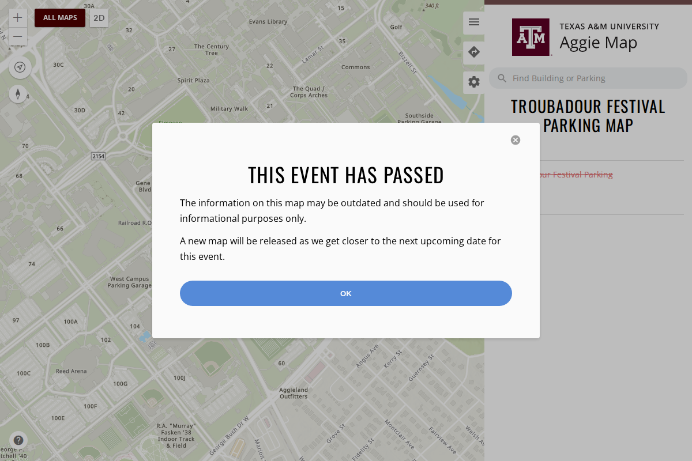
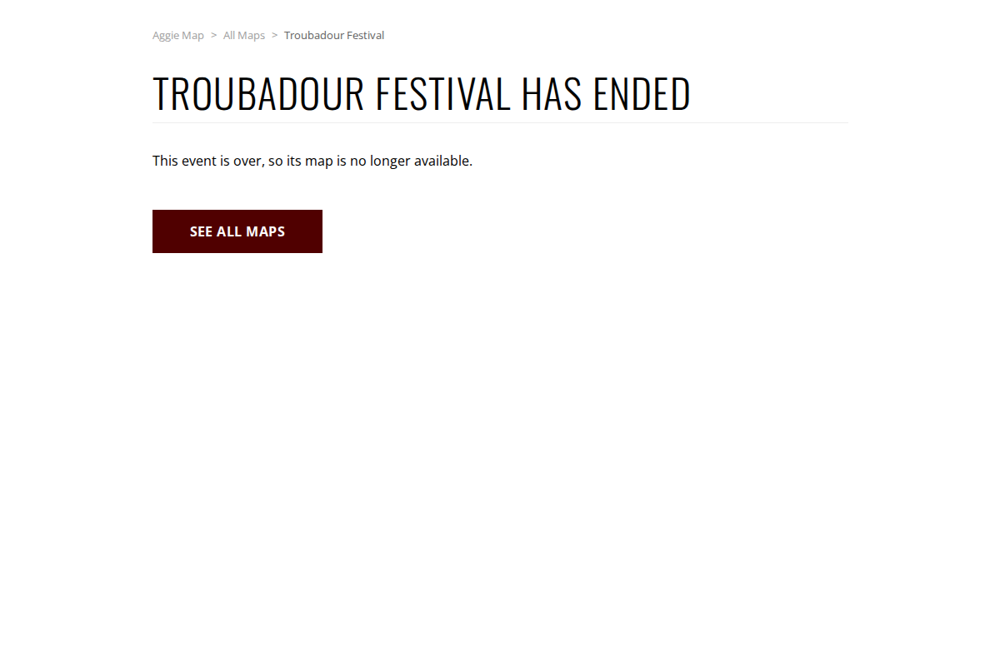
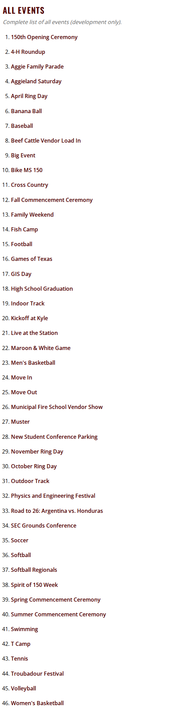
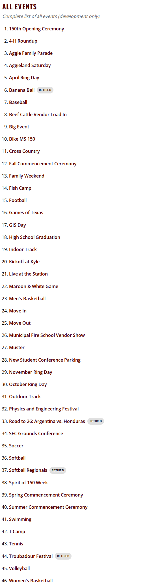
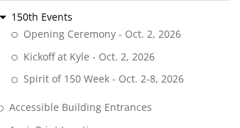
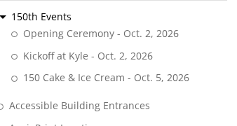

# 29 September 2026

> **In production.** Released to [aggiemap.tamu.edu](https://aggiemap.tamu.edu) on the evening of
> 29 September 2026. This file is the record of that release and is not edited further, except to
> correct something that is wrong.

**Previous release: [28 September, second release](2026-09-28-2.md).**

Verified on dev before it shipped: **174 checks passed, none failed**, in 12.1 minutes. That covers
69 maps loading with every layer returning data, analytics, search, popups, the GIS services the maps
use, and the retired maps staying out of sight. Four maps were skipped, which is the point of this
release: they are the retired events, and their services are stopped. The 11 maps behind a builder
were skipped, because production still has no builder inventory — the same position as the last two
releases ([#1088](https://github.com/TamuGeoInnovation/Tamu.GeoInnovation.js.monorepo/issues/1088)).

The commit that shipped is tagged twice, `dev-2026-09-29` and `prod-2026-09-29`, both on
[`e973c045`](https://github.com/TamuGeoInnovation/Tamu.GeoInnovation.js.monorepo/commit/e973c045d9d28774efbe3cb06dd00e9031b31cb8).
One build serves both environments, so the pair reads: verified on dev on this date, shipped on the
same one. This is the first release in this repository to carry tags at all
([#1145](https://github.com/TamuGeoInnovation/Tamu.GeoInnovation.js.monorepo/issues/1145)).

The same suite was run against production once it was out: **156 passed, none failed**, including
every retired map answering with the ended page rather than a broken map. Sixteen were skipped — the
11 builder-gated maps, the four retired events' own map loads, and one check that only applies to dev.

---

## Summary

Events that are over are now marked **retired**, and four are. On production the visible change is
what happens when you follow an old link to one: it used to open a map whose data was gone, and now
says the event has ended. On dev they also leave All Maps search, while staying in the All Events list
labelled Retired, and the nightly checks stop testing them.

The cake and ice cream event is corrected: it is **150 Cake & Ice Cream** on **5 October**, not
"Spirit of 150 Week" over a range of days. Its address is unchanged, so links already shared still
work.

The rest of the release is process, and none of it changes the site: a release now records the commit
it came from, the notes link every issue and pull request they mention, and each pull request writes
its own notes rather than having them reconstructed afterwards.

---

## Changed

### Retired events are no longer offered anywhere

Events that are over used to be hidden with the same setting as maps not announced yet. Hidden maps
still show in dev's search, so four finished events were offered there and tested every night,
although their services are stopped on the production GIS server. They are now marked **retired**:
search and the listing pages leave them out on every environment, and the automated checks skip them.
Dev's All Events list still includes them, labelled **Retired**, because that list is where the team
keeps every event, working or not.

**A retired map's link no longer opens a map.** An old shared link, the map's own address, or the
entry in All Events leads to a short page saying the event has ended, with a button to All Maps. This
is the part that is visible on production, where these links used to open a map whose layers could
not load.

Retired: Banana Ball, Softball Regionals, Troubadour Festival, and Road to 26: Argentina vs. Honduras.
([#1098](https://github.com/TamuGeoInnovation/Tamu.GeoInnovation.js.monorepo/issues/1098))

**See it on production:**
[Troubadour Festival](https://aggiemap.tamu.edu/events/troubadour-festival-2025),
[Banana Ball](https://aggiemap.tamu.edu/events/savannah-bananas-parking),
[Softball Regionals](https://aggiemap.tamu.edu/events/softball-regionals-2025),
[Argentina vs. Honduras](https://aggiemap.tamu.edu/events/argentina-vs-honduras-2026). Each should say
the event has ended rather than drawing a map.

The search change and the All Events label are **visible on dev only**, because production already
hid these maps from both. The captures below are from a local build of what shipped.

| Before | After |
| --- | --- |
|  |  |
|  |  |
|  |  |

### 150 Cake & Ice Cream, corrected

The cake and ice cream event was published as **Spirit of 150 Week**, the week it sits in, and the
date beside it read a range rather than the day it happens. It is one event, on **5 October**.

It now reads **150 Cake & Ice Cream - Oct. 5, 2026** in the 150th Events group on the main map, and
carries that name on its own map, on Campus Events and on the 150th Anniversary page.

**Its address has not changed.** Any link already shared still works, which is why the address still
reads `spirit-of-150-week`.

| Before (production) | After (production) |
| --- | --- |
|  |  |

**See it on production:** [the main map](https://aggiemap.tamu.edu/map), 150th Events in the layer
list; and [the event map](https://aggiemap.tamu.edu/events/spirit-of-150-week), whose address keeps
the old name on purpose. Searching *cake*, *ice cream* or *spirit* should all find it.

Corrected by Tricia Speed.

---

## Behind the scenes

- **A check that retired maps stay hidden.** The smoke suite searches All Maps for each retired map
  and reads every listing page, on each environment. It checks that dev's All Events list still has
  them, each labelled Retired, and that each retired map's link opens the ended page and no map.
  ([#1098](https://github.com/TamuGeoInnovation/Tamu.GeoInnovation.js.monorepo/issues/1098))
- **The GIS services check skips retired maps' services** rather than listing them as known
  failures.
  ([#1098](https://github.com/TamuGeoInnovation/Tamu.GeoInnovation.js.monorepo/issues/1098))
- **Each build is tagged with the commit it came from.** `scripts/tag-build.sh dev` when a build
  reaches dev, `scripts/tag-build.sh prod` when it is promoted. The `prod` tag **refuses a commit
  carrying no `dev-*` tag**, which is what makes "we shipped what we tested" a fact rather than an
  assumption. Before this, a build was identified only by an Azure DevOps number that nobody outside
  the pipeline can resolve.
  ([#1145](https://github.com/TamuGeoInnovation/Tamu.GeoInnovation.js.monorepo/issues/1145))
- **The notes link every issue and pull request they mention, with full URLs,** and end with a table
  of everything a release carried. A bare `#1122` is inert text in a file, so it led nowhere for the
  reader these notes exist for.
  ([#1139](https://github.com/TamuGeoInnovation/Tamu.GeoInnovation.js.monorepo/issues/1139))
- **Each pull request writes its own notes entry**, rather than the notes being assembled afterwards
  from memory — which had already left a release without its images, and nearly missed a
  data-correctness fix.
  ([#1132](https://github.com/TamuGeoInnovation/Tamu.GeoInnovation.js.monorepo/issues/1132))

---

## What went into this release

Every pull request this release carried, and the issue behind each one.

| Change | Pull request | Issue |
| --- | --- | --- |
| Retired events out of search and listings, and an ended page instead of a map | [#1136](https://github.com/TamuGeoInnovation/Tamu.GeoInnovation.js.monorepo/pull/1136) | [#1098](https://github.com/TamuGeoInnovation/Tamu.GeoInnovation.js.monorepo/issues/1098) |
| The cake and ice cream event named for what it is | [#1143](https://github.com/TamuGeoInnovation/Tamu.GeoInnovation.js.monorepo/pull/1143) | [#1142](https://github.com/TamuGeoInnovation/Tamu.GeoInnovation.js.monorepo/issues/1142) |
| Each build tagged with the commit it came from | [#1147](https://github.com/TamuGeoInnovation/Tamu.GeoInnovation.js.monorepo/pull/1147) | [#1145](https://github.com/TamuGeoInnovation/Tamu.GeoInnovation.js.monorepo/issues/1145) |
| Every issue and pull request a release carried, linked | [#1141](https://github.com/TamuGeoInnovation/Tamu.GeoInnovation.js.monorepo/pull/1141) | [#1139](https://github.com/TamuGeoInnovation/Tamu.GeoInnovation.js.monorepo/issues/1139) |
| Each pull request adds its own notes, and releases cut before production | [#1135](https://github.com/TamuGeoInnovation/Tamu.GeoInnovation.js.monorepo/pull/1135) | [#1132](https://github.com/TamuGeoInnovation/Tamu.GeoInnovation.js.monorepo/issues/1132) |

Known and **not** fixed in this release, each tracked:
[#1122](https://github.com/TamuGeoInnovation/Tamu.GeoInnovation.js.monorepo/issues/1122) and
[#1123](https://github.com/TamuGeoInnovation/Tamu.GeoInnovation.js.monorepo/issues/1123) (services on
production's known-failures list),
[#1102](https://github.com/TamuGeoInnovation/Tamu.GeoInnovation.js.monorepo/issues/1102) (dev
hardcoded to the production transportation host), and
[#1107](https://github.com/TamuGeoInnovation/Tamu.GeoInnovation.js.monorepo/issues/1107) (where
baseline images should live).
