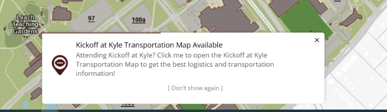
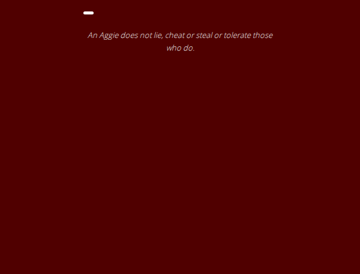

# 30 September 2026, second release

> **Cleared for release.** This file describes what the second 30 September release contains and what
> cleared it. Whether it has reached production is recorded by the `prod-2026-09-30-2` tag, not by this
> sentence. This file is the record of that release and is not edited further, except to correct
> something that is wrong.

**Previous release: [30 September](2026-09-30.md).**

Cut the same day as the first because the 150th Opening Ceremony moved venue on the afternoon of
30 September, for an event on **Friday 2 October**.

Verified on dev before release: **17 checks passed, none failed**, in 2.6 minutes, against 69 maps.
Those 17 are the checks covering what this release changes — the map notice, the development-only
gating, the directions entry points and the search sources behind them — not the full suite of 204.
That was a deliberate choice for a release with a two-day deadline, and it means this release is less
thoroughly checked than the first one today. The nightly scheduled run covers the rest.

The commit is [`f4dc9275`](https://github.com/TamuGeoInnovation/Tamu.GeoInnovation.js.monorepo/commit/f4dc9275),
tagged `dev-2026-09-30-2` after that run passed.

---

## Summary

**The Sesquicentennial Opening Ceremony has moved indoors to Rudder Auditorium.** AggieMap now says so
in three places: a notice on the event's own map with the full details, a message on the main map, and
the event map itself is centred on Rudder rather than a kilometre north of it.

**Concurrent notices no longer hide each other.** Several messages on the main map now stack in one
panel instead of rendering on top of one another, and an important one sorts to the top and says that
it is important.

---

## Changed

### The Opening Ceremony venue change

Because of the forecast, the ceremony is in **Rudder Auditorium**: program 4 p.m., reception 5 p.m.,
Rudder Tower Auditorium, 401 Joe Routt Blvd. Free parking at West Campus Garage, with shuttles to
Rudder from 3 p.m. Yell Practice at 9 p.m. is unchanged.

A message on the main map carries the short version. Opening
[the event's own map](https://aggiemap.tamu.edu/events/150th-kickoff) shows the full details in a notice
before the map, which can be dismissed and stays dismissed **for that browser session** — deliberately
not forever, because a notice about Friday that someone dismissed on Wednesday has to come back.

**The map was also pointing at the wrong place.** Its centre and zoom were set for the outdoor venue
and were left behind when the service was republished for the indoor one — about 1.2km north of where
the data actually is, which pushed the event marker to the bottom edge and ran the shuttle route off
the map. Both now come from the service extent rather than being chosen by eye.

([#1192](https://github.com/TamuGeoInnovation/Tamu.GeoInnovation.js.monorepo/issues/1192))

### Several notices at once no longer hide each other

Every notice on the main map was pinned to the same point on the screen, so when more than one applied
they rendered exactly on top of each other and only one could be seen. Three were active on
30 September, and the venue change was not the one showing.

They now stack in a single panel, and a notice can be marked important: it sorts above the others and
carries a maroon bar and an **IMPORTANT** label, so its position is explained rather than arbitrary.
Notices of equal importance keep the order they arrived in.

The 150th events also take their icon from the anniversary series now, rather than each naming an image
file — so an event added later gets the right one without anybody remembering.

| Before (dev) | After (dev) |
| --- | --- |
|  |  |

([#1195](https://github.com/TamuGeoInnovation/Tamu.GeoInnovation.js.monorepo/issues/1195),
building on [#693](https://github.com/TamuGeoInnovation/Tamu.GeoInnovation.js.monorepo/pull/693) and
closing [#687](https://github.com/TamuGeoInnovation/Tamu.GeoInnovation.js.monorepo/issues/687))

---

## What to test

**On production**, once it is out.

| Open this | Look for |
| --- | --- |
| [The main map](https://aggiemap.tamu.edu/map) | one panel of notices, not one notice covering others. **Opening Ceremony moved to Rudder Auditorium** at the top, marked IMPORTANT, with the 150th logo |
| [The Opening Ceremony map](https://aggiemap.tamu.edu/events/150th-kickoff) | a notice with the venue, times, parking and shuttles. Dismiss it, reload: it stays away. Open a new window: it comes back |
| The same map, behind the notice | Rudder Fountain and West Campus Garage both in view, with the shuttle route between them |

---

## Behind the scenes

- **The Bus Routes tab no longer reaches production.** Bus data is development-only, so the tab opened a
  panel apologising for being unavailable. The check that should have caught it now exists: every
  development-only section is asserted absent on production and present on dev.
  ([#1188](https://github.com/TamuGeoInnovation/Tamu.GeoInnovation.js.monorepo/issues/1188),
  [#1090](https://github.com/TamuGeoInnovation/Tamu.GeoInnovation.js.monorepo/issues/1090))
- **The production tag defaults to the commit its dev tag points at.** The release notes merge between
  the two tags, so development's head is never the deployed commit by the time production is tagged.
  ([#1182](https://github.com/TamuGeoInnovation/Tamu.GeoInnovation.js.monorepo/issues/1182))
- **How a commit becomes a deployed site is written down**, including the part that costs the most time
  when it is not known: merging to `development` does not start a build.
  ([#1184](https://github.com/TamuGeoInnovation/Tamu.GeoInnovation.js.monorepo/issues/1184))
- **Verify with affected builds before pushing**, not one application picked by hand — a shared library
  change can break an app nobody has opened.
  ([#1198](https://github.com/TamuGeoInnovation/Tamu.GeoInnovation.js.monorepo/issues/1198))
- **The closing-reference check is asynchronous**, so an empty result means *not linked yet* rather than
  a failure. ([#1186](https://github.com/TamuGeoInnovation/Tamu.GeoInnovation.js.monorepo/issues/1186))

---

## Known, and not fixed here

- **Bus routes still cannot go to production.** The bus data is published only on the development GIS
  server; the production host answers `499 Token Required`, and a bus-stop link on production reads from
  dev today. ([#1191](https://github.com/TamuGeoInnovation/Tamu.GeoInnovation.js.monorepo/issues/1191),
  [#1189](https://github.com/TamuGeoInnovation/Tamu.GeoInnovation.js.monorepo/issues/1189))
- **Five bus routes draw no stops**, pending a data fix.
  ([#1174](https://github.com/TamuGeoInnovation/Tamu.GeoInnovation.js.monorepo/issues/1174))
- **The notification container's own test has been failing** on `development` for some time, which is
  part of why the overlap went unnoticed.
  ([#1197](https://github.com/TamuGeoInnovation/Tamu.GeoInnovation.js.monorepo/issues/1197))

---

## What went into this release

Every pull request this release carried, and the issue behind each one.

| Change | Pull request | Issue |
| --- | --- | --- |
| The 150th Opening Ceremony venue change, and the map recentred on it | [#1193](https://github.com/TamuGeoInnovation/Tamu.GeoInnovation.js.monorepo/pull/1193) | [#1192](https://github.com/TamuGeoInnovation/Tamu.GeoInnovation.js.monorepo/issues/1192) |
| Concurrent notices stack, and one can say it matters | [#1196](https://github.com/TamuGeoInnovation/Tamu.GeoInnovation.js.monorepo/pull/1196) | [#1195](https://github.com/TamuGeoInnovation/Tamu.GeoInnovation.js.monorepo/issues/1195) |
| The Bus Routes tab kept off production | [#1190](https://github.com/TamuGeoInnovation/Tamu.GeoInnovation.js.monorepo/pull/1190) | [#1188](https://github.com/TamuGeoInnovation/Tamu.GeoInnovation.js.monorepo/issues/1188) |
| The production tag follows its dev tag | [#1183](https://github.com/TamuGeoInnovation/Tamu.GeoInnovation.js.monorepo/pull/1183) | [#1182](https://github.com/TamuGeoInnovation/Tamu.GeoInnovation.js.monorepo/issues/1182) |
| How a commit becomes a deployed site | [#1185](https://github.com/TamuGeoInnovation/Tamu.GeoInnovation.js.monorepo/pull/1185) | [#1184](https://github.com/TamuGeoInnovation/Tamu.GeoInnovation.js.monorepo/issues/1184) |
| Verify with affected builds before pushing | [#1200](https://github.com/TamuGeoInnovation/Tamu.GeoInnovation.js.monorepo/pull/1200) | [#1198](https://github.com/TamuGeoInnovation/Tamu.GeoInnovation.js.monorepo/issues/1198) |
| The closing-reference check is asynchronous | [#1187](https://github.com/TamuGeoInnovation/Tamu.GeoInnovation.js.monorepo/pull/1187) | [#1186](https://github.com/TamuGeoInnovation/Tamu.GeoInnovation.js.monorepo/issues/1186) |

[#1196](https://github.com/TamuGeoInnovation/Tamu.GeoInnovation.js.monorepo/pull/1196) also closes
[#687](https://github.com/TamuGeoInnovation/Tamu.GeoInnovation.js.monorepo/issues/687), and builds on
[#693](https://github.com/TamuGeoInnovation/Tamu.GeoInnovation.js.monorepo/pull/693), open since March.
