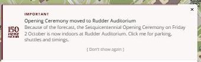

# 30 September 2026, third release

> **Cleared for release.** This file describes what the third 30 September release contains and what
> cleared it. Whether it has reached production is recorded by the `prod-2026-09-30-3` tag, not by this
> sentence. This file is the record of that release and is not edited further, except to correct
> something that is wrong.

**Previous release: [30 September, second release](2026-09-30-2.md).**

A wording fix to the notice the second release put on production, cut the same day because the event
is on **Friday 2 October** and this is the notice people act on to find parking.

---

## Summary

**The Opening Ceremony notice now reads "Click here for parking, shuttles and times."** It read
"Click me for parking, shuttles and timings."

---

## Changed

### The venue notice wording

Two words on the main map's venue-change notice:

| | Text |
| --- | --- |
| Before | … now indoors at Rudder Auditorium. **Click me for parking, shuttles and timings.** |
| After | … now indoors at Rudder Auditorium. **Click here for parking, shuttles and times.** |

**"Click me"** came from the other event notices, which say *"Click me to open the … Transportation
Map"*. It reads as the notice speaking rather than as an instruction, and this is the notice most
likely to be acted on before Friday. **"timings"** should be **"times"**.

*Before, captured from production while it was live.*

The Football and Kickoff at Kyle notices still say "Click me". That is deliberate: this release fixes
the urgent, public one, and making the rest consistent does not justify a release today.

([#1209](https://github.com/TamuGeoInnovation/Tamu.GeoInnovation.js.monorepo/issues/1209))

---

## What to test

**On production**, once it is out.

| Open this | Look for |
| --- | --- |
| [The main map](https://aggiemap.tamu.edu/map) | the notice marked **IMPORTANT** at the top of the panel, reading **"Click here for parking, shuttles and times."** Notices dismiss themselves after about ten seconds, so look as the map loads, or hover to hold one open |

---

## Behind the scenes

- **This was the first change verified with affected builds before pushing**, following the rule added
  in [#1200](https://github.com/TamuGeoInnovation/Tamu.GeoInnovation.js.monorepo/pull/1200) — rather
  than after a check caught something. Lint passed across 7 projects and both production builds
  succeeded, with `correction-lite-angular` holding at 1021.19 kB against its 1024 kB budget.
- **The second release's notes linked a screenshot that was never committed.** `after-dev-grouped.png`
  is supplied by [#1208](https://github.com/TamuGeoInnovation/Tamu.GeoInnovation.js.monorepo/pull/1208),
  which is still open, so that image is broken on `development` until it merges. Worth knowing because
  it is the failure the notes rule exists to prevent
  ([#1132](https://github.com/TamuGeoInnovation/Tamu.GeoInnovation.js.monorepo/issues/1132)), and it
  happened anyway — the notes and the image were in separate pull requests.

---

## Known, and not fixed here

Everything listed under [the second release](2026-09-30-2.md#known-and-not-fixed-here) still stands:
bus routes cannot reach production
([#1191](https://github.com/TamuGeoInnovation/Tamu.GeoInnovation.js.monorepo/issues/1191)), five bus
routes draw no stops
([#1174](https://github.com/TamuGeoInnovation/Tamu.GeoInnovation.js.monorepo/issues/1174)), and the
notification container's own test is still failing on `development`
([#1197](https://github.com/TamuGeoInnovation/Tamu.GeoInnovation.js.monorepo/issues/1197)).

---

## What went into this release

Every pull request this release carried, and the issue behind each one.

| Change | Pull request | Issue |
| --- | --- | --- |
| The venue notice says "Click here for parking, shuttles and times" | [#1210](https://github.com/TamuGeoInnovation/Tamu.GeoInnovation.js.monorepo/pull/1210) | [#1209](https://github.com/TamuGeoInnovation/Tamu.GeoInnovation.js.monorepo/issues/1209) |
