# 1 October 2026, second release

> **Cleared for release.** This file describes what the second 1 October release contains and what
> cleared it. Whether it has reached production is recorded by the `prod-2026-10-01` tag, not by this
> sentence. This file is the record of that release and is not edited further, except to correct
> something that is wrong.

**Previous release on production: [30 September, third release](2026-09-30-3.md).** The
[1 October release](2026-10-01.md) never reached production on its own; it ships with this one.

Four faults in the map's own controls, all of them things a visitor would hit within a minute of
using a map: alerts that followed you to the map you had just opened, a hamburger that ignored the
first click, a side panel that swallowed the thing you clicked, and two unexplained icons that threw
away the map when pressed. A fifth change is not visible at all and matters more than any of them:
the suite can now tell a map that drew nothing from one that drew correctly.

---

## Summary

- **Clicking an alert takes you to its map and clears the rest.** They no longer follow you to the
  destination, and nothing is drawn underneath a venue-change notice.
- **The hamburger works on the first click.** It used to take two, on every map.
- **Clicking a feature opens the side panel** instead of appearing to do nothing when the panel is
  closed.
- **Two unexplained icons are gone from the desktop maps.** Pressing either used to return you to the
  root map.
- **The suite now fails a map that loads everything and draws nothing**, which it previously passed.

---

## Changed

### Event maps no longer say an event has passed before it happens

The 150th Opening Ceremony map, and every map for an event on 2 October, said **"This event has
passed"** from 7 PM the evening before the event, and all through the event day itself. The map read
the event's date as midnight in UTC, which is 7 PM the day before in College Station, and treated the
start of that day as its end. The same check had been on production since August.

A map now says its event has passed only a full day after the event's last date: for a 2 October
event, from 4 October. Until then it shows the event's own notice, such as the Opening Ceremony's
venue change. It never shows both: when they opened together, the second appeared as an empty box with
only a close button.

| Before: noon on the event day | After: the evening before |
| --- | --- |
| 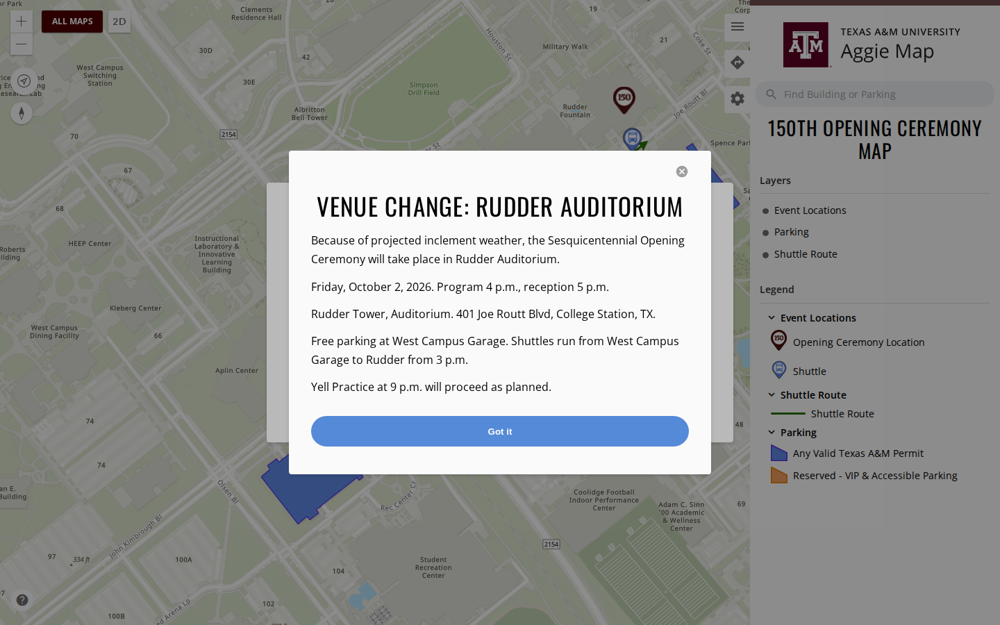 | 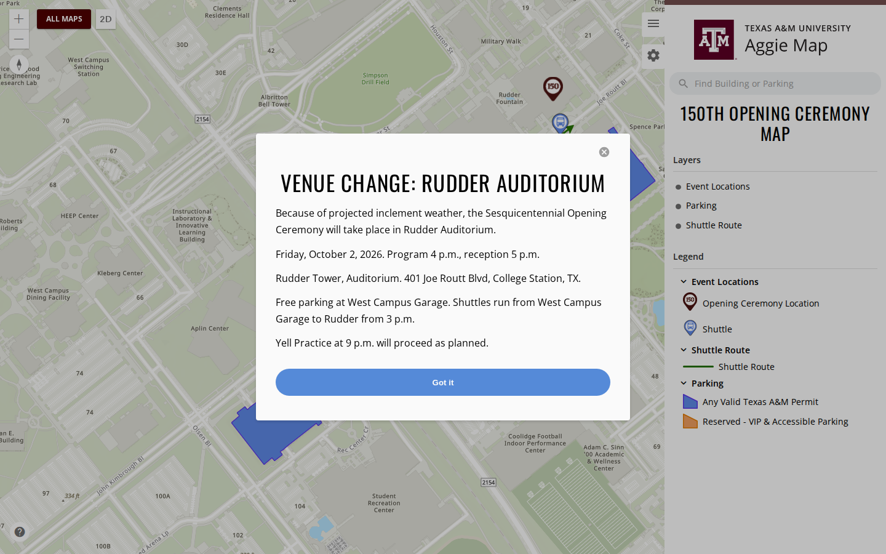 |

([#1298](https://github.com/TamuGeoInnovation/Tamu.GeoInnovation.js.monorepo/issues/1298))

### Alerts no longer follow you to the map you opened

Clicking one alert on the main map took you to the map it named and brought the others along, so you
arrived to be told about the map you were already looking at, plus everything you had not clicked.

The event maps are routes of AggieMap itself, so the alerts survived the navigation. Acting on one now
clears the batch. Alerts you have never seen still appear if you open an event map directly, which
they did not before. Acknowledging one — "Don't show again" — now means everywhere, including the
Ring Day and event map deployments, which each kept their own record before. And while a venue-change
notice or an event-passed warning is open, the alerts hold back and stop their countdown, so they are
not drawn underneath it and have not silently expired behind it.

| Before | After |
| --- | --- |
| 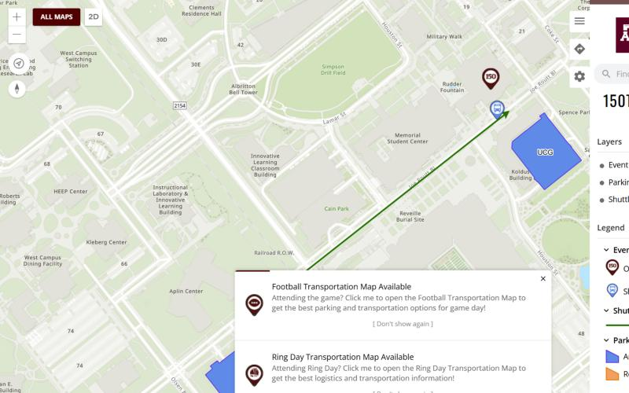 |  |

The four alerts as they appear on the main map, for reference:

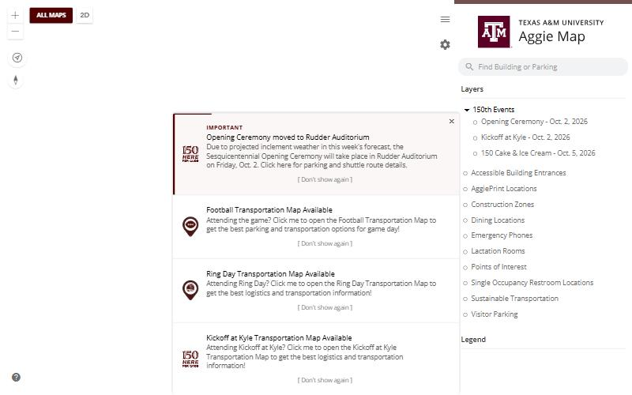

([#1246](https://github.com/TamuGeoInnovation/Tamu.GeoInnovation.js.monorepo/issues/1246))

### The hamburger works on the first click

The side panel's tabs ignored the first click and responded to the second, on every map — AggieMap,
the event maps and Ring Day alike. The panel recorded which view was showing by reading the whole
browser path, `map/d`, and compared it against tab names like `settings` and the default view, which
it could never match. The first click only recorded the view; the second finally compared equal.

| Before | After |
| --- | --- |
| 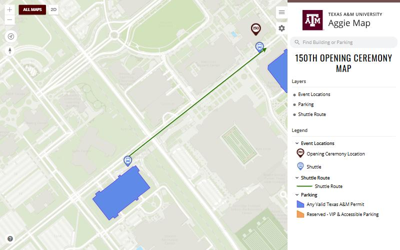 | 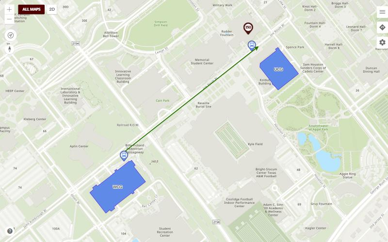 |

([#1249](https://github.com/TamuGeoInnovation/Tamu.GeoInnovation.js.monorepo/issues/1249))

### Clicking a feature opens the side panel

With the panel closed, clicking a building or a parking lot did nothing you could see. The feature
popup is rendered inside the panel, so closing the panel closed the popup with it: the click worked,
the popup drew, and it was behind the panel you had shut.

The panel now opens when a popup opens. It only ever opens — it will not close itself on you while
you are reading one.

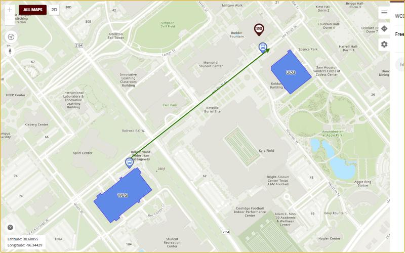

Only the after is shown. The before is a closed panel and an unchanged map — a picture of nothing
happening, which is the fault but not something an image conveys. What was measured on production
instead: with the panel off screen, clicking the same lot left the popup element present with a
height of `0` and no text. On development it now reports the lot's name and its share link.

([#1244](https://github.com/TamuGeoInnovation/Tamu.GeoInnovation.js.monorepo/issues/1244))

### Two unexplained icons are gone from the desktop maps

A list icon and a layers icon sat at the bottom right of the event and Ring Day maps, partly behind
the side panel. Pressing either returned you to the root map, losing the map you were looking at.

They were shortcuts to the mobile map's Legend and Layers panels, shown on desktop by mistake: the
routes they point at exist only on the mobile map, so on a desktop map the link could not resolve and
fell back to the root. They remain on the mobile map, where they work. On desktop the side panel
already offers Layers and Legend.

| Before | After |
| --- | --- |
| 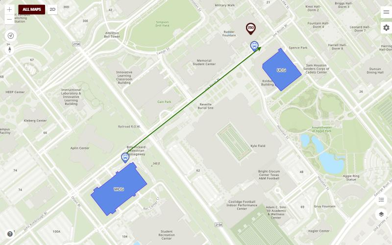 |  |

([#1251](https://github.com/TamuGeoInnovation/Tamu.GeoInnovation.js.monorepo/issues/1251))

### Event maps take their projection from the basemap

Every event and parking map drew an empty canvas on development. The maps pinned themselves to Web
Mercator while the campus basemap on development is a vector tile cache in Texas State Plane, and
Esri cannot reproject a tiled layer: the basemap loaded, reported no error, and painted nothing.

([#1240](https://github.com/TamuGeoInnovation/Tamu.GeoInnovation.js.monorepo/issues/1240), [#1242](https://github.com/TamuGeoInnovation/Tamu.GeoInnovation.js.monorepo/pull/1242))

### Campus notifications stay on their own campus

AggieMap's alerts — Ring Day, Football, Kickoff at Kyle, the 150th events — are College Station's, and
they were appearing on the Galveston, McAllen and DC / Bush School maps. They also sat over the map
and took the click: pressing a building on a campus map could open the Football Transportation map
instead.

Those campuses are separate places and will have notifications of their own. A map now shows its own
campus's alerts and nobody else's, and the kiosk maps — which are embedded inside other applications,
with no one there to dismiss anything — show none at all.

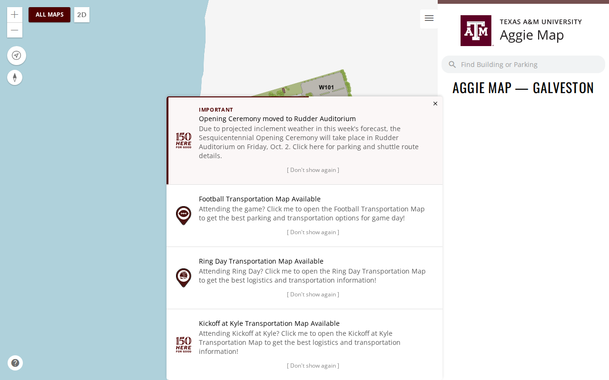

The first fix covered someone arriving at a campus map from another page. Opening one **directly**, from
a link or a bookmark, still showed College Station's alerts for its first ten seconds: the app read the
address before it had finished loading, while it still looked like the main map. That is fixed too, and
every campus map is now checked for it on every run.

| Opened directly, before | Opened directly, after |
| --- | --- |
|  |  |

([#1265](https://github.com/TamuGeoInnovation/Tamu.GeoInnovation.js.monorepo/issues/1265),
[#1281](https://github.com/TamuGeoInnovation/Tamu.GeoInnovation.js.monorepo/issues/1281))

### Alerts appear only on maps

College Station's alerts also covered the **All Maps** pages, where they hid the very list you came to
choose from. They now appear only on a page that shows a College Station map: the main map, and the
event, parking and operations maps.

| Before | After |
| --- | --- |
| 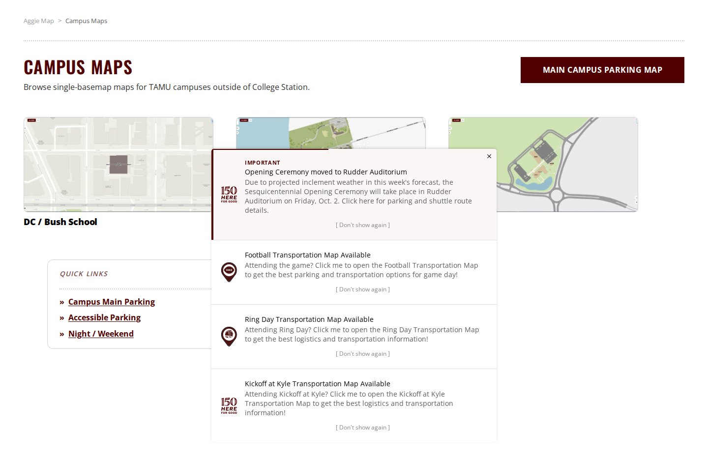 |  |

([#1290](https://github.com/TamuGeoInnovation/Tamu.GeoInnovation.js.monorepo/issues/1290))

### The Campus Maps page no longer lists College Station's parking

The **Campus Maps** page, which lists DC, Galveston and McAllen, ended with a box of quick links to
College Station's parking maps. They had nothing to do with the other campuses and are gone from that
page, and so is the header's **Main Campus Parking Map** button. College Station's own pages keep
both.

| Before | After |
| --- | --- |
| 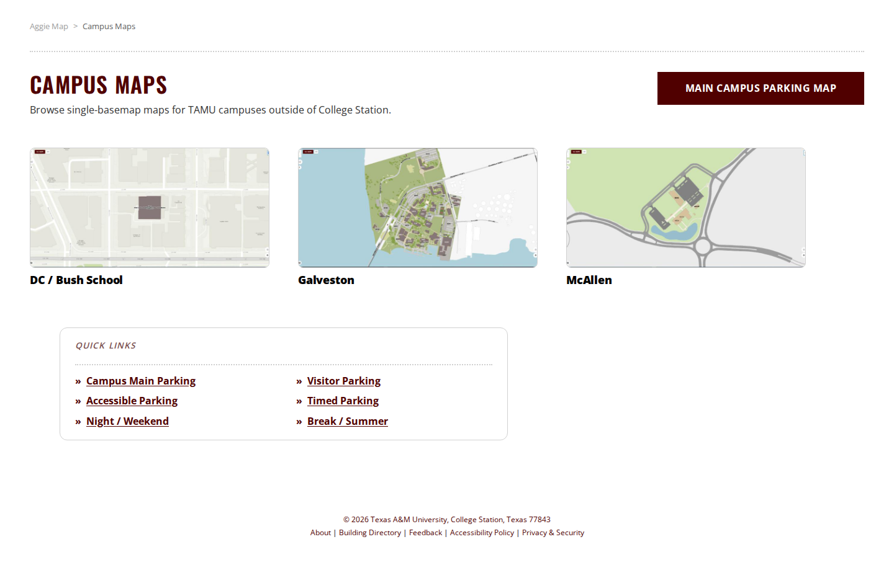 | 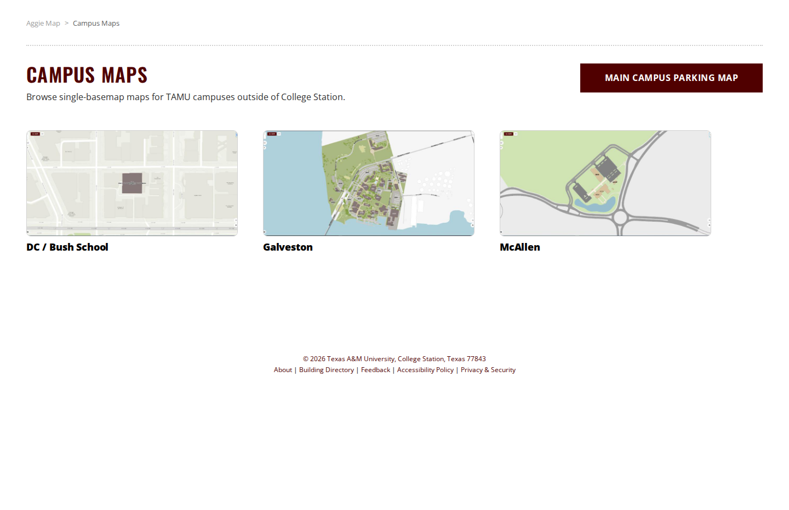 |

| Button, before | Button, after |
| --- | --- |
|  | 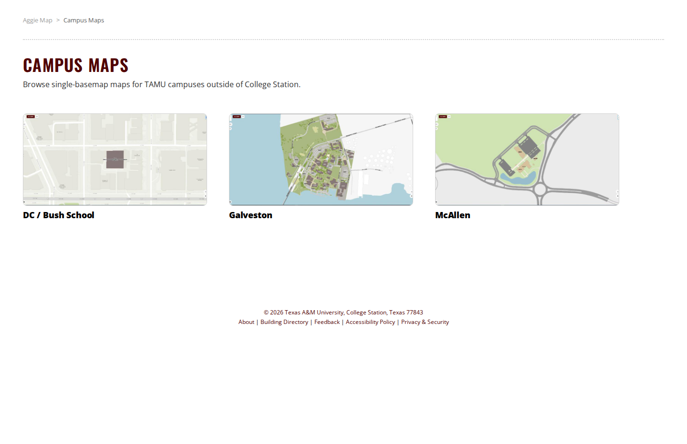 |

([#1291](https://github.com/TamuGeoInnovation/Tamu.GeoInnovation.js.monorepo/issues/1291), [#1295](https://github.com/TamuGeoInnovation/Tamu.GeoInnovation.js.monorepo/issues/1295))

### Campus building labels read correctly

On the DC map the building was labelled **"F002 CONCAT NEWLINE CONCAT TAMUDC"**, and on the McAllen map
every building label was drawn twice. Both came from the invisible layer that makes buildings
clickable, which was also drawing its service's own labels on top of the map's. It no longer draws any,
on every campus.

| | Before | After |
| --- | --- | --- |
| DC | 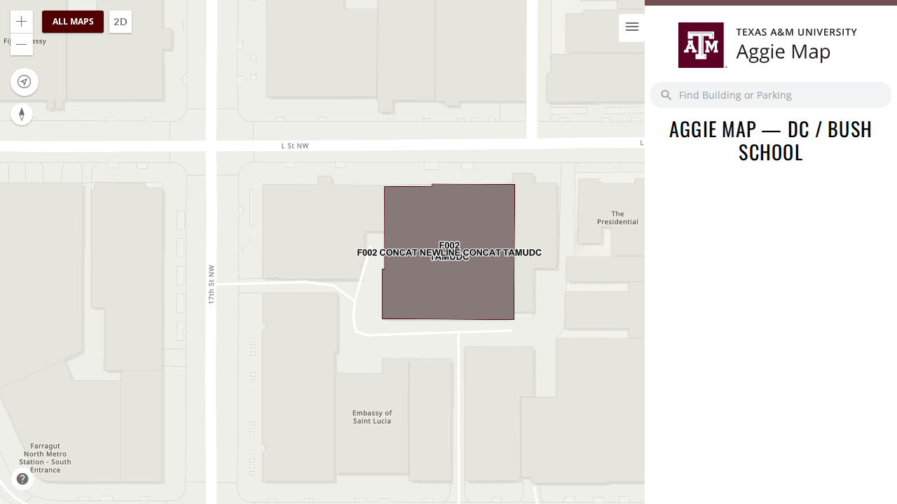 | 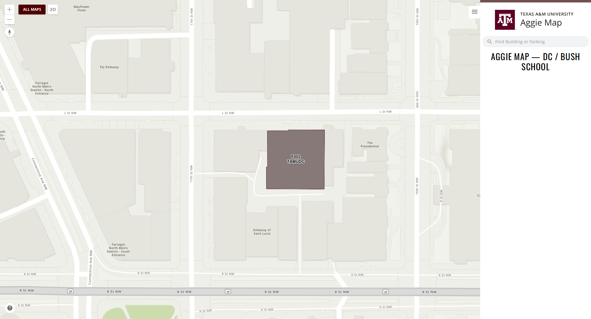 |
| McAllen | 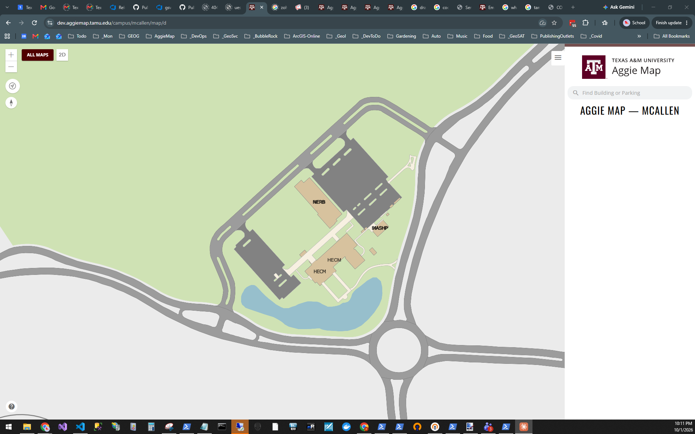 | 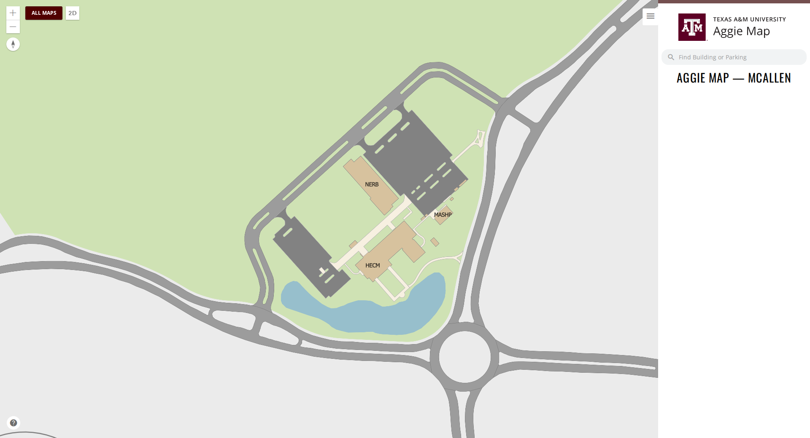 |

([#1283](https://github.com/TamuGeoInnovation/Tamu.GeoInnovation.js.monorepo/issues/1283))

### Campus maps draw for a visitor who has chosen a basemap before

The Galveston, McAllen and DC / Bush School maps showed building outlines on a white page for anyone
who had ever picked a basemap on AggieMap — the campus basemap simply did not draw.

Each campus map carries its own basemap, and it was also honouring the basemap choice saved from the
main map. Those are in different projections, and a tiled basemap cannot be redrawn into a map that
uses another one, so it disappeared while the buildings, which can be redrawn, stayed. The campus maps
now keep their own basemap. A link that names a basemap still works.

This only ever affected development: the projection the two disagree about is the vector tile basemap,
which is not published for production.

([#1259](https://github.com/TamuGeoInnovation/Tamu.GeoInnovation.js.monorepo/issues/1259))

---

### The campus maps show a picture of themselves

The Campus Maps page listed DC / Bush School, Galveston and McAllen as names over an empty area. Each
now shows a picture of the campus it opens, so you can see what you are choosing between.

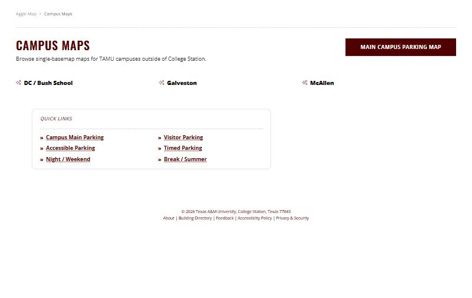

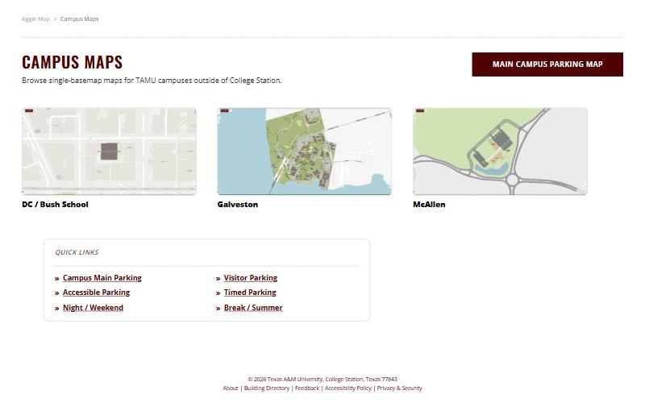

The pictures were added in the previous change, to the All Maps page. The Campus Maps page is a
different component, so the page they were added for never showed them — and a second fault meant the
picture a map declares never reached either listing. Both are fixed, and the styles now live in one
place the two listings share, so a campus added later appears with its picture in both.

([#1275](https://github.com/TamuGeoInnovation/Tamu.GeoInnovation.js.monorepo/issues/1275))

---

## Development only

### Code Maroon alerts on the map

A proof of concept for Emergency Operations: `/code-maroon` on dev is the campus map with the live Code
Maroon feed shown over it, reached from a development-only tile on All Maps. **It is not on production**:
the route and the overlay are both gated to development, and the feed is listed in the smoke suite's
development-only services, so a run fails if production ever requests it. College Station's event
notices are suppressed on that route.

**One part does reach the production server:** AggieMap's nginx gains a reverse proxy for the feed,
with a fifteen-second cache, because the feed cannot be read directly by a browser. Nothing on
production uses it.

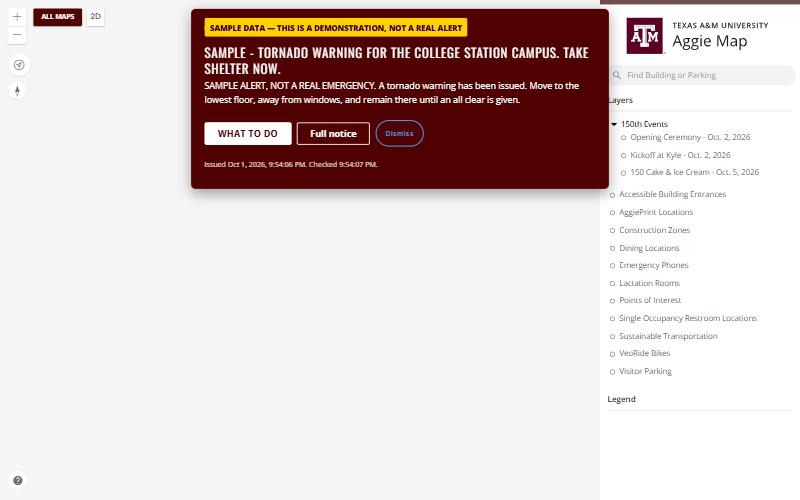

([#1289](https://github.com/TamuGeoInnovation/Tamu.GeoInnovation.js.monorepo/issues/1289))

---

## Not visible, and the reason the rest were found

### The suite now fails a map whose layers cannot be drawn

The smoke suite passed all 69 maps while every event map was blank. It asked whether each layer
loaded and answered yes, because they had — a tiled basemap in the wrong projection loads perfectly
and simply cannot be painted.

Each map now also asserts that every visible tiled layer can actually be drawn in that map's
projection, decided by Esri's own comparison rather than by matching numbers, because the same
projection has more than one identifier.

**A limit worth recording:** a map can still satisfy every layer assertion and paint nothing. The DC
campus map does exactly that — it reports itself ready with a blank canvas
([#1259](https://github.com/TamuGeoInnovation/Tamu.GeoInnovation.js.monorepo/issues/1259)). This check is correct and not yet sufficient.

([#1241](https://github.com/TamuGeoInnovation/Tamu.GeoInnovation.js.monorepo/issues/1241))

### The suite now checks the picture, not only the layers

The check added this release asks whether every layer *could* be drawn. The campus maps showed that a
map can satisfy that and still be empty: 34 layers, all loaded, all visible, all drawable, nothing on
screen.

Each map is now also measured by its picture. A map whose canvas is a single flat colour fails. The
threshold was set from measurements at both ends — a drawn map covers 26% to 47% of its canvas with
its most common colour, an empty one 82% to 96% — and it requires the map to stay drawn rather than
accepting the moment before it empties, which is how the first version of this check passed a map that
was broken.

([#1259](https://github.com/TamuGeoInnovation/Tamu.GeoInnovation.js.monorepo/issues/1259))

### Pull requests must now carry before/after images

A check fails a pull request that changes a template, stylesheet, component or directive and shows no
image in its body. The rule was already written in the pull request template and was skipped anyway,
four times in one session, because `gh pr create --body-file` replaces the template rather than
filling it in. The escape hatch is the `no-visible-change` label.

([#1258](https://github.com/TamuGeoInnovation/Tamu.GeoInnovation.js.monorepo/issues/1258))

---

### A map is given long enough to draw before it is called broken

Not visible, but it decides whether a release can go out. The picture check added in this release gave
each map thirty seconds. CLAUDE.md has always said that a canvas blank for twenty to forty seconds is
Esri still drawing, so the budget was shorter than the normal case, and on development it failed four
maps that had drawn — including the main map, reported blank while the measurement beside it said
otherwise. It is ninety seconds now, and a timeout says which of its two causes happened: a canvas
that stayed blank, or one that drew but never settled.

([#1285](https://github.com/TamuGeoInnovation/Tamu.GeoInnovation.js.monorepo/issues/1285))

---

## What to test

**On production**, once it is out.

| Open this | Look for |
| --- | --- |
| [The main map](https://aggiemap.tamu.edu/map) | the hamburger opens and closes the panel on the **first** click; clicking a building opens the side panel; the basemap is the **raster** Aggieland one (vector tiles here would mean the dev-only gate did not ship) |
| [The main map](https://aggiemap.tamu.edu/map), alerts | clicking an alert opens its map, and the other alerts do not follow you there |
| [DC](https://aggiemap.tamu.edu/campus/dc-bush-school), [Galveston](https://aggiemap.tamu.edu/campus/galveston), [McAllen](https://aggiemap.tamu.edu/campus/mcallen), each in a new tab | no College Station alerts at any point, and the campus basemap draws |
| [The campus maps page](https://aggiemap.tamu.edu/all-maps/campus) | a picture for each campus, each opening its map; **no alerts, no quick links, no Main Campus Parking Map button** |
| [DC](https://aggiemap.tamu.edu/campus/dc-bush-school) and [McAllen](https://aggiemap.tamu.edu/campus/mcallen) | each building labelled once, with no "CONCAT" text |
| `aggiemap.tamu.edu/code-maroon` | **not** available: it is development only |
| [All Maps](https://aggiemap.tamu.edu/all-maps) | no alerts |
| [Ring Pickup](https://aggiemap.tamu.edu/events/ring-day/map?event-day=day1) and [Ring Day](https://aggiemap.tamu.edu/events/ring-day/map?event-day=day2) | each opens framed on its own area |
| [The main map's settings](https://aggiemap.tamu.edu/map/d/settings) | choosing **Aerial Imagery** shows a spinner beside it until the map has redrawn |

---

## What cleared it

**GATE_NUMBERS**

---

## What went into this release

Every pull request this release carried, and the issue behind each one.

| Change | Pull request | Issue |
| --- | --- | --- |
| Event maps take their projection from the basemap | [#1242](https://github.com/TamuGeoInnovation/Tamu.GeoInnovation.js.monorepo/pull/1242) | [#1240](https://github.com/TamuGeoInnovation/Tamu.GeoInnovation.js.monorepo/issues/1240) |
| The suite fails a map that loads everything and draws nothing | [#1252](https://github.com/TamuGeoInnovation/Tamu.GeoInnovation.js.monorepo/pull/1252) | [#1241](https://github.com/TamuGeoInnovation/Tamu.GeoInnovation.js.monorepo/issues/1241) |
| The hamburger moves the panel on the first click | [#1253](https://github.com/TamuGeoInnovation/Tamu.GeoInnovation.js.monorepo/pull/1253) | [#1249](https://github.com/TamuGeoInnovation/Tamu.GeoInnovation.js.monorepo/issues/1249) |
| Acting on one alert clears the batch | [#1254](https://github.com/TamuGeoInnovation/Tamu.GeoInnovation.js.monorepo/pull/1254) | [#1246](https://github.com/TamuGeoInnovation/Tamu.GeoInnovation.js.monorepo/issues/1246) |
| The side panel opens when a feature is clicked | [#1255](https://github.com/TamuGeoInnovation/Tamu.GeoInnovation.js.monorepo/pull/1255) | [#1244](https://github.com/TamuGeoInnovation/Tamu.GeoInnovation.js.monorepo/issues/1244) |
| Mobile-only map controls hidden on desktop | [#1256](https://github.com/TamuGeoInnovation/Tamu.GeoInnovation.js.monorepo/pull/1256) | [#1251](https://github.com/TamuGeoInnovation/Tamu.GeoInnovation.js.monorepo/issues/1251) |
| Pull requests must carry before/after images | [#1263](https://github.com/TamuGeoInnovation/Tamu.GeoInnovation.js.monorepo/pull/1263) | [#1258](https://github.com/TamuGeoInnovation/Tamu.GeoInnovation.js.monorepo/issues/1258) |
| College Station notifications stay off the campus and kiosk maps | [#1266](https://github.com/TamuGeoInnovation/Tamu.GeoInnovation.js.monorepo/pull/1266) | [#1265](https://github.com/TamuGeoInnovation/Tamu.GeoInnovation.js.monorepo/issues/1265) |
| Campus maps opened directly stay free of College Station notifications | [#1286](https://github.com/TamuGeoInnovation/Tamu.GeoInnovation.js.monorepo/pull/1286) | [#1281](https://github.com/TamuGeoInnovation/Tamu.GeoInnovation.js.monorepo/issues/1281) |
| College Station notices appear only on map pages | [#1292](https://github.com/TamuGeoInnovation/Tamu.GeoInnovation.js.monorepo/pull/1292) | [#1290](https://github.com/TamuGeoInnovation/Tamu.GeoInnovation.js.monorepo/issues/1290) |
| The Campus Maps page no longer carries College Station quick links | [#1293](https://github.com/TamuGeoInnovation/Tamu.GeoInnovation.js.monorepo/pull/1293) | [#1291](https://github.com/TamuGeoInnovation/Tamu.GeoInnovation.js.monorepo/issues/1291) |
| The Campus Maps page no longer carries the Main Campus Parking Map button | [#1296](https://github.com/TamuGeoInnovation/Tamu.GeoInnovation.js.monorepo/pull/1296) | [#1295](https://github.com/TamuGeoInnovation/Tamu.GeoInnovation.js.monorepo/issues/1295) |
| Campus click overlays no longer draw their service's labels | [#1297](https://github.com/TamuGeoInnovation/Tamu.GeoInnovation.js.monorepo/pull/1297) | [#1283](https://github.com/TamuGeoInnovation/Tamu.GeoInnovation.js.monorepo/issues/1283) |
| Code Maroon alerts on the map, development only | [#1294](https://github.com/TamuGeoInnovation/Tamu.GeoInnovation.js.monorepo/pull/1294) | [#1289](https://github.com/TamuGeoInnovation/Tamu.GeoInnovation.js.monorepo/issues/1289) |
| Event maps no longer say an event has passed before it happens | [#1299](https://github.com/TamuGeoInnovation/Tamu.GeoInnovation.js.monorepo/pull/1299) | [#1298](https://github.com/TamuGeoInnovation/Tamu.GeoInnovation.js.monorepo/issues/1298) |
| Campus maps keep their own basemap, and the suite checks the picture | [#1269](https://github.com/TamuGeoInnovation/Tamu.GeoInnovation.js.monorepo/pull/1269) | [#1259](https://github.com/TamuGeoInnovation/Tamu.GeoInnovation.js.monorepo/issues/1259) |
| Each campus map is shown as a picture you can click | [#1270](https://github.com/TamuGeoInnovation/Tamu.GeoInnovation.js.monorepo/pull/1270) | [#1245](https://github.com/TamuGeoInnovation/Tamu.GeoInnovation.js.monorepo/issues/1245) |
| The campus pictures reach the page they were added for | [#1287](https://github.com/TamuGeoInnovation/Tamu.GeoInnovation.js.monorepo/pull/1287) | [#1275](https://github.com/TamuGeoInnovation/Tamu.GeoInnovation.js.monorepo/issues/1275) |
| A map is given long enough to draw before it is called broken | [#1288](https://github.com/TamuGeoInnovation/Tamu.GeoInnovation.js.monorepo/pull/1288) | [#1285](https://github.com/TamuGeoInnovation/Tamu.GeoInnovation.js.monorepo/issues/1285) |
| Contributors reuse components, code and CSS, and build anything new to be reused | [#1284](https://github.com/TamuGeoInnovation/Tamu.GeoInnovation.js.monorepo/pull/1284) | [#1282](https://github.com/TamuGeoInnovation/Tamu.GeoInnovation.js.monorepo/issues/1282) |

**Also carried: the [1 October release](2026-10-01.md), which never reached production on its own.** Its
notes merged and its build passed on dev, but it was held back and then overtaken by this one, so
production receives it now. What it brings is described in that file.

| Change | Pull request | Issue |
| --- | --- | --- |
| The campus basemap on vector tiles (dev), the basemap loading indicator, and the compass keeps its needle | [#1227](https://github.com/TamuGeoInnovation/Tamu.GeoInnovation.js.monorepo/pull/1227) | [#1222](https://github.com/TamuGeoInnovation/Tamu.GeoInnovation.js.monorepo/issues/1222), [#1223](https://github.com/TamuGeoInnovation/Tamu.GeoInnovation.js.monorepo/issues/1223), [#1224](https://github.com/TamuGeoInnovation/Tamu.GeoInnovation.js.monorepo/issues/1224) |
| The vector tile basemap stays off production | [#1233](https://github.com/TamuGeoInnovation/Tamu.GeoInnovation.js.monorepo/pull/1233) | [#1229](https://github.com/TamuGeoInnovation/Tamu.GeoInnovation.js.monorepo/issues/1229) |
| Each Ring Day period opens on its own view | [#1234](https://github.com/TamuGeoInnovation/Tamu.GeoInnovation.js.monorepo/pull/1234) | [#1230](https://github.com/TamuGeoInnovation/Tamu.GeoInnovation.js.monorepo/issues/1230) |
| The dead TWO, COVID, Kissing Bug, Football and Move-In projects are removed | [#1237](https://github.com/TamuGeoInnovation/Tamu.GeoInnovation.js.monorepo/pull/1237) | [#1232](https://github.com/TamuGeoInnovation/Tamu.GeoInnovation.js.monorepo/issues/1232) |

---
