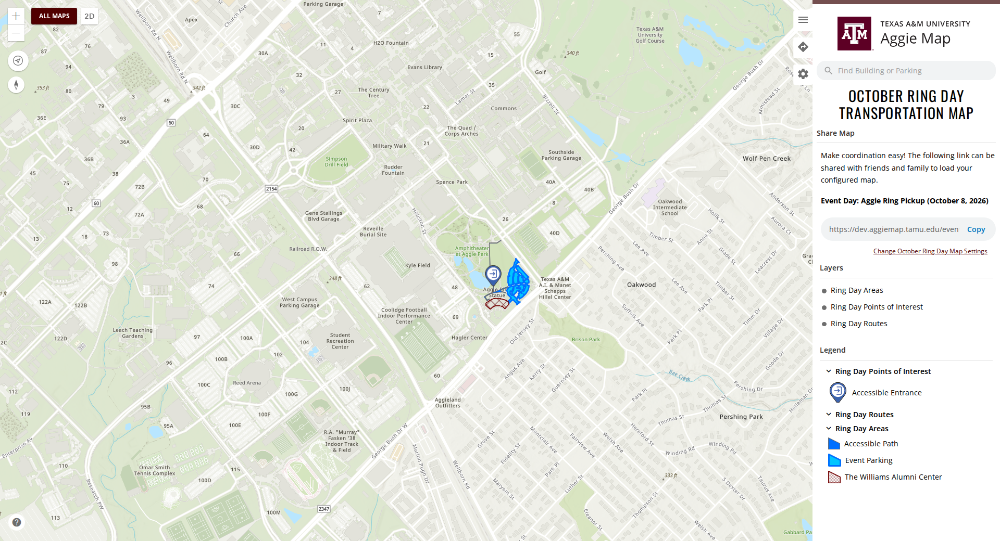
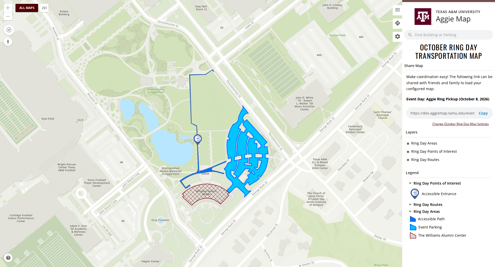
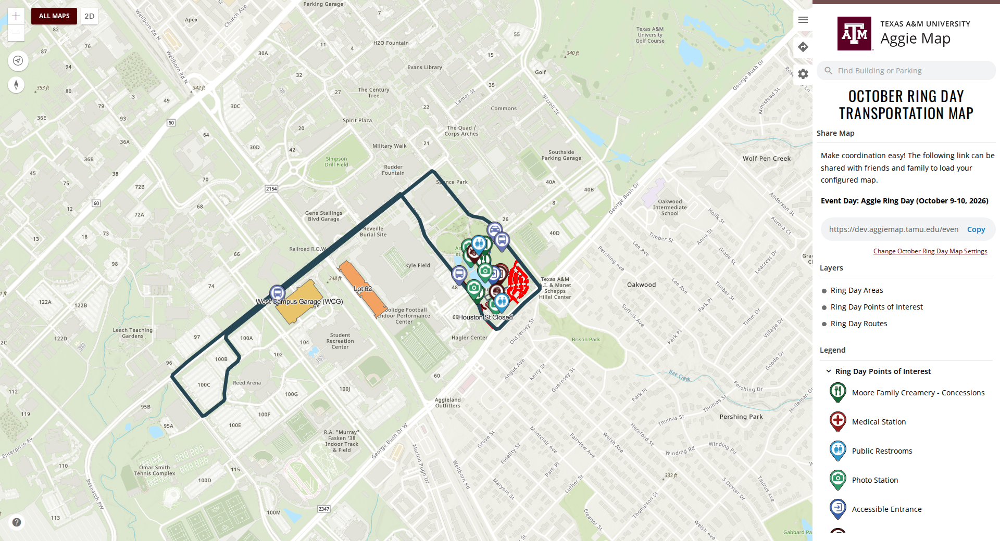
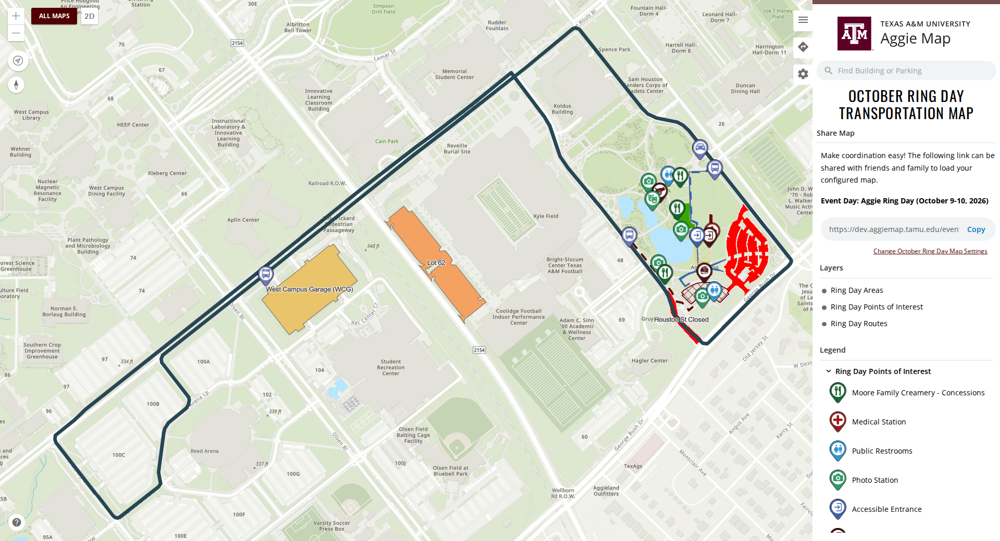
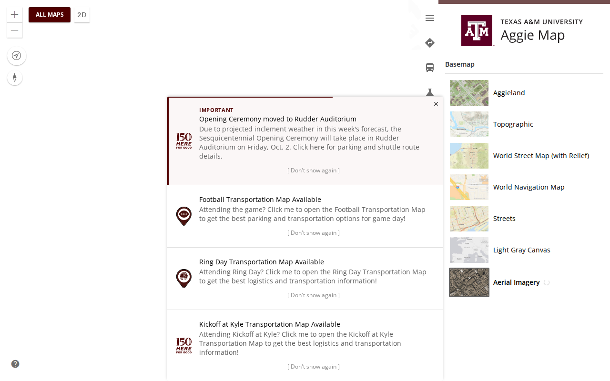
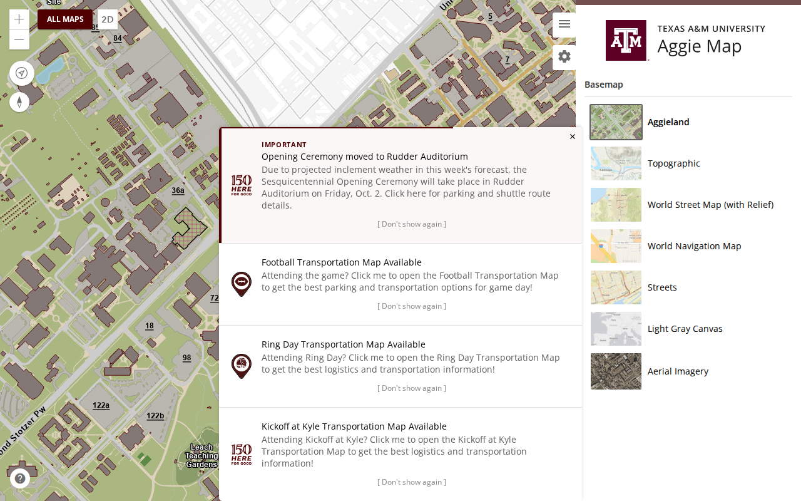
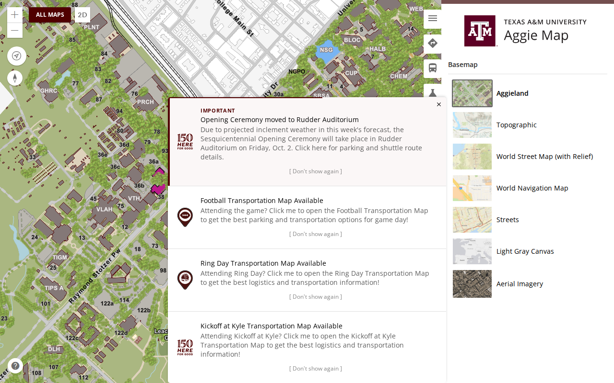

# 1 October 2026

> **Cleared for release.** This file describes what the 1 October release contains and what cleared it.
> Whether it has reached production is recorded by the `prod-2026-10-01` tag, not by this sentence. This
> file is the record of that release and is not edited further, except to correct something that is
> wrong.

**Previous release: [30 September, third release](2026-09-30-3.md).**

The October Ring Day map is framed for each of its days ahead of Ring Day (8–10 October). Switching
basemaps now shows that something is loading. The campus basemap on vector tiles is in this build too,
but development only: it is not published for production. And 28 dead projects are gone from the
repository, which makes every release build faster.

---

## Summary

- **The Ring Day map opens on each day's own area.** Ring Pickup opens close in on the pickup lots;
  Ring Day opens on Aggie Park and the shuttle loop, centered.
- **Choosing a basemap shows a loading indicator** until the map has redrawn, instead of appearing to do
  nothing — most noticeable with Aerial Imagery.

---

## Changed

### The Ring Day map opens on each day's own area

The October Ring Day map framed both of its event days with one view, and they cover very different
areas. Ring Pickup (8 October) now opens close in on the pickup lots and the Williams Alumni Center.
Ring Day (9–10 October) opens on Aggie Park and the West Campus Garage shuttle loop, centered rather
than pushed against the right edge.

| | Before | After |
| --- | --- | --- |
| Ring Pickup |  |  |
| Ring Day |  |  |

([#1230](https://github.com/TamuGeoInnovation/Tamu.GeoInnovation.js.monorepo/issues/1230))

### Choosing a basemap shows that it is loading

The basemap gallery marks the basemap being loaded with a spinner until the map has finished
redrawing. Aerial Imagery takes noticeably longer than the rest, and without this the map looked
unchanged and read as broken.

*Captured on dev while Aerial Imagery loaded.*

([#1222](https://github.com/TamuGeoInnovation/Tamu.GeoInnovation.js.monorepo/issues/1222))

---

## Development only

### The campus basemap on vector tiles

On dev and localhost, the Aggieland basemap is drawn from the vector tile service
`Hosted/VTBase/VectorTileServer`, in Texas State Plane Central (EPSG:32139). The basemap gallery now
switches between that projection and Web Mercator, and the compass keeps its needle on every basemap
instead of changing to a dial.

**Production keeps the raster basemap it has always had.** The vector tile service is not published for
production, and nothing without a production service is shown there unless that is explicitly allowed
— the same rule that keeps bus routes off production. #1227 first put the vector tiles on every
environment; [#1229](https://github.com/TamuGeoInnovation/Tamu.GeoInnovation.js.monorepo/issues/1229)
gated them to development before anything shipped, and the smoke suite now fails if production ever
requests the service.

| Production: raster, unchanged | Dev: vector tiles |
| --- | --- |
|  |  |

([#1223](https://github.com/TamuGeoInnovation/Tamu.GeoInnovation.js.monorepo/issues/1223),
[#1224](https://github.com/TamuGeoInnovation/Tamu.GeoInnovation.js.monorepo/issues/1224),
[#1229](https://github.com/TamuGeoInnovation/Tamu.GeoInnovation.js.monorepo/issues/1229))

---

## What to test

**On production**, once it is out.

| Open this | Look for |
| --- | --- |
| [Ring Pickup](https://aggiemap.tamu.edu/events/ring-day/map?event-day=day1) | opens close in on the pickup lots and the Williams Alumni Center |
| [Ring Day](https://aggiemap.tamu.edu/events/ring-day/map?event-day=day2) | opens on Aggie Park and the West Campus Garage shuttle loop, centered |
| [The main map's settings](https://aggiemap.tamu.edu/map/d/settings) | choose **Aerial Imagery**: a spinner beside it until the map has redrawn |
| [The main map](https://aggiemap.tamu.edu/map) | the **raster** campus basemap, exactly as before. If you see the vector tile map here, stop: it should be on dev only |

---

## What cleared it

The full smoke suite against dev, on Azure build **20261001.4** from
[`2eb4fc29`](https://github.com/TamuGeoInnovation/Tamu.GeoInnovation.js.monorepo/commit/2eb4fc29),
deployed by Release-431 and serving `main.1da4ac75c523c3da.js`: **205 passed, 0 failed, 7 skipped, in
14.0 minutes** (212 tests), run at 07:01 on 1 October. Tagged `dev-2026-10-01-2`.

An earlier build without #1237 (`916943b9`, Azure 20261001.2) also passed the full suite on dev, with
the same numbers, and was tagged `dev-2026-10-01`. It was held back so this release could carry the
dead-project removal too, and is not what ships.

The suite now includes the development-only service checks from #1229: the main map and an event map
must request the vector tile service on dev and must never request it on production.

---

## Behind the scenes

- **The vector tiles nearly shipped.** #1227 merged and passed the full dev suite (203 passed, 0
  failed) with the vector tile basemap on every environment. The suite tested dev, where the service
  exists, so it had nothing to object to. The gap is now closed in two places: a unit test that fails if
  any code names the vector tile basemap directly instead of resolving it by environment, and the smoke
  check above. Both were proven to fail on the build that was about to ship.
- **28 dead projects are gone**
  ([#1232](https://github.com/TamuGeoInnovation/Tamu.GeoInnovation.js.monorepo/issues/1232)): TWO,
  COVID, Kissing Bug, and the old standalone Football and Move-In apps, as decided in the dead-project
  survey ([#1226](https://github.com/TamuGeoInnovation/Tamu.GeoInnovation.js.monorepo/issues/1226)).
  Azure had been building and shipping the old Football and Move-In apps with every release, because
  only their test projects were excluded. **The release build now compiles 7 apps instead of 9: 380 s
  down to 282 s, 26% faster.** Nx's project graph computes about 8% faster, with 173 projects instead
  of 201. The Discover page loses its deprecated "Movein" link. The old Ring Day app stays until after
  Ring Day ([#1236](https://github.com/TamuGeoInnovation/Tamu.GeoInnovation.js.monorepo/issues/1236)).
  The old Move-In app is still deployed at `/movein/` until its server copy is deleted
  ([#1235](https://github.com/TamuGeoInnovation/Tamu.GeoInnovation.js.monorepo/issues/1235)).
- **The rule is written down.** CLAUDE.md now says that nothing without a production service is visible
  on production unless explicitly allowed, and how to register a development-only service with the
  smoke suite.

---

## Known, and not fixed here

Everything listed under [the second 30 September release](2026-09-30-2.md#known-and-not-fixed-here)
still stands: bus routes cannot reach production
([#1191](https://github.com/TamuGeoInnovation/Tamu.GeoInnovation.js.monorepo/issues/1191)), five bus
routes draw no stops
([#1174](https://github.com/TamuGeoInnovation/Tamu.GeoInnovation.js.monorepo/issues/1174)), and the
notification container's own test is still failing on `development`
([#1197](https://github.com/TamuGeoInnovation/Tamu.GeoInnovation.js.monorepo/issues/1197)).

---

## What went into this release

Every pull request this release carried, and the issue behind each one.

| Change | Pull request | Issue |
| --- | --- | --- |
| The campus basemap on vector tiles (dev), a loading indicator in the basemap gallery, and the compass keeps its needle | [#1227](https://github.com/TamuGeoInnovation/Tamu.GeoInnovation.js.monorepo/pull/1227) | [#1222](https://github.com/TamuGeoInnovation/Tamu.GeoInnovation.js.monorepo/issues/1222), [#1223](https://github.com/TamuGeoInnovation/Tamu.GeoInnovation.js.monorepo/issues/1223), [#1224](https://github.com/TamuGeoInnovation/Tamu.GeoInnovation.js.monorepo/issues/1224) |
| The vector tile basemap stays off production | [#1233](https://github.com/TamuGeoInnovation/Tamu.GeoInnovation.js.monorepo/pull/1233) | [#1229](https://github.com/TamuGeoInnovation/Tamu.GeoInnovation.js.monorepo/issues/1229) |
| Each Ring Day period opens on its own view | [#1234](https://github.com/TamuGeoInnovation/Tamu.GeoInnovation.js.monorepo/pull/1234) | [#1230](https://github.com/TamuGeoInnovation/Tamu.GeoInnovation.js.monorepo/issues/1230) |
| Remove the dead TWO, COVID, Kissing Bug, Football and Move-In projects | [#1237](https://github.com/TamuGeoInnovation/Tamu.GeoInnovation.js.monorepo/pull/1237) | [#1232](https://github.com/TamuGeoInnovation/Tamu.GeoInnovation.js.monorepo/issues/1232) |
