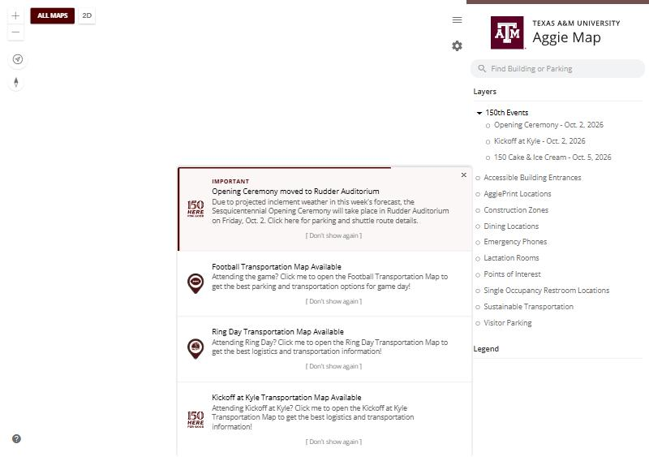
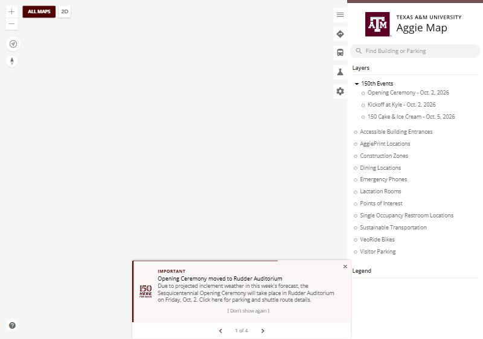
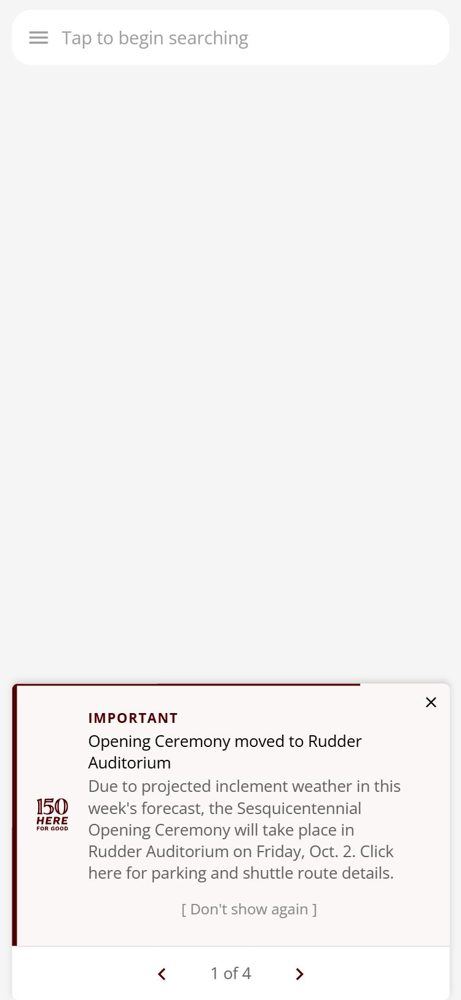
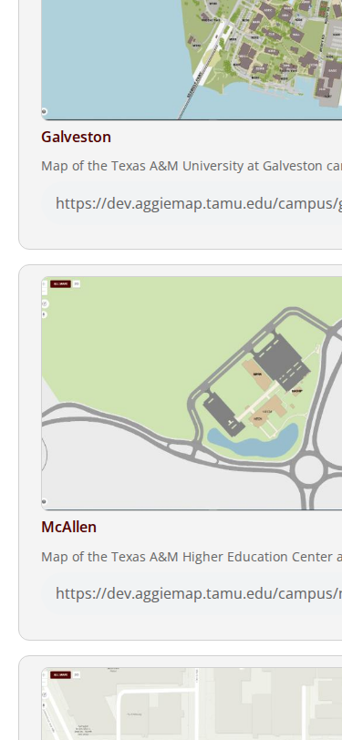
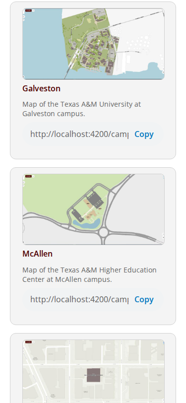
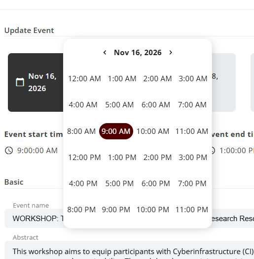

# 3 October 2026

> **Cleared for release.** This file describes what the 3 October release contains and what cleared
> it. Whether it has reached production is recorded by the `prod-2026-10-03` tag, not by this
> sentence. This file is the record of that release and is not edited further, except to correct
> something that is wrong.

**Previous release on production: [2 October](2026-10-02.md).**

The framework under every map moves to **Angular 16**, the first step up from a version that left
long-term support in 2023. Nothing is meant to look different because of it. What visitors will
notice is smaller and was found along the way: alerts that stack into one tidy card, All Maps that
fits a phone again, and a modal that closes back to the page you came from on production, which it
never did before.

---

## Summary

- **Alerts show one at a time**, with a stepper, instead of a stack tall enough to cover the map.
- **All Maps fits a phone again.** The campus cards no longer push their **Copy** button off-screen.
- **Closing a modal returns to the page you came from** on production.
- **GIS Day's date and time pickers use the browser's own inputs.**
- **Angular 16**, Nx 16.10 and TypeScript 5.1 under everything; the ArcGIS runtime moves to 4.27.
- **Five unused applications removed**, each recorded before it went.

---

## Changed

### Alerts show one at a time

When several alerts were active, the main map stacked all of them, four cards tall, covering much of
the map on a laptop and all of it on a phone. They now share one card with a stepper to move between
them, the most important first.

| Before | After | On a phone |
| --- | --- | --- |
|  |  |  |

([#1327](https://github.com/TamuGeoInnovation/Tamu.GeoInnovation.js.monorepo/issues/1327),
[#687](https://github.com/TamuGeoInnovation/Tamu.GeoInnovation.js.monorepo/issues/687); its layout now
uses the shared styles, [#1333](https://github.com/TamuGeoInnovation/Tamu.GeoInnovation.js.monorepo/issues/1333))

### All Maps fits a phone again

The Campus Maps cards were 208px wider than a 375px screen, cutting off each card and pushing its
**Copy** button off-screen, and copying the link is the only way those maps get shared, since
production does not list them. Found by the new phone-width checks on their first run.

| Before | After |
| --- | --- |
|  |  |

([#1335](https://github.com/TamuGeoInnovation/Tamu.GeoInnovation.js.monorepo/issues/1335))

### Closing a modal returns to the page you came from

On production the app never recorded where you had been. It recognised each navigation by a class
name, and production builds shorten class names: in production's code `NavigationEnd` is called `Wn`.
So the history stayed empty, and closing a modal always fell back to the browser's Back, which leaves
AggieMap entirely when the modal was opened from a link. Development builds keep class names, which is
why nobody saw it there.

([#1348](https://github.com/TamuGeoInnovation/Tamu.GeoInnovation.js.monorepo/issues/1348))

### GIS Day's date and time pickers use the browser's own inputs

The hour grid came from a library that only worked through `ngcc`, which Angular 16 removes, and has no
release that does not. The shared picker now shows the browser's own time and date inputs; every page
that uses it is unchanged.

([#1220](https://github.com/TamuGeoInnovation/Tamu.GeoInnovation.js.monorepo/issues/1220))

---

## Not visible

### Angular 16

Angular 15.2 to 16.2, Nx 16.0 to 16.10, TypeScript 4.9 to 5.1
([#1343](https://github.com/TamuGeoInnovation/Tamu.GeoInnovation.js.monorepo/issues/1343)), the first
version step of [#1218](https://github.com/TamuGeoInnovation/Tamu.GeoInnovation.js.monorepo/issues/1218).
It needed `ngcc` gone first: four packages that relied on it were upgraded, replaced or removed, and the
install now fails if one returns
([#1276](https://github.com/TamuGeoInnovation/Tamu.GeoInnovation.js.monorepo/issues/1276)–[#1279](https://github.com/TamuGeoInnovation/Tamu.GeoInnovation.js.monorepo/issues/1279)).
NestJS stays on 9 for this release; it moves to 10 on its own
([#1350](https://github.com/TamuGeoInnovation/Tamu.GeoInnovation.js.monorepo/issues/1350)).

### The ArcGIS runtime moves to 4.27

The maps loaded ArcGIS 4.23, from 2022, because nothing pinned the version
([#1219](https://github.com/TamuGeoInnovation/Tamu.GeoInnovation.js.monorepo/issues/1219)). The type
definitions follow in a later release
([#1322](https://github.com/TamuGeoInnovation/Tamu.GeoInnovation.js.monorepo/issues/1322)).

### Five unused applications removed

Three UES applications UES confirmed it no longer uses
([#1325](https://github.com/TamuGeoInnovation/Tamu.GeoInnovation.js.monorepo/issues/1325)), Geocode
Correction Lite, which the Geoservices site no longer serves
([#1339](https://github.com/TamuGeoInnovation/Tamu.GeoInnovation.js.monorepo/issues/1339)), and the
2019 Tree Inventory experiment
([#1352](https://github.com/TamuGeoInnovation/Tamu.GeoInnovation.js.monorepo/issues/1352)). Each is
recorded in [`docs/applications/`](../applications/) before it went. The UES Operations map is in daily
use and stays.

### Builds are tagged with their applications again

Nx 16.10 broke the step that tags each build with the applications it holds, so the first development
build after the upgrade carried none, and a release filtering on those tags could fall back to a
different build ([#1354](https://github.com/TamuGeoInnovation/Tamu.GeoInnovation.js.monorepo/issues/1354)).
A deployable build that tags nothing now shows as an error.

### The suite checks more

- **Every kind of page at phone width**, which found the All Maps overflow on its first run
  ([#1331](https://github.com/TamuGeoInnovation/Tamu.GeoInnovation.js.monorepo/issues/1331)).
- **Event maps at College Station time**: no early "has passed", and today's events listed
  ([#1302](https://github.com/TamuGeoInnovation/Tamu.GeoInnovation.js.monorepo/issues/1302)).
- **The build banner names its build**
  ([#1319](https://github.com/TamuGeoInnovation/Tamu.GeoInnovation.js.monorepo/issues/1319)).
- **The campus-map checks run only where those maps are listed**, which stopped two false failures on
  every production run ([#1313](https://github.com/TamuGeoInnovation/Tamu.GeoInnovation.js.monorepo/issues/1313)).
- **The map notice checks run on a fixed clock**, so they no longer expire with a real event
  ([#1356](https://github.com/TamuGeoInnovation/Tamu.GeoInnovation.js.monorepo/issues/1356)).

---

## What to test

**On production**, once it is out.

| Open this | Look for |
| --- | --- |
| [The main map](https://aggiemap.tamu.edu/map) | alerts in **one** card with a stepper, not a stack |
| [All Maps](https://aggiemap.tamu.edu/all-maps) on a phone | nothing cut off at the right edge, and no sideways scroll |
| [The main map](https://aggiemap.tamu.edu/map), a feature's details opened from a link | closing it stays in AggieMap |
| Any map, after a hard reload | the map draws as before; nothing should look different because of Angular 16 |
| `aggiemap.tamu.edu/code-maroon` | **not** available: it is development only |

---

## What cleared it

**What ships:** RC_BUILD.

**How it was cleared, in order:**

1. **Each pull request's own checks.** The package changes were verified locally with a clean `npm ci`
   and a full `nx affected` build; the Angular 16 upgrade's one break, in the router history types, was
   fixed in the shared service before merging.
2. **The full suite on dev, build 20261003.7** (`573e85d4`, the Angular 16 merge): **322 passed,
   2 failed, 7 skipped**, in 42 minutes, no flaky tests. Both failures are the map notice check, which
   had expired with the 150th Kickoff: it ran on the real clock in UTC, and from 4 October that map
   rightly says the event has passed. On dev, on College Station time, the map showed its notice; the
   corrected check passes all three tests against dev
   ([#1356](https://github.com/TamuGeoInnovation/Tamu.GeoInnovation.js.monorepo/issues/1356)).
3. **The full suite on dev, the release candidate**: RC_RESULT

---

## What went into this release

| Change | Pull request | Issue |
| --- | --- | --- |
| Upgrade `ngx-webstorage-service` to 5.0.0 | [#1309](https://github.com/TamuGeoInnovation/Tamu.GeoInnovation.js.monorepo/pull/1309) | [#1277](https://github.com/TamuGeoInnovation/Tamu.GeoInnovation.js.monorepo/issues/1277) |
| Upgrade `ng2-dragula` to 4.0.0 | [#1310](https://github.com/TamuGeoInnovation/Tamu.GeoInnovation.js.monorepo/pull/1310) | [#1278](https://github.com/TamuGeoInnovation/Tamu.GeoInnovation.js.monorepo/issues/1278) |
| Replace the date-time picker library with native inputs | [#1312](https://github.com/TamuGeoInnovation/Tamu.GeoInnovation.js.monorepo/pull/1312) | [#1220](https://github.com/TamuGeoInnovation/Tamu.GeoInnovation.js.monorepo/issues/1220) |
| Remove `ngx-lightbox` and `ngx-filesaver` | [#1311](https://github.com/TamuGeoInnovation/Tamu.GeoInnovation.js.monorepo/pull/1311) | [#1276](https://github.com/TamuGeoInnovation/Tamu.GeoInnovation.js.monorepo/issues/1276) |
| Stop running `ngcc`; fail the install if a package needs it | [#1317](https://github.com/TamuGeoInnovation/Tamu.GeoInnovation.js.monorepo/pull/1317) | [#1279](https://github.com/TamuGeoInnovation/Tamu.GeoInnovation.js.monorepo/issues/1279) |
| Upgrade Angular 15 to 16, with Nx 16.10 | [#1345](https://github.com/TamuGeoInnovation/Tamu.GeoInnovation.js.monorepo/pull/1345) | [#1343](https://github.com/TamuGeoInnovation/Tamu.GeoInnovation.js.monorepo/issues/1343) |
| Pin the ArcGIS runtime to 4.27 | [#1329](https://github.com/TamuGeoInnovation/Tamu.GeoInnovation.js.monorepo/pull/1329) | [#1219](https://github.com/TamuGeoInnovation/Tamu.GeoInnovation.js.monorepo/issues/1219) |
| Show one notification at a time, with a stepper | [#1330](https://github.com/TamuGeoInnovation/Tamu.GeoInnovation.js.monorepo/pull/1330) | [#1327](https://github.com/TamuGeoInnovation/Tamu.GeoInnovation.js.monorepo/issues/1327), [#687](https://github.com/TamuGeoInnovation/Tamu.GeoInnovation.js.monorepo/issues/687) |
| The stepper uses the shared styles | [#1334](https://github.com/TamuGeoInnovation/Tamu.GeoInnovation.js.monorepo/pull/1334) | [#1333](https://github.com/TamuGeoInnovation/Tamu.GeoInnovation.js.monorepo/issues/1333) |
| All Maps cards shrink to a phone screen | [#1337](https://github.com/TamuGeoInnovation/Tamu.GeoInnovation.js.monorepo/pull/1337) | [#1335](https://github.com/TamuGeoInnovation/Tamu.GeoInnovation.js.monorepo/issues/1335) |
| Router history fills in production builds | [#1351](https://github.com/TamuGeoInnovation/Tamu.GeoInnovation.js.monorepo/pull/1351) | [#1348](https://github.com/TamuGeoInnovation/Tamu.GeoInnovation.js.monorepo/issues/1348) |
| Record which UES applications are in use | [#1324](https://github.com/TamuGeoInnovation/Tamu.GeoInnovation.js.monorepo/pull/1324) | [#1323](https://github.com/TamuGeoInnovation/Tamu.GeoInnovation.js.monorepo/issues/1323) |
| Remove the three unused UES applications | [#1328](https://github.com/TamuGeoInnovation/Tamu.GeoInnovation.js.monorepo/pull/1328) | [#1325](https://github.com/TamuGeoInnovation/Tamu.GeoInnovation.js.monorepo/issues/1325) |
| Remove `correction-lite-angular` | [#1344](https://github.com/TamuGeoInnovation/Tamu.GeoInnovation.js.monorepo/pull/1344) | [#1339](https://github.com/TamuGeoInnovation/Tamu.GeoInnovation.js.monorepo/issues/1339) |
| Remove `trees-angular` | [#1353](https://github.com/TamuGeoInnovation/Tamu.GeoInnovation.js.monorepo/pull/1353) | [#1352](https://github.com/TamuGeoInnovation/Tamu.GeoInnovation.js.monorepo/issues/1352) |
| Tag builds from the Nx project graph | [#1355](https://github.com/TamuGeoInnovation/Tamu.GeoInnovation.js.monorepo/pull/1355) | [#1354](https://github.com/TamuGeoInnovation/Tamu.GeoInnovation.js.monorepo/issues/1354) |
| Check every class of page at phone width | [#1336](https://github.com/TamuGeoInnovation/Tamu.GeoInnovation.js.monorepo/pull/1336) | [#1331](https://github.com/TamuGeoInnovation/Tamu.GeoInnovation.js.monorepo/issues/1331) |
| Check event maps at College Station time | [#1321](https://github.com/TamuGeoInnovation/Tamu.GeoInnovation.js.monorepo/pull/1321) | [#1302](https://github.com/TamuGeoInnovation/Tamu.GeoInnovation.js.monorepo/issues/1302) |
| Check the build banner names its build | [#1318](https://github.com/TamuGeoInnovation/Tamu.GeoInnovation.js.monorepo/pull/1318) | [#1319](https://github.com/TamuGeoInnovation/Tamu.GeoInnovation.js.monorepo/issues/1319) |
| Require the campus maps only where they are listed | [#1316](https://github.com/TamuGeoInnovation/Tamu.GeoInnovation.js.monorepo/pull/1316) | [#1313](https://github.com/TamuGeoInnovation/Tamu.GeoInnovation.js.monorepo/issues/1313) |
| Run the map notice checks on a fixed clock | [#1357](https://github.com/TamuGeoInnovation/Tamu.GeoInnovation.js.monorepo/pull/1357) | [#1356](https://github.com/TamuGeoInnovation/Tamu.GeoInnovation.js.monorepo/issues/1356) |
| Standardise line endings | [#1338](https://github.com/TamuGeoInnovation/Tamu.GeoInnovation.js.monorepo/pull/1338) | [#1280](https://github.com/TamuGeoInnovation/Tamu.GeoInnovation.js.monorepo/issues/1280) |
| Remove two committed build logs | [#1342](https://github.com/TamuGeoInnovation/Tamu.GeoInnovation.js.monorepo/pull/1342) | [#1341](https://github.com/TamuGeoInnovation/Tamu.GeoInnovation.js.monorepo/issues/1341) |
| Prove a dependency change with a clean `npm ci` | [#1349](https://github.com/TamuGeoInnovation/Tamu.GeoInnovation.js.monorepo/pull/1349) | [#1347](https://github.com/TamuGeoInnovation/Tamu.GeoInnovation.js.monorepo/issues/1347) |
| Record that the 2 October release shipped | [#1315](https://github.com/TamuGeoInnovation/Tamu.GeoInnovation.js.monorepo/pull/1315) | [#1314](https://github.com/TamuGeoInnovation/Tamu.GeoInnovation.js.monorepo/issues/1314) |
| These release notes | this pull request | [#1358](https://github.com/TamuGeoInnovation/Tamu.GeoInnovation.js.monorepo/issues/1358) |
