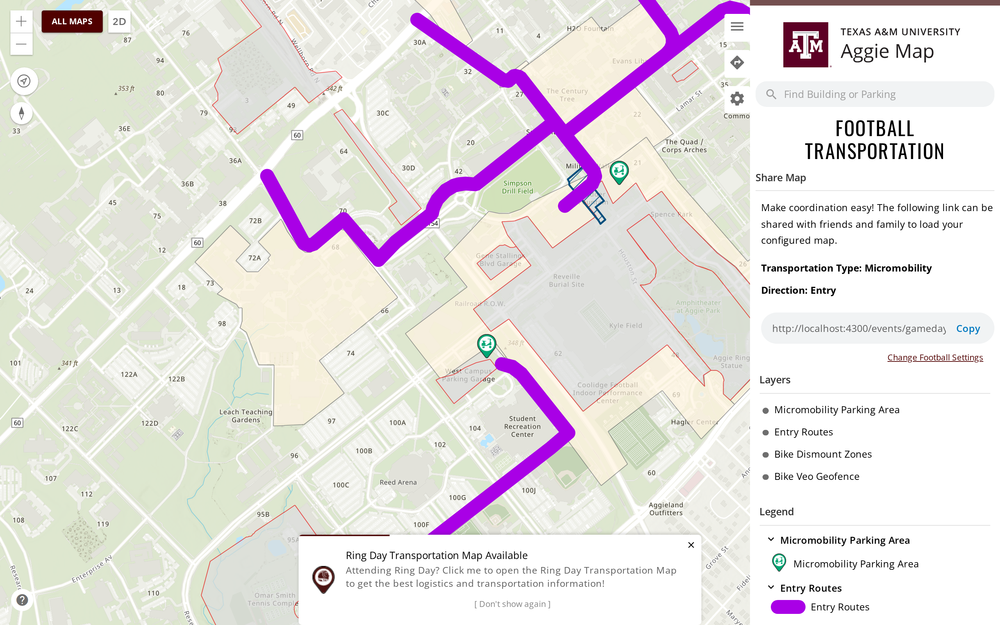
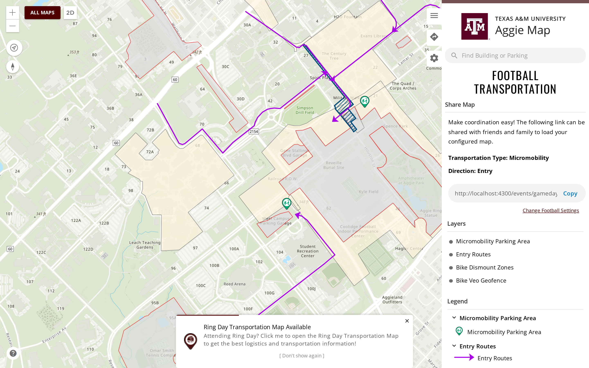
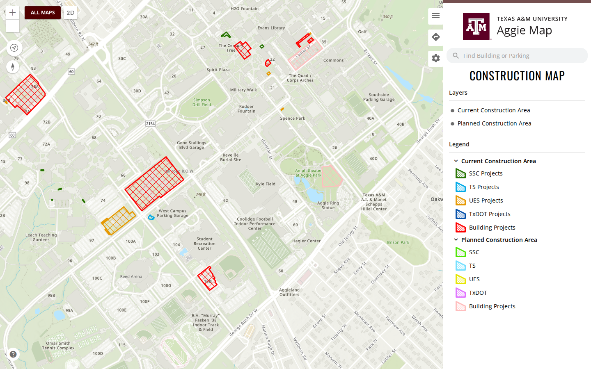
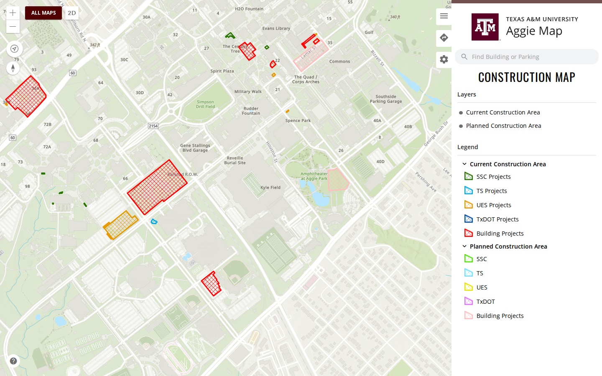
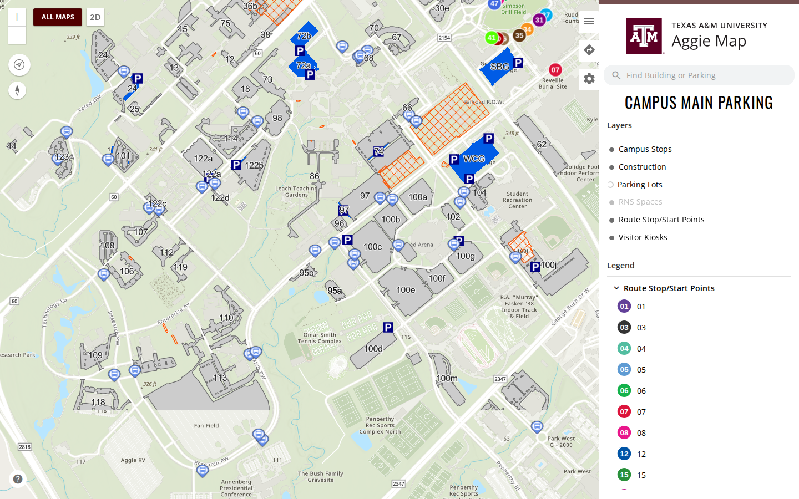
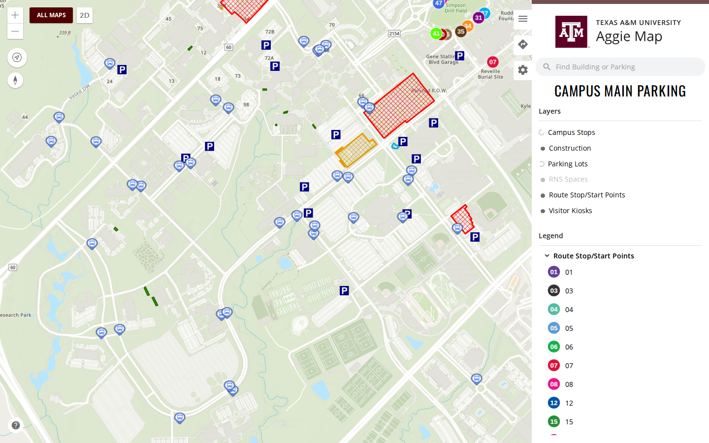
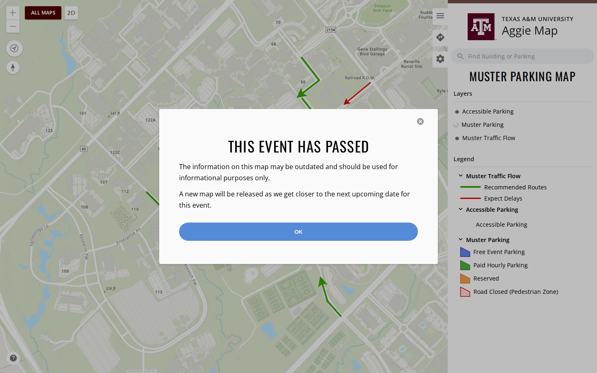
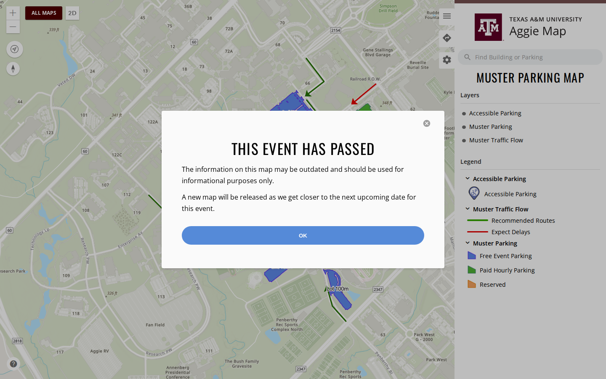
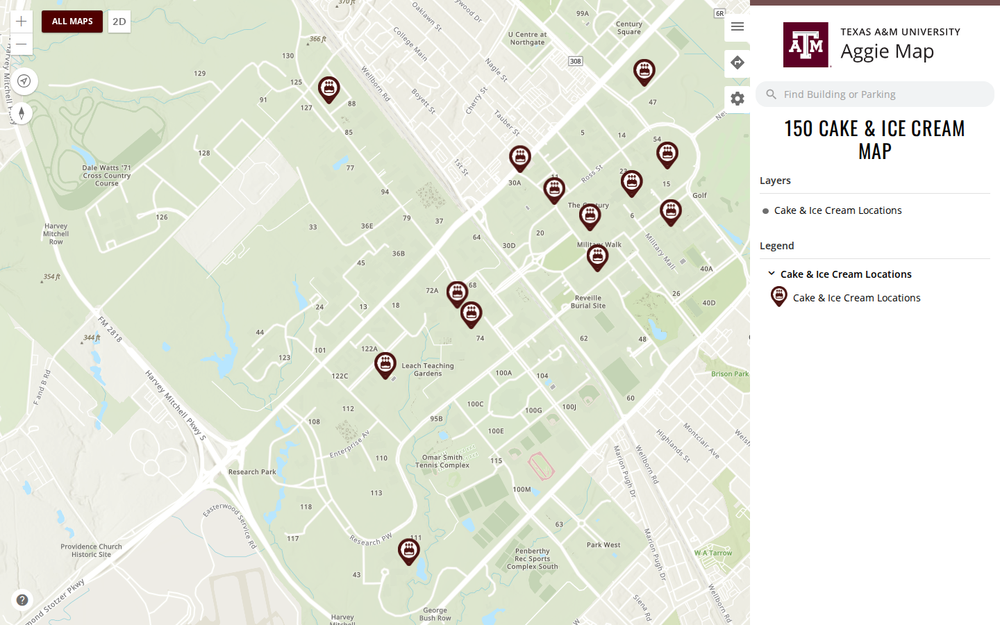
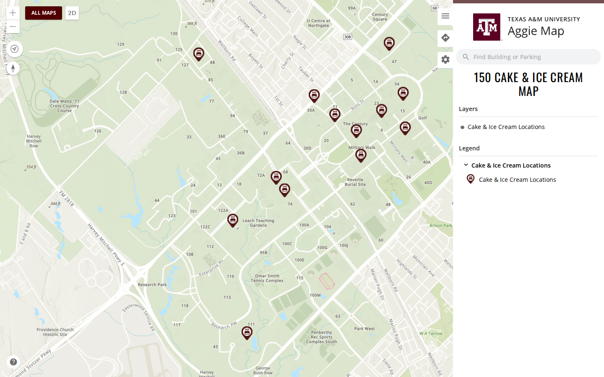

# 6 October 2026, second release

Built from [`8c7a9765`](https://github.com/TamuGeoInnovation/Tamu.GeoInnovation.js.monorepo/commit/8c7a9765) as `main-AV4OTLR6.js`, deployed to dev at 18:56 Central
and tagged `dev-2026-10-06-4` once the suite below passed. The `prod-*` tag on the same commit records
when it reaches production, so what ships is what was verified.

**The suite cleared it on dev**: 421 passed, 0 failed, 14 skipped of 436, in 21 minutes 53 seconds
(18:58:07 to 19:20:00 Central, release scope, 6 workers). One test was flaky: the bus routes check,
where one route did not draw within 30 seconds on the first attempt and passed on retry. It is the
single long bus test ([#1473](https://github.com/TamuGeoInnovation/Tamu.GeoInnovation.js.monorepo/issues/1473)), and nothing in this release touches bus routes. The
three Men's Basketball tests, which had failed in every run since its service changed, pass again.

This is the day's second release, after the [first 6 October release](2026-10-06.md) that carried the
Angular 20 to 22 upgrades. **It is about how maps look**: every layer now draws, and is named, the way
the service that publishes it says.

## Summary

- **Maps draw the symbology that was actually drawn for them** ([#1497](https://github.com/TamuGeoInnovation/Tamu.GeoInnovation.js.monorepo/issues/1497)): a layer styled in ArcGIS Pro keeps its
  symbol on the portal item, while the service publishes a flattened approximation - and the maps were
  drawing the approximation. Across the 36 hosted services, **128 of 128 layers** are affected, which
  is why symbols have had to be copied into our own code one at a time. Layers now draw what was
  published for them, unless a map deliberately sets its own.

  The clearest case is the Football micromobility routes, authored as a thin line with arrowheads and
  flattened by the service into a thick line with none:

  | Before | After |
  | --- | --- |
  |  |  |

  Maps whose services were already faithful are unchanged - Visitor Parking looks exactly as it did.

- **Every layer now draws, and is named, the way its service publishes it** ([#1508](https://github.com/TamuGeoInnovation/Tamu.GeoInnovation.js.monorepo/issues/1508)): with the
  symbology readable at last, the copies this repository kept of it have no purpose. **90 hard-coded
  renderers and 76 symbol, colour and image constants are gone**, along with 71 layer titles that
  restated the service's own name. The cartography is the service owner's decision; our job is to
  render it without breaking it.

  Three reasons written into the code for keeping a copy were checked against the live services, and
  none of them held:

  - The per-event parking classifications were said to need hard-coding. The hosted views publish
    them. `VolleyballParking_view` publishes **three** classes where this repository declared two, so
    the Disabled class was being drawn as though it were event parking.
  - The inlined marker art was said to be necessary because the image endpoint returns 400. It does -
    and all four services publish the art inside the renderer JSON, so Esri never asks the endpoint.
  - Construction was said to want one colour because the map is about construction. Reviewed side by
    side, the service's per-owner symbols are the better map.

  | | Before | After |
  | --- | --- | --- |
  | Construction |  |  |
  | Main Campus Parking |  |  |
  | Muster |  |  |
  | Spirit of 150 Week |  |  |

  Where a service's name or order would make a map *worse*, ours stays and the service is asked to fix
  it instead - 40 names and 2 orders, listed for Transportation on [#1523](https://github.com/TamuGeoInnovation/Tamu.GeoInnovation.js.monorepo/issues/1523), together with 42
  symbols published at a size that does not match their art.

---

## What was tested

These were the rows tested on dev before this went to production, by the maintainer on the evening of
6 October against `8c7a9765`, all as expected. That included Muster's accessible parking pin, which the
service now sizes at 25 by 25 where an override in this repository had drawn it 22 by 28. The links now
point at production, since that is where anyone following them will look.

| Change | Open this on production | Look for |
| --- | --- | --- |
| Map symbology ([#1497](https://github.com/TamuGeoInnovation/Tamu.GeoInnovation.js.monorepo/issues/1497)) | Any map you know well, and [Football micromobility entry](https://aggiemap.tamu.edu/events/gameday-parking/map/d?transport-type=micromobility&direction=entry) | **This one needs the widest look of anything in the release.** Micromobility routes should be a thin line with arrowheads, not a thick slab. Everywhere else, symbols should look the same or better - anything that looks *worse* or has changed unexpectedly is the thing to report, on any map |
| Map symbology, names and order ([#1508](https://github.com/TamuGeoInnovation/Tamu.GeoInnovation.js.monorepo/issues/1508)) | [Construction](https://aggiemap.tamu.edu/operations/construction-map), [Main Campus Parking](https://aggiemap.tamu.edu/parking/ts-main-parking), [Muster](https://aggiemap.tamu.edu/events/muster), [Spirit of 150 Week](https://aggiemap.tamu.edu/events/spirit-of-150-week) | Construction should show a colour per owner rather than one orange hatch. Everywhere else: symbols and layer names should look the same or better. **A layer whose name changed is expected** - 71 titles now come from the service. Report anything that looks *worse*, a name that reads wrongly, or a marker that looks squashed. **One named thing:** Muster's accessible parking pin was drawn 22x28 by an override and is now drawn 25x25 as the service declares it, so it may look slightly squashed - the art is 700x885, a portrait pin. If it reads badly at that size, say so |

---

## What went into this release

Every pull request this release carried, and the issue behind each one.

| Change | Pull request | Issue |
| --- | --- | --- |
| fix(maps-esri): Draw a hosted layer with the symbology its portal item publishes | [#1499](https://github.com/TamuGeoInnovation/Tamu.GeoInnovation.js.monorepo/pull/1499) | [#1497](https://github.com/TamuGeoInnovation/Tamu.GeoInnovation.js.monorepo/issues/1497) |
| docs(releases): Record what is on dev and what the suite said about it | [#1503](https://github.com/TamuGeoInnovation/Tamu.GeoInnovation.js.monorepo/pull/1503) | [#1502](https://github.com/TamuGeoInnovation/Tamu.GeoInnovation.js.monorepo/issues/1502) |
| docs(releases): Cut the 6 October release notes | [#1505](https://github.com/TamuGeoInnovation/Tamu.GeoInnovation.js.monorepo/pull/1505) | [#1504](https://github.com/TamuGeoInnovation/Tamu.GeoInnovation.js.monorepo/issues/1504) |
| fix(aggiemap-smoke): Campus maps are no longer development-only | [#1507](https://github.com/TamuGeoInnovation/Tamu.GeoInnovation.js.monorepo/pull/1507) | [#1506](https://github.com/TamuGeoInnovation/Tamu.GeoInnovation.js.monorepo/issues/1506) |
| docs(workspace): Write down how a layer's look is decided, and how to override it | [#1510](https://github.com/TamuGeoInnovation/Tamu.GeoInnovation.js.monorepo/pull/1510) | [#1509](https://github.com/TamuGeoInnovation/Tamu.GeoInnovation.js.monorepo/issues/1509) |
| fix(gisday-nest): Stop startup logging from printing the environment | [#1515](https://github.com/TamuGeoInnovation/Tamu.GeoInnovation.js.monorepo/pull/1515) | [#1514](https://github.com/TamuGeoInnovation/Tamu.GeoInnovation.js.monorepo/issues/1514) |
| docs(workspace): Say which signal to wait for when a map must be finished | [#1520](https://github.com/TamuGeoInnovation/Tamu.GeoInnovation.js.monorepo/pull/1520) | [#1519](https://github.com/TamuGeoInnovation/Tamu.GeoInnovation.js.monorepo/issues/1519) |
| feat(ts-events-angular): Draw and name every layer the way its service publishes it | [#1526](https://github.com/TamuGeoInnovation/Tamu.GeoInnovation.js.monorepo/pull/1526) | [#1508](https://github.com/TamuGeoInnovation/Tamu.GeoInnovation.js.monorepo/issues/1508) |
| docs(workspace): Commit the capture review tool and the day's check times | [#1529](https://github.com/TamuGeoInnovation/Tamu.GeoInnovation.js.monorepo/pull/1529) | [#1528](https://github.com/TamuGeoInnovation/Tamu.GeoInnovation.js.monorepo/issues/1528) |
