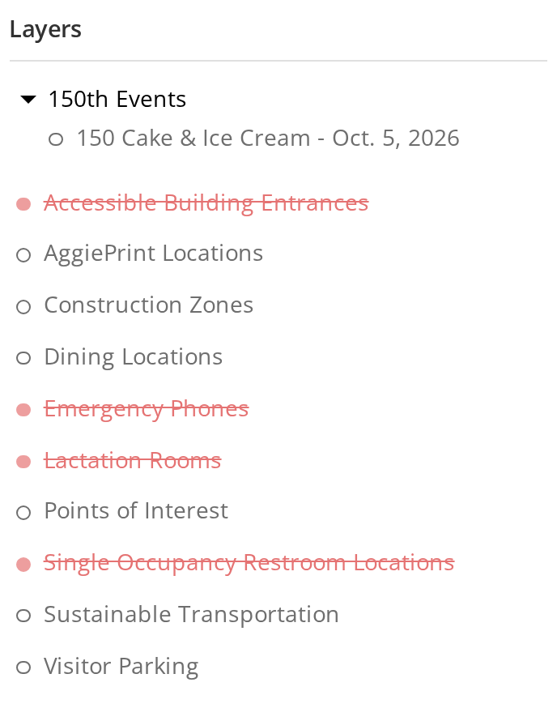
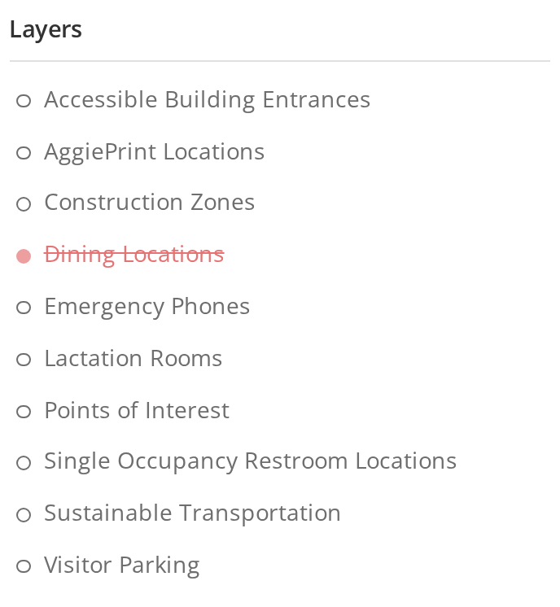

# 6 October 2026

On production as `main-RKVTA45W.js`, from
[`0c8b12df`](https://github.com/TamuGeoInnovation/Tamu.GeoInnovation.js.monorepo/commit/0c8b12df),
tagged `dev-2026-10-06-3` and `prod-2026-10-06` - the same commit carries both, so what shipped is
what was verified.

**The suite cleared it on dev**: 421 passed, 1 failed, 14 skipped of 436, in 29 minutes 24 seconds.
The one failure was the paint check on `/map` timing out under the run's own load - the canvas was
0.340 white, well under the 0.65 that would mean blank, but it held steady for only two of the three
consecutive readings required inside 90 seconds. `/map` is the heaviest map in the suite; RNS Spaces
alone serves 44,980 features. Re-run on its own it passed in 43.8 seconds, and dev showed exactly the
ten layer failures it already allows and no others.

**This release also carries the Angular 20, 21 and 22 upgrades**, which had been waiting in
`unreleased.md`. Nothing about them is meant to be visible; what to watch for is in the summary below.

## Summary

- **The 150th Events group is gone from the main map** ([#1418](https://github.com/TamuGeoInnovation/Tamu.GeoInnovation.js.monorepo/issues/1418)): the anniversary events ran from 2 to 5 October and are
  all over. Each was taken out of the layer list on the day after it happened; 150 Cake & Ice Cream was
  the last of them, so the heading goes with it. Nothing else in the list changes, and each event's own
  map is untouched.

  | Before | After |
  | --- | --- |
  |  |  |
- **The campus maps are live on production** ([#1482](https://github.com/TamuGeoInnovation/Tamu.GeoInnovation.js.monorepo/issues/1482)): Galveston, McAllen and the DC / Bush School have been
  reachable in production by direct URL all along, but nothing there linked to them, so to everyone
  else they did not exist. The **Campus Maps** section on All Maps and the **Campus Maps** tile in
  Visit Maps now appear on production as well as dev.

  They stay out of the All Maps search, deliberately and on both environments: that search is College
  Station's, and a Galveston building answering a search made there would be a worse result than no
  result. The section and the tile are how these maps are reached, which is why each card carries a
  copy field. No service work was needed - all six campus services are the production ones in both
  environments, confirmed by loading each map on production and finding no request to a development
  host.

  | Before (production) | After (production) |
  | --- | --- |
  |  |  |
- **Campus building links are readable** ([#1481](https://github.com/TamuGeoInnovation/Tamu.GeoInnovation.js.monorepo/issues/1481)): the copy button on a Galveston, McAllen or DC / Bush School
  building popup produced `?feature=galveston-buildings-layer:3` - nothing a person could read, and
  keyed on an ArcGIS object id that is not stable when the service is republished, so a link shared
  today could come to point at a different building. It now copies `?bldg=3010`, or `?abbrv=OCNG` for a
  building with no number, the same shape the main map has always used. Links of the old form still
  open, so anything already shared keeps working.

  | Before | After |
  | --- | --- |
  |  |  |
- **Football micromobility follows its services again** ([#996](https://github.com/TamuGeoInnovation/Tamu.GeoInnovation.js.monorepo/issues/996)): Transportation added an **Entry Routes** layer to
  the entry service and removed its bike lane markings, and nothing on the map read the new layer - so
  a cyclist arriving at the game was shown where to park and where to dismount and no way to reach
  either. The entry map had no route layer at all. Entry Routes now draw, the five layers are listed in
  the order the services publish them rather than alphabetically, and both route layers draw the
  symbology the service publishes instead of a colour held in our code.

  | Before (entry) | After (entry) |
  | --- | --- |
  |  |  |
  |  |  |
- **Satellite campus building popups** ([#1463](https://github.com/TamuGeoInnovation/Tamu.GeoInnovation.js.monorepo/issues/1463)): clicking or searching for a building on the
  Galveston, McAllen and DC / Bush School maps now shows a popup like the main map's. It gives the building's
  name, its number, its address where the campus publishes one, and a link to copy that reopens the
  building. Before, it showed a raw table of every database field. This was the last thing holding the
  campus maps back from production.

  | Before | After |
  | --- | --- |
  |  |  |
  |  |  |
  |  |  |
- **Upcoming Events shows the next date, not a range** ([#1443](https://github.com/TamuGeoInnovation/Tamu.GeoInnovation.js.monorepo/issues/1443)): a repeat event showed every date it spans, so Soccer
  read "Dates: 8/5/2026 - 11/1/2026" - a three-month span where a visitor wanted to know when the next
  one is. Each card now reads "Next:" and one date, chosen the same way the list itself is ordered.

  | Before | After |
  | --- | --- |
  |  |  |
- Not visible: **Angular 22** ([#1469](https://github.com/TamuGeoInnovation/Tamu.GeoInnovation.js.monorepo/issues/1469)): Angular 21.2 to 22.1, Nx 22.7 to 23.2, TypeScript 5.9
  to 6.0, ESLint 8 to 9. The last of the version steps. Nothing is meant to look or behave differently.
  Angular 22 makes components update only on input changes by default; a migration marked every
  existing component to keep updating as today, so **a panel or list that stops refreshing** is the
  first thing to report. The **popups** (map and mobile) and the **trip planner's parking and biking
  options** are now created differently, because the API they used is gone. Not on dev until the build
  after it merges.
- Not visible: **Angular 21** ([#1456](https://github.com/TamuGeoInnovation/Tamu.GeoInnovation.js.monorepo/issues/1456)): Angular 20.3 to 21.2, Nx 21.6 to 22.7, Jest 29 to 30.
  Nothing is meant to look or behave differently. The changes most likely to show are in **clicks and
  keys handled by shared components** (accordions, tooltips, the side panel's tabs, the mobile tiles and
  menu, Escape to close a popup or modal), whose handlers were adjusted for Angular 21's stricter
  checking, and the **copy button**, whose clipboard library is now imported differently. Not on dev
  until the build after it merges.
- Not visible: **Angular 20** ([#1447](https://github.com/TamuGeoInnovation/Tamu.GeoInnovation.js.monorepo/issues/1447)): Angular 19.2 to 20.3, Nx 20.8 to 21.6,
  TypeScript 5.7 to 5.9, with Prettier 3 ([#1448](https://github.com/TamuGeoInnovation/Tamu.GeoInnovation.js.monorepo/issues/1448)). Nothing is meant to look or behave
  differently, but **most templates changed form**: Angular's migration rewrote `*ngIf` and `*ngFor` as
  its built-in `@if` and `@for` blocks. A panel, list or button that fails to appear is the first thing
  to report. Not on dev until the build after it merges.
- **A Football Tailgating map, on dev only** ([#1422](https://github.com/TamuGeoInnovation/Tamu.GeoInnovation.js.monorepo/issues/1422), pull request
  [#1424](https://github.com/TamuGeoInnovation/Tamu.GeoInnovation.js.monorepo/pull/1424)).
  Listed under **Football** on the Athletics Events page, it shows the Aggie Park and West Campus
  tailgating zones with their circled numbers, the Revel XP tent numbers on Performance Lawn once zoomed
  in, and only the construction that affects tailgating (Aplin Center and SUP 1). After the last home
  game it says the season is over and the zones are subject to change, rather than taking the map
  down. The zones are a hosted layer in TAMU's ArcGIS Online organization with no production
  counterpart, so production does not list or open the map. Two legend fixes came with it, and apply
  to every map: a layer whose symbology was published from ArcGIS Pro no longer prints "Unsupported
  legend element type", and a layer that can be toggled but has no key of its own stays out of the
  legend.

  | Before (and production, unchanged) | After (dev) |
  | --- | --- |
  |  |  |

  

  

---

## What was tested

**The team tests these on dev before a release goes to production.** Dev is
[dev.aggiemap.tamu.edu](https://aggiemap.tamu.edu). Each row is a change on dev and not yet on
production. A pull request with a visible result adds its own row; at release, the rows move into the
dated notes as what was tested, and this table empties.

These were the rows the team worked through on dev before this went to production. The links now
point at production, since that is where anyone following them will look. One row, the campus maps,
could only be seen for real once it shipped - it had never appeared on production before.

| Change | Open this on production | Look for |
| --- | --- | --- |
| The 150th Events group ([#1418](https://github.com/TamuGeoInnovation/Tamu.GeoInnovation.js.monorepo/issues/1418)) | [The main map](https://aggiemap.tamu.edu/map/d), side panel, **Layers** | **No 150th Events heading at all**, and the list now starts at Accessible Building Entrances. The 150th event maps themselves still open from their own links |
| Campus maps on production ([#1482](https://github.com/TamuGeoInnovation/Tamu.GeoInnovation.js.monorepo/issues/1482)) | [All Maps](https://aggiemap.tamu.edu/all-maps) | A **Campus Maps** section and a **Campus Maps** tile in Visit Maps, each opening Galveston, McAllen and DC / Bush School. Typing "Galveston" in the map search still finds **nothing** - that is deliberate. This is the change to look at on production after the release, since dev showed it already |
| Campus building links ([#1481](https://github.com/TamuGeoInnovation/Tamu.GeoInnovation.js.monorepo/issues/1481)) | [Galveston](https://aggiemap.tamu.edu/campus/galveston/map/d?bldg=3010), [McAllen](https://aggiemap.tamu.edu/campus/mcallen/map/d), [DC / Bush School](https://aggiemap.tamu.edu/campus/dc-bush-school/map/d) | The link opens the building straight away. Click any building, press **Copy**, and the link reads `?bldg=<number>` - paste it in a new tab and the same building opens. An old `?feature=...` link must still work too |
| Football micromobility ([#996](https://github.com/TamuGeoInnovation/Tamu.GeoInnovation.js.monorepo/issues/996)) | [Entry](https://aggiemap.tamu.edu/events/gameday-parking/map/d?transport-type=micromobility&direction=entry), [Exit](https://aggiemap.tamu.edu/events/gameday-parking/map/d?transport-type=micromobility&direction=exit) | The entry map draws **Entry Routes**; the exit map draws **Exit Routes** and not the entry ones. Layers read Micromobility Parking Area, the routes, Bike Dismount Zones, Bike Veo Geofence - the same order as the legend below. **The routes are thicker than before**, because that is the width the service publishes; say so if it is too heavy. Needed before the 17 October home game |
| Campus building popups ([#1463](https://github.com/TamuGeoInnovation/Tamu.GeoInnovation.js.monorepo/issues/1463)) | [Galveston Student Center](https://aggiemap.tamu.edu/campus/galveston/map/d?feature=galveston-buildings-layer:1), [McAllen](https://aggiemap.tamu.edu/campus/mcallen/map/d), [DC / Bush School](https://aggiemap.tamu.edu/campus/dc-bush-school/map/d) | The popup shows a title, "Building N" and the address (Galveston and DC; McAllen has no address in its data), and a copy field, with **no Property/Value table**. Search Galveston for "Williams", open the result, copy its link and paste it in a new tab: it reopens the same building. DC's ZIP shows 00318 until the data is fixed ([#1464](https://github.com/TamuGeoInnovation/Tamu.GeoInnovation.js.monorepo/issues/1464)) |
| Upcoming Events dates ([#1443](https://github.com/TamuGeoInnovation/Tamu.GeoInnovation.js.monorepo/issues/1443)) | [All Maps](https://aggiemap.tamu.edu/all-maps), the **Upcoming Events** row | Each card reads **Next:** and a single date - the next one that event happens - rather than a range. Check one with several dates, such as October Ring Day, shows only the first of them |
| Angular 22 ([#1469](https://github.com/TamuGeoInnovation/Tamu.GeoInnovation.js.monorepo/issues/1469)) | The [main map](https://aggiemap.tamu.edu/map/d): click a building, then a parking lot; the side panel's Layers and Legend; an event map such as [Ring Day](https://aggiemap.tamu.edu/events/ring-day); the [mobile map](https://aggiemap.tamu.edu/map/m) popups; [directions](https://aggiemap.tamu.edu/map/d/trip) with parking and biking options | **nothing different**. Popups open with their content; the trip planner shows its parking and biking options; turning a layer on or off updates the map and the legend straight away. Anything that only updates after another click is the thing to report |
| Angular 21 ([#1456](https://github.com/TamuGeoInnovation/Tamu.GeoInnovation.js.monorepo/issues/1456)) | The [main map](https://aggiemap.tamu.edu/map/d), a building popup, and an event map such as [Ring Day](https://aggiemap.tamu.edu/events/ring-day); on a phone, the [mobile map](https://aggiemap.tamu.edu/map/m) | **nothing different**. Click a building and press **Copy** in its popup, then paste; press **Escape** to close a popup; open and close the side panel's tabs and any accordion; on a phone, use the menu and the tiles. A click or key that does nothing is the thing to report |
| Angular 20 ([#1447](https://github.com/TamuGeoInnovation/Tamu.GeoInnovation.js.monorepo/issues/1447)) | Any map you use; [All Maps](https://aggiemap.tamu.edu/all-maps); an event builder such as [Ring Day](https://aggiemap.tamu.edu/events/ring-day); popups, the side panel's Layers and Legend; and GIS Day's pages if you use them | **nothing different**. Templates were rewritten from `*ngIf`/`*ngFor` to `@if`/`@for`, so the thing to look for is something missing: an empty list, a panel that will not open, a button that has gone |

---

## What went into this release

Every pull request this release carried, and the issue behind each one.

| Change | Pull request | Issue |
| --- | --- | --- |
| docs: Record the 5 October release | [#1391](https://github.com/TamuGeoInnovation/Tamu.GeoInnovation.js.monorepo/pull/1391) | [#1390](https://github.com/TamuGeoInnovation/Tamu.GeoInnovation.js.monorepo/issues/1390) |
| docs: Record Azure build stages, releases and smoke runs | [#1420](https://github.com/TamuGeoInnovation/Tamu.GeoInnovation.js.monorepo/pull/1420) | [#1419](https://github.com/TamuGeoInnovation/Tamu.GeoInnovation.js.monorepo/issues/1419) |
| feat(aggiemap-angular): Football Tailgating map, as a development-only prototype | [#1424](https://github.com/TamuGeoInnovation/Tamu.GeoInnovation.js.monorepo/pull/1424) | [#1422](https://github.com/TamuGeoInnovation/Tamu.GeoInnovation.js.monorepo/issues/1422) |
| docs: Report and record times in US Central, and say how to convert them | [#1425](https://github.com/TamuGeoInnovation/Tamu.GeoInnovation.js.monorepo/pull/1425) | [#1423](https://github.com/TamuGeoInnovation/Tamu.GeoInnovation.js.monorepo/issues/1423) |
| docs: Backfill the Azure build history, and say why releases cannot be pulled | [#1430](https://github.com/TamuGeoInnovation/Tamu.GeoInnovation.js.monorepo/pull/1430) | [#1428](https://github.com/TamuGeoInnovation/Tamu.GeoInnovation.js.monorepo/issues/1428) |
| feat(aggiemap-smoke): Run only the part of the suite a change can affect | [#1432](https://github.com/TamuGeoInnovation/Tamu.GeoInnovation.js.monorepo/pull/1432) | [#1427](https://github.com/TamuGeoInnovation/Tamu.GeoInnovation.js.monorepo/issues/1427) |
| fix(ts-events-angular): Follow the Men's Basketball service's renamed layers | [#1434](https://github.com/TamuGeoInnovation/Tamu.GeoInnovation.js.monorepo/pull/1434) | [#1431](https://github.com/TamuGeoInnovation/Tamu.GeoInnovation.js.monorepo/issues/1431) |
| fix(ci): Find the bundle under either builder's naming, so the smoke suite can run | [#1436](https://github.com/TamuGeoInnovation/Tamu.GeoInnovation.js.monorepo/pull/1436) | [#1435](https://github.com/TamuGeoInnovation/Tamu.GeoInnovation.js.monorepo/issues/1435) |
| fix(ci): Look for the map probe in every script, not only the main bundle | [#1438](https://github.com/TamuGeoInnovation/Tamu.GeoInnovation.js.monorepo/pull/1438) | [#1435](https://github.com/TamuGeoInnovation/Tamu.GeoInnovation.js.monorepo/issues/1435) |
| fix(ci): Stop pipefail turning a found map probe into "not found" | [#1441](https://github.com/TamuGeoInnovation/Tamu.GeoInnovation.js.monorepo/pull/1441) | [#1435](https://github.com/TamuGeoInnovation/Tamu.GeoInnovation.js.monorepo/issues/1435) |
| ci(aggiemap-smoke): Give the smoke job 120 minutes, so a full run can finish | [#1446](https://github.com/TamuGeoInnovation/Tamu.GeoInnovation.js.monorepo/pull/1446) | [#1445](https://github.com/TamuGeoInnovation/Tamu.GeoInnovation.js.monorepo/issues/1445) |
| chore(workspace): Upgrade Prettier 2.8.8 to 3.9.9, needed by Angular 20 | [#1450](https://github.com/TamuGeoInnovation/Tamu.GeoInnovation.js.monorepo/pull/1450) | [#1448](https://github.com/TamuGeoInnovation/Tamu.GeoInnovation.js.monorepo/issues/1448) |
| chore(workspace): Upgrade Angular 19 to 20, with Nx 21 | [#1451](https://github.com/TamuGeoInnovation/Tamu.GeoInnovation.js.monorepo/pull/1451) | [#1447](https://github.com/TamuGeoInnovation/Tamu.GeoInnovation.js.monorepo/issues/1447) |
| fix(aggiemap-smoke): Check each development-only service on the page that uses it | [#1461](https://github.com/TamuGeoInnovation/Tamu.GeoInnovation.js.monorepo/pull/1461) | [#1460](https://github.com/TamuGeoInnovation/Tamu.GeoInnovation.js.monorepo/issues/1460) |
| chore(workspace): Upgrade Angular 20 to 21, with Nx 22 | [#1465](https://github.com/TamuGeoInnovation/Tamu.GeoInnovation.js.monorepo/pull/1465) | [#1456](https://github.com/TamuGeoInnovation/Tamu.GeoInnovation.js.monorepo/issues/1456) |
| docs(workspace): Add the cloud session's rules and handoff to CLAUDE.md | [#1467](https://github.com/TamuGeoInnovation/Tamu.GeoInnovation.js.monorepo/pull/1467) | [#1466](https://github.com/TamuGeoInnovation/Tamu.GeoInnovation.js.monorepo/issues/1466) |
| chore(workspace): Upgrade Angular 21 to 22, with Nx 23 and TypeScript 6 | [#1471](https://github.com/TamuGeoInnovation/Tamu.GeoInnovation.js.monorepo/pull/1471) | [#1469](https://github.com/TamuGeoInnovation/Tamu.GeoInnovation.js.monorepo/issues/1469) |
| feat(aggiemap-angular): Campus building popups show a title, address and copy link | [#1472](https://github.com/TamuGeoInnovation/Tamu.GeoInnovation.js.monorepo/pull/1472) | [#1463](https://github.com/TamuGeoInnovation/Tamu.GeoInnovation.js.monorepo/issues/1463) |
| test(aggiemap-smoke): Make the smoke suite fast enough to gate a release | [#1477](https://github.com/TamuGeoInnovation/Tamu.GeoInnovation.js.monorepo/pull/1477) | [#1426](https://github.com/TamuGeoInnovation/Tamu.GeoInnovation.js.monorepo/issues/1426) |
| fix(ts-events-angular): Football micromobility follows its services again | [#1486](https://github.com/TamuGeoInnovation/Tamu.GeoInnovation.js.monorepo/pull/1486) | [#996](https://github.com/TamuGeoInnovation/Tamu.GeoInnovation.js.monorepo/issues/996) |
| fix(aggiemap-angular): Remove the 150th Events group now that every event has passed | [#1487](https://github.com/TamuGeoInnovation/Tamu.GeoInnovation.js.monorepo/pull/1487) | [#1418](https://github.com/TamuGeoInnovation/Tamu.GeoInnovation.js.monorepo/issues/1418) |
| fix(aggiemap-angular): Show an upcoming event's next date, not its whole range | [#1488](https://github.com/TamuGeoInnovation/Tamu.GeoInnovation.js.monorepo/pull/1488) | [#1443](https://github.com/TamuGeoInnovation/Tamu.GeoInnovation.js.monorepo/issues/1443) |
| fix(ts-events-angular): Campus building popups copy a readable ?bldg= link | [#1489](https://github.com/TamuGeoInnovation/Tamu.GeoInnovation.js.monorepo/pull/1489) | [#1481](https://github.com/TamuGeoInnovation/Tamu.GeoInnovation.js.monorepo/issues/1481) |
| feat(aggiemap-angular): Link the satellite-campus maps on production | [#1490](https://github.com/TamuGeoInnovation/Tamu.GeoInnovation.js.monorepo/pull/1490) | [#1482](https://github.com/TamuGeoInnovation/Tamu.GeoInnovation.js.monorepo/issues/1482) |
| test(aggiemap-smoke): A production map may request only production services | [#1491](https://github.com/TamuGeoInnovation/Tamu.GeoInnovation.js.monorepo/pull/1491) | [#1483](https://github.com/TamuGeoInnovation/Tamu.GeoInnovation.js.monorepo/issues/1483) |
| chore(workspace): Add a script that captures a screenshot into the repository | [#1492](https://github.com/TamuGeoInnovation/Tamu.GeoInnovation.js.monorepo/pull/1492) | [#1484](https://github.com/TamuGeoInnovation/Tamu.GeoInnovation.js.monorepo/issues/1484) |
| docs(workspace): Bring the work in flight up to 6 October, with the day's build times | [#1493](https://github.com/TamuGeoInnovation/Tamu.GeoInnovation.js.monorepo/pull/1493) | [#1480](https://github.com/TamuGeoInnovation/Tamu.GeoInnovation.js.monorepo/issues/1480) |
| docs(workspace): Maintainers open pull requests ready, contributors open drafts | [#1495](https://github.com/TamuGeoInnovation/Tamu.GeoInnovation.js.monorepo/pull/1495) | [#1494](https://github.com/TamuGeoInnovation/Tamu.GeoInnovation.js.monorepo/issues/1494) |
