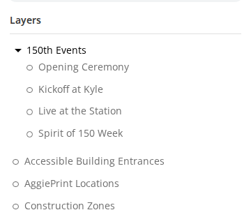

# Release notes

One file per production release, named for the date it reached production: `YYYY-MM-DD.md`.
If a second release reaches production on the same day, add a suffix: `YYYY-MM-DD-2.md`,
then `-3`, and so on. The first file keeps its name, so links already shared still work.

A **dated** file lands on `development` when the release reaches production, not before, because a
file named for a date reads as a record of something that shipped. It is *written* before, though -
see [Cutting a release](#cutting-a-release).

Work in progress lives in [`unreleased.md`](unreleased.md), which collects what has merged since
the last production release. It is not assembled from memory at the end — one release was
reconstructed afterwards and four changes were nearly missed, including a data-correctness fix that
mattered more than the features around it.

**Each pull request with a user-visible result adds its own entry to `unreleased.md`, in that pull
request**, with the before/after screenshots it already has. When it merges, the notes are already
complete; nobody writes them later or goes back for images. Link the images where the pull request
committed them, relative to this folder:

```html

```

One capture then serves the issue, the pull request and the notes, and nothing has to be named for a
release date that is not known yet. The link keeps working when the file is renamed, since both
names are in this folder. A "before" from production and an "after" from localhost or dev is fine:
label each with where it was taken. The "after" is the build that goes to production, so there is
nothing to re-capture at release time.

A pull request with no user-visible result, such as tests, CI or internal docs, adds a line under
*Behind the scenes* if it is worth recording, or nothing.

**Link every issue and pull request you mention, and list them all at the end.** Two separate things:

Inline, write the full URL rather than a bare `#1122`:

```markdown
Reported in [#1122](https://github.com/TamuGeoInnovation/Tamu.GeoInnovation.js.monorepo/issues/1122).
```

GitHub only turns `#1122` into a link inside issue and pull request comments. In a file in this
folder it is inert text, so a bare number is a dead end for exactly the reader these notes exist
for - someone outside the team, opening a shared link, who was not in the room.

Then end the file with **What went into this release**, a table of every issue and pull request it
carried:

```markdown
## What went into this release

| | |
| --- | --- |
| [#1098](https://github.com/.../issues/1098) | `visible:false` meant both "not announced" and "finished" |
| [#1136](https://github.com/.../pull/1136) | Retire finished events |
```

The prose answers "what changed and why". The table answers "what went into this", which is a
different question and the one asked months later, when someone is tracing when a behaviour arrived
or reporting what the work produced. Neither substitutes for the other.

On the day it ships, `unreleased.md` is renamed to `YYYY-MM-DD.md` for that date and its
"Unreleased" heading becomes the status line. A fresh `unreleased.md` starts empty.

That rename is the whole mechanism. It keeps one place to look for what is coming, and keeps the
dated files meaning exactly what they have always meant.

**Keep `unreleased.md` honest about environments.** It describes things that have not reached
users, so it is the file most likely to make a claim a reader cannot verify. If something is on
dev, say so; if it has not been built anywhere yet, say that too.

This repository is public, so every file here has a permanent URL that anyone can read
without an account. That is the point — release notes are for the people who asked for the
work and the people who test it, not only for the people who wrote it. Sharing a link should
never require the reader to sign in to anything.

## Cutting a release

**Prepare the release pull request before deploying to production, and merge it once production is
up.** Merging is the only release-notes step after production. Writing the notes after the deploy
made them the first job of every release night, and the file most likely to be shared outside the
team stayed wrong until someone got to it (#1094, #1132).

Once the full smoke suite passes on dev, open one pull request that:

1. **Renames** `unreleased.md` to `YYYY-MM-DD.md` for the day it will ship, and turns the
   "Unreleased" banner into the status line of a release that has shipped. If the deploy slips to
   another day, rename it before merging.
2. **Records the dev run's numbers**: checks passed, failed and skipped, and how long the run took.
   That run is what cleared the release, so it is the number worth writing down. The status line
   says so, and links to the
   [smoke workflow](https://github.com/TamuGeoInnovation/Tamu.GeoInnovation.js.monorepo/actions/workflows/aggiemap-smoke.yml),
   which checks production every day and opens a health issue if something breaks. Production
   numbers are not recorded by hand.
3. **Points the *What to test* links at production.** Anything deliberately not on production keeps
   its dev link and says why. Bus routes on the first 28 September release, and campus maps, are the
   examples.
4. **Leaves a pointer in a fresh `unreleased.md`.** Links to `unreleased.md` get shared while people
   are testing on dev, and the rename alone leaves them resolving to an empty page. A line naming the
   dated file keeps them useful. Carry forward anything else the file holds that is not part of the
   release, such as a work-in-flight section.
5. **Checks the commit message for stray closing keywords.** Writing `Closes #1234` in prose, even to
   say an issue is *not* closed by the change, will close it. This has happened once.

Then deploy. When production is up, open it and check the thing the release is about, then merge the
pull request. If production shows a problem, do not merge: fix it, or change the status line to say
what did not ship.

## What belongs here

Notes written for the person who will _use_ or _check_ the change: what shipped, where to see
it, what behaves differently, and what still needs a decision. Narrative, not terse.

These are **release notes**, not a changelog. A changelog is a terse, developer-facing list of
what changed between versions. If this repository ever wants one, it belongs in a
`CHANGELOG.md` at the root and should stay separate — mixing the two audiences is what makes
both go stale.

There is also an in-app changelog at
`libs/aggiemap/ngx/core/src/lib/pages/changelog/changelog-events.ts`, shown to AggieMap's own
users. That is a third audience again. Its last entry is from 2019.

## Writing one

Start from the previous file. The shape that has worked:

- **A status line at the top** saying where the release actually is: shipped to production on
  a given date, or partially rolled out. Readers act on this first, and it is the line most
  likely to go stale between drafting and sending.
- **A short summary** of the whole release, before any detail. Most readers stop here.
- **Sections per area of change**, with links a reader can click to see the thing itself.
- **Decisions and open questions**, so the record says what was chosen and what was not.

Two things worth being careful about, both of which have caused real confusion:

- **Say which environment a link points at, and keep it true.** A link to `dev.aggiemap` in a
  note about a production release will send someone to the wrong place.
- **Do not describe intended behaviour as current behaviour.** "Will be reachable once
  deployed" and "is reachable" are different claims, and a reader checking the second one
  against a site that has not been deployed yet will report a bug that does not exist.

## Past files are a record

Do not go back and edit a file when a later release changes what it describes. If a map was
hidden in one release and made public in the next, the first file should still say it was
hidden: that was true on its date. The later file records the change. Fix a file only when
it was wrong about its own release, such as a broken link or a misstated fact.

## Sharing

Link to the file on GitHub. It renders tables and links properly, needs no account, and stays
put:

```
https://github.com/TamuGeoInnovation/Tamu.GeoInnovation.js.monorepo/blob/development/docs/releases/YYYY-MM-DD.md
```

If these ever move to tagged GitHub Releases, these files become the body of each release and
nothing here is wasted.
