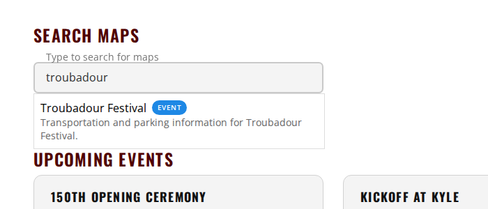
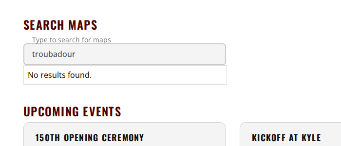
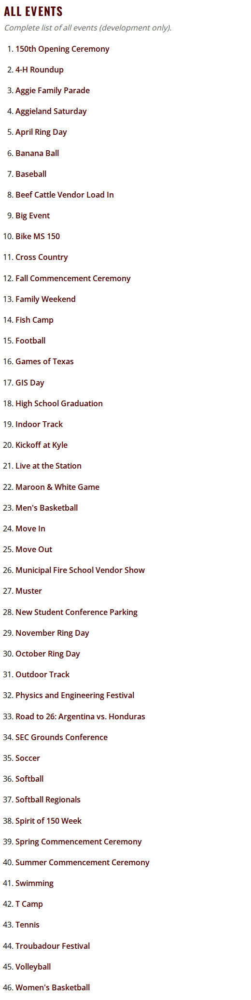
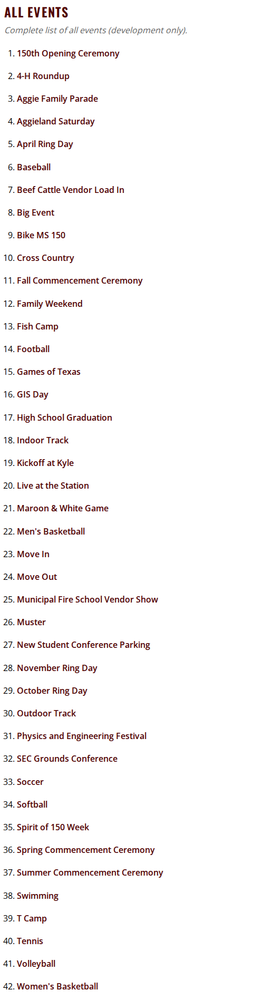

# Unreleased

> **Not on production.** This file collects what has merged since the last production release. Each
> entry says where it can be seen.

**Production is currently running the [second 28 September release](2026-09-28-2.md).**

If you followed a link to this page expecting the notes for the release being tested, including the
*What to test* checklist and the before and after screenshots, they are in
[28 September, second release](2026-09-28-2.md) now. That file is the permanent record of what
shipped; this one only ever describes what has not shipped yet.

---

## Summary

Events that are over can now be marked **retired**, and four are. Production looks the same, because
they were already hidden there. On dev they no longer appear in All Maps search or the All Events
list, and the nightly checks stop testing them.

---

## Changed

### Retired events are no longer offered anywhere

Events that are over used to be hidden with the same setting as maps not announced yet. Hidden maps
still show on dev, so four finished events stayed in dev's search and All Events list and were tested
every night, although their services are stopped on the production GIS server. They are now marked
**retired**: listed nowhere, on any environment, and skipped by the automated checks. A link already
shared still opens the map; what it should say is #1103.

Retired: Banana Ball, Softball Regionals, Troubadour Festival, and Road to 26: Argentina vs. Honduras.
(#1098)

**Visible on dev only.** Production already hid these maps.

| Before (dev) | After (dev) |
| --- | --- |
|  |  |
|  |  |

## Behind the scenes

- **A check that retired maps stay hidden.** The smoke suite searches All Maps for each retired map
  and reads every listing page, on each environment. (#1098)
- **The GIS services check skips retired maps' services** rather than listing them as known
  failures. (#1098)

---

## Work in flight — 28 September, after the second release

Nothing below has merged, so it is not part of a release yet. This section exists because
[`CLAUDE_SETUP.md`](../../CLAUDE_SETUP.md) sends a session on another machine here first, and an empty
file would say the work had stopped.

### Read this first if you are picking up elsewhere

**726 screenshots exist only on the work machine.** They are in `test/visual/baselines/builder/`,
untracked and deliberately uncommitted — 363 builder destinations at two viewports, 322MB. They are
the output of a two-hour crawl against dev and can be regenerated with:

```bash
AGGIEMAP_SMOKE_BASE_URL=https://dev.aggiemap.tamu.edu BUILDER_INVENTORY_SHOTS=/some/dir   npx playwright test --config=tools/builder-inventory/playwright.config.ts
```

The capture resumes rather than restarts, so an interrupted run costs only what it had not reached.

They are uncommitted on purpose: at 322MB they would more than triple a 151MB repository, permanently,
since git keeps every version. Where they should live is #1107.

### Open pull requests

None from 28 September. Everything merged that day shipped in the
[second 28 September release](2026-09-28-2.md).

### The decision waiting to be made

**#1107 — evaluate Visual Regression Tracker on the cluster** as the home for baseline images. It
holds the comparison of the options, why Percy and Chromatic cannot work here (they re-render from
DOM, and these maps are a WebGL canvas), and the caveat that VRT's Playwright agent is two years
stale while its server is current.

The contained test is in that issue: stand VRT up, point the existing capture at `gameday-parking`'s
14 destinations, and find out whether the agent works before migrating 726 images.

### Filed today, none started

| Issue | |
| --- | --- |
| #1089 | Full visual suite: a screenshot of every page, including builder paths |
| #1090 | Nothing asserts development-only sections stay off production |
| #1091 | Layer toggle round-trip: prove a layer returns the map to its original state |
| #1097 | Two 2025 events still registered and tested nightly on dev |
| #1098 | `visible:false` means both "not announced" and "finished", so hidden maps accumulate |
| #1099 | Ring Day naming: October holds the generic `/events/ring-day` id |
| #1100 | The builder-inventory README claims the smoke suite consumes its output; nothing did |
| #1101 | Inventory every GIS service, with dev and prod URLs and which maps use them |
| #1102 | Dev is hardcoded to the production transportation GIS host by a `TEMP` |
| #1103 | No test that a past event shows the "this event has passed" warning |
| #1104 | Define an emergency test tier for urgent deploys |
| #1105 | Map captures are not byte-reproducible; page captures are |
| #1122 | Bike racks search reads a service that does not exist on the production GIS server |
| #1123 | Two unused football entries point at stopped services |

### Worth knowing before touching the visual work

- **Page captures are byte-identical across runs; map captures are not.** Measured three times each.
  So hash comparison works for pages and cannot work for maps, which need pixel tolerance (#1105).
- **A local dev server must be reached at `http://localhost:4200`, not `127.0.0.1`.** `TestingService`
  keys on the host containing `dev` or `localhost`, so `127.0.0.1` renders the *production* variant —
  6 headings on All Maps instead of 31.
- **The builder inventory is environment-specific** and the smoke suite refuses one captured
  elsewhere. Production has no inventory yet, so its builder maps still skip.
