# Unreleased

> **Not on production.** This file collects what has merged since the last production release. Each
> entry says where it can be seen.

**On production: the [2 October release](2026-10-02.md)**, tagged `prod-2026-10-02`.

**On dev, being tested: Azure build 20261004.44**, the candidate for production on Monday 5 October. It
carries Angular 16 to 19, Node 22, NestJS 10, ArcGIS 4.27 and everything else merged since 2 October. It
passed the full suite, but it is **not on production yet**: the team tests it on dev first. Its release
notes are in [#1391](https://github.com/TamuGeoInnovation/Tamu.GeoInnovation.js.monorepo/pull/1391), and merge before the deploy. The `prod-*` tag, not this file, will
record when it ships.

If you followed a link here expecting the notes for a release that just shipped, they are in those
dated files now. Those files are the permanent record of what shipped; this one only ever describes
what has not shipped yet.

---

## Summary

Merged since the 3 October release was cut, and on dev in Release-443:

- **The two 150th events that have happened are off the main map**
  ([#1413](https://github.com/TamuGeoInnovation/Tamu.GeoInnovation.js.monorepo/issues/1413), pull request
  [#1414](https://github.com/TamuGeoInnovation/Tamu.GeoInnovation.js.monorepo/pull/1414)). Opening Ceremony and Kickoff at Kyle were both on
  2 October and were still offered in the map's **150th Events** list three days later, with parking,
  shuttle routes and event locations for things that had finished. 150 Cake & Ice Cream is today and
  stays; it comes out tomorrow, on its own issue.

  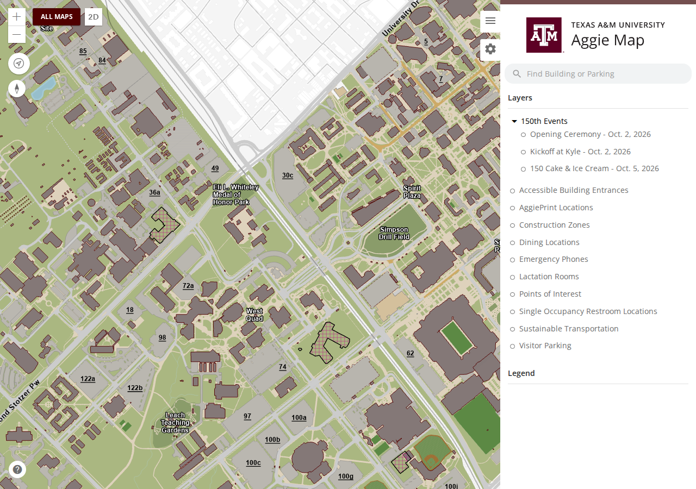

  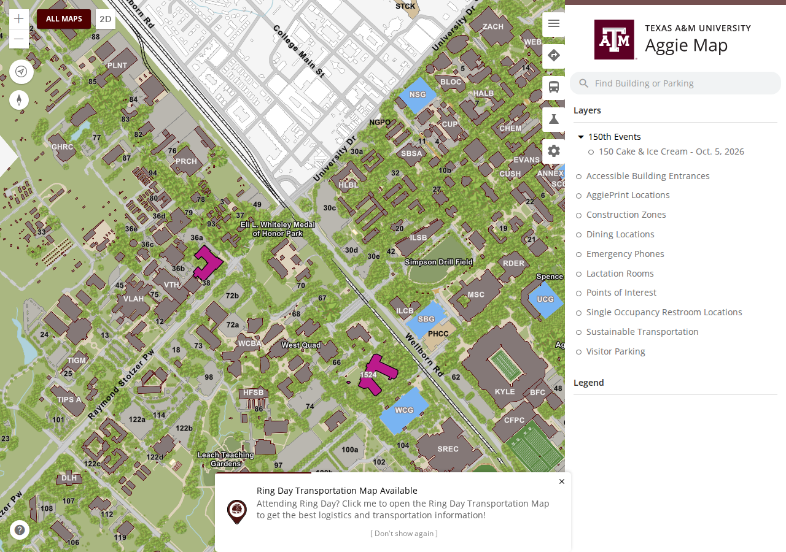

- Not visible: **NestJS 9 to 10** ([#1350](https://github.com/TamuGeoInnovation/Tamu.GeoInnovation.js.monorepo/issues/1350), pull request [#1363](https://github.com/TamuGeoInnovation/Tamu.GeoInnovation.js.monorepo/pull/1363)) for the
  NestJS APIs: GIS Day, OIDC, Mailroom, VeoRide, Geoservices and UES Operations. AggieMap and the event
  maps are Angular apps and do not change.
- Not visible: **the ArcGIS type definitions move to 4.27** ([#1322](https://github.com/TamuGeoInnovation/Tamu.GeoInnovation.js.monorepo/issues/1322), pull request
  [#1364](https://github.com/TamuGeoInnovation/Tamu.GeoInnovation.js.monorepo/pull/1364)), matching the 4.27 runtime. Nothing is meant to look different.
- **Angular 17** ([#1365](https://github.com/TamuGeoInnovation/Tamu.GeoInnovation.js.monorepo/issues/1365)): Angular 16.2 to 17.1, Nx 16.10 to 17.3, TypeScript 5.1 to
  5.3. Nothing is meant to look or behave differently; anything that does is a bug in this upgrade.
  On dev in build 20261004.4.
- **Angular 18** ([#1371](https://github.com/TamuGeoInnovation/Tamu.GeoInnovation.js.monorepo/issues/1371)): Angular 17.1 to 18.2, Nx 17.3 to 19.8, TypeScript 5.3 to
  5.5. Nothing is meant to look or behave differently. Not on dev until the build after it merges.
- **Angular 19** ([#1378](https://github.com/TamuGeoInnovation/Tamu.GeoInnovation.js.monorepo/issues/1378)): Angular 18.2 to 19.2, Nx 19.8 to 20.8, TypeScript 5.5 to
  5.7. Nothing is meant to look or behave differently. Components are now marked `standalone: false`
  explicitly, as Angular 19 makes standalone the default. Not on dev until the build after it merges.
- Not visible: **the Angular apps build with esbuild** ([#1403](https://github.com/TamuGeoInnovation/Tamu.GeoInnovation.js.monorepo/issues/1403)). All 11 move from
  Angular's webpack builder to its esbuild-based `application` builder, the default since Angular 17,
  and `nx serve` uses its Vite dev server. A cold production build of AggieMap took 18 seconds instead
  of 2 minutes 15. The built files land where they always did, in `dist/apps/<app>/`, so the Azure
  DevOps releases and the image builds need no change. The initial download is 1 to 6% smaller, split
  into more, smaller files. Nothing is meant to look or behave differently. Two things changed in code
  to get there, so watch them: the **Copy** buttons, whose library is loaded differently, and the
  link an **event map's popup** copies, which still carries the builder's choices but reads them
  another way (the old way left AggieMap blank under esbuild). Not on dev until the build after it
  merges.
- **Event maps open on the chosen day or session again** ([#1379](https://github.com/TamuGeoInnovation/Tamu.GeoInnovation.js.monorepo/issues/1379)). Since the ArcGIS
  4.27 runtime ([#1219](https://github.com/TamuGeoInnovation/Tamu.GeoInnovation.js.monorepo/issues/1219)), Ring Day, Fish Camp and Move-In opened zoomed out at the
  default campus view on dev instead of on the location their builder choice frames. Production was never
  affected: it still runs ArcGIS 4.23. A new smoke check opens each choice and checks where it lands.

  | Before (dev, Ring Day day 1) | After |
  | --- | --- |
  | 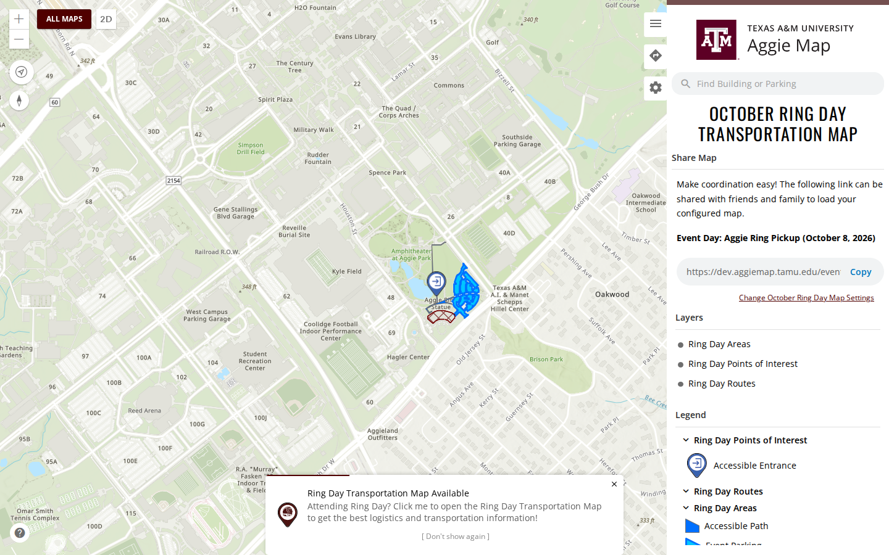 | 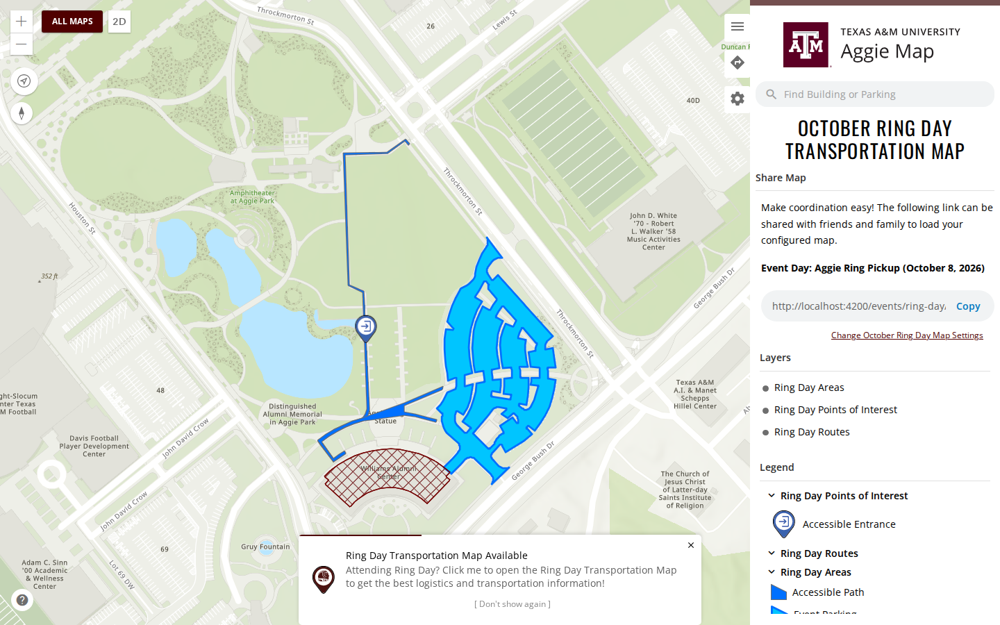 |
- **The dining kiosk map shows its dining locations** ([#1392](https://github.com/TamuGeoInnovation/Tamu.GeoInnovation.js.monorepo/issues/1392)). The
  sidebar-free dining map at [`/kiosk/dining/map`](https://aggiemap.tamu.edu/kiosk/dining/map), meant
  for embedding elsewhere, opened on the basemap with no dining locations, on dev and production. Like
  every event map it loads the main map's layers as well as its own, and both define a dining layer.
  The kiosk's setting that turned dining on reached only the main map's copy, and whichever copy loaded
  first was drawn: on most loads the kiosk's own, still hidden. Kiosk maps now load none of the main
  map's layers: the dining kiosk draws the basemap, buildings and dining locations, and nothing else,
  so parking lots, space numbers and the 150th event layers are gone from it too. Its dining layer is on
  in its own definition. On production it is reached by direct link only; All Maps lists kiosk maps on
  dev only, as before. A new smoke check opens it by link on both environments, several times, since
  the fault came and went between loads, and checks it holds no main-map layers.

  | Before (production) | After |
  | --- | --- |
  | 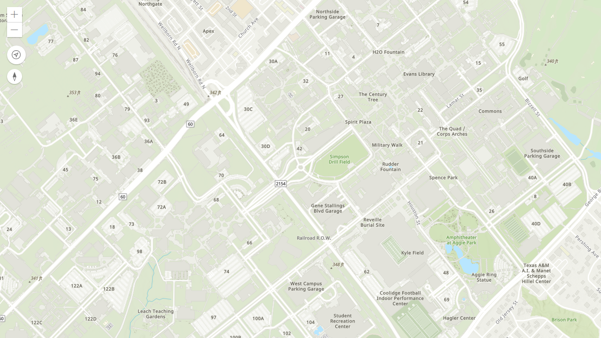 | 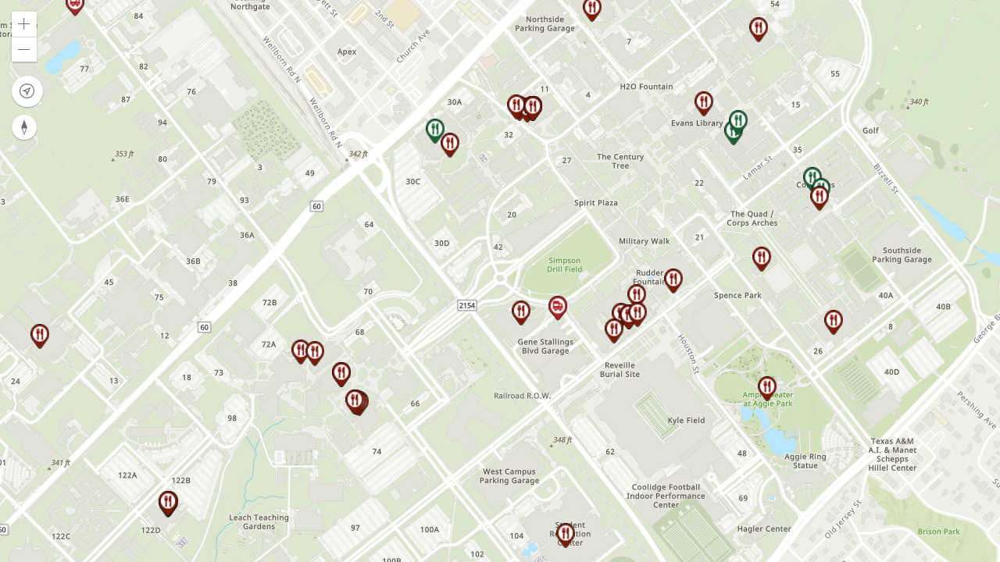 |
- **A map's layer settings stay on that map** ([#1397](https://github.com/TamuGeoInnovation/Tamu.GeoInnovation.js.monorepo/issues/1397)). Some event and kiosk maps change
  how they show a main-map layer: Break/Summer parking turns off the surface lots' popups, and the Ring Days, SEC Grounds and football hide construction.
  Those settings were kept for the whole browser tab, so going back to the main map without reloading,
  with the Back button for example, showed it with the other map's settings until the page was
  reloaded. Each map now keeps its own. A new smoke check opens the main map, moves to such a map,
  goes Back, and checks the main map is as it was.

  | Before (dev: the main map after Back from the dining kiosk) | After |
  | --- | --- |
  | 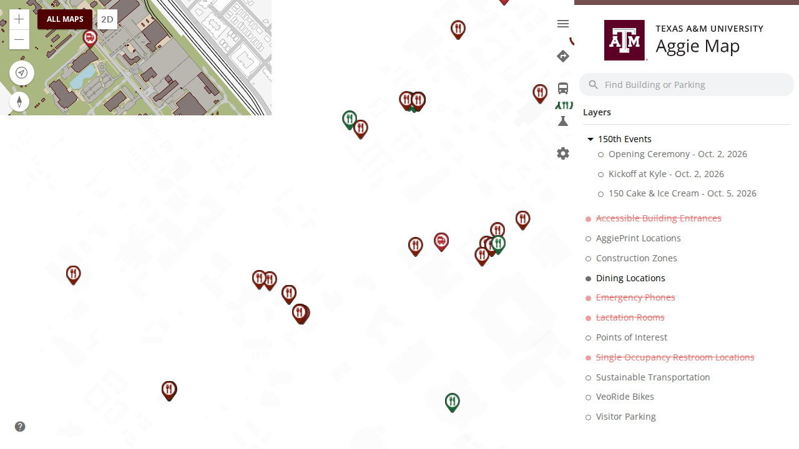 | 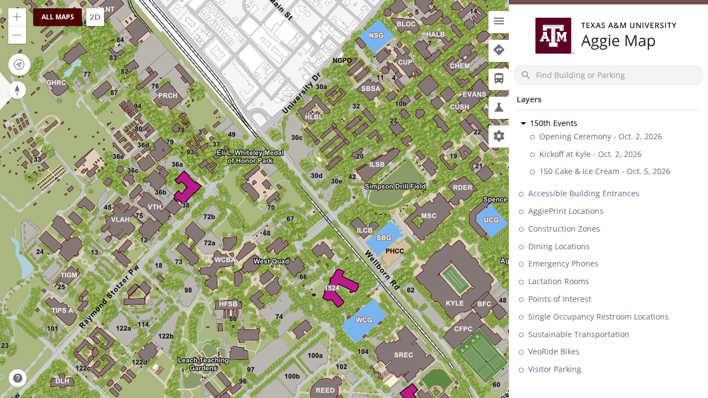 |
- **VeoRide retired** ([#1398](https://github.com/TamuGeoInnovation/Tamu.GeoInnovation.js.monorepo/issues/1398)). The **VeoRide Bikes** layer is gone from the main
  map's layer list, and from the event maps and the Ring Day app, which share its definitions. VeoRide
  was an experiment and is no longer needed. Its three applications, its library and five npm packages
  used only by them went with it, recorded first in [`docs/applications/veoride.md`](../applications/veoride.md). The
  **Sustainable Transportation** group, listed next to it, is unchanged. The API at
  `veoride.geoservices.tamu.edu` keeps running until someone decides to shut it down. With the group
  turned on, a local build still draws its bike lanes, racks and stations ([capture](../screenshots/1398-retire-veoride/after-sustainable-transportation-on-local.png)).

  | Before (dev) | After |
  | --- | --- |
  | 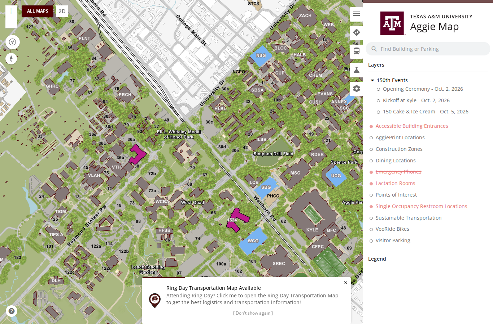 | 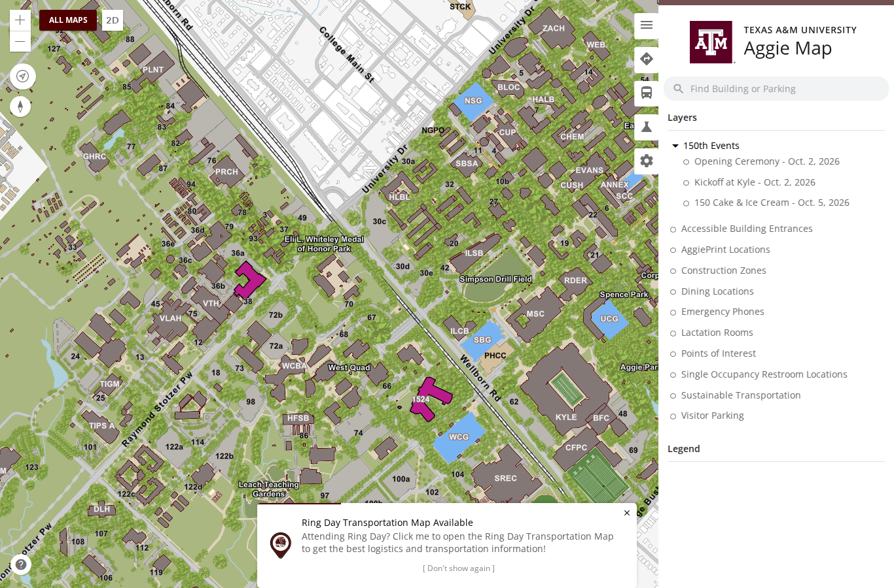 |
- **A Football Tailgating map, on dev only** ([#1422](https://github.com/TamuGeoInnovation/Tamu.GeoInnovation.js.monorepo/issues/1422), pull request
  [#1424](https://github.com/TamuGeoInnovation/Tamu.GeoInnovation.js.monorepo/pull/1424)).
  Listed under **Football** on the Athletics Events page, it shows the Aggie Park and West Campus
  tailgating zones with their circled numbers, the Revel XP tent numbers on Performance Lawn once zoomed
  in, and only the construction that affects tailgating (Aplin Center and SUP 1). After the last home
  game it says the season is over and the zones are subject to change, rather than taking the map
  down. The zones are a hosted layer in TAMU's ArcGIS Online organization with no production
  counterpart, so production does not list or open the map. Two legend fixes came with it, and apply
  to every map: a layer whose symbology was published from ArcGIS Pro no longer prints "Unsupported
  legend element type", and a layer that can be toggled but has no key of its own stays out of the
  legend.

  | Before (and production, unchanged) | After (dev) |
  | --- | --- |
  | 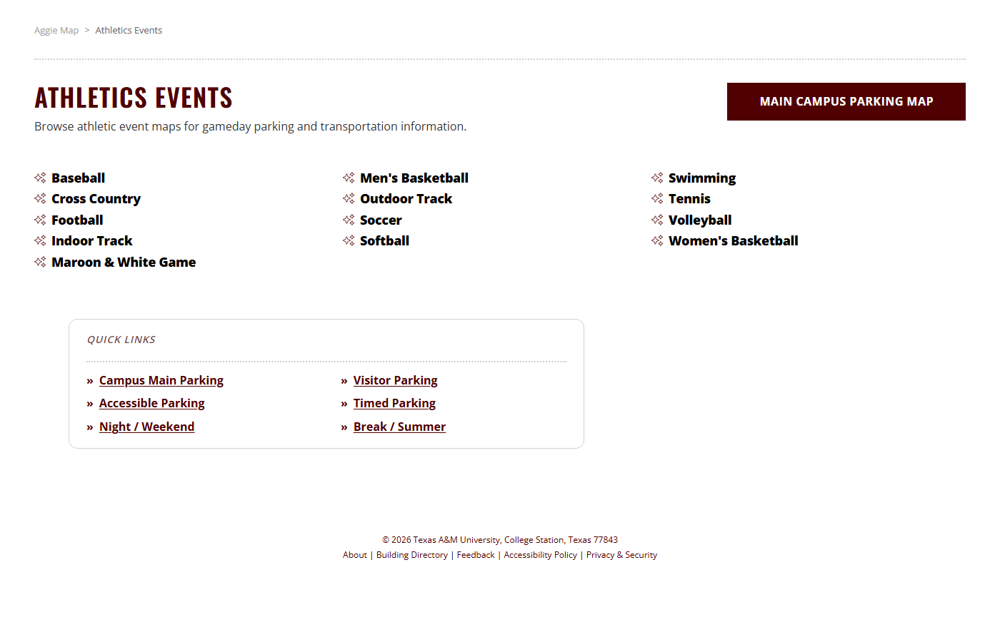 | 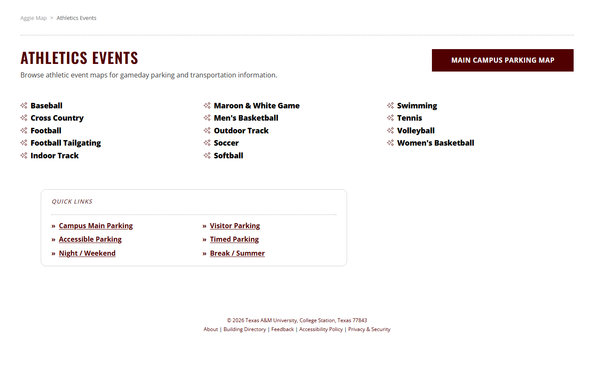 |

  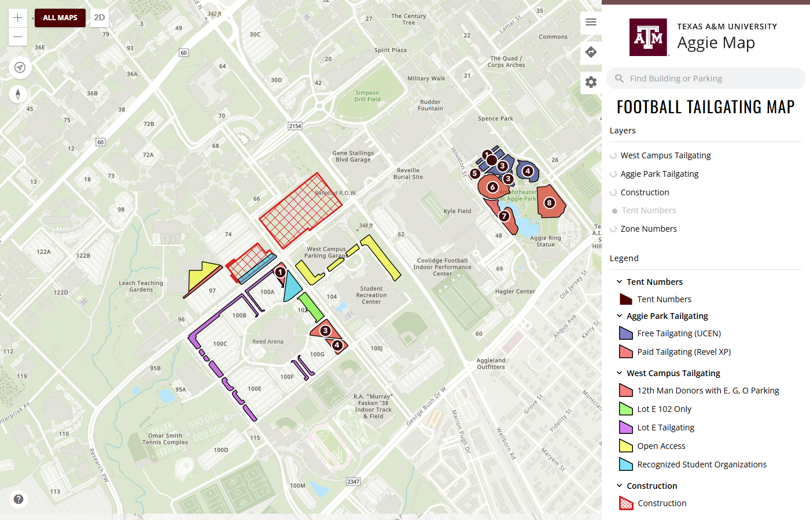

  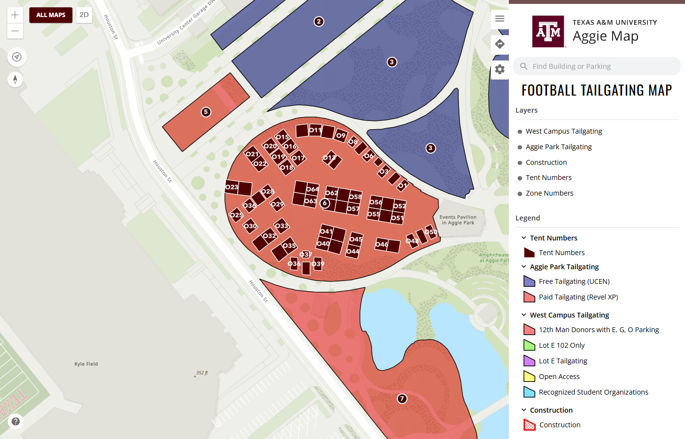

---

## What to test on dev

**The team tests these on dev before a release goes to production.** Dev is
[dev.aggiemap.tamu.edu](https://dev.aggiemap.tamu.edu). Each row is a change on dev and not yet on
production. A pull request with a visible result adds its own row; at release, the rows move into the
dated notes as what was tested, and this table empties.

**Currently on dev for testing:** Azure build **20261004.44** (`f23a992a`, the Angular 19 merge), tagged
`dev-2026-10-05`, deployed late on 4 October. It passed the full suite on 5 October: 743 passed, 0 failed,
14 skipped, in 1.9 hours. Every row below is in it.

| Change | Open this on dev | Look for |
| --- | --- | --- |
| Alerts show one at a time ([#1327](https://github.com/TamuGeoInnovation/Tamu.GeoInnovation.js.monorepo/issues/1327)) | [The main map](https://dev.aggiemap.tamu.edu/map) | the alerts in **one** card with a stepper, the most important first; stepping through them, and dismissing one, works |
| All Maps fits a phone ([#1335](https://github.com/TamuGeoInnovation/Tamu.GeoInnovation.js.monorepo/issues/1335)) | [All Maps](https://dev.aggiemap.tamu.edu/all-maps) and [Campus Maps](https://dev.aggiemap.tamu.edu/all-maps/campus) on a phone | nothing cut off at the right edge, no sideways scroll, each campus card's **Copy** button reachable |
| Angular 16 ([#1343](https://github.com/TamuGeoInnovation/Tamu.GeoInnovation.js.monorepo/issues/1343)) | Any map you use: the [main map](https://dev.aggiemap.tamu.edu/map), an [event map](https://dev.aggiemap.tamu.edu/events/150th-kickoff), [parking](https://dev.aggiemap.tamu.edu/all-maps/parking), a [campus map](https://dev.aggiemap.tamu.edu/campus/galveston) | **nothing different**: maps draw, search works, popups open, the side panel opens and closes. Anything that looks or behaves differently is a bug in this upgrade |
| ArcGIS 4.27 ([#1219](https://github.com/TamuGeoInnovation/Tamu.GeoInnovation.js.monorepo/issues/1219)) | The same maps | layers, labels and basemaps draw as before; route arrows on event maps still point the right way |
| Closing the "Report a bad route" form ([#1348](https://github.com/TamuGeoInnovation/Tamu.GeoInnovation.js.monorepo/issues/1348)) | Directions on a phone, then **Report a bad route**, then close | it returns to the directions you came from. Directions are hidden on production, so this is a dev-only check for now |
| NestJS 10 ([#1350](https://github.com/TamuGeoInnovation/Tamu.GeoInnovation.js.monorepo/issues/1350)) | Nothing on AggieMap | nothing to test on dev.aggiemap: the NestJS APIs deploy separately, so check them where each one runs |
| ArcGIS types 4.27 ([#1322](https://github.com/TamuGeoInnovation/Tamu.GeoInnovation.js.monorepo/issues/1322)) | [An event map with routes](https://dev.aggiemap.tamu.edu/events/150th-kickoff), and clicking features on the [main map](https://dev.aggiemap.tamu.edu/map) | route arrows still drawn and pointing the right way; clicking a building or lot still opens its popup |
| Angular 17 ([#1365](https://github.com/TamuGeoInnovation/Tamu.GeoInnovation.js.monorepo/issues/1365)) | Any map you use: the [main map](https://dev.aggiemap.tamu.edu/map), an [event map](https://dev.aggiemap.tamu.edu/events/150th-kickoff), [parking](https://dev.aggiemap.tamu.edu/all-maps/parking), a [campus map](https://dev.aggiemap.tamu.edu/campus/galveston), and [All Maps](https://dev.aggiemap.tamu.edu/all-maps) | **nothing different**, as for Angular 16: maps draw, search works, popups open, the side panel opens and closes, alerts step through |
| Angular 18 ([#1371](https://github.com/TamuGeoInnovation/Tamu.GeoInnovation.js.monorepo/issues/1371)) | Any map you use, [All Maps](https://dev.aggiemap.tamu.edu/all-maps), and anything that loads data: search, popups, the side panel | **nothing different**. Every app's HTTP setup changed form in this upgrade, so anything that fails to load data is the first thing to report |
| Angular 19 ([#1378](https://github.com/TamuGeoInnovation/Tamu.GeoInnovation.js.monorepo/issues/1378)) | Any map you use, [All Maps](https://dev.aggiemap.tamu.edu/all-maps), the [dining kiosk](https://dev.aggiemap.tamu.edu/kiosk/dining/map), and anything with a popup, the side panel or a builder | **nothing different**. Every component changed form in this upgrade, so a page or panel that fails to appear is the first thing to report |
| Built with esbuild ([#1403](https://github.com/TamuGeoInnovation/Tamu.GeoInnovation.js.monorepo/issues/1403)) | Any map you use, [All Maps](https://dev.aggiemap.tamu.edu/all-maps), a **Copy** button on All Maps or in a building's popup, and a popup's **Copy** link on [Ring Day, day 1](https://dev.aggiemap.tamu.edu/events/ring-day/map/d?event-day=day1) | **nothing different**: every page loads, maps draw, styles look as before. **Copy** still copies and shows its confirmation, and the Ring Day popup's link, opened in a new tab, opens day 1 on that feature, not the builder. A Copy button that does nothing is the first thing to report |
| Event maps open on the chosen day or session ([#1379](https://github.com/TamuGeoInnovation/Tamu.GeoInnovation.js.monorepo/issues/1379)) | [Ring Day, day 1](https://dev.aggiemap.tamu.edu/events/ring-day/map/d?event-day=day1), [Ring Day, day 2](https://dev.aggiemap.tamu.edu/events/ring-day/map/d?event-day=day2), [Fish Camp, sessions B, C, E and F](https://dev.aggiemap.tamu.edu/events/fish-camp/map/d?fish-camp-session=sessions-a-f), [Fish Camp, sessions A, D and G](https://dev.aggiemap.tamu.edu/events/fish-camp/map/d?fish-camp-session=session-g) | each opens **close in** on its own location (day 1 on the ring pickup by the Williams Alumni Center, day 2 on Aggie Park), not zoomed out over campus. Compare with [production](https://aggiemap.tamu.edu/events/ring-day/map/d?event-day=day1) |
| The dining kiosk shows its dining locations ([#1392](https://github.com/TamuGeoInnovation/Tamu.GeoInnovation.js.monorepo/issues/1392)) | [The dining kiosk on dev](https://dev.aggiemap.tamu.edu/kiosk/dining/map); after release, [on production](https://aggiemap.tamu.edu/kiosk/dining/map) by direct link | the dining locations drawn as markers across campus, no sidebar, and nothing else over the basemap: no parking lot shading, space numbers or 150th event layers. Reload a few times: before the fix the dining appeared on some loads only. All Maps still lists it on dev only, by design |
| A map's layer settings stay on that map ([#1397](https://github.com/TamuGeoInnovation/Tamu.GeoInnovation.js.monorepo/issues/1397)) | [The main map](https://dev.aggiemap.tamu.edu/map), then **All Maps** and the [dining kiosk](https://dev.aggiemap.tamu.edu/kiosk/dining/map) or [Break / Summer parking](https://dev.aggiemap.tamu.edu/parking/break-summer), then the browser's **Back** button | back on the main map, **Dining Locations** is off in the layer list as it is when the main map opens, and clicking a surface lot still opens its popup. Before the fix, the main map kept the other map's settings until a reload |
| VeoRide retired ([#1398](https://github.com/TamuGeoInnovation/Tamu.GeoInnovation.js.monorepo/issues/1398)) | [The main map](https://dev.aggiemap.tamu.edu/map), **Layers** | no **VeoRide Bikes** in the list; **Sustainable Transportation** still turns on and draws its bike lanes, dismount zones, fix stations, racks and EV charging stations |

**Not testable on dev in this release:** GIS Day's native date and time pickers
([#1220](https://github.com/TamuGeoInnovation/Tamu.GeoInnovation.js.monorepo/issues/1220)). GIS Day is deployed separately, not by this build, so they reach users when GIS
Day next deploys.

---

## Work in flight — 5 October

Nothing below has merged, so it is not part of a release yet. This section exists because
[`CLAUDE_SETUP.md`](../../CLAUDE_SETUP.md) sends a session on another machine here first, and an empty
file would say the work had stopped.

### The Angular upgrade ([#1218](https://github.com/TamuGeoInnovation/Tamu.GeoInnovation.js.monorepo/issues/1218)), in order

| Order | Step | State |
| --- | --- | --- |
| 1 | Remove `ngcc` ([#1220](https://github.com/TamuGeoInnovation/Tamu.GeoInnovation.js.monorepo/issues/1220)) | done |
| 2 | ArcGIS runtime off 4.23 ([#1219](https://github.com/TamuGeoInnovation/Tamu.GeoInnovation.js.monorepo/issues/1219)) | done: 4.27, in the 5 October release |
| 3 | Angular 15 to 16 ([#1343](https://github.com/TamuGeoInnovation/Tamu.GeoInnovation.js.monorepo/issues/1343)) | done, in the 5 October release |
| 4 | NestJS 9 to 10 ([#1350](https://github.com/TamuGeoInnovation/Tamu.GeoInnovation.js.monorepo/issues/1350)) | done: [#1363](https://github.com/TamuGeoInnovation/Tamu.GeoInnovation.js.monorepo/pull/1363) |
| 5 | ArcGIS type definitions 4.23 to 4.27 ([#1322](https://github.com/TamuGeoInnovation/Tamu.GeoInnovation.js.monorepo/issues/1322)) | done: [#1364](https://github.com/TamuGeoInnovation/Tamu.GeoInnovation.js.monorepo/pull/1364) |
| 6 | Angular 16 to 17 ([#1365](https://github.com/TamuGeoInnovation/Tamu.GeoInnovation.js.monorepo/issues/1365)) | done: [#1370](https://github.com/TamuGeoInnovation/Tamu.GeoInnovation.js.monorepo/pull/1370) |
| 7 | Angular 17 to 18 ([#1371](https://github.com/TamuGeoInnovation/Tamu.GeoInnovation.js.monorepo/issues/1371)) | done: [#1377](https://github.com/TamuGeoInnovation/Tamu.GeoInnovation.js.monorepo/pull/1377) |
| 8 | Node 20.18 to 22.23.3 ([#1376](https://github.com/TamuGeoInnovation/Tamu.GeoInnovation.js.monorepo/issues/1376)) | done: [#1401](https://github.com/TamuGeoInnovation/Tamu.GeoInnovation.js.monorepo/pull/1401) |
| 9 | Angular 18 to 19 ([#1378](https://github.com/TamuGeoInnovation/Tamu.GeoInnovation.js.monorepo/issues/1378)) | done: [#1406](https://github.com/TamuGeoInnovation/Tamu.GeoInnovation.js.monorepo/pull/1406). Steps 3 to 9 are all in build 20261004.44, on dev for Monday's release |
| 9b | esbuild-based `application` builder ([#1403](https://github.com/TamuGeoInnovation/Tamu.GeoInnovation.js.monorepo/issues/1403)) | ready: [#1408](https://github.com/TamuGeoInnovation/Tamu.GeoInnovation.js.monorepo/pull/1408), to merge **after** Monday's production deploy, so production ships exactly what was tested |
| 10 | Angular 19 to 22, one major per pull request | next. Forecast about 2 to 3 hours each in the new check setup ([`docs/upgrades/angular.md`](../upgrades/angular.md)) |
| 11 | `esri-loader` to `@arcgis/core`, 134 files | last |
| — | Dead projects ([#1226](https://github.com/TamuGeoInnovation/Tamu.GeoInnovation.js.monorepo/issues/1226)) | VeoRide retired ([#1404](https://github.com/TamuGeoInnovation/Tamu.GeoInnovation.js.monorepo/pull/1404)); the old Ring Day app goes after 10 October ([#1236](https://github.com/TamuGeoInnovation/Tamu.GeoInnovation.js.monorepo/issues/1236)) |

**A local `nx affected` on a `package.json` change fails on projects that already fail on
`development`.** Every project counts as affected. Measured on 2 October: `cpa-angular`,
`ues-recycling-angular`, `signage-angular`, `ues-valves-angular` and `oidc-admin-angular` fail to build
on unchanged `development` (TypeORM and NestJS typings, signage typings, a missing `secrets` file);
NestJS builds fail on missing `ormconfig` files; three NestJS projects fail stale generator specs. CI
excludes all of them. Compare against this list, not the exit code. After any dependency change, prove
the lock file with a clean `npm ci` before pushing (CLAUDE.md, [#1347](https://github.com/TamuGeoInnovation/Tamu.GeoInnovation.js.monorepo/issues/1347)).

### Also open

- **Pin CI runners to `ubuntu-24.04`** before `ubuntu-latest` moves to Ubuntu 26 on 19 October
  ([#1407](https://github.com/TamuGeoInnovation/Tamu.GeoInnovation.js.monorepo/issues/1407), low).
- **`gisday-competitions-angular`'s page never answers when served locally** ([#1410](https://github.com/TamuGeoInnovation/Tamu.GeoInnovation.js.monorepo/issues/1410), low);
  CI and Azure exclude the app.
- **Clicking a Ring Day popup throws in `TripPlannerConnectionService.connection`**, on production too
  ([#1411](https://github.com/TamuGeoInnovation/Tamu.GeoInnovation.js.monorepo/issues/1411), medium). The popup still works.
- **The map probe should report popups**, so a test can see one carried between maps ([#1400](https://github.com/TamuGeoInnovation/Tamu.GeoInnovation.js.monorepo/issues/1400),
  medium).
- **The shared flex mixins emit dead vendor prefixes** ([#1340](https://github.com/TamuGeoInnovation/Tamu.GeoInnovation.js.monorepo/issues/1340), low priority), which makes
  reused CSS larger than hand-written.
- **Angular 16's parallel Sass compilation failed once on Azure** with "This file is already being
  loaded", on stylesheets that built cleanly before and since. If it recurs, it becomes its own issue.

### Also open from 1 and 2 October

- **Code Maroon needs an IIS proxy for its feed.** Dev reads a saved copy of the feed until then
  ([#1304](https://github.com/TamuGeoInnovation/Tamu.GeoInnovation.js.monorepo/issues/1304), in the 2 October release). The fix is an IIS URL Rewrite and ARR rule
  with server-side caching, for dev only, to be arranged with the team that manages the server; the
  saved copy is removed once it is in place.
- **The browser console's build banner prints `___BUILD_DATE___` and the other placeholders** instead
  of the build's details ([#1306](https://github.com/TamuGeoInnovation/Tamu.GeoInnovation.js.monorepo/issues/1306), low priority).
- **The old standalone Ring Day app** is removed after Ring Day, 8 to 10 October
  ([#1236](https://github.com/TamuGeoInnovation/Tamu.GeoInnovation.js.monorepo/issues/1236)). The old Move-In app's deployed copy at `/movein/` still needs deleting
  ([#1235](https://github.com/TamuGeoInnovation/Tamu.GeoInnovation.js.monorepo/issues/1235)).
- **Every map's starting center and zoom** to be checked against its data ([#1231](https://github.com/TamuGeoInnovation/Tamu.GeoInnovation.js.monorepo/issues/1231)).
- **Signage does not build from its current source** ([#1226](https://github.com/TamuGeoInnovation/Tamu.GeoInnovation.js.monorepo/issues/1226)).

### Waiting on someone else

**Bus route stops are a data fix, not a code fix
([#1174](https://github.com/TamuGeoInnovation/Tamu.GeoInnovation.js.monorepo/issues/1174)).** Five
routes draw no stops — NW0104, NW0305, NW4041, 15R and 47/48 — and two draw the wrong number: 40 has
one extra, 47 two missing. The map matches each stop's `Route` field in the Bus Stops layer
(`TS/Bus_Routes/MapServer/0`) against the route code, and no stop carries those codes. The side panel
still lists their stops, because that comes from separate text fields.

**Megan maintains the bus data.** `bus.spec.ts` records the seven as known failures for dev, so the
nightly run shows each one going green as its data is corrected. Production deliberately has no
entries, so the test holds any bus release until the data is right.

### Read this first if you are picking up elsewhere

**726 screenshots exist only on the work machine.** They are in `test/visual/baselines/builder/`,
untracked and deliberately uncommitted — 363 builder destinations at two viewports, 325MB. They are
the output of a two-hour crawl against dev and can be regenerated with:

```bash
AGGIEMAP_SMOKE_BASE_URL=https://dev.aggiemap.tamu.edu BUILDER_INVENTORY_SHOTS=/some/dir \
  npx playwright test --config=tools/builder-inventory/playwright.config.ts
```

The capture resumes rather than restarts, so an interrupted run costs only what it had not reached.

They are uncommitted on purpose: at 325MB they would more than triple a 153MB repository,
permanently, since git keeps every version. Where they should live is
[#1107](https://github.com/TamuGeoInnovation/Tamu.GeoInnovation.js.monorepo/issues/1107).

### A lesson from this release worth keeping

**A red smoke run is not automatically a code fault.** On the morning of 30 September the scheduled
run was red on both environments: 57 failures on production, one on dev. Every one of them was the
new tests running against builds that predated them — neither environment had been redeployed since
the 29 September release. Checking the deployed bundle settled it in minutes; debugging the
application would have wasted the morning.

Until a build can say which commit it came from
([#1148](https://github.com/TamuGeoInnovation/Tamu.GeoInnovation.js.monorepo/issues/1148)), the smoke
suite tests a URL and cannot know what it verified, so this can happen after any merge that is not
promptly deployed.

### The decision waiting to be made

**[#1107](https://github.com/TamuGeoInnovation/Tamu.GeoInnovation.js.monorepo/issues/1107) — evaluate
Visual Regression Tracker on the cluster** as the home for baseline images, with
[#1119](https://github.com/TamuGeoInnovation/Tamu.GeoInnovation.js.monorepo/issues/1119) to stand it
up. Phase 0 is five decisions that need no VPN: hostname, TLS issuer, image storage, PVC size, and who
can log in.

The contained test is in #1107: stand VRT up, point the existing capture at `gameday-parking`'s 14
destinations, and find out whether its Playwright agent — about two years stale, while the server is
current — still works before migrating 726 images.

### Open, none started

| Issue | |
| --- | --- |
| [#1079](https://github.com/TamuGeoInnovation/Tamu.GeoInnovation.js.monorepo/issues/1079) | Visual baselines are stale against dev, and there is one set for all environments |
| [#1082](https://github.com/TamuGeoInnovation/Tamu.GeoInnovation.js.monorepo/issues/1082) | All Maps scrolls sideways on a phone: a copy field with an unbreakable URL widens its card |
| [#1089](https://github.com/TamuGeoInnovation/Tamu.GeoInnovation.js.monorepo/issues/1089) | Full visual suite: a screenshot of every page, including builder paths |
| [#1090](https://github.com/TamuGeoInnovation/Tamu.GeoInnovation.js.monorepo/issues/1090) | Nothing asserts development-only sections stay off production |
| [#1091](https://github.com/TamuGeoInnovation/Tamu.GeoInnovation.js.monorepo/issues/1091) | Layer toggle round-trip: prove a layer returns the map to its original state |
| [#1097](https://github.com/TamuGeoInnovation/Tamu.GeoInnovation.js.monorepo/issues/1097) | Two 2025 events still registered on dev |
| [#1099](https://github.com/TamuGeoInnovation/Tamu.GeoInnovation.js.monorepo/issues/1099) | Ring Day naming: October holds the generic `/events/ring-day` id |
| [#1101](https://github.com/TamuGeoInnovation/Tamu.GeoInnovation.js.monorepo/issues/1101) | Inventory every GIS service, with dev and prod URLs and which maps use them |
| [#1102](https://github.com/TamuGeoInnovation/Tamu.GeoInnovation.js.monorepo/issues/1102) | Dev is hardcoded to the production transportation GIS host by a `TEMP` |
| [#1103](https://github.com/TamuGeoInnovation/Tamu.GeoInnovation.js.monorepo/issues/1103) | No test that a past event shows the "this event has passed" warning |
| [#1104](https://github.com/TamuGeoInnovation/Tamu.GeoInnovation.js.monorepo/issues/1104) | Define an emergency test tier for urgent deploys |
| [#1105](https://github.com/TamuGeoInnovation/Tamu.GeoInnovation.js.monorepo/issues/1105) | Map captures are not byte-reproducible; page captures are |
| [#1123](https://github.com/TamuGeoInnovation/Tamu.GeoInnovation.js.monorepo/issues/1123) | Two unused football entries point at stopped services |
| [#1134](https://github.com/TamuGeoInnovation/Tamu.GeoInnovation.js.monorepo/issues/1134) | Test production's builder-gated maps using the builder inventory |
| [#1137](https://github.com/TamuGeoInnovation/Tamu.GeoInnovation.js.monorepo/issues/1137) | Run a frequent scheduled subset of map function checks and alert on failure |
| [#1140](https://github.com/TamuGeoInnovation/Tamu.GeoInnovation.js.monorepo/issues/1140) | Field names differ between three maps in the latest service data |
| [#1144](https://github.com/TamuGeoInnovation/Tamu.GeoInnovation.js.monorepo/issues/1144) | Release process: which of the remaining options to adopt |
| [#1146](https://github.com/TamuGeoInnovation/Tamu.GeoInnovation.js.monorepo/issues/1146) | Professionalization sweep |
| [#1148](https://github.com/TamuGeoInnovation/Tamu.GeoInnovation.js.monorepo/issues/1148) | A deployed build cannot say which commit it came from |
| [#1156](https://github.com/TamuGeoInnovation/Tamu.GeoInnovation.js.monorepo/issues/1156) | Decide whether to turn Claude's auto memory off, as the C# repository did |
| [#1159](https://github.com/TamuGeoInnovation/Tamu.GeoInnovation.js.monorepo/issues/1159) | Test that every map's side panel tabs open and close |
| [#1160](https://github.com/TamuGeoInnovation/Tamu.GeoInnovation.js.monorepo/issues/1160) | Test that the items inside every map's side panel open and close |
| [#1161](https://github.com/TamuGeoInnovation/Tamu.GeoInnovation.js.monorepo/issues/1161) | Test that an upcoming event's toast appears, opens its map, and stays dismissed |
| [#1169](https://github.com/TamuGeoInnovation/Tamu.GeoInnovation.js.monorepo/issues/1169) | Drive directions' visitor parking query uses a column that no longer exists |
| [#1173](https://github.com/TamuGeoInnovation/Tamu.GeoInnovation.js.monorepo/issues/1173) | Every popup offers a copy link that reopens that map and feature, through shared code |
| [#1174](https://github.com/TamuGeoInnovation/Tamu.GeoInnovation.js.monorepo/issues/1174) | Five bus routes draw no stops (waiting on the data) |

### Worth knowing before touching the visual work

- **Page captures are byte-identical across runs; map captures are not.** Measured three times each.
  So hash comparison works for pages and cannot work for maps, which need pixel tolerance
  ([#1105](https://github.com/TamuGeoInnovation/Tamu.GeoInnovation.js.monorepo/issues/1105)).
- **A local dev server must be reached at `http://localhost:4200`, not `127.0.0.1`.** `TestingService`
  keys on the host containing `dev` or `localhost`, so `127.0.0.1` renders the *production* variant.
  That is deliberate and useful — it is the `local-production` test environment, and the way to capture
  production behaviour before deploying — but it is not what you want for everyday work.
- **The builder inventory is environment-specific** and the smoke suite refuses one captured
  elsewhere. Production has no inventory yet, so its builder maps still skip
  ([#1134](https://github.com/TamuGeoInnovation/Tamu.GeoInnovation.js.monorepo/issues/1134)).
