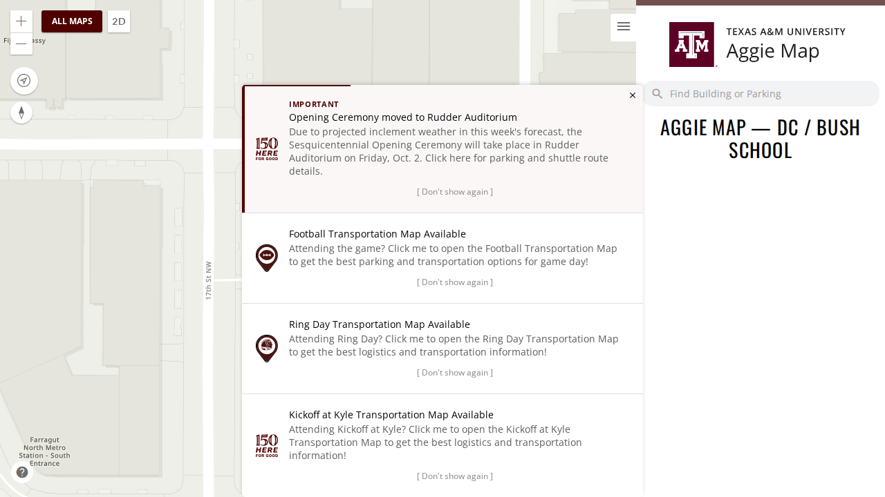
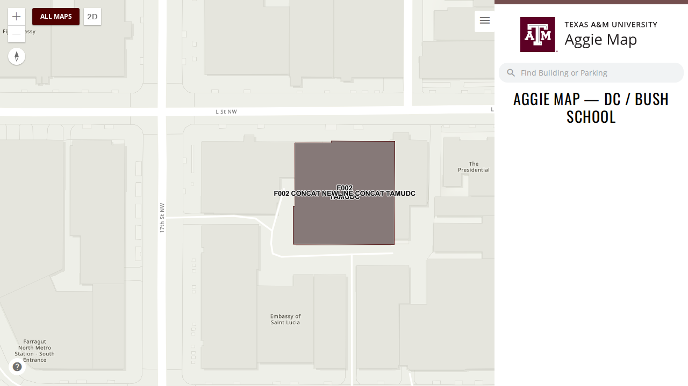

# Unreleased

> **Not on production.** This file collects what has merged since the last production release. Each
> entry says where it can be seen.

**The [1 October release](2026-10-01.md) is cleared and on its way to production.**

If you followed a link here expecting the notes for a release that just shipped, they are in a dated
file now — the Ring Day framing, the basemap loading indicator, the development-only vector tile
basemap and the dead-project removal in [1 October](2026-10-01.md). Those files are the permanent record of what shipped; this one
only ever describes what has not shipped yet.

---

## Summary

### Campus maps no longer flash College Station's notices

**[#1281](https://github.com/TamuGeoInnovation/Tamu.GeoInnovation.js.monorepo/issues/1281).** Opening
the DC, Galveston or McAllen campus map directly, from a link or a bookmark, showed College Station's
notices (the Opening Ceremony, Football, Ring Day and Kickoff at Kyle) for the map's first ten seconds.
Clicking the map in that time could open the Football map instead. Campus maps now show none of them.
[#1266](https://github.com/TamuGeoInnovation/Tamu.GeoInnovation.js.monorepo/pull/1266) had fixed this
only for someone arriving from another page.

| Before | After |
| --- | --- |
|  |  |

**What to test:** open [the DC campus map](https://dev.aggiemap.tamu.edu/campus/dc-bush-school) in a
new tab and watch it for ten seconds. No notices should appear. The same goes for
[Galveston](https://dev.aggiemap.tamu.edu/campus/galveston) and
[McAllen](https://dev.aggiemap.tamu.edu/campus/mcallen). The main map should still show them.

---

## Work in flight — 1 October

Nothing below has merged, so it is not part of a release yet. This section exists because
[`CLAUDE_SETUP.md`](../../CLAUDE_SETUP.md) sends a session on another machine here first, and an empty
file would say the work had stopped.

### Waiting on someone else

**Bus route stops are a data fix, not a code fix
([#1174](https://github.com/TamuGeoInnovation/Tamu.GeoInnovation.js.monorepo/issues/1174)).** Five
routes draw no stops — NW0104, NW0305, NW4041, 15R and 47/48 — and two draw the wrong number: 40 has
one extra, 47 two missing. The map matches each stop's `Route` field in the Bus Stops layer
(`TS/Bus_Routes/MapServer/0`) against the route code, and no stop carries those codes. The side panel
still lists their stops, because that comes from separate text fields.

**Megan maintains the bus data.** `bus.spec.ts` records the seven as known failures for dev, so the
nightly run shows each one going green as its data is corrected. Production deliberately has no
entries, so the test holds any bus release until the data is right.

### Read this first if you are picking up elsewhere

**726 screenshots exist only on the work machine.** They are in `test/visual/baselines/builder/`,
untracked and deliberately uncommitted — 363 builder destinations at two viewports, 325MB. They are
the output of a two-hour crawl against dev and can be regenerated with:

```bash
AGGIEMAP_SMOKE_BASE_URL=https://dev.aggiemap.tamu.edu BUILDER_INVENTORY_SHOTS=/some/dir \
  npx playwright test --config=tools/builder-inventory/playwright.config.ts
```

The capture resumes rather than restarts, so an interrupted run costs only what it had not reached.

They are uncommitted on purpose: at 325MB they would more than triple a 153MB repository,
permanently, since git keeps every version. Where they should live is
[#1107](https://github.com/TamuGeoInnovation/Tamu.GeoInnovation.js.monorepo/issues/1107).

### A lesson from this release worth keeping

**A red smoke run is not automatically a code fault.** On the morning of 30 September the scheduled
run was red on both environments: 57 failures on production, one on dev. Every one of them was the
new tests running against builds that predated them — neither environment had been redeployed since
the 29 September release. Checking the deployed bundle settled it in minutes; debugging the
application would have wasted the morning.

Until a build can say which commit it came from
([#1148](https://github.com/TamuGeoInnovation/Tamu.GeoInnovation.js.monorepo/issues/1148)), the smoke
suite tests a URL and cannot know what it verified, so this can happen after any merge that is not
promptly deployed.

### The decision waiting to be made

**[#1107](https://github.com/TamuGeoInnovation/Tamu.GeoInnovation.js.monorepo/issues/1107) — evaluate
Visual Regression Tracker on the cluster** as the home for baseline images, with
[#1119](https://github.com/TamuGeoInnovation/Tamu.GeoInnovation.js.monorepo/issues/1119) to stand it
up. Phase 0 is five decisions that need no VPN: hostname, TLS issuer, image storage, PVC size, and who
can log in.

The contained test is in #1107: stand VRT up, point the existing capture at `gameday-parking`'s 14
destinations, and find out whether its Playwright agent — about two years stale, while the server is
current — still works before migrating 726 images.

### Open, none started

| Issue | |
| --- | --- |
| [#1079](https://github.com/TamuGeoInnovation/Tamu.GeoInnovation.js.monorepo/issues/1079) | Visual baselines are stale against dev, and there is one set for all environments |
| [#1082](https://github.com/TamuGeoInnovation/Tamu.GeoInnovation.js.monorepo/issues/1082) | All Maps scrolls sideways on a phone: a copy field with an unbreakable URL widens its card |
| [#1089](https://github.com/TamuGeoInnovation/Tamu.GeoInnovation.js.monorepo/issues/1089) | Full visual suite: a screenshot of every page, including builder paths |
| [#1090](https://github.com/TamuGeoInnovation/Tamu.GeoInnovation.js.monorepo/issues/1090) | Nothing asserts development-only sections stay off production |
| [#1091](https://github.com/TamuGeoInnovation/Tamu.GeoInnovation.js.monorepo/issues/1091) | Layer toggle round-trip: prove a layer returns the map to its original state |
| [#1097](https://github.com/TamuGeoInnovation/Tamu.GeoInnovation.js.monorepo/issues/1097) | Two 2025 events still registered on dev |
| [#1099](https://github.com/TamuGeoInnovation/Tamu.GeoInnovation.js.monorepo/issues/1099) | Ring Day naming: October holds the generic `/events/ring-day` id |
| [#1101](https://github.com/TamuGeoInnovation/Tamu.GeoInnovation.js.monorepo/issues/1101) | Inventory every GIS service, with dev and prod URLs and which maps use them |
| [#1102](https://github.com/TamuGeoInnovation/Tamu.GeoInnovation.js.monorepo/issues/1102) | Dev is hardcoded to the production transportation GIS host by a `TEMP` |
| [#1103](https://github.com/TamuGeoInnovation/Tamu.GeoInnovation.js.monorepo/issues/1103) | No test that a past event shows the "this event has passed" warning |
| [#1104](https://github.com/TamuGeoInnovation/Tamu.GeoInnovation.js.monorepo/issues/1104) | Define an emergency test tier for urgent deploys |
| [#1105](https://github.com/TamuGeoInnovation/Tamu.GeoInnovation.js.monorepo/issues/1105) | Map captures are not byte-reproducible; page captures are |
| [#1123](https://github.com/TamuGeoInnovation/Tamu.GeoInnovation.js.monorepo/issues/1123) | Two unused football entries point at stopped services |
| [#1134](https://github.com/TamuGeoInnovation/Tamu.GeoInnovation.js.monorepo/issues/1134) | Test production's builder-gated maps using the builder inventory |
| [#1137](https://github.com/TamuGeoInnovation/Tamu.GeoInnovation.js.monorepo/issues/1137) | Run a frequent scheduled subset of map function checks and alert on failure |
| [#1140](https://github.com/TamuGeoInnovation/Tamu.GeoInnovation.js.monorepo/issues/1140) | Field names differ between three maps in the latest service data |
| [#1144](https://github.com/TamuGeoInnovation/Tamu.GeoInnovation.js.monorepo/issues/1144) | Release process: which of the remaining options to adopt |
| [#1146](https://github.com/TamuGeoInnovation/Tamu.GeoInnovation.js.monorepo/issues/1146) | Professionalization sweep |
| [#1148](https://github.com/TamuGeoInnovation/Tamu.GeoInnovation.js.monorepo/issues/1148) | A deployed build cannot say which commit it came from |
| [#1156](https://github.com/TamuGeoInnovation/Tamu.GeoInnovation.js.monorepo/issues/1156) | Decide whether to turn Claude's auto memory off, as the C# repository did |
| [#1159](https://github.com/TamuGeoInnovation/Tamu.GeoInnovation.js.monorepo/issues/1159) | Test that every map's side panel tabs open and close |
| [#1160](https://github.com/TamuGeoInnovation/Tamu.GeoInnovation.js.monorepo/issues/1160) | Test that the items inside every map's side panel open and close |
| [#1161](https://github.com/TamuGeoInnovation/Tamu.GeoInnovation.js.monorepo/issues/1161) | Test that an upcoming event's toast appears, opens its map, and stays dismissed |
| [#1169](https://github.com/TamuGeoInnovation/Tamu.GeoInnovation.js.monorepo/issues/1169) | Drive directions' visitor parking query uses a column that no longer exists |
| [#1173](https://github.com/TamuGeoInnovation/Tamu.GeoInnovation.js.monorepo/issues/1173) | Every popup offers a copy link that reopens that map and feature, through shared code |
| [#1174](https://github.com/TamuGeoInnovation/Tamu.GeoInnovation.js.monorepo/issues/1174) | Five bus routes draw no stops (waiting on the data) |

### Worth knowing before touching the visual work

- **Page captures are byte-identical across runs; map captures are not.** Measured three times each.
  So hash comparison works for pages and cannot work for maps, which need pixel tolerance
  ([#1105](https://github.com/TamuGeoInnovation/Tamu.GeoInnovation.js.monorepo/issues/1105)).
- **A local dev server must be reached at `http://localhost:4200`, not `127.0.0.1`.** `TestingService`
  keys on the host containing `dev` or `localhost`, so `127.0.0.1` renders the *production* variant.
  That is deliberate and useful — it is the `local-production` test environment, and the way to capture
  production behaviour before deploying — but it is not what you want for everyday work.
- **The builder inventory is environment-specific** and the smoke suite refuses one captured
  elsewhere. Production has no inventory yet, so its builder maps still skip
  ([#1134](https://github.com/TamuGeoInnovation/Tamu.GeoInnovation.js.monorepo/issues/1134)).
