# Unreleased

> **Not on production.** This file collects what has merged since the last production release. Each
> entry says where it can be seen.

**On production: the [2 October release](2026-10-02.md)**, tagged `prod-2026-10-02`.

**On dev, being tested: the [5 October release](2026-10-05.md)**, which takes the maps from Angular 15
to 19 on Node 22, built with esbuild, and brings NestJS 10 and ArcGIS 4.27. Its notes are written and
it passed the full suite, but it is **not on production yet**: the team tests it on dev first, and it
is planned for production on Monday 5 October. The `prod-*` tag, not this file, will record when it
ships.

**If you followed a link here** expecting the notes for a release that just shipped, they are in those
dated files now. Everything that was listed here, including the Angular 16 release first written up for
3 October, is in the [5 October release](2026-10-05.md), which is named for the day it is planned to
reach production. Those files are the permanent record of what shipped; this one only ever describes
what has not shipped yet.

---

## Summary

- **Upcoming Events shows the next date, not a range** ([#1443](https://github.com/TamuGeoInnovation/Tamu.GeoInnovation.js.monorepo/issues/1443)): a repeat event showed every date it spans, so Soccer
  read "Dates: 8/5/2026 - 11/1/2026" - a three-month span where a visitor wanted to know when the next
  one is. Each card now reads "Next:" and one date, chosen the same way the list itself is ordered.

  | Before | After |
  | --- | --- |
  | 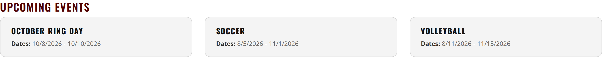 | 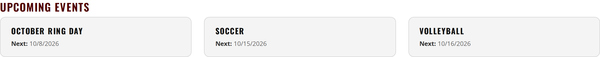 |
- **The campus maps are live on production** ([#1482](https://github.com/TamuGeoInnovation/Tamu.GeoInnovation.js.monorepo/issues/1482)): Galveston, McAllen and the DC / Bush School have been
  reachable in production by direct URL all along, but nothing there linked to them, so to everyone
  else they did not exist. The **Campus Maps** section on All Maps and the **Campus Maps** tile in
  Visit Maps now appear on production as well as dev.

  They stay out of the All Maps search, deliberately and on both environments: that search is College
  Station's, and a Galveston building answering a search made there would be a worse result than no
  result. The section and the tile are how these maps are reached, which is why each card carries a
  copy field. No service work was needed - all six campus services are the production ones in both
  environments, confirmed by loading each map on production and finding no request to a development
  host.

  | Before (production) | After (production) |
  | --- | --- |
  | 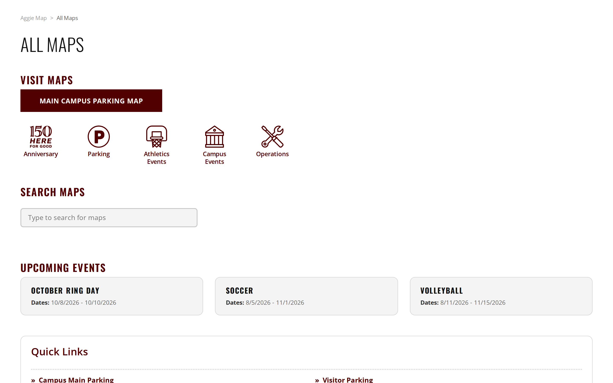 | 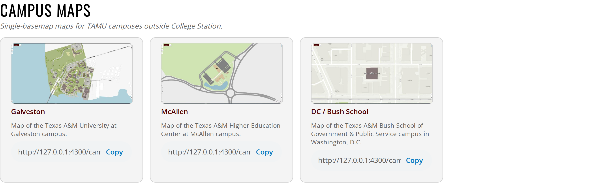 |
- **Campus building links are readable** ([#1481](https://github.com/TamuGeoInnovation/Tamu.GeoInnovation.js.monorepo/issues/1481)): the copy button on a Galveston, McAllen or DC / Bush School
  building popup produced `?feature=galveston-buildings-layer:3` - nothing a person could read, and
  keyed on an ArcGIS object id that is not stable when the service is republished, so a link shared
  today could come to point at a different building. It now copies `?bldg=3010`, or `?abbrv=OCNG` for a
  building with no number, the same shape the main map has always used. Links of the old form still
  open, so anything already shared keeps working.

  | Before | After |
  | --- | --- |
  |  | 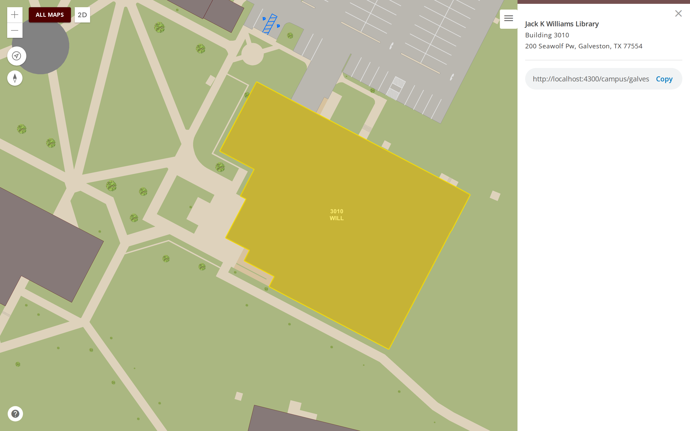 |
- **Football micromobility follows its services again** ([#996](https://github.com/TamuGeoInnovation/Tamu.GeoInnovation.js.monorepo/issues/996)): Transportation added an **Entry Routes** layer to
  the entry service and removed its bike lane markings, and nothing on the map read the new layer - so
  a cyclist arriving at the game was shown where to park and where to dismount and no way to reach
  either. The entry map had no route layer at all. Entry Routes now draw, the five layers are listed in
  the order the services publish them rather than alphabetically, and both route layers draw the
  symbology the service publishes instead of a colour held in our code.

  | Before (entry) | After (entry) |
  | --- | --- |
  | 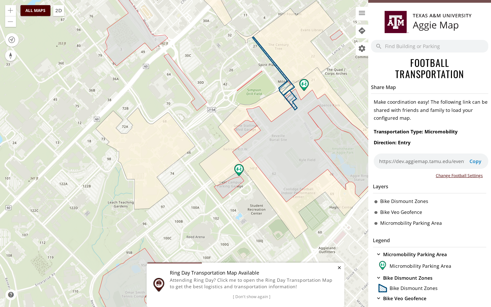 | 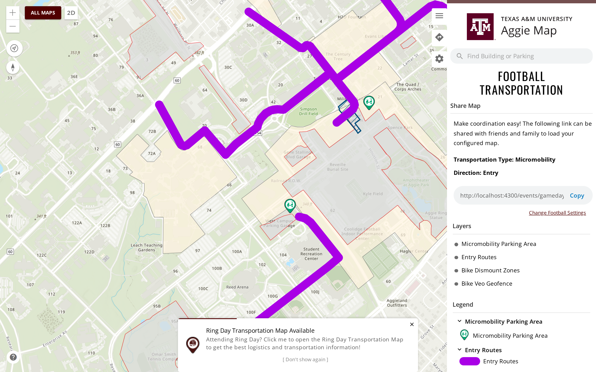 |
  | 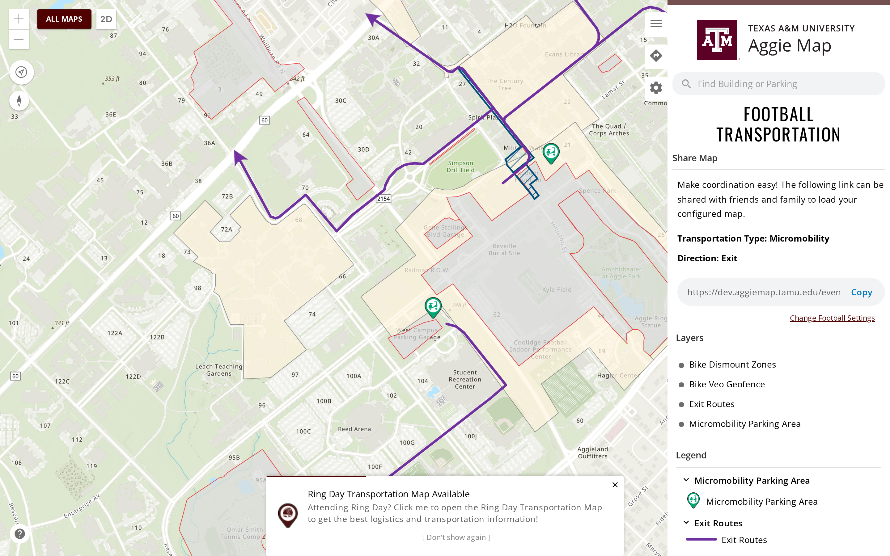 | 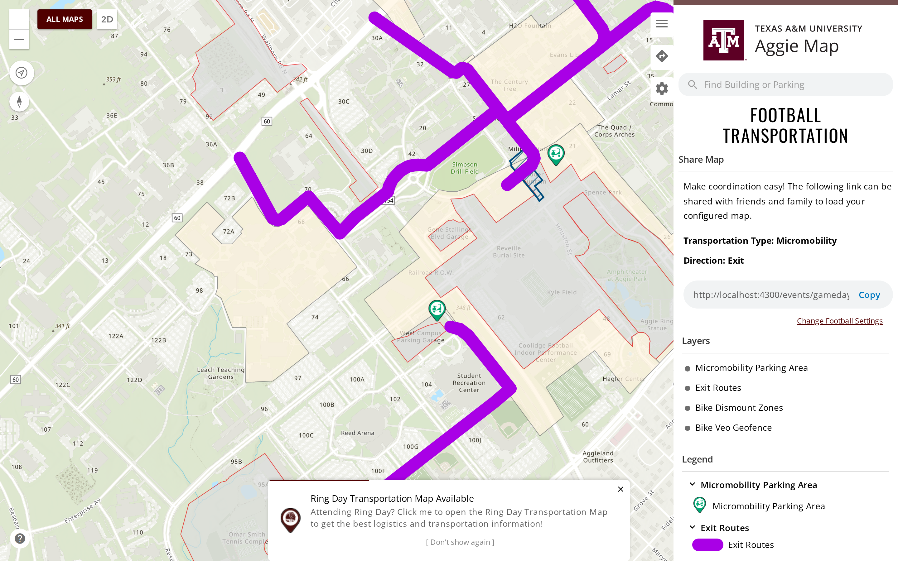 |
- **Satellite campus building popups** ([#1463](https://github.com/TamuGeoInnovation/Tamu.GeoInnovation.js.monorepo/issues/1463)): clicking or searching for a building on the
  Galveston, McAllen and DC / Bush School maps now shows a popup like the main map's. It gives the building's
  name, its number, its address where the campus publishes one, and a link to copy that reopens the
  building. Before, it showed a raw table of every database field. This was the last thing holding the
  campus maps back from production.

  | Before | After |
  | --- | --- |
  | 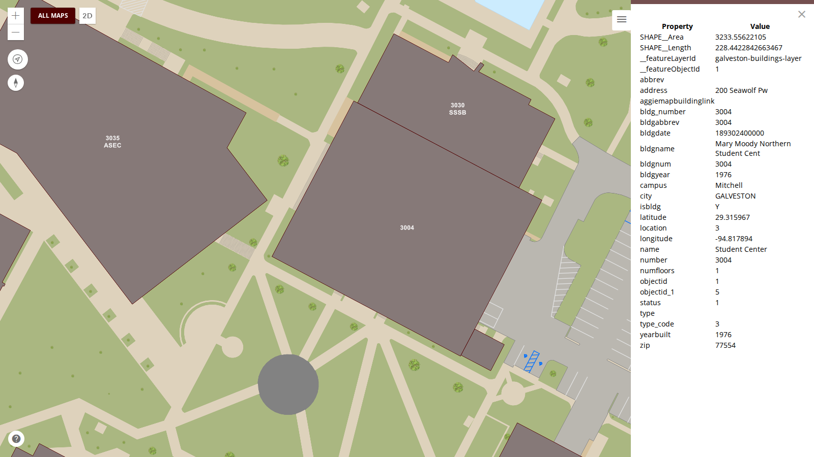 |  |
  | 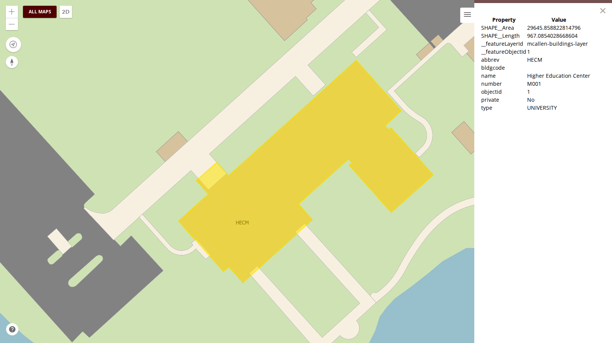 | 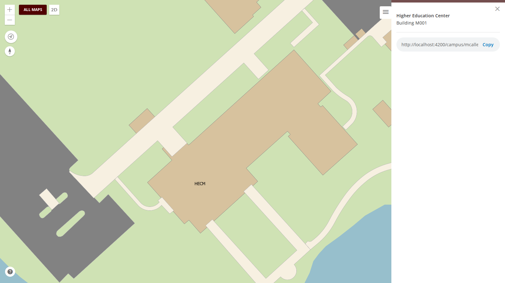 |
  | 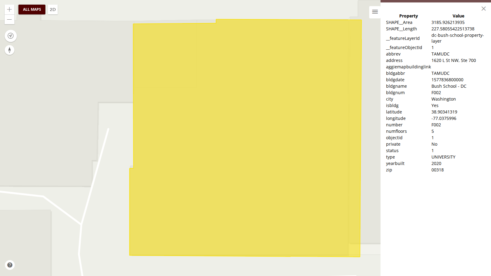 | 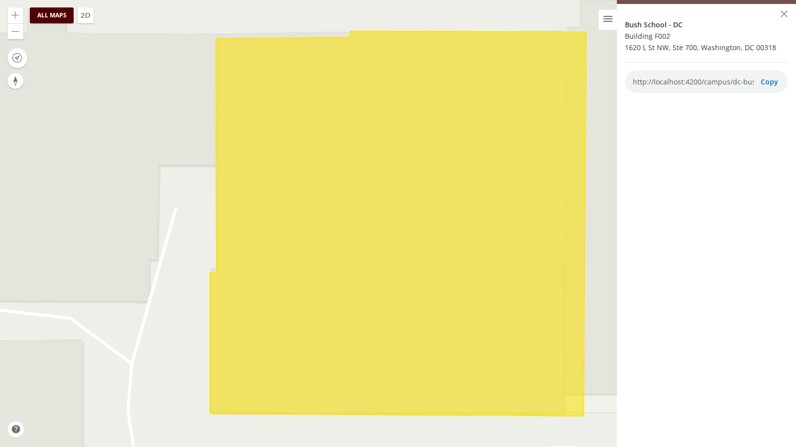 |
- Not visible: **Angular 22** ([#1469](https://github.com/TamuGeoInnovation/Tamu.GeoInnovation.js.monorepo/issues/1469)): Angular 21.2 to 22.1, Nx 22.7 to 23.2, TypeScript 5.9
  to 6.0, ESLint 8 to 9. The last of the version steps. Nothing is meant to look or behave differently.
  Angular 22 makes components update only on input changes by default; a migration marked every
  existing component to keep updating as today, so **a panel or list that stops refreshing** is the
  first thing to report. The **popups** (map and mobile) and the **trip planner's parking and biking
  options** are now created differently, because the API they used is gone. Not on dev until the build
  after it merges.
- Not visible: **Angular 21** ([#1456](https://github.com/TamuGeoInnovation/Tamu.GeoInnovation.js.monorepo/issues/1456)): Angular 20.3 to 21.2, Nx 21.6 to 22.7, Jest 29 to 30.
  Nothing is meant to look or behave differently. The changes most likely to show are in **clicks and
  keys handled by shared components** (accordions, tooltips, the side panel's tabs, the mobile tiles and
  menu, Escape to close a popup or modal), whose handlers were adjusted for Angular 21's stricter
  checking, and the **copy button**, whose clipboard library is now imported differently. Not on dev
  until the build after it merges.
- Not visible: **Angular 20** ([#1447](https://github.com/TamuGeoInnovation/Tamu.GeoInnovation.js.monorepo/issues/1447)): Angular 19.2 to 20.3, Nx 20.8 to 21.6,
  TypeScript 5.7 to 5.9, with Prettier 3 ([#1448](https://github.com/TamuGeoInnovation/Tamu.GeoInnovation.js.monorepo/issues/1448)). Nothing is meant to look or behave
  differently, but **most templates changed form**: Angular's migration rewrote `*ngIf` and `*ngFor` as
  its built-in `@if` and `@for` blocks. A panel, list or button that fails to appear is the first thing
  to report. Not on dev until the build after it merges.
- **A Football Tailgating map, on dev only** ([#1422](https://github.com/TamuGeoInnovation/Tamu.GeoInnovation.js.monorepo/issues/1422), pull request
  [#1424](https://github.com/TamuGeoInnovation/Tamu.GeoInnovation.js.monorepo/pull/1424)).
  Listed under **Football** on the Athletics Events page, it shows the Aggie Park and West Campus
  tailgating zones with their circled numbers, the Revel XP tent numbers on Performance Lawn once zoomed
  in, and only the construction that affects tailgating (Aplin Center and SUP 1). After the last home
  game it says the season is over and the zones are subject to change, rather than taking the map
  down. The zones are a hosted layer in TAMU's ArcGIS Online organization with no production
  counterpart, so production does not list or open the map. Two legend fixes came with it, and apply
  to every map: a layer whose symbology was published from ArcGIS Pro no longer prints "Unsupported
  legend element type", and a layer that can be toggled but has no key of its own stays out of the
  legend.

  | Before (and production, unchanged) | After (dev) |
  | --- | --- |
  |  |  |

  

  


---

## What to test on dev

**The team tests these on dev before a release goes to production.** Dev is
[dev.aggiemap.tamu.edu](https://dev.aggiemap.tamu.edu). Each row is a change on dev and not yet on
production. A pull request with a visible result adds its own row; at release, the rows move into the
dated notes as what was tested, and this table empties.

**Currently on dev for testing:** the [5 October release](2026-10-05.md), from
[`cc809f63`](https://github.com/TamuGeoInnovation/Tamu.GeoInnovation.js.monorepo/commit/cc809f63),
tagged `dev-2026-10-04-3`, which passed the full suite on 4 October: 328 passed, 0 failed, 7 skipped.
What to test in it is listed in [that file](2026-10-05.md#what-to-test).

| Change | Open this on dev | Look for |
| --- | --- | --- |
| Upcoming Events dates ([#1443](https://github.com/TamuGeoInnovation/Tamu.GeoInnovation.js.monorepo/issues/1443)) | [All Maps](https://dev.aggiemap.tamu.edu/all-maps), the **Upcoming Events** row | Each card reads **Next:** and a single date - the next one that event happens - rather than a range. Check one with several dates, such as October Ring Day, shows only the first of them |
| Campus maps on production ([#1482](https://github.com/TamuGeoInnovation/Tamu.GeoInnovation.js.monorepo/issues/1482)) | [All Maps](https://dev.aggiemap.tamu.edu/all-maps) | A **Campus Maps** section and a **Campus Maps** tile in Visit Maps, each opening Galveston, McAllen and DC / Bush School. Typing "Galveston" in the map search still finds **nothing** - that is deliberate. This is the change to look at on production after the release, since dev showed it already |
| Campus building links ([#1481](https://github.com/TamuGeoInnovation/Tamu.GeoInnovation.js.monorepo/issues/1481)) | [Galveston](https://dev.aggiemap.tamu.edu/campus/galveston/map/d?bldg=3010), [McAllen](https://dev.aggiemap.tamu.edu/campus/mcallen/map/d), [DC / Bush School](https://dev.aggiemap.tamu.edu/campus/dc-bush-school/map/d) | The link opens the building straight away. Click any building, press **Copy**, and the link reads `?bldg=<number>` - paste it in a new tab and the same building opens. An old `?feature=...` link must still work too |
| Football micromobility ([#996](https://github.com/TamuGeoInnovation/Tamu.GeoInnovation.js.monorepo/issues/996)) | [Entry](https://dev.aggiemap.tamu.edu/events/gameday-parking/map/d?transport-type=micromobility&direction=entry), [Exit](https://dev.aggiemap.tamu.edu/events/gameday-parking/map/d?transport-type=micromobility&direction=exit) | The entry map draws **Entry Routes**; the exit map draws **Exit Routes** and not the entry ones. Layers read Micromobility Parking Area, the routes, Bike Dismount Zones, Bike Veo Geofence - the same order as the legend below. **The routes are thicker than before**, because that is the width the service publishes; say so if it is too heavy. Needed before the 17 October home game |
| Campus building popups ([#1463](https://github.com/TamuGeoInnovation/Tamu.GeoInnovation.js.monorepo/issues/1463)) | [Galveston Student Center](https://dev.aggiemap.tamu.edu/campus/galveston/map/d?feature=galveston-buildings-layer:1), [McAllen](https://dev.aggiemap.tamu.edu/campus/mcallen/map/d), [DC / Bush School](https://dev.aggiemap.tamu.edu/campus/dc-bush-school/map/d) | The popup shows a title, "Building N" and the address (Galveston and DC; McAllen has no address in its data), and a copy field, with **no Property/Value table**. Search Galveston for "Williams", open the result, copy its link and paste it in a new tab: it reopens the same building. DC's ZIP shows 00318 until the data is fixed ([#1464](https://github.com/TamuGeoInnovation/Tamu.GeoInnovation.js.monorepo/issues/1464)) |
| Angular 22 ([#1469](https://github.com/TamuGeoInnovation/Tamu.GeoInnovation.js.monorepo/issues/1469)) | The [main map](https://dev.aggiemap.tamu.edu/map/d): click a building, then a parking lot; the side panel's Layers and Legend; an event map such as [Ring Day](https://dev.aggiemap.tamu.edu/events/ring-day); the [mobile map](https://dev.aggiemap.tamu.edu/map/m) popups; [directions](https://dev.aggiemap.tamu.edu/map/d/trip) with parking and biking options | **nothing different**. Popups open with their content; the trip planner shows its parking and biking options; turning a layer on or off updates the map and the legend straight away. Anything that only updates after another click is the thing to report |
| Angular 21 ([#1456](https://github.com/TamuGeoInnovation/Tamu.GeoInnovation.js.monorepo/issues/1456)) | The [main map](https://dev.aggiemap.tamu.edu/map/d), a building popup, and an event map such as [Ring Day](https://dev.aggiemap.tamu.edu/events/ring-day); on a phone, the [mobile map](https://dev.aggiemap.tamu.edu/map/m) | **nothing different**. Click a building and press **Copy** in its popup, then paste; press **Escape** to close a popup; open and close the side panel's tabs and any accordion; on a phone, use the menu and the tiles. A click or key that does nothing is the thing to report |
| Angular 20 ([#1447](https://github.com/TamuGeoInnovation/Tamu.GeoInnovation.js.monorepo/issues/1447)) | Any map you use; [All Maps](https://dev.aggiemap.tamu.edu/all-maps); an event builder such as [Ring Day](https://dev.aggiemap.tamu.edu/events/ring-day); popups, the side panel's Layers and Legend; and GIS Day's pages if you use them | **nothing different**. Templates were rewritten from `*ngIf`/`*ngFor` to `@if`/`@for`, so the thing to look for is something missing: an empty list, a panel that will not open, a button that has gone |

---

## Work in flight — 5 October

Nothing below has merged, so it is not part of a release yet. This section exists because
[`CLAUDE_SETUP.md`](../../CLAUDE_SETUP.md) sends a session on another machine here first, and an empty
file would say the work had stopped.

### The Angular upgrade ([#1218](https://github.com/TamuGeoInnovation/Tamu.GeoInnovation.js.monorepo/issues/1218)), in order

| Order | Step | State |
| --- | --- | --- |
| 1 | Remove `ngcc` ([#1220](https://github.com/TamuGeoInnovation/Tamu.GeoInnovation.js.monorepo/issues/1220)) | done |
| 2 | ArcGIS runtime off 4.23 ([#1219](https://github.com/TamuGeoInnovation/Tamu.GeoInnovation.js.monorepo/issues/1219)) | done: 4.27, in the 5 October release |
| 3 | Angular 15 to 16 ([#1343](https://github.com/TamuGeoInnovation/Tamu.GeoInnovation.js.monorepo/issues/1343)) | done, in the 5 October release |
| 4 | NestJS 9 to 10 ([#1350](https://github.com/TamuGeoInnovation/Tamu.GeoInnovation.js.monorepo/issues/1350)) | done: [#1363](https://github.com/TamuGeoInnovation/Tamu.GeoInnovation.js.monorepo/pull/1363) |
| 5 | ArcGIS type definitions 4.23 to 4.27 ([#1322](https://github.com/TamuGeoInnovation/Tamu.GeoInnovation.js.monorepo/issues/1322)) | done: [#1364](https://github.com/TamuGeoInnovation/Tamu.GeoInnovation.js.monorepo/pull/1364) |
| 6 | Angular 16 to 17 ([#1365](https://github.com/TamuGeoInnovation/Tamu.GeoInnovation.js.monorepo/issues/1365)) | done: [#1370](https://github.com/TamuGeoInnovation/Tamu.GeoInnovation.js.monorepo/pull/1370) |
| 7 | Angular 17 to 18 ([#1371](https://github.com/TamuGeoInnovation/Tamu.GeoInnovation.js.monorepo/issues/1371)) | done: [#1377](https://github.com/TamuGeoInnovation/Tamu.GeoInnovation.js.monorepo/pull/1377) |
| 8 | Node 20.18 to 22.23.3 ([#1376](https://github.com/TamuGeoInnovation/Tamu.GeoInnovation.js.monorepo/issues/1376)) | done: [#1401](https://github.com/TamuGeoInnovation/Tamu.GeoInnovation.js.monorepo/pull/1401) |
| 9 | Angular 18 to 19 ([#1378](https://github.com/TamuGeoInnovation/Tamu.GeoInnovation.js.monorepo/issues/1378)) | done: [#1406](https://github.com/TamuGeoInnovation/Tamu.GeoInnovation.js.monorepo/pull/1406). Steps 2 to 9b are all in the 5 October release |
| 9b | esbuild-based `application` builder ([#1403](https://github.com/TamuGeoInnovation/Tamu.GeoInnovation.js.monorepo/issues/1403)) | done: [#1408](https://github.com/TamuGeoInnovation/Tamu.GeoInnovation.js.monorepo/pull/1408), in the 5 October release |
| 10 | Angular 19 to 22, one major per pull request | next. Forecast about 2 to 3 hours each in the new check setup ([`docs/upgrades/angular.md`](../upgrades/angular.md)) |
| 11 | `esri-loader` to `@arcgis/core`, 134 files | last |
| — | Dead projects ([#1226](https://github.com/TamuGeoInnovation/Tamu.GeoInnovation.js.monorepo/issues/1226)) | VeoRide retired ([#1404](https://github.com/TamuGeoInnovation/Tamu.GeoInnovation.js.monorepo/pull/1404)); the old Ring Day app goes after 10 October ([#1236](https://github.com/TamuGeoInnovation/Tamu.GeoInnovation.js.monorepo/issues/1236)) |

**A local `nx affected` on a `package.json` change fails on projects that already fail on
`development`.** Every project counts as affected. Measured on 2 October: `cpa-angular`,
`ues-recycling-angular`, `signage-angular`, `ues-valves-angular` and `oidc-admin-angular` fail to build
on unchanged `development` (TypeORM and NestJS typings, signage typings, a missing `secrets` file);
NestJS builds fail on missing `ormconfig` files; three NestJS projects fail stale generator specs. CI
excludes all of them. Compare against this list, not the exit code. After any dependency change, prove
the lock file with a clean `npm ci` before pushing (CLAUDE.md, [#1347](https://github.com/TamuGeoInnovation/Tamu.GeoInnovation.js.monorepo/issues/1347)).

### Also open

- **Pin CI runners to `ubuntu-24.04`** before `ubuntu-latest` moves to Ubuntu 26 on 19 October
  ([#1407](https://github.com/TamuGeoInnovation/Tamu.GeoInnovation.js.monorepo/issues/1407), low).
- **`gisday-competitions-angular`'s page never answers when served locally** ([#1410](https://github.com/TamuGeoInnovation/Tamu.GeoInnovation.js.monorepo/issues/1410), low);
  CI and Azure exclude the app.
- **Clicking a Ring Day popup throws in `TripPlannerConnectionService.connection`**, on production too
  ([#1411](https://github.com/TamuGeoInnovation/Tamu.GeoInnovation.js.monorepo/issues/1411), medium). The popup still works.
- **The map probe should report popups**, so a test can see one carried between maps ([#1400](https://github.com/TamuGeoInnovation/Tamu.GeoInnovation.js.monorepo/issues/1400),
  medium).
- **The shared flex mixins emit dead vendor prefixes** ([#1340](https://github.com/TamuGeoInnovation/Tamu.GeoInnovation.js.monorepo/issues/1340), low priority), which makes
  reused CSS larger than hand-written.
- **Angular 16's parallel Sass compilation failed once on Azure** with "This file is already being
  loaded", on stylesheets that built cleanly before and since. If it recurs, it becomes its own issue.

### Also open from 1 and 2 October

- **Code Maroon needs an IIS proxy for its feed.** Dev reads a saved copy of the feed until then
  ([#1304](https://github.com/TamuGeoInnovation/Tamu.GeoInnovation.js.monorepo/issues/1304), in the 2 October release). The fix is an IIS URL Rewrite and ARR rule
  with server-side caching, for dev only, to be arranged with the team that manages the server; the
  saved copy is removed once it is in place.
- **The browser console's build banner prints `___BUILD_DATE___` and the other placeholders** instead
  of the build's details ([#1306](https://github.com/TamuGeoInnovation/Tamu.GeoInnovation.js.monorepo/issues/1306), low priority).
- **The old standalone Ring Day app** is removed after Ring Day, 8 to 10 October
  ([#1236](https://github.com/TamuGeoInnovation/Tamu.GeoInnovation.js.monorepo/issues/1236)). The old Move-In app's deployed copy at `/movein/` still needs deleting
  ([#1235](https://github.com/TamuGeoInnovation/Tamu.GeoInnovation.js.monorepo/issues/1235)).
- **Every map's starting center and zoom** to be checked against its data ([#1231](https://github.com/TamuGeoInnovation/Tamu.GeoInnovation.js.monorepo/issues/1231)).
- **Signage does not build from its current source** ([#1226](https://github.com/TamuGeoInnovation/Tamu.GeoInnovation.js.monorepo/issues/1226)).

### Waiting on someone else

**Bus route stops are a data fix, not a code fix
([#1174](https://github.com/TamuGeoInnovation/Tamu.GeoInnovation.js.monorepo/issues/1174)).** Five
routes draw no stops — NW0104, NW0305, NW4041, 15R and 47/48 — and two draw the wrong number: 40 has
one extra, 47 two missing. The map matches each stop's `Route` field in the Bus Stops layer
(`TS/Bus_Routes/MapServer/0`) against the route code, and no stop carries those codes. The side panel
still lists their stops, because that comes from separate text fields.

**Megan maintains the bus data.** `bus.spec.ts` records the seven as known failures for dev, so the
nightly run shows each one going green as its data is corrected. Production deliberately has no
entries, so the test holds any bus release until the data is right.

### Read this first if you are picking up elsewhere

**726 screenshots exist only on the work machine.** They are in `test/visual/baselines/builder/`,
untracked and deliberately uncommitted — 363 builder destinations at two viewports, 325MB. They are
the output of a two-hour crawl against dev and can be regenerated with:

```bash
AGGIEMAP_SMOKE_BASE_URL=https://dev.aggiemap.tamu.edu BUILDER_INVENTORY_SHOTS=/some/dir \
  npx playwright test --config=tools/builder-inventory/playwright.config.ts
```

The capture resumes rather than restarts, so an interrupted run costs only what it had not reached.

They are uncommitted on purpose: at 325MB they would more than triple a 153MB repository,
permanently, since git keeps every version. Where they should live is
[#1107](https://github.com/TamuGeoInnovation/Tamu.GeoInnovation.js.monorepo/issues/1107).

### A lesson from this release worth keeping

**A red smoke run is not automatically a code fault.** On the morning of 30 September the scheduled
run was red on both environments: 57 failures on production, one on dev. Every one of them was the
new tests running against builds that predated them — neither environment had been redeployed since
the 29 September release. Checking the deployed bundle settled it in minutes; debugging the
application would have wasted the morning.

Until a build can say which commit it came from
([#1148](https://github.com/TamuGeoInnovation/Tamu.GeoInnovation.js.monorepo/issues/1148)), the smoke
suite tests a URL and cannot know what it verified, so this can happen after any merge that is not
promptly deployed.

### The decision waiting to be made

**[#1107](https://github.com/TamuGeoInnovation/Tamu.GeoInnovation.js.monorepo/issues/1107) — evaluate
Visual Regression Tracker on the cluster** as the home for baseline images, with
[#1119](https://github.com/TamuGeoInnovation/Tamu.GeoInnovation.js.monorepo/issues/1119) to stand it
up. Phase 0 is five decisions that need no VPN: hostname, TLS issuer, image storage, PVC size, and who
can log in.

The contained test is in #1107: stand VRT up, point the existing capture at `gameday-parking`'s 14
destinations, and find out whether its Playwright agent — about two years stale, while the server is
current — still works before migrating 726 images.

### Open, none started

| Issue | |
| --- | --- |
| [#1079](https://github.com/TamuGeoInnovation/Tamu.GeoInnovation.js.monorepo/issues/1079) | Visual baselines are stale against dev, and there is one set for all environments |
| [#1082](https://github.com/TamuGeoInnovation/Tamu.GeoInnovation.js.monorepo/issues/1082) | All Maps scrolls sideways on a phone: a copy field with an unbreakable URL widens its card |
| [#1089](https://github.com/TamuGeoInnovation/Tamu.GeoInnovation.js.monorepo/issues/1089) | Full visual suite: a screenshot of every page, including builder paths |
| [#1090](https://github.com/TamuGeoInnovation/Tamu.GeoInnovation.js.monorepo/issues/1090) | Nothing asserts development-only sections stay off production |
| [#1091](https://github.com/TamuGeoInnovation/Tamu.GeoInnovation.js.monorepo/issues/1091) | Layer toggle round-trip: prove a layer returns the map to its original state |
| [#1097](https://github.com/TamuGeoInnovation/Tamu.GeoInnovation.js.monorepo/issues/1097) | Two 2025 events still registered on dev |
| [#1099](https://github.com/TamuGeoInnovation/Tamu.GeoInnovation.js.monorepo/issues/1099) | Ring Day naming: October holds the generic `/events/ring-day` id |
| [#1101](https://github.com/TamuGeoInnovation/Tamu.GeoInnovation.js.monorepo/issues/1101) | Inventory every GIS service, with dev and prod URLs and which maps use them |
| [#1102](https://github.com/TamuGeoInnovation/Tamu.GeoInnovation.js.monorepo/issues/1102) | Dev is hardcoded to the production transportation GIS host by a `TEMP` |
| [#1103](https://github.com/TamuGeoInnovation/Tamu.GeoInnovation.js.monorepo/issues/1103) | No test that a past event shows the "this event has passed" warning |
| [#1104](https://github.com/TamuGeoInnovation/Tamu.GeoInnovation.js.monorepo/issues/1104) | Define an emergency test tier for urgent deploys |
| [#1105](https://github.com/TamuGeoInnovation/Tamu.GeoInnovation.js.monorepo/issues/1105) | Map captures are not byte-reproducible; page captures are |
| [#1123](https://github.com/TamuGeoInnovation/Tamu.GeoInnovation.js.monorepo/issues/1123) | Two unused football entries point at stopped services |
| [#1134](https://github.com/TamuGeoInnovation/Tamu.GeoInnovation.js.monorepo/issues/1134) | Test production's builder-gated maps using the builder inventory |
| [#1137](https://github.com/TamuGeoInnovation/Tamu.GeoInnovation.js.monorepo/issues/1137) | Run a frequent scheduled subset of map function checks and alert on failure |
| [#1140](https://github.com/TamuGeoInnovation/Tamu.GeoInnovation.js.monorepo/issues/1140) | Field names differ between three maps in the latest service data |
| [#1144](https://github.com/TamuGeoInnovation/Tamu.GeoInnovation.js.monorepo/issues/1144) | Release process: which of the remaining options to adopt |
| [#1146](https://github.com/TamuGeoInnovation/Tamu.GeoInnovation.js.monorepo/issues/1146) | Professionalization sweep |
| [#1148](https://github.com/TamuGeoInnovation/Tamu.GeoInnovation.js.monorepo/issues/1148) | A deployed build cannot say which commit it came from |
| [#1156](https://github.com/TamuGeoInnovation/Tamu.GeoInnovation.js.monorepo/issues/1156) | Decide whether to turn Claude's auto memory off, as the C# repository did |
| [#1159](https://github.com/TamuGeoInnovation/Tamu.GeoInnovation.js.monorepo/issues/1159) | Test that every map's side panel tabs open and close |
| [#1160](https://github.com/TamuGeoInnovation/Tamu.GeoInnovation.js.monorepo/issues/1160) | Test that the items inside every map's side panel open and close |
| [#1161](https://github.com/TamuGeoInnovation/Tamu.GeoInnovation.js.monorepo/issues/1161) | Test that an upcoming event's toast appears, opens its map, and stays dismissed |
| [#1169](https://github.com/TamuGeoInnovation/Tamu.GeoInnovation.js.monorepo/issues/1169) | Drive directions' visitor parking query uses a column that no longer exists |
| [#1173](https://github.com/TamuGeoInnovation/Tamu.GeoInnovation.js.monorepo/issues/1173) | Every popup offers a copy link that reopens that map and feature, through shared code |
| [#1174](https://github.com/TamuGeoInnovation/Tamu.GeoInnovation.js.monorepo/issues/1174) | Five bus routes draw no stops (waiting on the data) |

### Worth knowing before touching the visual work

- **Page captures are byte-identical across runs; map captures are not.** Measured three times each.
  So hash comparison works for pages and cannot work for maps, which need pixel tolerance
  ([#1105](https://github.com/TamuGeoInnovation/Tamu.GeoInnovation.js.monorepo/issues/1105)).
- **A local dev server must be reached at `http://localhost:4200`, not `127.0.0.1`.** `TestingService`
  keys on the host containing `dev` or `localhost`, so `127.0.0.1` renders the *production* variant.
  That is deliberate and useful — it is the `local-production` test environment, and the way to capture
  production behaviour before deploying — but it is not what you want for everyday work.
- **The builder inventory is environment-specific** and the smoke suite refuses one captured
  elsewhere. Production has no inventory yet, so its builder maps still skip
  ([#1134](https://github.com/TamuGeoInnovation/Tamu.GeoInnovation.js.monorepo/issues/1134)).
