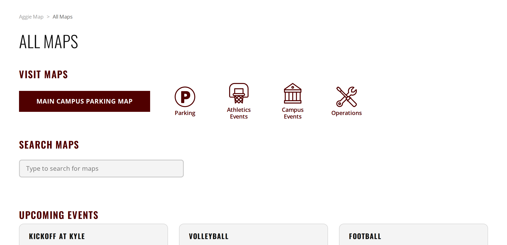
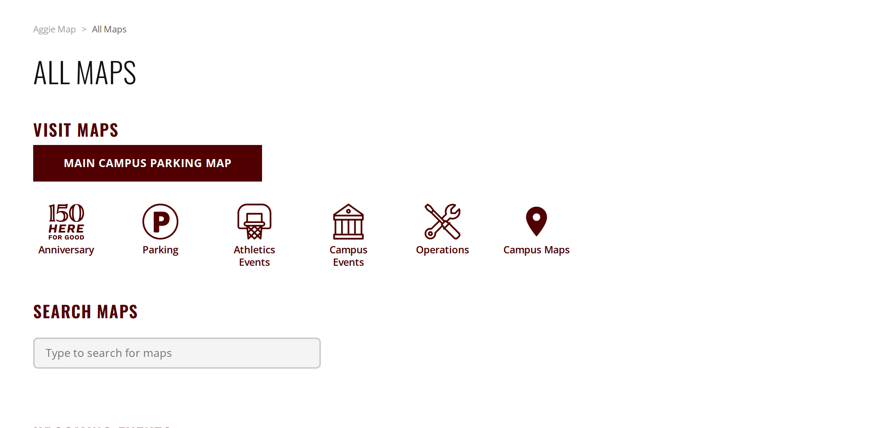
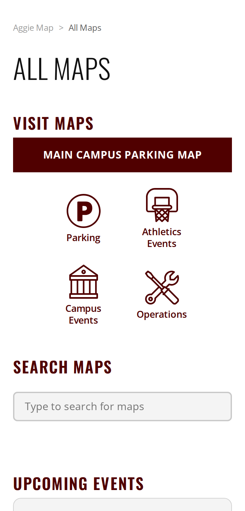
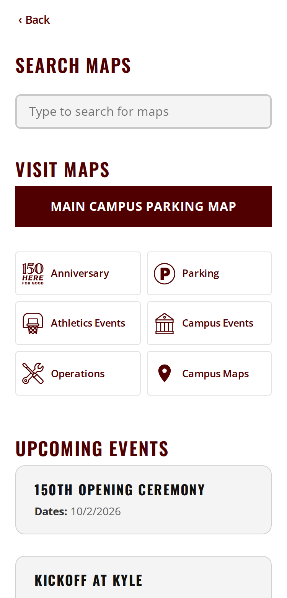

# Unreleased

> **Not in production.** This file collects what has merged since the last production release
> and is rewritten as it goes. On the day it ships it is renamed to `YYYY-MM-DD.md` for that
> date and this heading becomes the status line. Nothing here has reached users yet.

**Production is currently running the [25 September release](2026-09-25.md).**

**On dev now, ready to check.** Everything below is deployed to
[dev.aggiemap.tamu.edu](https://dev.aggiemap.tamu.edu) as of 27 September. Bus routes appear there
and are deliberately held on production — see the bus entry below.

Confirmed on that deployment: analytics reports to the development property, and the bus panel
behaves correctly for the environment. The per-map layer checks are described under *Behind the
scenes*.

---

## Summary

Bus routes return to Aggie Map on dev, held on production until their service is published. The 150th Anniversary maps gain a section of their own and appear on
the main map. The Maps pages work properly on a phone. Three map bugs are fixed, one of which had
been showing incorrect data on production. Behind the scenes, every map is now checked automatically
against the live site.

**One thing needs resolving before this goes to production** — see *Needs a decision* at the end.

---

## What to test

Everything below is on **dev**. Each link opens the thing it describes; the detail is further down if
you want it.

| Open this | Look for |
| --- | --- |
| [All Maps](https://dev.aggiemap.tamu.edu/all-maps) | a **150th Anniversary** tile; opening it lists all five anniversary maps |
| [All Maps, on a phone](https://dev.aggiemap.tamu.edu/all-maps) | the tiles sit **side by side** rather than one per line, and a **‹ Back** link replaces the breadcrumb |
| [The main map](https://dev.aggiemap.tamu.edu/map) | a **150th Events** heading in the layer list, four events, all starting switched off |
| [Bus routes](https://dev.aggiemap.tamu.edu/map/d/bus) | routes and stops list; clicking a stop opens a popup with a schedule link |
| [Gameday Parking, micromobility](https://dev.aggiemap.tamu.edu/events/gameday-parking/map/d?transport-type=micromobility&direction=entry) | **Bike Dismount Zones** and **Bike Veo Geofence** draw the right things — they were showing each other's data |
| [150th Opening Ceremony](https://dev.aggiemap.tamu.edu/events/150th-kickoff) | the legend no longer lists *Hourly Paid Parking* |

Two things worth knowing before you report something as broken:

- **Bus routes will not appear on production** when this ships. That is deliberate, not a bug — the
  service they read is not published there yet. On dev they work.
- **Dev shows sections production does not**, such as Campus Maps and kiosk maps. Those are
  development-only and are not part of this release.

---

## New

### Bus routes and stops are back — on dev only, for now

Bus routes and stops return to Aggie Map, with stop popups and shareable links to a specific stop.
Opening a shared stop link draws the route serving it.

**Held on production until the bus service is published.** The data comes from a GIS service that is
not yet publicly readable on the production server, so on production Aggie Map keeps showing the
"Bus routes are currently unavailable" notice it shows today. Nothing changes for anyone using the
live site until that service is published, at which point this is switched on without a code change
of any substance.

**Check on dev:** [the bus panel](https://dev.aggiemap.tamu.edu/map/d/bus), the bus layer on the main
map, and a stop popup.

### A 150th Anniversary section

All Maps now has a 150th Anniversary tile leading to a page listing all five anniversary maps —
Kickoff at Kyle, Live at the Station, Spirit of 150 Week, Opening Ceremony, and the Aggie Family
Parade.

The anniversary maps keep their existing addresses, so links already shared still work. They also
still appear under Campus Events, so nobody has to learn a new route to find them.

**Check on dev:** [dev.aggiemap.tamu.edu/all-maps](https://dev.aggiemap.tamu.edu/all-maps), then the
Anniversary tile.

| Before | After |
| --- | --- |
|  |  |

The **Anniversary** tile is the new one. *Campus Maps* also appears in the "after" image — that is a
development-only section and is not part of this release.

### 150th events on the main map

Four anniversary events are available on the main campus map under a *150th Events* heading:
Opening Ceremony, Kickoff at Kyle, Live at the Station and Spirit of 150 Week. Each is turned on and
off on its own, and all four start off, so they are there when wanted without changing what the map
looks like on arrival. Opening Ceremony is one entry that shows its event locations, shuttle route and
parking together.

**Check on dev:** [the main map](https://dev.aggiemap.tamu.edu/map), then the layer list for the
*150th Events* heading.

### The Maps pages work on a phone

The Visit Maps tiles were taking roughly half a phone screen each. They now sit side by side, and the
breadcrumb on narrow screens is replaced with a single Back link that returns to whichever map you
came from rather than always the main map.

**Check on dev:** [dev.aggiemap.tamu.edu/all-maps](https://dev.aggiemap.tamu.edu/all-maps) on a phone,
or a narrow browser window.

| Before | After |
| --- | --- |
|  |  |

The tiles now sit side by side as compact rows rather than large stacked icons, the breadcrumb and
page heading are replaced by a single **‹ Back** link, and search moves above the tiles.

### About page

Kaleb Wilson added.

---

## Fixed

### Gameday Parking was showing the wrong bike layers

**This is the one worth knowing about.** On the Gameday Parking map, two micromobility layers were
displaying the wrong data under the wrong names — "Bike Veo Geofence" was drawing dismount zones, and
"Bike Lanes" was drawing the geofence. Two further layers failed to load entirely.

The underlying services had been republished and their layer positions shifted; the map was still
asking for the old positions. Nothing errored for the two mislabelled ones, so nothing flagged it.
This has been wrong on production for some time.

Three layers are corrected. **Bike Lanes is temporarily withheld** — see *Needs a decision*.

### The 150th Opening Ceremony legend listed a class that no longer exists

"Hourly Paid Parking" was removed from the data but stayed in the legend, because the map carried its
own copy of the classes rather than reading the service. Reported by Megan.

### The "Aggie Map" breadcrumb went back to the wrong place

On a desktop browser, the **Aggie Map** crumb returned you to whichever map you had just come from
rather than to the main Aggie Map. Opening the bus map, clicking All Maps, then clicking Aggie Map
took you back to the bus map.

It affected every Maps page, not only All Maps, because they share a header.

The phone layout is unchanged: there the same trail is shown as a single **‹ Back** link, and going
back to the map you came from is what it is for.

**Check on dev:** open [the bus map](https://dev.aggiemap.tamu.edu/map/d/bus), click **All Maps**, then
click **Aggie Map** — you should land on the main campus map.

### The Back link lost shared-link details

On the Maps pages, the "Aggie Map" link back to your last map dropped any detail in the address — so
returning from a shared bus stop link went nowhere useful. It now returns you to exactly the map you
were on.

---

## Behind the scenes

Not user-visible, but worth recording.

**Every map is now checked automatically.** A suite loads all 73 maps against the live site and
verifies each layer actually loads and returns data. It runs daily and will open an issue only when
something breaks. It found the Gameday Parking bug above.

Eleven maps cannot be reached by address at all — they require choices in a builder first — so every
combination of every builder was walked and recorded, producing 360 shareable links that reach each
destination directly. That record is also a baseline: if a choice is renamed or a destination starts
drawing different layers, it shows up as a difference.

The application now carries a small read-only handle used by those tests to inspect which layers a
map has loaded. It exposes nothing that was not already public and cannot change anything.

Also: build-tagging fixes in the pipeline, and documentation for the fork-based workflow and release
notes themselves.

---

## Needs a decision

### Bus routes read from the development GIS server

`TS/Bus_Routes` is not publicly readable on the production GIS server — it returns "Token Required" —
so Aggie Map is pointed at the development server for bus data.

**Decided: bus routes are held on production rather than holding the release.** Shipping as-is would
leave a live feature depending on a development server — if that server were restarted or taken down
for maintenance, bus routes would disappear from the live site with nothing to explain why. Everything
else in this release is independent of bus and should not wait for one service.

So on production the bus panel keeps the "currently unavailable" notice it already shows, and makes no
request to the development server at all. Dev is unaffected and shows the working feature.

**What is still needed:** make `TS/Bus_Routes` publicly readable on the production GIS server,
matching `TS/BikeMap`, which is already public. Once it is, removing the hold is a small change and
bus routes appear on production.

Worth knowing: because bus data is drawn as graphics rather than loaded as a map layer, the automated
checks above would **not** notice if it stopped working.

### Where did Bike Lanes go?

Neither micromobility service publishes a layer named "Bike Lanes" any more. Rather than leave it
showing the wrong data, it is hidden for now. Both services were republished on 24 September, which
is when the positions shifted, so the question is whether Bike Lanes was dropped then and where its
data now lives.

The map still shows Campus Bike Lanes and City Bike Lanes and Routes, so bike lane information has
not disappeared from it.

---

## Fixed outside this release

**Development analytics were being recorded as production traffic.** `dev.aggiemap.tamu.edu` was
reporting into the production Google Analytics property, so development activity was mixed into the
production numbers and the development property recorded nothing at all. This was a pipeline
configuration issue, fixed and verified — development now reports to its own property. No code change
was involved, so it is already in effect.

GIS Day has the same problem and has not been fixed.
