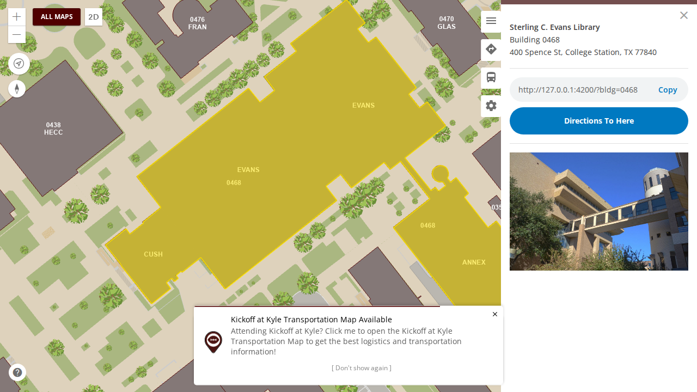
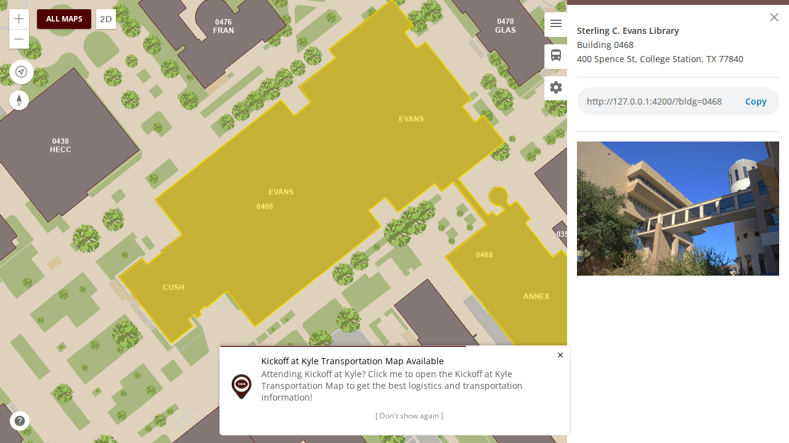
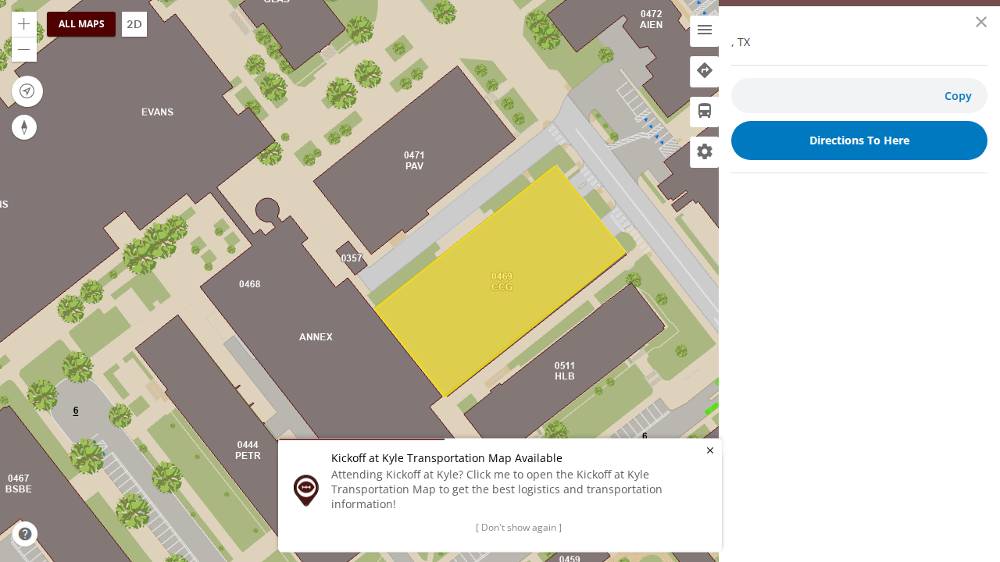
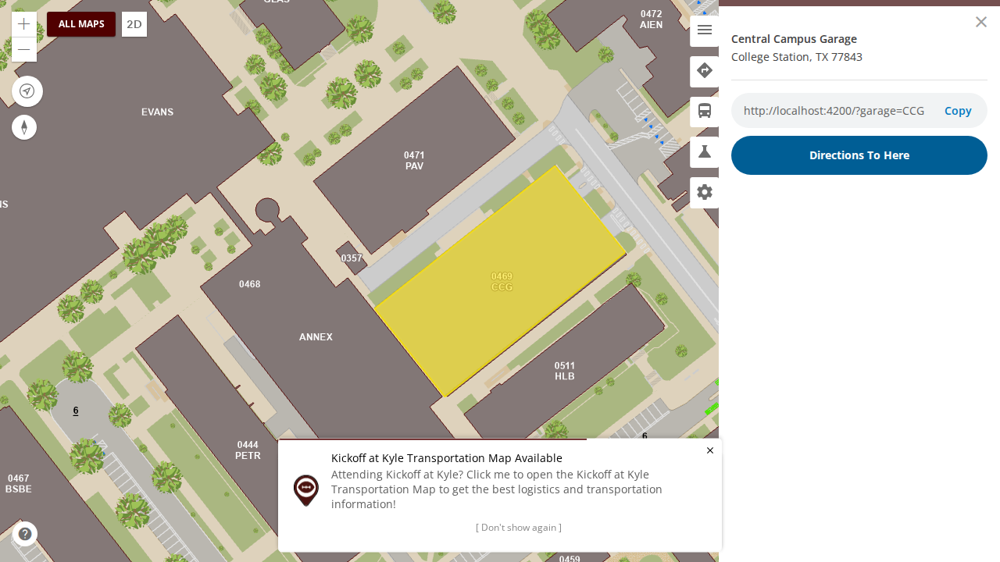

# Unreleased

> **Not on production.** This file collects what has merged since the last production release. Each
> entry says where it can be seen.

**Production is currently running the [29 September release](2026-09-29.md).**

If you followed a link here expecting the notes for the release that just shipped — the retired
events, the 150 Cake & Ice Cream correction, and the before and after screenshots — they are in
[29 September](2026-09-29.md) now. That file is the permanent record of what shipped; this one only
ever describes what has not shipped yet.

---

## Summary

Choosing a parking garage from search shows its details again, and a garage can be shared by link.
Drive directions can find parking again: its lookups for all lots and for night-privilege lots were
both failing on production.

## What to test

**On dev**, once this is deployed. Production follows the next release.

| Open this | Look for |
| --- | --- |
| [The main map](https://dev.aggiemap.tamu.edu/map) | search **Central Campus Garage**, choose it under **Parking Garage**: the details show its name and a link ending `?garage=CCG` |
| [A garage link](https://dev.aggiemap.tamu.edu/map?garage=CCG) | opens Central Campus Garage's details |

## Fixed

### Directions are no longer offered while routing does not work

The routing service behind directions is unpublished, so the Directions tab and the "Directions To
Here" buttons offered something that could not work: the tab opened a maintenance notice. On
production they are now hidden, on the main map, the event and parking maps, and in every popup. They
stay on dev, where routing is being rebuilt, and come back to production with one change when it is
ready. ([#1003](https://github.com/TamuGeoInnovation/Tamu.GeoInnovation.js.monorepo/issues/1003))

| Before (as production) | After (as production) |
| --- | --- |
|  |  |

### Bike directions could not find a bike rack

Planning a bike trip looks up the nearest bike rack. On production that lookup read a service that no
longer exists, so it found none. It now reads the same bike racks the map shows, 318 of them. Like all
directions, bike trips are for now offered on dev only (above).
([#1122](https://github.com/TamuGeoInnovation/Tamu.GeoInnovation.js.monorepo/issues/1122))

### Choosing a parking garage from search opened an empty details panel

Searching for a garage and choosing it highlighted the garage on the map, but the details panel showed
only ", TX" and an empty link. Garages were opened with the building details, which look for building
fields a garage doesn't have. They now get their own details, with the garage's name, and a link
(`?garage=CCG`) that reopens it; a parking lot link could not, since garages aren't in the lots layer.
([#1163](https://github.com/TamuGeoInnovation/Tamu.GeoInnovation.js.monorepo/issues/1163))

| Before (production) | After (local) |
| --- | --- |
|  |  |

### Drive directions could not look up parking

Two of the parking lookups the Directions tab uses when planning a drive were failing on production,
so no lot came back from them:

| Lookup | Before | After |
| --- | --- | --- |
| All lots (used with a permit) | "Failed to execute query": it asked for space-count fields renamed when the parking table was renamed | answers, with the renamed fields |
| Night-privilege lots (evenings, with a permit) | "Service not found": the service had moved to another folder | answers, 91 night lots |

([#1162](https://github.com/TamuGeoInnovation/Tamu.GeoInnovation.js.monorepo/issues/1162),
[#1166](https://github.com/TamuGeoInnovation/Tamu.GeoInnovation.js.monorepo/issues/1166))

The lookup for visitors without a permit is still broken: it asks for a column the parking layer has
never had, and what it should ask for needs a decision
([#1169](https://github.com/TamuGeoInnovation/Tamu.GeoInnovation.js.monorepo/issues/1169)).

## Behind the scenes

- **Every bus route is tested for its stops**, before bus routes go to production. Each route the bus
  panel lists is chosen in turn and must draw one stop on the map for every stop it lists. Five routes
  draw none (NW0104, NW0305, NW4041, 15R, 47/48) and two draw a different number (40, 47), because
  the bus stop data does not tag them; that is being fixed in the data
  ([#1174](https://github.com/TamuGeoInnovation/Tamu.GeoInnovation.js.monorepo/issues/1174)).
  ([#1175](https://github.com/TamuGeoInnovation/Tamu.GeoInnovation.js.monorepo/issues/1175))
- **The release steps are one ordered sequence**, in [README.md](README.md): build and deploy to dev,
  run the full suite, tag dev only if it passed, merge the notes, deploy production, tag production,
  check production. They had been spread across three documents that each described part of it, in
  different orders, and the notes were written after the deploy — so the file most likely to be
  shared outside the team was wrong until someone got to it.
  ([#1150](https://github.com/TamuGeoInnovation/Tamu.GeoInnovation.js.monorepo/issues/1150),
  [#1151](https://github.com/TamuGeoInnovation/Tamu.GeoInnovation.js.monorepo/pull/1151))
- **Every search source on the main map is tested**, each the way a visitor reaches it: typed into
  the search box, opened by a link, or used by the Directions tab. Before, one source could stop
  working while the others kept returning results. The first run found two problems nobody had
  noticed: choosing a parking garage from search opens an empty details panel
  ([#1163](https://github.com/TamuGeoInnovation/Tamu.GeoInnovation.js.monorepo/issues/1163)), and
  the night parking lookup used by drive directions reads a service that no longer exists
  ([#1162](https://github.com/TamuGeoInnovation/Tamu.GeoInnovation.js.monorepo/issues/1162)). It also
  confirms the bike racks problem already filed
  ([#1122](https://github.com/TamuGeoInnovation/Tamu.GeoInnovation.js.monorepo/issues/1122)).
  ([#1138](https://github.com/TamuGeoInnovation/Tamu.GeoInnovation.js.monorepo/issues/1138))
- **Every bug gets a test, and the search checks ask what the app actually does.** A rule in
  `CLAUDE.md` now requires a test when a bug is filed and when it is fixed. The checks for the
  sources only the Directions tab uses now run each source's own query instead of asking whether its
  service answers. That found a third hidden problem: the parking lookup used by drive directions
  asks for fields that were renamed, so its query fails on production
  ([#1166](https://github.com/TamuGeoInnovation/Tamu.GeoInnovation.js.monorepo/issues/1166)).
  ([#1167](https://github.com/TamuGeoInnovation/Tamu.GeoInnovation.js.monorepo/issues/1167))

---

## Work in flight — 29 September, after the release

Nothing below has merged, so it is not part of a release yet. This section exists because
[`CLAUDE_SETUP.md`](../../CLAUDE_SETUP.md) sends a session on another machine here first, and an empty
file would say the work had stopped.

### Read this first if you are picking up elsewhere

**726 screenshots exist only on the work machine.** They are in `test/visual/baselines/builder/`,
untracked and deliberately uncommitted — 363 builder destinations at two viewports, 322MB. They are
the output of a two-hour crawl against dev and can be regenerated with:

```bash
AGGIEMAP_SMOKE_BASE_URL=https://dev.aggiemap.tamu.edu BUILDER_INVENTORY_SHOTS=/some/dir \
  npx playwright test --config=tools/builder-inventory/playwright.config.ts
```

The capture resumes rather than restarts, so an interrupted run costs only what it had not reached.

They are uncommitted on purpose: at 322MB they would more than triple a 151MB repository,
permanently, since git keeps every version. Where they should live is
[#1107](https://github.com/TamuGeoInnovation/Tamu.GeoInnovation.js.monorepo/issues/1107).

### The two things the release process still does by hand

Tagging dev and tagging production are manual, which was fine for proving the sequence and will not
survive a normal week. Automating them needs the build to say which commit it came from
([#1148](https://github.com/TamuGeoInnovation/Tamu.GeoInnovation.js.monorepo/issues/1148)); until
then the smoke suite tests a URL and cannot know which commit it verified. A tag applied after a
passing run is the only thing making "we shipped what we tested" checkable, so the gap matters.

### The decision waiting to be made

**[#1107](https://github.com/TamuGeoInnovation/Tamu.GeoInnovation.js.monorepo/issues/1107) — evaluate
Visual Regression Tracker on the cluster** as the home for baseline images. It holds the comparison of
the options, why Percy and Chromatic cannot work here (they re-render from DOM, and these maps are a
WebGL canvas), and the caveat that VRT's Playwright agent is two years stale while its server is
current.

The contained test is in that issue: stand VRT up, point the existing capture at `gameday-parking`'s
14 destinations, and find out whether the agent works before migrating 726 images.

### Open, none started

| Issue | |
| --- | --- |
| [#1079](https://github.com/TamuGeoInnovation/Tamu.GeoInnovation.js.monorepo/issues/1079) | Visual baselines are stale against dev, and there is one set for all environments |
| [#1082](https://github.com/TamuGeoInnovation/Tamu.GeoInnovation.js.monorepo/issues/1082) | All Maps scrolls sideways on a phone: a copy field with an unbreakable URL widens its card |
| [#1089](https://github.com/TamuGeoInnovation/Tamu.GeoInnovation.js.monorepo/issues/1089) | Full visual suite: a screenshot of every page, including builder paths |
| [#1090](https://github.com/TamuGeoInnovation/Tamu.GeoInnovation.js.monorepo/issues/1090) | Nothing asserts development-only sections stay off production |
| [#1091](https://github.com/TamuGeoInnovation/Tamu.GeoInnovation.js.monorepo/issues/1091) | Layer toggle round-trip: prove a layer returns the map to its original state |
| [#1097](https://github.com/TamuGeoInnovation/Tamu.GeoInnovation.js.monorepo/issues/1097) | Two 2025 events still registered on dev |
| [#1099](https://github.com/TamuGeoInnovation/Tamu.GeoInnovation.js.monorepo/issues/1099) | Ring Day naming: October holds the generic `/events/ring-day` id |
| [#1101](https://github.com/TamuGeoInnovation/Tamu.GeoInnovation.js.monorepo/issues/1101) | Inventory every GIS service, with dev and prod URLs and which maps use them |
| [#1102](https://github.com/TamuGeoInnovation/Tamu.GeoInnovation.js.monorepo/issues/1102) | Dev is hardcoded to the production transportation GIS host by a `TEMP` |
| [#1103](https://github.com/TamuGeoInnovation/Tamu.GeoInnovation.js.monorepo/issues/1103) | No test that a past event shows the "this event has passed" warning |
| [#1104](https://github.com/TamuGeoInnovation/Tamu.GeoInnovation.js.monorepo/issues/1104) | Define an emergency test tier for urgent deploys |
| [#1105](https://github.com/TamuGeoInnovation/Tamu.GeoInnovation.js.monorepo/issues/1105) | Map captures are not byte-reproducible; page captures are |
| [#1122](https://github.com/TamuGeoInnovation/Tamu.GeoInnovation.js.monorepo/issues/1122) | Bike racks search reads a service that does not exist on the production GIS server |
| [#1123](https://github.com/TamuGeoInnovation/Tamu.GeoInnovation.js.monorepo/issues/1123) | Two unused football entries point at stopped services |
| [#1140](https://github.com/TamuGeoInnovation/Tamu.GeoInnovation.js.monorepo/issues/1140) | Field names differ between three maps in the latest service data |
| [#1144](https://github.com/TamuGeoInnovation/Tamu.GeoInnovation.js.monorepo/issues/1144) | Release process: which of the remaining options to adopt |
| [#1146](https://github.com/TamuGeoInnovation/Tamu.GeoInnovation.js.monorepo/issues/1146) | Professionalization sweep |
| [#1148](https://github.com/TamuGeoInnovation/Tamu.GeoInnovation.js.monorepo/issues/1148) | Builds do not say which commit they came from |

### Worth knowing before touching the visual work

- **Page captures are byte-identical across runs; map captures are not.** Measured three times each.
  So hash comparison works for pages and cannot work for maps, which need pixel tolerance
  ([#1105](https://github.com/TamuGeoInnovation/Tamu.GeoInnovation.js.monorepo/issues/1105)).
- **A local dev server must be reached at `http://localhost:4200`, not `127.0.0.1`.** `TestingService`
  keys on the host containing `dev` or `localhost`, so `127.0.0.1` renders the *production* variant —
  6 headings on All Maps instead of 31.
- **The builder inventory is environment-specific** and the smoke suite refuses one captured
  elsewhere. Production has no inventory yet, so its builder maps still skip.
